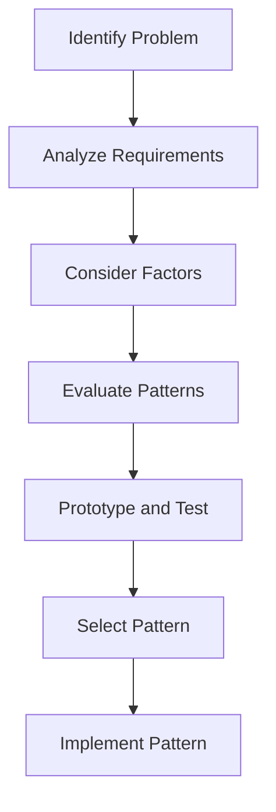

## 15.1 Selecting the Right Design Pattern in Python

Selecting the right design pattern is a critical step in software development. It can significantly impact the success of a project by enhancing code quality, maintainability, and scalability. However, choosing the wrong pattern can lead to increased complexity, reduced performance, and maintenance challenges. In this section, we'll explore the importance of pattern selection, factors to consider, the decision-making process, common pitfalls, and best practices.

### Importance of Pattern Selection

Design patterns provide reusable solutions to common software design problems. They help developers create robust, scalable, and maintainable code. However, selecting the appropriate pattern is crucial because:

- **Improves Code Quality**: The right pattern helps structure code logically, making it easier to understand and modify.
- **Enhances Maintainability**: Patterns that align with project requirements reduce the effort needed for future modifications.
- **Facilitates Scalability**: Certain patterns are designed to handle growth in data, users, or functionality.
- **Avoids Over-Engineering**: Using the wrong pattern can introduce unnecessary complexity, making the codebase difficult to manage.

### Factors to Consider

When selecting a design pattern, consider the following factors:

#### Project Requirements

Understanding the specific problem you're trying to solve is the first step in pattern selection. Align the pattern with both functional and non-functional requirements:

- **Functional Requirements**: These are the specific behaviors or functions of the system. Choose patterns that directly address these needs.
- **Non-Functional Requirements**: Consider performance, security, and usability. Some patterns are better suited for high-performance applications, while others enhance security or usability.

#### Complexity vs. Simplicity

Balance the complexity of implementing a pattern with the need to keep the codebase simple:

- **Avoid Over-Engineering**: Don't use a pattern just because it's popular or familiar. Ensure it adds value to your project.
- **Keep It Simple**: Choose patterns that solve the problem without introducing unnecessary complexity.

#### Scalability and Performance

Evaluate how patterns affect scalability and performance:

- **Scalable Patterns**: Patterns like the Observer or Command can help manage growing systems by decoupling components.
- **Performance Considerations**: Some patterns, like Singleton, can introduce bottlenecks if not implemented correctly. Consider the performance impact of each pattern.

#### Maintainability

Select patterns that promote cleaner code and ease future modifications:

- **Clean Code**: Patterns like MVC or MVVM separate concerns, making code easier to read and maintain.
- **Future Modifications**: Choose patterns that allow for easy updates and extensions.

#### Team Expertise

Consider the team's familiarity with various patterns:

- **Leverage Team Strengths**: Choose patterns that the team can implement effectively.
- **Training and Learning**: If a pattern is new to the team, provide training to ensure successful implementation.

### Decision-Making Process

Selecting the right pattern involves a structured decision-making process:

#### Problem Analysis

Thoroughly analyze the problem domain:

- **Use Cases**: Create detailed use cases to understand the problem and its context.
- **Identify Challenges**: Pinpoint key challenges that the pattern needs to address.

#### Pattern Matching

Map problem characteristics to appropriate patterns:

- **Pattern Characteristics**: Understand the strengths and weaknesses of each pattern.
- **Mapping Chart**: Use a chart to match common problems with suitable patterns.

#### Evaluation and Selection

Assess multiple patterns before making a decision:

- **Advantages and Disadvantages**: Weigh the pros and cons of each pattern.
- **Suitability**: Consider how well each pattern fits the problem context.

#### Prototyping

Build small prototypes to test the suitability of a pattern:

- **Test Patterns**: Create prototypes to explore how a pattern works in practice.
- **Reveal Issues**: Prototyping can uncover unforeseen issues, helping you make informed decisions.

### Common Pitfalls to Avoid

Avoid these common pitfalls when selecting design patterns:

#### Pattern Overuse

Using patterns for every problem can lead to unnecessary complexity:

- **Selective Use**: Apply patterns only when they add value to the project.

#### Pattern Bias

Favoring familiar patterns without proper evaluation can be detrimental:

- **Objective Evaluation**: Assess patterns based on their suitability, not familiarity.

#### Ignoring Future Needs

Consider future requirements and potential changes:

- **Forward Thinking**: Choose patterns that can accommodate future growth and changes.

### Case Studies and Examples

Let's explore real-world scenarios where appropriate pattern selection made a significant difference:

#### Successful Pattern Selection

- **E-commerce Platform**: An e-commerce platform used the MVC pattern to separate concerns, resulting in a scalable and maintainable codebase.
- **Real-Time Chat Application**: A chat application leveraged the Observer pattern to efficiently manage user notifications, enhancing performance and user experience.

#### Challenges with Wrong Pattern Choice

- **Over-Engineered System**: A project used multiple patterns unnecessarily, leading to a complex and difficult-to-maintain codebase.
- **Performance Bottlenecks**: A system implemented the Singleton pattern incorrectly, causing performance issues due to contention.

### Best Practices

To select the right pattern, follow these best practices:

- **Continuous Learning**: Stay updated on new patterns and their applications.
- **Document Decisions**: Keep a record of the decision process for pattern selection to aid future reference.
- **Collaborative Approach**: Involve the team in the decision-making process to leverage diverse perspectives.

### Try It Yourself

To reinforce your understanding, try experimenting with the following:

- **Modify Code Examples**: Take a simple project and apply different patterns to see how they affect the design.
- **Prototype Patterns**: Build small prototypes using different patterns to explore their impact on code structure and performance.

### Visualizing Pattern Selection

To better understand how to select the right pattern, let's visualize the decision-making process using a flowchart:

This flowchart represents the steps involved in selecting the right design pattern, from identifying the problem to implementing the chosen pattern.

### Knowledge Check

To test your understanding of selecting the right design pattern, consider the following questions:

1. What are the key factors to consider when selecting a design pattern?
2. How can prototyping help in pattern selection?
3. Why is it important to avoid pattern overuse?
4. What are the benefits of documenting the pattern selection process?

### Embrace the Journey

Remember, selecting the right design pattern is a journey. As you gain experience, you'll become more adept at choosing patterns that best suit your project's needs. Keep experimenting, stay curious, and enjoy the process of designing robust and maintainable software.

## Quiz Time!



### What is the primary benefit of selecting the right design pattern?

- [x] Enhances code quality and maintainability
- [ ] Increases code complexity
- [ ] Reduces team collaboration
- [ ] Limits code reusability

> **Explanation:** Selecting the right design pattern enhances code quality and maintainability by providing a structured approach to solving common design problems.

### Which factor is NOT crucial when selecting a design pattern?

- [ ] Project requirements
- [ ] Team expertise
- [ ] Scalability
- [x] Personal preference

> **Explanation:** While personal preference might influence decisions, it is not a crucial factor in selecting a design pattern. The focus should be on project requirements, team expertise, and scalability.

### How can prototyping assist in pattern selection?

- [x] By revealing unforeseen issues
- [ ] By increasing code complexity
- [ ] By eliminating the need for documentation
- [ ] By reducing team collaboration

> **Explanation:** Prototyping helps reveal unforeseen issues by allowing developers to test how a pattern works in practice, thus aiding in informed decision-making.

### What is a common pitfall when selecting design patterns?

- [ ] Objective evaluation
- [x] Pattern overuse
- [ ] Considering future needs
- [ ] Collaborative approach

> **Explanation:** Pattern overuse is a common pitfall where developers apply patterns unnecessarily, leading to increased complexity without added value.

### Why is it important to consider team expertise when selecting a design pattern?

- [x] To ensure effective implementation
- [ ] To increase project costs
- [ ] To reduce code quality
- [ ] To limit scalability

> **Explanation:** Considering team expertise ensures that the chosen pattern can be effectively implemented, leveraging the team's strengths and knowledge.

### What should be documented during the pattern selection process?

- [x] The decision process and rationale
- [ ] The personal preferences of the team
- [ ] The complexity of the codebase
- [ ] The number of patterns considered

> **Explanation:** Documenting the decision process and rationale helps provide a reference for future projects and ensures transparency in the selection process.

### What is the impact of ignoring future needs when selecting a design pattern?

- [x] It can lead to challenges in accommodating growth
- [ ] It simplifies the codebase
- [ ] It enhances team collaboration
- [ ] It reduces project costs

> **Explanation:** Ignoring future needs can lead to challenges in accommodating growth and changes, making it crucial to consider future requirements during pattern selection.

### How does the MVC pattern benefit an e-commerce platform?

- [x] By separating concerns for scalability and maintainability
- [ ] By increasing code complexity
- [ ] By reducing user experience
- [ ] By limiting functionality

> **Explanation:** The MVC pattern separates concerns, enhancing scalability and maintainability, which is beneficial for an e-commerce platform.

### What is the role of use cases in problem analysis?

- [x] To understand the problem and its context
- [ ] To increase code complexity
- [ ] To reduce team collaboration
- [ ] To limit scalability

> **Explanation:** Use cases help understand the problem and its context, providing a clear picture of the requirements and challenges to address.

### True or False: Pattern bias is when developers favor familiar patterns without proper evaluation.

- [x] True
- [ ] False

> **Explanation:** Pattern bias occurs when developers favor familiar patterns without proper evaluation, which can lead to suboptimal design choices.


