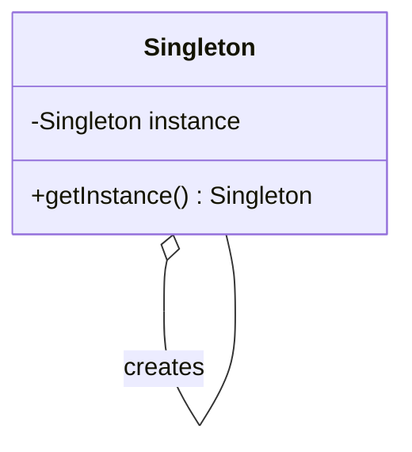
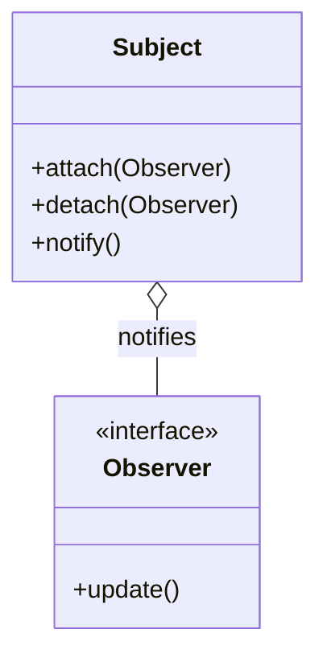
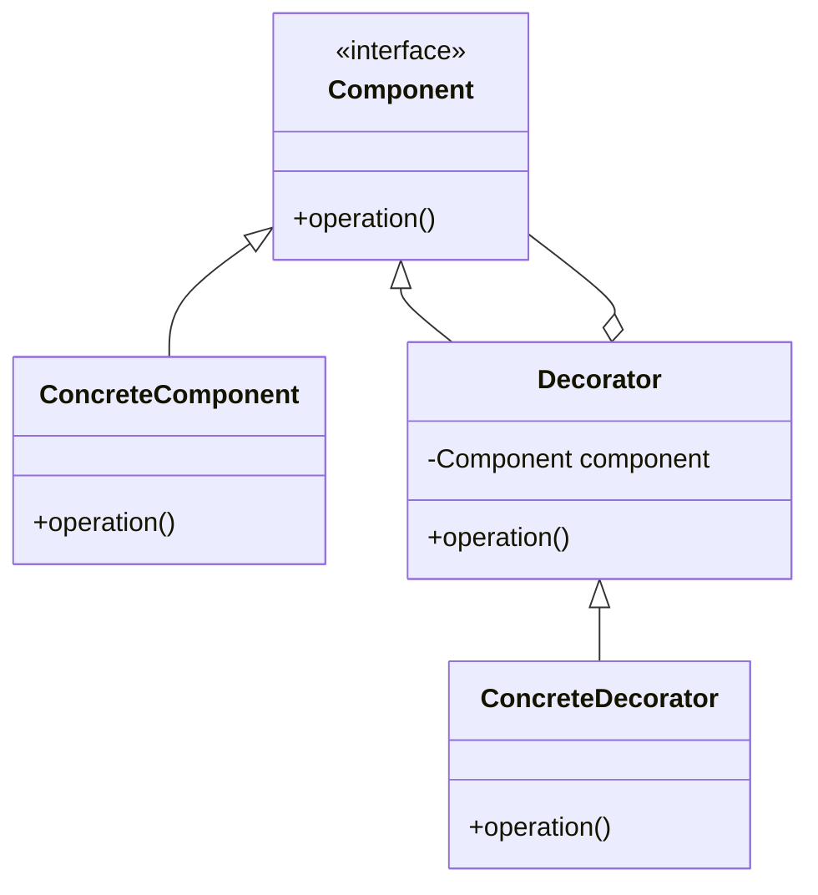

## 18.4 Common Interview Questions on Design Patterns

Design patterns are a crucial part of software engineering interviews, especially for roles that require strong architectural skills. This section aims to prepare you for such interviews by providing a collection of common questions, tips, and sample answers. We'll cover various design patterns, categorize questions by pattern type, and offer advice on how to approach these questions effectively.

### Compilation of Questions

#### Creational Patterns

1. **Explain the Singleton Pattern. Why and when would you use it?**
   - **Sample Answer**: The Singleton Pattern ensures a class has only one instance and provides a global point of access to it. It's used when exactly one object is needed to coordinate actions across the system, such as a configuration manager or a connection pool.
   - **Key Points**: Thread safety, lazy initialization, and global access.

2. **What is the Factory Method Pattern, and how does it differ from the Abstract Factory Pattern?**
   - **Sample Answer**: The Factory Method Pattern defines an interface for creating an object but lets subclasses alter the type of objects that will be created. The Abstract Factory Pattern provides an interface for creating families of related or dependent objects without specifying their concrete classes.
   - **Key Points**: Flexibility in object creation, separation of concerns, and scalability.

3. **How would you implement a Prototype Pattern in Python?**
   - **Sample Answer**: The Prototype Pattern is implemented by creating a new object by copying an existing object, known as the prototype. In Python, this can be achieved using the `copy` module for shallow or deep copies.
   - **Key Points**: Cloning, `copy.deepcopy()`, and object initialization efficiency.

#### Structural Patterns

1. **Describe the Adapter Pattern and provide a use case.**
   - **Sample Answer**: The Adapter Pattern allows incompatible interfaces to work together. It acts as a bridge between two incompatible interfaces. A common use case is integrating a new class into an existing system without modifying the existing code.
   - **Key Points**: Interface compatibility, code reuse, and system integration.

2. **What is the purpose of the Decorator Pattern, and how is it implemented in Python?**
   - **Sample Answer**: The Decorator Pattern attaches additional responsibilities to an object dynamically. In Python, decorators are often implemented using functions or classes that wrap another function or class.
   - **Key Points**: Dynamic behavior extension, `@decorator` syntax, and function wrapping.

3. **How does the Composite Pattern help in managing hierarchies?**
   - **Sample Answer**: The Composite Pattern allows you to compose objects into tree structures to represent part-whole hierarchies. It lets clients treat individual objects and compositions of objects uniformly.
   - **Key Points**: Hierarchical structures, uniformity, and recursive composition.

#### Behavioral Patterns

1. **What is the Observer Pattern, and where is it commonly used?**
   - **Sample Answer**: The Observer Pattern defines a one-to-many dependency between objects so that when one object changes state, all its dependents are notified and updated automatically. It's commonly used in event-driven systems, such as GUI frameworks.
   - **Key Points**: Event handling, decoupling, and reactive programming.

2. **Explain the Strategy Pattern with an example.**
   - **Sample Answer**: The Strategy Pattern defines a family of algorithms, encapsulates each one, and makes them interchangeable. It lets the algorithm vary independently from clients that use it. An example is a sorting strategy where different algorithms can be applied based on the data size.
   - **Key Points**: Algorithm encapsulation, flexibility, and separation of concerns.

3. **How does the Command Pattern facilitate undo/redo operations?**
   - **Sample Answer**: The Command Pattern encapsulates a request as an object, thereby allowing for parameterization of clients with queues, requests, and operations. It supports undo/redo by storing the history of commands and reversing their effects.
   - **Key Points**: Encapsulation of requests, command history, and reversible operations.

#### Advanced Concepts

1. **Discuss the importance of the MVC Pattern in web development.**
   - **Sample Answer**: The Model-View-Controller (MVC) Pattern separates an application into three interconnected components: Model, View, and Controller. This separation helps manage complex applications by dividing responsibilities, improving modularity, and facilitating collaborative development.
   - **Key Points**: Separation of concerns, modularity, and maintainability.

2. **How can the Proxy Pattern enhance security in a system?**
   - **Sample Answer**: The Proxy Pattern provides a surrogate or placeholder for another object to control access. It can enhance security by acting as a protective barrier, controlling access to sensitive resources, and performing access checks.
   - **Key Points**: Access control, security, and resource management.

3. **What role does the Chain of Responsibility Pattern play in request handling?**
   - **Sample Answer**: The Chain of Responsibility Pattern passes a request along a chain of handlers. Each handler decides whether to process the request or pass it to the next handler. This pattern is useful for creating a flexible and scalable request processing system.
   - **Key Points**: Request processing, handler chaining, and flexibility.

### Explanation of Concepts

When answering interview questions, it's crucial to explain the reasoning behind your answers. Here are some tips:

- **Use Examples**: Provide real-world examples or experiences to demonstrate your understanding.
- **Clarify Concepts**: Explain key concepts clearly and concisely, using simple language.
- **Relate to Practical Applications**: Show how design patterns solve specific problems in software development.

### Tips for Candidates

- **Be Clear and Concise**: Clearly articulate your thoughts and avoid unnecessary jargon.
- **Ask Clarifying Questions**: If a question is unclear, don't hesitate to ask for clarification.
- **Be Honest**: If you're unsure about an answer, it's better to admit it than to guess.

### Common Mistakes to Avoid

- **Incorrect Terminology**: Ensure you use the correct terminology when discussing design patterns.
- **Lack of Real-World Application**: Relate patterns to real-world applications to demonstrate practical understanding.
- **Overcomplicating Answers**: Keep your answers simple and focused on the key points.

### Behavioral Questions

1. **Describe a time when you used a design pattern to solve a problem.**
   - **Guidance**: Discuss the problem, the pattern you chose, and the outcome. Highlight your problem-solving skills and adaptability.

2. **How do you decide which design pattern to use in a given situation?**
   - **Guidance**: Explain your thought process, considering factors like scalability, maintainability, and the specific problem at hand.

### Additional Practice

- **Exercises**: Implement various design patterns in small projects to reinforce your understanding.
- **Mock Interviews**: Practice with peers or mentors to simulate real interview scenarios.
- **Coding Challenges**: Participate in coding challenges that focus on design patterns.

### Resource References

- **Guide Sections**: Refer back to relevant sections of this guide for detailed revision.
- **External Resources**: Explore reputable resources like [Refactoring Guru](https://refactoring.guru/design-patterns) and [GeeksforGeeks](https://www.geeksforgeeks.org/design-patterns/) for further preparation.

### Visualizing Design Patterns

To enhance your understanding of design patterns, let's visualize some of the key concepts using diagrams.

#### Singleton Pattern

*Caption*: This diagram illustrates the Singleton Pattern, where a single instance of a class is created and accessed globally.

#### Observer Pattern

*Caption*: The Observer Pattern diagram shows the relationship between the Subject and Observer, where the Subject notifies Observers of state changes.

#### Decorator Pattern

*Caption*: This diagram represents the Decorator Pattern, where additional responsibilities are added to a component dynamically.

### Knowledge Check

To reinforce your learning, let's pose some questions and challenges:

- **Question**: How would you implement a thread-safe Singleton in Python?
- **Challenge**: Implement the Observer Pattern in a simple Python application.

### Embrace the Journey

Remember, mastering design patterns is a journey. As you progress, you'll become more adept at recognizing patterns and applying them to solve complex problems. Keep experimenting, stay curious, and enjoy the learning process!

## Quiz Time!



### What is the primary purpose of the Singleton Pattern?

- [x] To ensure a class has only one instance
- [ ] To create multiple instances of a class
- [ ] To define a family of algorithms
- [ ] To encapsulate a request as an object

> **Explanation:** The Singleton Pattern ensures a class has only one instance and provides a global point of access to it.

### Which pattern allows incompatible interfaces to work together?

- [ ] Singleton Pattern
- [x] Adapter Pattern
- [ ] Observer Pattern
- [ ] Strategy Pattern

> **Explanation:** The Adapter Pattern allows incompatible interfaces to work together by acting as a bridge.

### How does the Decorator Pattern enhance functionality?

- [x] By attaching additional responsibilities to an object dynamically
- [ ] By creating a single instance of a class
- [ ] By defining a family of algorithms
- [ ] By encapsulating a request as an object

> **Explanation:** The Decorator Pattern attaches additional responsibilities to an object dynamically, enhancing its functionality.

### What is the key benefit of the Composite Pattern?

- [x] It allows treating individual objects and compositions uniformly
- [ ] It ensures a class has only one instance
- [ ] It defines a family of algorithms
- [ ] It encapsulates a request as an object

> **Explanation:** The Composite Pattern allows treating individual objects and compositions uniformly, simplifying client code.

### Which pattern is commonly used in event-driven systems?

- [ ] Singleton Pattern
- [ ] Adapter Pattern
- [x] Observer Pattern
- [ ] Strategy Pattern

> **Explanation:** The Observer Pattern is commonly used in event-driven systems to handle state changes and notifications.

### How does the Command Pattern support undo/redo operations?

- [x] By encapsulating a request as an object
- [ ] By creating a single instance of a class
- [ ] By defining a family of algorithms
- [ ] By attaching additional responsibilities to an object

> **Explanation:** The Command Pattern encapsulates a request as an object, allowing for undo/redo operations by storing command history.

### What is the primary goal of the Strategy Pattern?

- [ ] To ensure a class has only one instance
- [ ] To create multiple instances of a class
- [x] To define a family of algorithms
- [ ] To encapsulate a request as an object

> **Explanation:** The Strategy Pattern defines a family of algorithms, encapsulates each one, and makes them interchangeable.

### How does the Proxy Pattern enhance security?

- [x] By controlling access to sensitive resources
- [ ] By creating a single instance of a class
- [ ] By defining a family of algorithms
- [ ] By encapsulating a request as an object

> **Explanation:** The Proxy Pattern enhances security by controlling access to sensitive resources through a surrogate.

### What is the main advantage of using the Chain of Responsibility Pattern?

- [x] It allows request processing to be flexible and scalable
- [ ] It ensures a class has only one instance
- [ ] It defines a family of algorithms
- [ ] It encapsulates a request as an object

> **Explanation:** The Chain of Responsibility Pattern allows request processing to be flexible and scalable by passing requests along a chain of handlers.

### True or False: The MVC Pattern helps manage complex applications by dividing responsibilities.

- [x] True
- [ ] False

> **Explanation:** True. The MVC Pattern helps manage complex applications by dividing responsibilities into Model, View, and Controller components.


