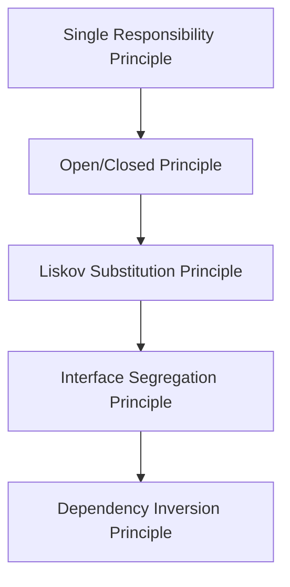

## 2.1 The SOLID Principles

In the world of software development, especially when dealing with object-oriented programming (OOP), the SOLID principles serve as a compass guiding developers towards writing robust, maintainable, and scalable code. These principles, introduced by Robert C. Martin, are a set of five design guidelines that help in creating systems that are easy to manage and extend over time. Let's delve into each principle, understand its significance, and see how it can be implemented in Python.

### Overview of SOLID

The SOLID acronym stands for:

- **S**: Single Responsibility Principle
- **O**: Open/Closed Principle
- **L**: Liskov Substitution Principle
- **I**: Interface Segregation Principle
- **D**: Dependency Inversion Principle

By adhering to these principles, developers can ensure that their code remains clean and adaptable to change, reducing the risk of introducing bugs when modifying or extending the system.

### Single Responsibility Principle (SRP)

**Definition**: A class should have only one reason to change, meaning it should have only one job or responsibility.

**Rationale**: When a class is tasked with multiple responsibilities, changes in one responsibility may affect or break the other. This leads to a fragile design where a single change can have unintended consequences.

#### Correct Implementation

```python
class ReportGenerator:
    def generate_report(self, data):
        # Logic to generate report
        pass

class ReportPrinter:
    def print_report(self, report):
        # Logic to print report
        pass
```

In this example, the `ReportGenerator` class is responsible for generating reports, while the `ReportPrinter` class handles printing. Each class has a single responsibility, making the system easier to maintain.

#### Incorrect Implementation

```python
class ReportManager:
    def generate_report(self, data):
        # Logic to generate report
        pass
    
    def print_report(self, report):
        # Logic to print report
        pass
```

Here, the `ReportManager` class violates the SRP by handling both report generation and printing, leading to a tightly coupled design.

### Open/Closed Principle (OCP)

**Definition**: Software entities (classes, modules, functions, etc.) should be open for extension but closed for modification.

**Rationale**: The goal is to allow the behavior of a module to be extended without modifying its source code, thus reducing the risk of introducing bugs.

#### Correct Implementation

```python
class Shape:
    def area(self):
        raise NotImplementedError

class Circle(Shape):
    def __init__(self, radius):
        self.radius = radius

    def area(self):
        return 3.14 * self.radius * self.radius

class Square(Shape):
    def __init__(self, side):
        self.side = side

    def area(self):
        return self.side * self.side
```

In this example, the `Shape` class is open for extension (by adding new shapes) but closed for modification (no need to alter existing code to add new shapes).

#### Incorrect Implementation

```python
class Shape:
    def area(self, shape_type, dimension):
        if shape_type == 'circle':
            return 3.14 * dimension * dimension
        elif shape_type == 'square':
            return dimension * dimension
```

This implementation requires modifying the `Shape` class every time a new shape is added, violating the OCP.

### Liskov Substitution Principle (LSP)

**Definition**: Objects of a superclass should be replaceable with objects of a subclass without affecting the correctness of the program.

**Rationale**: This principle ensures that a subclass can stand in for its superclass without altering the desirable properties of the program.

#### Correct Implementation

```python
class Bird:
    def fly(self):
        pass

class Sparrow(Bird):
    def fly(self):
        print("Sparrow flying")

class Ostrich(Bird):
    def fly(self):
        raise Exception("Ostriches can't fly")
```

In this example, the `Sparrow` class correctly extends `Bird` and adheres to LSP. However, `Ostrich` violates LSP because it cannot fulfill the contract of `Bird`.

#### Incorrect Implementation

```python
class Bird:
    def fly(self):
        pass

class Penguin(Bird):
    def fly(self):
        raise Exception("Penguins can't fly")
```

The `Penguin` class violates LSP as it cannot substitute `Bird` without breaking the expected behavior.

### Interface Segregation Principle (ISP)

**Definition**: Clients should not be forced to depend on interfaces they do not use.

**Rationale**: This principle encourages the creation of smaller, more specific interfaces rather than a large, general-purpose one.

#### Correct Implementation

```python
class Printer:
    def print(self):
        pass

class Scanner:
    def scan(self):
        pass

class MultiFunctionDevice(Printer, Scanner):
    def print(self):
        print("Printing document")

    def scan(self):
        print("Scanning document")
```

Here, `Printer` and `Scanner` are separate interfaces, allowing `MultiFunctionDevice` to implement only the functionalities it needs.

#### Incorrect Implementation

```python
class MultiFunctionDevice:
    def print(self):
        pass

    def scan(self):
        pass

    def fax(self):
        pass
```

This class forces clients to implement methods they may not need, violating ISP.

### Dependency Inversion Principle (DIP)

**Definition**: High-level modules should not depend on low-level modules. Both should depend on abstractions. Abstractions should not depend on details. Details should depend on abstractions.

**Rationale**: This principle aims to decouple software modules, making them easier to change and maintain.

#### Correct Implementation

```python
class Database:
    def connect(self):
        pass

class MySQLDatabase(Database):
    def connect(self):
        print("Connecting to MySQL")

class Application:
    def __init__(self, db: Database):
        self.db = db

    def start(self):
        self.db.connect()
```

In this example, `Application` depends on the `Database` abstraction, not a specific database implementation, adhering to DIP.

#### Incorrect Implementation

```python
class MySQLDatabase:
    def connect(self):
        print("Connecting to MySQL")

class Application:
    def __init__(self):
        self.db = MySQLDatabase()

    def start(self):
        self.db.connect()
```

Here, `Application` is tightly coupled to `MySQLDatabase`, violating DIP.

### Visualizing SOLID Principles



**Diagram Description**: This flowchart illustrates the progression and interconnection of the SOLID principles, emphasizing their role in achieving a robust software design.

### Benefits of Adhering to SOLID Principles

Adhering to the SOLID principles leads to several benefits:

- **Maintainability**: Code is easier to understand, modify, and extend.
- **Scalability**: Systems can grow without significant rework.
- **Testability**: Smaller, focused classes and interfaces make unit testing more straightforward.
- **Flexibility**: Systems can adapt to change with minimal impact on existing code.

### Relating SOLID Principles to Design Patterns

Many design patterns naturally embody SOLID principles:

- **Factory Method Pattern**: Aligns with the Open/Closed Principle by allowing new product types to be added without modifying existing code.
- **Strategy Pattern**: Supports the Interface Segregation Principle by defining a family of algorithms, each encapsulated in its own class.
- **Observer Pattern**: Demonstrates the Dependency Inversion Principle by decoupling subjects from observers.

### Try It Yourself

Experiment with the following exercises to deepen your understanding of the SOLID principles:

1. **Refactor a Class**: Take a class with multiple responsibilities and refactor it to adhere to the Single Responsibility Principle.
2. **Extend a System**: Implement a new feature in a system without modifying existing code, following the Open/Closed Principle.
3. **Substitute Classes**: Create subclasses that can replace their superclass without altering the program's behavior, adhering to the Liskov Substitution Principle.
4. **Design Interfaces**: Split a large interface into smaller, more specific ones, following the Interface Segregation Principle.
5. **Decouple Modules**: Refactor a tightly coupled system to depend on abstractions rather than concrete implementations, adhering to the Dependency Inversion Principle.

### Conclusion

The SOLID principles are foundational to object-oriented design, guiding developers in creating systems that are robust, maintainable, and adaptable. By understanding and applying these principles, you can write Python code that stands the test of time, accommodating change and growth with ease. Remember, this is just the beginning. As you progress, you'll encounter more complex scenarios where these principles will be invaluable. Keep experimenting, stay curious, and enjoy the journey!

## Quiz Time!



### What does the "S" in SOLID stand for?

- [x] Single Responsibility Principle
- [ ] Simple Responsibility Principle
- [ ] Single Role Principle
- [ ] Simple Role Principle

> **Explanation:** The "S" in SOLID stands for Single Responsibility Principle, which states that a class should have only one reason to change.

### Which principle states that software entities should be open for extension but closed for modification?

- [x] Open/Closed Principle
- [ ] Liskov Substitution Principle
- [ ] Interface Segregation Principle
- [ ] Dependency Inversion Principle

> **Explanation:** The Open/Closed Principle emphasizes that software entities should be extendable without modifying existing code.

### What is the main idea behind the Liskov Substitution Principle?

- [x] Objects of a superclass should be replaceable with objects of a subclass without affecting the program's correctness.
- [ ] A class should have only one reason to change.
- [ ] Clients should not depend on interfaces they do not use.
- [ ] High-level modules should not depend on low-level modules.

> **Explanation:** The Liskov Substitution Principle ensures that subclasses can stand in for their superclasses without altering the program's behavior.

### Which principle encourages the creation of smaller, more specific interfaces?

- [x] Interface Segregation Principle
- [ ] Single Responsibility Principle
- [ ] Open/Closed Principle
- [ ] Dependency Inversion Principle

> **Explanation:** The Interface Segregation Principle advocates for smaller, more specific interfaces to avoid forcing clients to implement unnecessary methods.

### What does the Dependency Inversion Principle aim to achieve?

- [x] High-level modules should not depend on low-level modules. Both should depend on abstractions.
- [ ] A class should have only one reason to change.
- [ ] Software entities should be open for extension but closed for modification.
- [ ] Objects of a superclass should be replaceable with objects of a subclass.

> **Explanation:** The Dependency Inversion Principle aims to decouple software modules by making them depend on abstractions rather than concrete implementations.

### Which design pattern aligns with the Open/Closed Principle?

- [x] Factory Method Pattern
- [ ] Observer Pattern
- [ ] Strategy Pattern
- [ ] Singleton Pattern

> **Explanation:** The Factory Method Pattern allows new product types to be added without modifying existing code, aligning with the Open/Closed Principle.

### How does the Strategy Pattern support the Interface Segregation Principle?

- [x] By defining a family of algorithms, each encapsulated in its own class.
- [ ] By allowing new product types to be added without modifying existing code.
- [ ] By decoupling subjects from observers.
- [ ] By ensuring a class has only one reason to change.

> **Explanation:** The Strategy Pattern supports the Interface Segregation Principle by defining a family of algorithms, each encapsulated in its own class, allowing clients to choose only the algorithms they need.

### What is a benefit of adhering to the SOLID principles?

- [x] Improved maintainability and scalability of code.
- [ ] Increased complexity and coupling.
- [ ] Reduced testability and flexibility.
- [ ] Decreased code readability.

> **Explanation:** Adhering to the SOLID principles improves maintainability and scalability, making code easier to understand, modify, and extend.

### True or False: The SOLID principles are only applicable to object-oriented programming.

- [x] True
- [ ] False

> **Explanation:** The SOLID principles are specifically designed for object-oriented programming to guide developers in creating robust, maintainable, and scalable systems.

### Which principle is violated if a class is tightly coupled to a specific database implementation?

- [x] Dependency Inversion Principle
- [ ] Single Responsibility Principle
- [ ] Open/Closed Principle
- [ ] Liskov Substitution Principle

> **Explanation:** If a class is tightly coupled to a specific database implementation, it violates the Dependency Inversion Principle, which states that high-level modules should depend on abstractions rather than concrete implementations.


