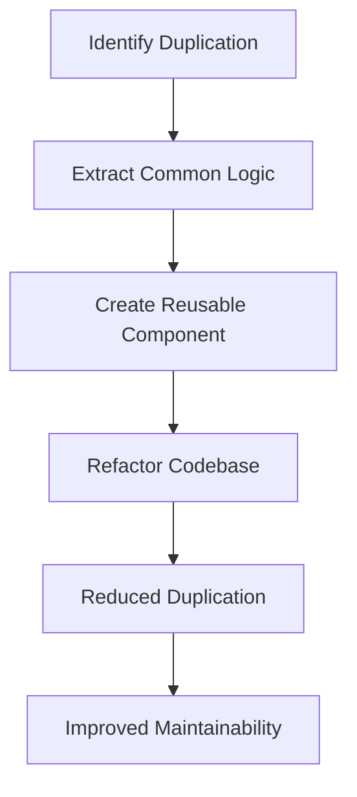

## 2.2 DRY (Don't Repeat Yourself)

The DRY (Don't Repeat Yourself) principle is a fundamental concept in software development that emphasizes the importance of reducing repetition within code. By adhering to DRY, developers can create more maintainable, scalable, and error-free software. In this section, we will explore the DRY principle in depth, discuss the consequences of violating it, and demonstrate strategies to implement it effectively in Python.

### Understanding the DRY Principle

The DRY principle was introduced by Andy Hunt and Dave Thomas in their book "The Pragmatic Programmer." The core idea is simple: every piece of knowledge in a system should have a single, unambiguous, authoritative representation. This means that code should not be duplicated across a codebase. Instead, common functionality should be abstracted into reusable components.

#### Why Redundancy is Detrimental

Redundancy in code can lead to several issues:

1. **Increased Maintenance Effort**: When the same logic is duplicated in multiple places, any change to that logic requires updates in all locations. This increases the risk of introducing bugs and inconsistencies.

2. **Higher Risk of Errors**: Duplicated code can lead to errors if one instance is updated while others are not. This inconsistency can cause unexpected behavior in the application.

3. **Code Bloat**: Redundant code increases the size of the codebase, making it harder to navigate and understand. This can slow down development and make onboarding new developers more challenging.

4. **Reduced Flexibility**: A codebase with high redundancy is less flexible to change. Refactoring becomes more complex, and adapting the system to new requirements can be cumbersome.

### Consequences of Violating DRY

Let's consider an example to illustrate the consequences of violating the DRY principle. Suppose we have a simple e-commerce application where we need to calculate the total price of items in a shopping cart, including tax.

```python
def calculate_total_price_with_tax(cart_items):
    total = 0
    for item in cart_items:
        total += item['price'] * item['quantity']
    total += total * 0.07  # Adding 7% tax
    return total

def calculate_discounted_price_with_tax(cart_items, discount):
    total = 0
    for item in cart_items:
        total += item['price'] * item['quantity']
    total -= discount
    total += total * 0.07  # Adding 7% tax
    return total
```

In this example, the logic for calculating the total price with tax is duplicated in both functions. If the tax rate changes, we need to update it in multiple places, increasing the risk of errors.

### Strategies to Adhere to DRY in Python

Python provides several constructs that can help us adhere to the DRY principle, such as functions, classes, and modules. Let's explore these strategies in detail.

#### Using Functions

Functions are a fundamental building block in Python that allow us to encapsulate reusable logic. By extracting common functionality into a function, we can eliminate code duplication.

```python
def calculate_total(cart_items, discount=0):
    total = 0
    for item in cart_items:
        total += item['price'] * item['quantity']
    total -= discount
    return total

def calculate_total_with_tax(cart_items, discount=0):
    total = calculate_total(cart_items, discount)
    total += total * 0.07  # Adding 7% tax
    return total
```

In this refactored code, the common logic for calculating the total price is extracted into the `calculate_total` function. The `calculate_total_with_tax` function then reuses this logic, adhering to the DRY principle.

#### Using Classes

Classes allow us to encapsulate related data and behavior, promoting code reuse and reducing duplication. By organizing code into classes, we can create reusable components that adhere to the DRY principle.

```python
class ShoppingCart:
    def __init__(self):
        self.items = []

    def add_item(self, item):
        self.items.append(item)

    def calculate_total(self, discount=0):
        total = 0
        for item in self.items:
            total += item['price'] * item['quantity']
        total -= discount
        return total

    def calculate_total_with_tax(self, discount=0):
        total = self.calculate_total(discount)
        total += total * 0.07  # Adding 7% tax
        return total
```

In this example, the `ShoppingCart` class encapsulates the logic for managing cart items and calculating totals. By using a class, we ensure that the logic is centralized and reusable.

#### Using Modules

Modules allow us to organize code into separate files, promoting reuse across different parts of an application. By placing common functionality in a module, we can avoid duplication and adhere to the DRY principle.

Create a module `cart_utils.py`:

```python

def calculate_total(cart_items, discount=0):
    total = 0
    for item in cart_items:
        total += item['price'] * item['quantity']
    total -= discount
    return total

def calculate_total_with_tax(cart_items, discount=0):
    total = calculate_total(cart_items, discount)
    total += total * 0.07  # Adding 7% tax
    return total
```

Now, we can import and use these functions in different parts of our application without duplicating code.

```python
from cart_utils import calculate_total_with_tax

cart_items = [{'price': 10, 'quantity': 2}, {'price': 20, 'quantity': 1}]
total_with_tax = calculate_total_with_tax(cart_items)
print(total_with_tax)
```

### Balancing DRY and Over-Abstraction

While the DRY principle is essential for maintaining clean and efficient code, it's important to strike a balance between DRY and over-abstraction. Over-abstraction can lead to code that is difficult to understand and maintain. Here are some tips to find the right balance:

1. **Avoid Premature Abstraction**: Resist the urge to abstract code before you have a clear understanding of the problem domain. Premature abstraction can lead to unnecessary complexity.

2. **Keep It Simple**: Strive for simplicity in your abstractions. Avoid creating overly complex hierarchies or interfaces that are difficult to understand.

3. **Refactor When Necessary**: Refactor code when you notice duplication or when new requirements emerge. Refactoring allows you to improve code quality incrementally.

4. **Use Descriptive Names**: Use clear and descriptive names for functions, classes, and modules. This makes your abstractions more understandable and easier to use.

5. **Document Your Code**: Provide documentation for your abstractions, explaining their purpose and how they should be used. This helps other developers understand and use your code effectively.

### Best Practices for Promoting Code Reuse and Simplicity

To promote code reuse and simplicity, consider the following best practices:

- **Modular Design**: Organize your code into modules that encapsulate related functionality. This promotes reuse and makes your codebase easier to navigate.

- **Reusable Components**: Create reusable components that can be used across different parts of your application. This reduces duplication and improves maintainability.

- **Consistent Naming Conventions**: Use consistent naming conventions for functions, classes, and modules. This makes your code more readable and easier to understand.

- **Avoid Hardcoding Values**: Use constants or configuration files to store values that may change. This makes your code more flexible and easier to update.

- **Leverage Python Libraries**: Take advantage of Python's rich ecosystem of libraries and frameworks. Using well-established libraries can save time and reduce duplication.

### Real-World Scenarios: Applying DRY for Improved Code Quality

Let's explore a real-world scenario where applying the DRY principle improved code quality. Consider a web application that handles user authentication and authorization.

#### Initial Implementation

In the initial implementation, the logic for checking user permissions is duplicated across multiple views.

```python
def view_dashboard(user):
    if user.is_authenticated and user.has_permission('view_dashboard'):
        # Display dashboard
        pass
    else:
        # Redirect to login
        pass

def edit_profile(user):
    if user.is_authenticated and user.has_permission('edit_profile'):
        # Allow profile editing
        pass
    else:
        # Redirect to login
        pass
```

#### Refactored Implementation

By applying the DRY principle, we can extract the common logic into a reusable function.

```python
def check_permission(user, permission):
    if user.is_authenticated and user.has_permission(permission):
        return True
    return False

def view_dashboard(user):
    if check_permission(user, 'view_dashboard'):
        # Display dashboard
        pass
    else:
        # Redirect to login
        pass

def edit_profile(user):
    if check_permission(user, 'edit_profile'):
        # Allow profile editing
        pass
    else:
        # Redirect to login
        pass
```

In this refactored implementation, the `check_permission` function encapsulates the common logic for checking user permissions. This reduces duplication and makes the code easier to maintain.

### Try It Yourself

To reinforce your understanding of the DRY principle, try modifying the code examples provided. Experiment with different ways to refactor the code to adhere to DRY. Consider creating your own examples where you identify duplication and refactor the code to eliminate it.

### Visualizing DRY in Action

To better understand the impact of the DRY principle, let's visualize the process of refactoring code to adhere to DRY.



**Figure 1**: Visualizing the process of applying the DRY principle to improve code quality.

### References and Further Reading

- [The Pragmatic Programmer](https://pragprog.com/titles/tpp20/the-pragmatic-programmer-20th-anniversary-edition/) by Andrew Hunt and David Thomas
- [PEP 8 - Style Guide for Python Code](https://www.python.org/dev/peps/pep-0008/)
- [Python Modules](https://docs.python.org/3/tutorial/modules.html)
- [Python Classes](https://docs.python.org/3/tutorial/classes.html)

### Knowledge Check

Before we wrap up this section, let's test your understanding of the DRY principle with a few questions.

## Quiz Time!



### What is the main goal of the DRY principle?

- [x] To reduce code duplication
- [ ] To increase code complexity
- [ ] To make code run faster
- [ ] To use more libraries

> **Explanation:** The DRY principle aims to reduce code duplication to improve maintainability and reduce errors.

### What is a common consequence of violating the DRY principle?

- [x] Increased maintenance effort
- [ ] Faster code execution
- [ ] More readable code
- [ ] Improved security

> **Explanation:** Violating the DRY principle often leads to increased maintenance effort due to duplicated code that needs to be updated in multiple places.

### Which Python construct is NOT typically used to adhere to the DRY principle?

- [ ] Functions
- [ ] Classes
- [ ] Modules
- [x] Global variables

> **Explanation:** Global variables are not typically used to adhere to the DRY principle as they can lead to code that is difficult to manage and understand.

### What is a potential downside of over-abstraction?

- [x] Increased complexity
- [ ] Reduced code reuse
- [ ] More duplication
- [ ] Faster execution

> **Explanation:** Over-abstraction can lead to increased complexity, making the code harder to understand and maintain.

### How can modules help in adhering to the DRY principle?

- [x] By organizing code into reusable components
- [ ] By increasing code duplication
- [ ] By making code run faster
- [ ] By reducing the need for functions

> **Explanation:** Modules help adhere to the DRY principle by organizing code into reusable components that can be used across different parts of an application.

### What is a best practice for promoting code reuse?

- [x] Modular design
- [ ] Hardcoding values
- [ ] Using global variables
- [ ] Avoiding functions

> **Explanation:** Modular design promotes code reuse by organizing code into separate, reusable components.

### Which of the following is NOT a benefit of adhering to the DRY principle?

- [ ] Improved maintainability
- [ ] Reduced errors
- [ ] Code bloat
- [x] Increased redundancy

> **Explanation:** Adhering to the DRY principle reduces redundancy, leading to improved maintainability and reduced errors.

### What should you avoid to prevent over-abstraction?

- [x] Premature abstraction
- [ ] Using functions
- [ ] Creating classes
- [ ] Writing documentation

> **Explanation:** Avoiding premature abstraction helps prevent over-abstraction, which can lead to unnecessary complexity.

### Which of the following is a real-world scenario where DRY can improve code quality?

- [x] Centralizing user permission checks
- [ ] Duplicating configuration settings
- [ ] Using hardcoded values
- [ ] Avoiding refactoring

> **Explanation:** Centralizing user permission checks is a real-world scenario where DRY can improve code quality by reducing duplication and improving maintainability.

### True or False: The DRY principle encourages the use of global variables to reduce duplication.

- [ ] True
- [x] False

> **Explanation:** The DRY principle does not encourage the use of global variables, as they can lead to code that is difficult to manage and understand.



Remember, the journey to mastering the DRY principle is ongoing. As you continue to develop your skills, keep experimenting with different strategies to reduce duplication and improve code quality. Stay curious, and enjoy the process of becoming a more proficient Python developer!
