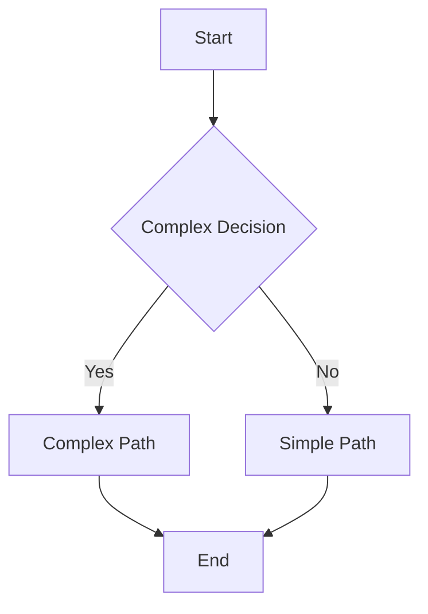

## 2.3 KISS (Keep It Simple, Stupid)

In the world of software development, complexity is often seen as a sign of sophistication and expertise. However, seasoned developers know that complexity can be the enemy of maintainability and scalability. This is where the KISS principle—Keep It Simple, Stupid—comes into play. Emphasizing simplicity in design, the KISS principle is a cornerstone of effective software engineering, particularly in Python, where readability and simplicity are highly valued.

### Understanding the KISS Principle

The KISS principle is a design philosophy that advocates for simplicity in software development. Coined by the U.S. Navy in 1960, the acronym stands for "Keep It Simple, Stupid," though it's often softened to "Keep It Simple, Silly" or "Keep It Simple, Smart." The core idea is that systems work best when they are kept simple rather than made complex. Complexity should only be introduced when absolutely necessary.

#### Background and Relevance

The KISS principle has its roots in the military, where simplicity in design and operation can be a matter of life and death. In software development, while the stakes might not be as high, the principle is equally relevant. Simplicity leads to code that is easier to read, understand, and maintain. It reduces the likelihood of bugs and makes it easier for new developers to get up to speed on a project.

### Benefits of Simple Design

#### Readability

Simple code is easier to read and understand. Python, with its emphasis on readability, naturally aligns with the KISS principle. When code is simple, it is more accessible to others, facilitating collaboration and reducing the time needed to onboard new team members.

#### Debugging

Simple code is easier to debug. When a bug arises, a simple codebase allows developers to quickly trace the source of the problem. Complex code, on the other hand, can obscure the root cause of issues, leading to longer debugging sessions and increased frustration.

#### Collaboration

In a collaborative environment, simplicity is key. It ensures that all team members, regardless of their experience level, can contribute effectively. Simple codebases are more inclusive, allowing for diverse teams to work together seamlessly.

### Reducing Complexity in Python Code

Let's explore some practical examples of how complexity can be reduced in Python code.

#### Example 1: Simplifying Conditional Logic

Complex conditional logic can often be simplified by breaking it down into smaller, more manageable pieces.

```python
def process_data(data):
    if data and isinstance(data, list) and len(data) > 0:
        if all(isinstance(item, int) for item in data):
            return sum(data)
    return 0

def process_data(data):
    if not data or not isinstance(data, list):
        return 0
    if not all(isinstance(item, int) for item in data):
        return 0
    return sum(data)
```

In this example, the complex nested conditions are broken down into simpler, more readable checks.

#### Example 2: Using Python's Built-in Functions

Python provides a wealth of built-in functions that can simplify code. Leveraging these functions can reduce complexity and improve readability.

```python
def filter_even_numbers(numbers):
    result = []
    for number in numbers:
        if number % 2 == 0:
            result.append(number)
    return result

def filter_even_numbers(numbers):
    return [number for number in numbers if number % 2 == 0]
```

Here, a list comprehension is used to simplify the process of filtering even numbers from a list.

### Pitfalls of Unnecessary Complexity

Unnecessary complexity, often referred to as over-engineering, can lead to several issues:

- **Increased Maintenance Costs**: Complex systems require more time and effort to maintain.
- **Higher Risk of Bugs**: Complexity can obscure the logic of a program, making it easier for bugs to go unnoticed.
- **Reduced Flexibility**: Complex systems are harder to modify and adapt to changing requirements.

### Guidelines for Achieving Simplicity

#### Focus on the Essentials

Identify the core functionality of your application and focus on implementing it as simply as possible. Avoid adding features that are not essential to the primary purpose of the application.

#### Use Python's Idioms

Python has many idiomatic ways of expressing common programming patterns. Familiarize yourself with these idioms and use them to simplify your code.

#### Refactor Regularly

Regular refactoring helps keep codebases simple and manageable. Look for opportunities to simplify complex code and eliminate redundancy.

#### Avoid Premature Optimization

Optimize only when necessary. Premature optimization can lead to complex code that is difficult to understand and maintain.

### Examples from Well-Known Python Projects

Several well-known Python projects exemplify the KISS principle. Let's look at a few examples:

#### Flask

Flask is a micro web framework for Python that emphasizes simplicity and minimalism. It provides the essentials for building web applications without unnecessary complexity.

```python
from flask import Flask

app = Flask(__name__)

@app.route('/')
def hello_world():
    return 'Hello, World!'

if __name__ == '__main__':
    app.run()
```

Flask's simplicity makes it easy to get started with web development in Python, while still being powerful enough for complex applications.

#### Requests

The Requests library is a simple, yet powerful HTTP library for Python. It abstracts the complexity of making HTTP requests, providing a clean and simple API.

```python
import requests

response = requests.get('https://api.example.com/data')
if response.status_code == 200:
    print(response.json())
```

Requests exemplifies the KISS principle by providing a straightforward way to interact with web services.

### Visualizing Simplicity in Design

To further illustrate the importance of simplicity in design, let's visualize the difference between a complex and a simple system using a flowchart.



**Description**: This flowchart shows a decision point leading to a complex or simple path. The simple path is direct and easy to follow, while the complex path involves additional steps and decisions.

### Try It Yourself

To truly understand the power of simplicity, try refactoring a piece of complex code in your own projects. Look for nested conditionals, redundant logic, or overly complex algorithms and simplify them using the principles discussed here.

### Knowledge Check

- What are the benefits of simplicity in software design?
- How can Python's built-in functions help reduce complexity?
- What are some common pitfalls of unnecessary complexity?

### Embrace the Journey

Remember, simplicity is a journey, not a destination. As you continue to develop your skills, strive to keep your code as simple as possible. This will not only make your code more maintainable but also more enjoyable to work with.

### Conclusion

The KISS principle is a powerful tool in the software developer's arsenal. By keeping designs simple, we can create systems that are easier to understand, maintain, and extend. In Python, where readability is a core philosophy, the KISS principle is particularly relevant. By embracing simplicity, we can write code that is not only functional but also elegant and efficient.

## Quiz Time!



### What does the KISS principle stand for?

- [x] Keep It Simple, Stupid
- [ ] Keep It Simple, Smart
- [ ] Keep It Simple, Silly
- [ ] Keep It Simple, Secure

> **Explanation:** The KISS principle stands for "Keep It Simple, Stupid," emphasizing simplicity in design.

### Which of the following is a benefit of simple design?

- [x] Easier debugging
- [ ] Increased complexity
- [ ] More features
- [ ] Higher maintenance costs

> **Explanation:** Simple design makes debugging easier by reducing complexity and making the code more understandable.

### How can Python's built-in functions help reduce complexity?

- [x] By providing simple and efficient ways to perform common tasks
- [ ] By adding more lines of code
- [ ] By making code harder to read
- [ ] By increasing the number of dependencies

> **Explanation:** Python's built-in functions offer straightforward solutions for common tasks, reducing the need for complex code.

### What is a common pitfall of unnecessary complexity?

- [x] Over-engineering
- [ ] Improved readability
- [ ] Faster execution
- [ ] Simplified code

> **Explanation:** Unnecessary complexity often leads to over-engineering, where systems become more complicated than needed.

### Which Python project exemplifies the KISS principle?

- [x] Flask
- [ ] Django
- [ ] TensorFlow
- [ ] NumPy

> **Explanation:** Flask is a micro web framework that emphasizes simplicity and minimalism, aligning with the KISS principle.

### What should you focus on to achieve simplicity in design?

- [x] Core functionality
- [ ] Adding features
- [ ] Premature optimization
- [ ] Complex algorithms

> **Explanation:** Focusing on core functionality helps keep the design simple and avoids unnecessary complexity.

### Why is regular refactoring important for simplicity?

- [x] It helps eliminate redundancy and simplify complex code
- [ ] It increases the number of features
- [ ] It makes code more complex
- [ ] It adds more lines of code

> **Explanation:** Regular refactoring helps maintain simplicity by removing redundant code and simplifying complex logic.

### What is a key characteristic of the KISS principle?

- [x] Simplicity
- [ ] Complexity
- [ ] Over-engineering
- [ ] Feature-richness

> **Explanation:** The KISS principle is characterized by simplicity, making systems easier to understand and maintain.

### How does the Requests library exemplify the KISS principle?

- [x] By providing a simple API for making HTTP requests
- [ ] By offering complex configurations
- [ ] By requiring extensive setup
- [ ] By using multiple dependencies

> **Explanation:** The Requests library offers a straightforward API for HTTP requests, exemplifying simplicity.

### True or False: The KISS principle encourages adding as many features as possible.

- [ ] True
- [x] False

> **Explanation:** The KISS principle discourages unnecessary features, focusing instead on simplicity and essential functionality.


