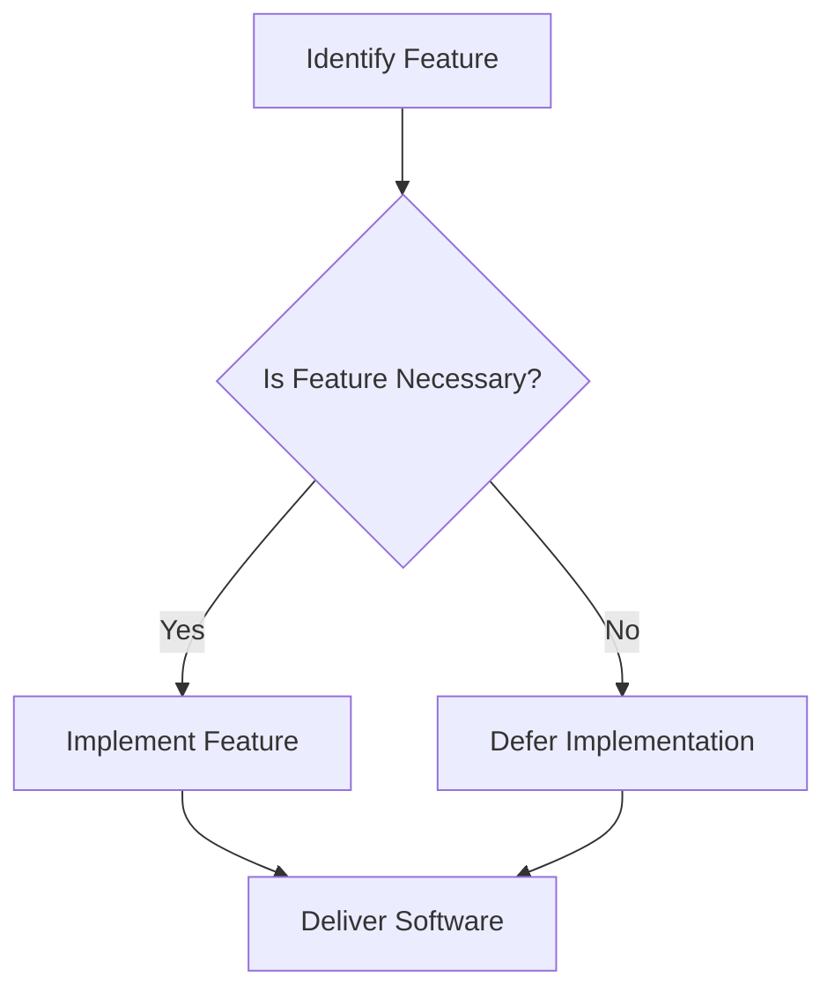

## 2.4 YAGNI (You Aren't Gonna Need It)

In the realm of software development, the YAGNI principle—short for "You Aren't Gonna Need It"—serves as a guiding philosophy to prevent over-engineering and maintain focus on delivering value. Originating from agile methodologies, YAGNI encourages developers to implement only the features necessary for the current requirements, avoiding the temptation to build functionality based on speculative future needs. This principle is crucial for maintaining lean and efficient codebases, ensuring that resources are allocated effectively, and that development timelines are adhered to.

### Understanding the YAGNI Principle

#### Origin and Context

YAGNI is a fundamental tenet of Extreme Programming (XP), a form of agile software development. It was popularized by Kent Beck, one of the pioneers of XP, who emphasized the importance of simplicity in software design. The principle is rooted in the agile manifesto, which values "responding to change over following a plan." By adhering to YAGNI, developers are encouraged to focus on the immediate needs of the project, rather than speculating on what might be needed in the future.

#### The Core Idea

At its core, YAGNI is about resisting the urge to add features that are not currently necessary. This involves a disciplined approach to software development, where every feature is justified by a current requirement. The principle is not about avoiding planning or foresight, but rather about avoiding the implementation of features that do not have a direct, immediate use.

### Risks of Premature Feature Addition

#### Over-Engineering and Complexity

One of the primary risks of adding features based on future predictions is over-engineering. This occurs when developers build complex systems to accommodate potential future requirements, leading to increased complexity and maintenance challenges. Over-engineered systems can become difficult to understand, test, and modify, ultimately slowing down development and increasing the likelihood of bugs.

#### Resource Waste

Implementing unnecessary features consumes valuable resources, including time, money, and developer effort. This can lead to project delays and budget overruns, as resources are diverted from critical tasks to support speculative features. By adhering to YAGNI, teams can ensure that their resources are focused on delivering the highest value features first.

#### Impact on Project Timelines

Adding features that aren't needed can significantly impact project timelines. Each additional feature requires design, implementation, testing, and documentation, all of which take time. This can delay the delivery of the core functionality, pushing back release dates and potentially impacting the project's success.

### Benefits of YAGNI

#### Reducing Waste and Accelerating Development

By focusing on the features that are truly necessary, YAGNI helps reduce waste in the development process. This lean approach ensures that every line of code written has a purpose, which can accelerate development by reducing the time spent on unnecessary tasks. As a result, teams can deliver functional software more quickly and efficiently.

#### Simplifying Codebases

Adhering to YAGNI leads to simpler, more maintainable codebases. When only the necessary features are implemented, the code remains clean and easy to understand. This simplicity makes it easier to refactor and extend the code in the future, as new requirements emerge.

#### Facilitating Agile Practices

YAGNI aligns perfectly with agile practices, which emphasize iterative development and frequent reassessment of requirements. By focusing on the immediate needs of the project, teams can iterate quickly, gather feedback, and adapt to changing requirements without being bogged down by unnecessary complexity.

### Practical Examples of YAGNI in Action

#### Example 1: Feature Toggles

Consider a scenario where a development team is building a web application. The product owner suggests adding a feature that allows users to customize their dashboard with widgets. While this feature could be valuable, it is not part of the current release requirements. By applying YAGNI, the team decides to implement a basic dashboard without customization options, focusing instead on delivering the core functionality.

```python
class Dashboard:
    def __init__(self):
        self.widgets = ["Weather", "News", "Calendar"]

    def display(self):
        for widget in self.widgets:
            print(f"Displaying {widget}")

dashboard = Dashboard()
dashboard.display()
```

In this example, the team avoids the complexity of implementing widget customization, which can be added later if user feedback indicates a need.

#### Example 2: Database Schema Design

Another common scenario involves designing a database schema. A developer might be tempted to add fields for potential future use, such as additional user profile information. However, by adhering to YAGNI, the developer focuses only on the fields required for the current application features.

```sql
CREATE TABLE Users (
    id INT PRIMARY KEY,
    username VARCHAR(50),
    email VARCHAR(100)
    -- Additional fields like 'phone_number' or 'address' are omitted
);
```

This approach keeps the database schema simple and focused, reducing the risk of unused fields cluttering the database.

### Balancing YAGNI with Forward-Thinking Design

While YAGNI emphasizes simplicity and immediate needs, it's important to balance this with forward-thinking design. This involves designing systems that are flexible and adaptable, without implementing unnecessary features.

#### Designing for Change

One way to balance YAGNI with future needs is to design systems that are easy to change. This can be achieved through modular design, where components are loosely coupled and can be modified independently. By designing for change, teams can accommodate future requirements without over-engineering the initial implementation.

#### Iterative Development and Reassessment

YAGNI works best in conjunction with iterative development and frequent reassessment of requirements. By regularly reviewing and updating the project backlog, teams can ensure that they are always working on the most valuable features. This iterative approach allows for flexibility and adaptability, ensuring that the software evolves in response to real user needs.

### Encouraging YAGNI in Development Teams

#### Promoting a Culture of Simplicity

To successfully implement YAGNI, it's important to promote a culture of simplicity within development teams. This involves encouraging developers to question the necessity of each feature and to prioritize simplicity in their designs. By fostering a culture that values simplicity, teams can avoid the pitfalls of over-engineering and focus on delivering value.

#### Providing Training and Resources

Providing training and resources on agile practices and the YAGNI principle can help teams understand the benefits of this approach. Workshops, seminars, and online courses can provide valuable insights into how to implement YAGNI effectively, ensuring that teams are equipped to make informed decisions about feature implementation.

#### Encouraging Collaboration and Communication

Collaboration and communication are key to successfully implementing YAGNI. By encouraging open dialogue between developers, product owners, and stakeholders, teams can ensure that everyone is aligned on the project's priorities. This collaborative approach helps prevent unnecessary features from creeping into the project and ensures that resources are focused on delivering the highest value features.

### Visualizing YAGNI in Software Development

To better understand how YAGNI fits into the software development process, let's visualize the principle using a flowchart. This diagram illustrates the decision-making process involved in determining whether a feature should be implemented.



In this flowchart, the decision to implement a feature is based on its necessity. If the feature is not necessary, it is deferred, allowing the team to focus on delivering the software with the essential features.

### Try It Yourself

To truly grasp the YAGNI principle, try applying it to a project you're currently working on. Identify a feature that is not immediately necessary and defer its implementation. Observe how this decision impacts your project's timeline and resource allocation. Consider how you might apply YAGNI to other areas of your project, and discuss your findings with your team.

### Knowledge Check

To reinforce your understanding of the YAGNI principle, consider the following questions:

- What are the potential risks of implementing features based on future predictions?
- How does YAGNI align with agile practices?
- In what ways can YAGNI reduce waste and accelerate development?
- How can teams balance YAGNI with forward-thinking design?

### Conclusion

The YAGNI principle is a powerful tool for maintaining focus and efficiency in software development. By implementing only the features that are truly necessary, teams can reduce waste, accelerate development, and deliver high-quality software that meets the needs of its users. As you continue your journey in software development, remember to embrace the simplicity and focus that YAGNI offers, and enjoy the benefits of a lean and efficient codebase.

## Quiz Time!



### What is the primary goal of the YAGNI principle?

- [x] To avoid implementing unnecessary features
- [ ] To ensure all potential features are planned for
- [ ] To maximize the complexity of a system
- [ ] To prioritize future needs over current requirements

> **Explanation:** The YAGNI principle aims to avoid implementing features that are not currently necessary, focusing on immediate needs.

### Which agile methodology popularized the YAGNI principle?

- [x] Extreme Programming (XP)
- [ ] Scrum
- [ ] Kanban
- [ ] Lean Software Development

> **Explanation:** YAGNI was popularized by Extreme Programming (XP), which emphasizes simplicity in software design.

### What is a potential risk of not following the YAGNI principle?

- [x] Over-engineering and increased complexity
- [ ] Underestimating future requirements
- [ ] Lack of planning for scalability
- [ ] Inability to adapt to change

> **Explanation:** Not following YAGNI can lead to over-engineering, where unnecessary features increase the complexity of the system.

### How does YAGNI help in resource allocation?

- [x] By focusing resources on necessary features
- [ ] By planning for all possible future features
- [ ] By reducing the number of developers needed
- [ ] By eliminating the need for project management

> **Explanation:** YAGNI helps allocate resources effectively by ensuring they are focused on features that provide immediate value.

### What is an example of applying YAGNI in database design?

- [x] Only including fields needed for current features
- [ ] Designing for all potential future data requirements
- [ ] Creating a complex schema to accommodate any changes
- [ ] Including placeholder fields for future use

> **Explanation:** Applying YAGNI in database design involves only including fields necessary for current features, avoiding speculative additions.

### How can teams balance YAGNI with forward-thinking design?

- [x] By designing systems that are easy to change
- [ ] By implementing all potential features upfront
- [ ] By avoiding any planning for future needs
- [ ] By focusing solely on current requirements

> **Explanation:** Balancing YAGNI with forward-thinking design involves creating systems that are flexible and easy to modify as needs change.

### What is a key benefit of adhering to the YAGNI principle?

- [x] Simplifying codebases
- [ ] Increasing project timelines
- [ ] Maximizing feature sets
- [ ] Ensuring all future needs are met

> **Explanation:** Adhering to YAGNI simplifies codebases by avoiding unnecessary complexity and focusing on essential features.

### How does YAGNI align with iterative development?

- [x] By allowing for frequent reassessment of requirements
- [ ] By ensuring all features are implemented at once
- [ ] By eliminating the need for iteration
- [ ] By focusing solely on long-term planning

> **Explanation:** YAGNI aligns with iterative development by enabling teams to frequently reassess and prioritize current requirements.

### What is a practice that supports the YAGNI principle?

- [x] Frequent reassessment of project requirements
- [ ] Implementing all possible features upfront
- [ ] Designing for maximum complexity
- [ ] Avoiding any form of planning

> **Explanation:** Frequent reassessment of project requirements supports YAGNI by ensuring that only necessary features are implemented.

### YAGNI is primarily about avoiding unnecessary features.

- [x] True
- [ ] False

> **Explanation:** True. YAGNI focuses on avoiding the implementation of features that are not immediately necessary.


