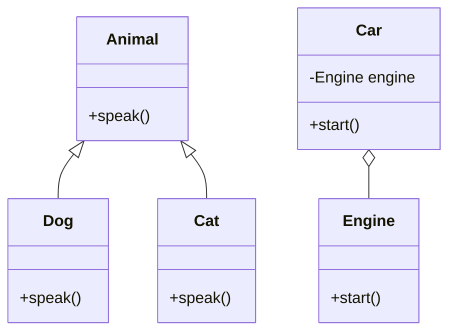

## 2.5 Composition over Inheritance

In the realm of object-oriented programming (OOP), two fundamental concepts are often debated: composition and inheritance. Both are powerful tools that allow developers to create complex systems by building on existing code. However, they serve different purposes and have distinct implications on the flexibility and reusability of your code. In this section, we'll delve into the principles of composition over inheritance, exploring how composition can offer greater flexibility and lead to more maintainable and scalable software designs.

### Understanding Inheritance

Inheritance is a mechanism in OOP that allows a new class, known as a subclass, to inherit attributes and methods from an existing class, called a superclass. This enables code reuse and establishes a hierarchical relationship between classes.

#### Example of Inheritance in Python

```python
class Animal:
    def speak(self):
        raise NotImplementedError("Subclasses must implement this method")

class Dog(Animal):
    def speak(self):
        return "Woof!"

class Cat(Animal):
    def speak(self):
        return "Meow!"

dog = Dog()
cat = Cat()
print(dog.speak())  # Output: Woof!
print(cat.speak())  # Output: Meow!
```

In this example, `Dog` and `Cat` inherit from `Animal`, allowing them to share the `speak` method's interface while providing their own implementations.

### Limitations of Inheritance

While inheritance promotes code reuse, it can also lead to tight coupling and brittle designs. Tight coupling occurs when subclasses are heavily dependent on the implementation details of their superclasses, making changes difficult and error-prone. Inheritance can also lead to the "fragile base class" problem, where changes to a superclass inadvertently affect all subclasses.

### Introducing Composition

Composition is an alternative to inheritance that involves building classes using other classes as components. Instead of inheriting behavior, a class can contain instances of other classes, delegating responsibilities to these contained objects.

#### Example of Composition in Python

```python
class Engine:
    def start(self):
        return "Engine started"

class Car:
    def __init__(self, engine):
        self.engine = engine

    def start(self):
        return self.engine.start()

engine = Engine()
car = Car(engine)
print(car.start())  # Output: Engine started
```

In this example, `Car` uses an instance of `Engine` to perform its `start` operation, demonstrating how composition allows for flexible and modular design.

### Comparing Composition and Inheritance

#### Flexibility

- **Inheritance**: Tends to create rigid hierarchies. Changes in the superclass can have unintended consequences on subclasses.
- **Composition**: Offers greater flexibility by allowing objects to be composed of various components, each responsible for a specific behavior.

#### Reusability

- **Inheritance**: Reuses code by extending classes but can lead to code duplication if not carefully managed.
- **Composition**: Encourages reusability by allowing components to be reused across different classes without forming a rigid hierarchy.

#### Coupling

- **Inheritance**: Often results in tight coupling between superclass and subclass.
- **Composition**: Promotes loose coupling, as components can be easily swapped or modified without affecting the entire system.

### When to Use Composition Over Inheritance

1. **When Flexibility is Required**: Use composition when you anticipate changes in behavior or need to swap components easily.
2. **To Avoid Fragile Base Class Problem**: Composition helps avoid issues where changes in a base class affect all derived classes.
3. **For Better Encapsulation**: Composition allows you to encapsulate behavior within components, leading to cleaner and more maintainable code.

### Best Practices for Implementing Composition

- **Define Clear Interfaces**: Use interfaces or protocols to define the expected behavior of components. This ensures that components can be easily swapped or extended.
- **Favor Delegation**: Delegate responsibilities to components rather than implementing all behavior within a single class.
- **Keep Components Focused**: Design components with a single responsibility to enhance reusability and maintainability.
- **Use Dependency Injection**: Pass components as dependencies to classes, allowing for greater flexibility and easier testing.

### Practical Example: A Notification System

Let's build a notification system that can send messages via different channels (e.g., email, SMS) using composition.

#### Step 1: Define Interfaces

```python
from abc import ABC, abstractmethod

class Notifier(ABC):
    @abstractmethod
    def send(self, message):
        pass
```

#### Step 2: Implement Concrete Components

```python
class EmailNotifier(Notifier):
    def send(self, message):
        return f"Sending email: {message}"

class SMSNotifier(Notifier):
    def send(self, message):
        return f"Sending SMS: {message}"
```

#### Step 3: Compose the Notification System

```python
class NotificationService:
    def __init__(self, notifier: Notifier):
        self.notifier = notifier

    def notify(self, message):
        return self.notifier.send(message)

email_notifier = EmailNotifier()
sms_notifier = SMSNotifier()

notification_service = NotificationService(email_notifier)
print(notification_service.notify("Hello, World!"))  # Output: Sending email: Hello, World!

notification_service = NotificationService(sms_notifier)
print(notification_service.notify("Hello, World!"))  # Output: Sending SMS: Hello, World!
```

### Visualizing Composition vs. Inheritance



In the diagram above, the left side illustrates inheritance with `Animal`, `Dog`, and `Cat`, while the right side shows composition with `Car` and `Engine`.

### Try It Yourself

Experiment with the notification system by adding a new notifier, such as a `PushNotifier`. Implement it using the same interface and test it with the `NotificationService`.

### Knowledge Check

- **What are the main differences between composition and inheritance?**
- **Why might composition lead to more flexible designs?**
- **How can dependency injection enhance the use of composition?**

### Conclusion

Composition over inheritance is a powerful principle in object-oriented design that promotes flexibility, reusability, and maintainability. By favoring composition, you can create systems that are easier to extend and modify, reducing the risk of tight coupling and brittle designs. Remember, this is just the beginning. As you progress, you'll find more opportunities to apply these principles in your projects. Keep experimenting, stay curious, and enjoy the journey!

## Quiz Time!



### What is a primary advantage of composition over inheritance?

- [x] Greater flexibility and modularity
- [ ] Easier to implement
- [ ] Requires less code
- [ ] Automatically enforces encapsulation

> **Explanation:** Composition allows for greater flexibility and modularity by enabling objects to be composed of various components, each responsible for specific behavior.

### In which scenario is inheritance most likely to lead to problems?

- [x] When changes in a superclass affect all subclasses
- [ ] When there are too many subclasses
- [ ] When a class has too many methods
- [ ] When a subclass overrides a method

> **Explanation:** Inheritance can lead to the "fragile base class" problem, where changes in a superclass inadvertently affect all subclasses.

### What is a key characteristic of composition?

- [x] Objects are composed of other objects
- [ ] Objects inherit from a base class
- [ ] Objects are immutable
- [ ] Objects are always singletons

> **Explanation:** Composition involves building classes using other classes as components, allowing for flexible and modular design.

### How does composition promote loose coupling?

- [x] By allowing components to be easily swapped or modified
- [ ] By enforcing strict type checking
- [ ] By using inheritance hierarchies
- [ ] By minimizing the number of classes

> **Explanation:** Composition promotes loose coupling by allowing components to be easily swapped or modified without affecting the entire system.

### Which of the following is a best practice for implementing composition?

- [x] Define clear interfaces for components
- [ ] Use as few classes as possible
- [ ] Avoid using protocols
- [ ] Implement all behavior within a single class

> **Explanation:** Defining clear interfaces ensures that components can be easily swapped or extended.

### What is a potential downside of using inheritance?

- [x] Tight coupling between superclass and subclass
- [ ] Increased code readability
- [ ] Easier code maintenance
- [ ] Better encapsulation

> **Explanation:** Inheritance often results in tight coupling between superclass and subclass, making changes difficult and error-prone.

### How can dependency injection enhance composition?

- [x] By allowing components to be passed as dependencies
- [ ] By reducing the number of classes
- [ ] By enforcing strict type checking
- [ ] By minimizing the use of interfaces

> **Explanation:** Dependency injection allows components to be passed as dependencies, providing greater flexibility and easier testing.

### What is the "fragile base class" problem?

- [x] Changes in a base class affect all derived classes
- [ ] A base class has too many methods
- [ ] A subclass overrides too many methods
- [ ] A base class is immutable

> **Explanation:** The "fragile base class" problem occurs when changes in a base class inadvertently affect all derived classes.

### What is a common use case for composition?

- [x] Building classes with interchangeable components
- [ ] Creating deep inheritance hierarchies
- [ ] Implementing singletons
- [ ] Enforcing strict encapsulation

> **Explanation:** Composition is commonly used to build classes with interchangeable components, promoting flexibility and modularity.

### True or False: Composition always requires more code than inheritance.

- [ ] True
- [x] False

> **Explanation:** Composition does not always require more code than inheritance. It depends on the specific design and requirements of the system.


