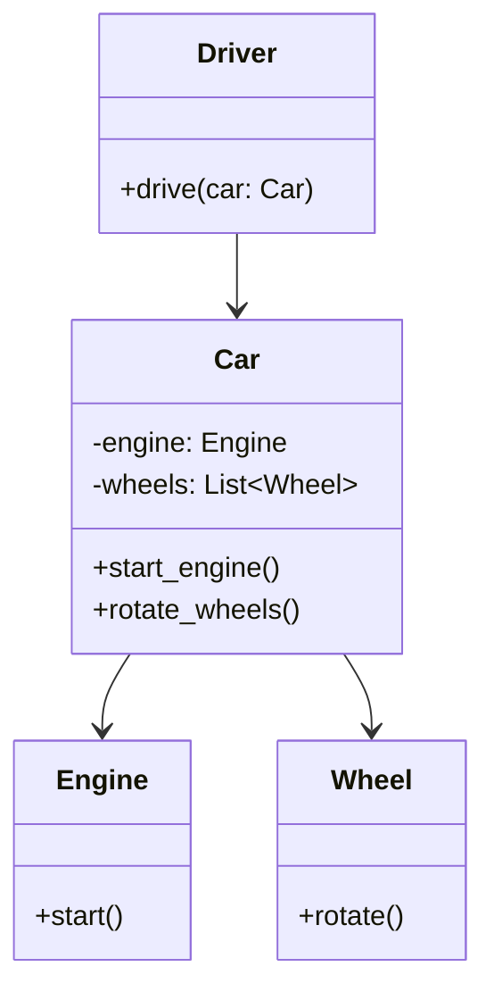

## 2.6 Law of Demeter

In the realm of object-oriented design, maintaining a clean and manageable codebase is paramount. One principle that significantly aids in achieving this goal is the Law of Demeter (LoD). Often referred to as the "Principle of Least Knowledge," the Law of Demeter is a guideline for designing software with minimal coupling between classes. This article delves into the intricacies of the Law of Demeter, its benefits, and practical applications in Python.

### Understanding the Law of Demeter

The Law of Demeter was introduced in 1987 at Northeastern University as part of a project aimed at reducing the complexity of software systems. It is a design guideline that suggests that a module should have limited knowledge about other modules. Specifically, it states that an object should only interact with its immediate friends and not with strangers. This means that a method of an object should only call methods of:

1. The object itself.
2. Its parameters.
3. Any objects it creates.
4. Its direct component objects.

#### The Principle of Least Knowledge

The core idea behind the Law of Demeter is the "Principle of Least Knowledge." This principle advocates for reducing the amount of information one part of a program has about another. By doing so, we can achieve a more modular and flexible system. The benefits of adhering to this principle include:

- **Reduced Coupling**: By minimizing dependencies between classes, changes in one part of the system are less likely to affect others.
- **Enhanced Maintainability**: Code that adheres to the Law of Demeter is generally easier to read and maintain.
- **Improved Testability**: With fewer dependencies, individual components can be tested in isolation more effectively.

### Violating the Law of Demeter

To better understand the Law of Demeter, let's first look at an example of code that violates this principle. Consider the following Python code:

```python
class Engine:
    def start(self):
        print("Engine started")

class Car:
    def __init__(self):
        self.engine = Engine()

class Driver:
    def drive(self, car):
        car.engine.start()  # Violates the Law of Demeter

car = Car()
driver = Driver()
driver.drive(car)
```

In this example, the `Driver` class directly accesses the `engine` attribute of the `Car` class to start the engine. This violates the Law of Demeter because `Driver` is interacting with a part of `Car` that it should not know about directly.

### Adhering to the Law of Demeter

Now, let's refactor the code to adhere to the Law of Demeter:

```python
class Engine:
    def start(self):
        print("Engine started")

class Car:
    def __init__(self):
        self.engine = Engine()

    def start_engine(self):
        self.engine.start()

class Driver:
    def drive(self, car):
        car.start_engine()  # Adheres to the Law of Demeter

car = Car()
driver = Driver()
driver.drive(car)
```

In the refactored code, the `Driver` class no longer interacts directly with the `engine` attribute of the `Car` class. Instead, it calls the `start_engine` method of the `Car` class, which internally handles the interaction with the `Engine` class. This change reduces coupling and makes the code more maintainable.

### Impact on Module Independence and Testability

Adhering to the Law of Demeter enhances module independence and testability. By ensuring that classes only interact with their immediate dependencies, we create a system where modules are less reliant on each other's internal structures. This independence means that changes to one module are less likely to necessitate changes in others, reducing the risk of introducing bugs.

Moreover, with fewer dependencies, testing becomes more straightforward. Each module can be tested in isolation, without needing to set up complex interactions with other parts of the system. This isolation simplifies the creation of unit tests and improves the reliability of the software.

### Strategies for Refactoring to Comply with the Law of Demeter

Refactoring code to comply with the Law of Demeter involves several strategies:

1. **Encapsulation**: Encapsulate the internal details of a class and expose only the necessary methods. This prevents external classes from accessing internal components directly.

2. **Delegation**: Use delegation to handle interactions with internal components. Instead of allowing external classes to interact with internal components, delegate the responsibility to the class itself.

3. **Facade Methods**: Create facade methods that provide a simplified interface for complex interactions. These methods can internally manage the interactions with multiple components.

4. **Use of Interfaces**: Define interfaces that expose only the necessary methods, hiding the internal details of the implementation.

### Example: Refactoring for Law of Demeter Compliance

Let's consider a more complex example that involves refactoring for Law of Demeter compliance:

```python
class Wheel:
    def rotate(self):
        print("Wheel rotating")

class Engine:
    def start(self):
        print("Engine started")

class Car:
    def __init__(self):
        self.engine = Engine()
        self.wheels = [Wheel() for _ in range(4)]

    def start_engine(self):
        self.engine.start()

    def rotate_wheels(self):
        for wheel in self.wheels:
            wheel.rotate()

class Driver:
    def drive(self, car):
        car.start_engine()
        car.rotate_wheels()

car = Car()
driver = Driver()
driver.drive(car)
```

In this example, the `Driver` class interacts with the `Car` class through the `start_engine` and `rotate_wheels` methods. The `Car` class internally manages the interactions with the `Engine` and `Wheel` classes, adhering to the Law of Demeter.

### Visualizing the Law of Demeter

To better understand the interactions and dependencies in the above example, let's visualize the relationships using a class diagram:



In this diagram, we can see that the `Driver` class interacts only with the `Car` class, while the `Car` class manages its internal components (`Engine` and `Wheel`) without exposing them directly to the `Driver` class.

### Benefits of the Law of Demeter

Adhering to the Law of Demeter offers several benefits:

- **Improved Code Readability**: By reducing the number of interactions between classes, the code becomes easier to read and understand.
- **Increased Flexibility**: Changes to one part of the system are less likely to affect others, making the system more adaptable to change.
- **Enhanced Maintainability**: With reduced coupling, the codebase becomes easier to maintain and extend over time.
- **Better Testability**: Isolated components can be tested independently, leading to more reliable and robust tests.

### Try It Yourself

To gain a deeper understanding of the Law of Demeter, try modifying the examples provided. Experiment with adding new components to the `Car` class and see how you can refactor the code to maintain compliance with the Law of Demeter. Consider how these changes affect the overall design and maintainability of the code.

### Knowledge Check

- What is the Law of Demeter, and why is it important in software design?
- How does adhering to the Law of Demeter improve module independence?
- What are some strategies for refactoring code to comply with the Law of Demeter?
- How does the Law of Demeter enhance testability?

### Conclusion

The Law of Demeter is a powerful principle that promotes minimal knowledge between classes, leading to reduced coupling and enhanced maintainability. By adhering to this principle, we can create more robust and flexible software systems that are easier to maintain and test. As you continue your journey in software development, keep the Law of Demeter in mind to build cleaner and more efficient codebases.

## Quiz Time!



### What is the primary goal of the Law of Demeter?

- [x] To minimize coupling between classes
- [ ] To maximize the number of methods in a class
- [ ] To ensure all classes have access to each other's internal components
- [ ] To increase the number of dependencies in a system

> **Explanation:** The Law of Demeter aims to minimize coupling between classes by restricting the knowledge each class has about others.

### Which of the following is a violation of the Law of Demeter?

- [ ] A method calling another method within the same class
- [x] A method accessing a method of an object's subcomponent
- [ ] A method calling a method on a parameter object
- [ ] A method creating and using a new object

> **Explanation:** Accessing a method of an object's subcomponent violates the Law of Demeter, as it involves interacting with a "stranger."

### How does the Law of Demeter improve testability?

- [x] By reducing dependencies, allowing for isolated testing
- [ ] By increasing the number of test cases needed
- [ ] By making all classes dependent on each other
- [ ] By requiring integration tests for all components

> **Explanation:** The Law of Demeter improves testability by reducing dependencies, which allows for isolated testing of individual components.

### What is a common strategy for refactoring code to comply with the Law of Demeter?

- [x] Encapsulation
- [ ] Increasing the number of public methods
- [ ] Directly accessing subcomponents
- [ ] Removing all method calls

> **Explanation:** Encapsulation is a common strategy for refactoring code to comply with the Law of Demeter by hiding internal details.

### Which of the following benefits is associated with the Law of Demeter?

- [x] Enhanced maintainability
- [ ] Increased complexity
- [ ] Greater coupling
- [ ] Reduced flexibility

> **Explanation:** The Law of Demeter enhances maintainability by reducing coupling and simplifying code interactions.

### What does the Law of Demeter suggest about object communication?

- [x] Objects should only communicate with their immediate friends
- [ ] Objects should communicate with all other objects
- [ ] Objects should avoid communication altogether
- [ ] Objects should communicate with strangers

> **Explanation:** The Law of Demeter suggests that objects should only communicate with their immediate friends to reduce coupling.

### How does the Law of Demeter affect code readability?

- [x] It improves code readability by reducing interactions
- [ ] It decreases code readability by increasing complexity
- [ ] It has no effect on code readability
- [ ] It makes code harder to understand

> **Explanation:** The Law of Demeter improves code readability by reducing the number of interactions between classes.

### What is a facade method in the context of the Law of Demeter?

- [x] A method that provides a simplified interface for complex interactions
- [ ] A method that exposes internal components
- [ ] A method that increases coupling
- [ ] A method that directly accesses subcomponents

> **Explanation:** A facade method provides a simplified interface for complex interactions, adhering to the Law of Demeter.

### Which principle is closely related to the Law of Demeter?

- [x] Principle of Least Knowledge
- [ ] Principle of Maximum Knowledge
- [ ] Principle of Complete Coupling
- [ ] Principle of Total Dependence

> **Explanation:** The Principle of Least Knowledge is closely related to the Law of Demeter, emphasizing minimal knowledge between classes.

### True or False: The Law of Demeter allows for direct access to an object's subcomponents.

- [ ] True
- [x] False

> **Explanation:** False. The Law of Demeter discourages direct access to an object's subcomponents to reduce coupling.


