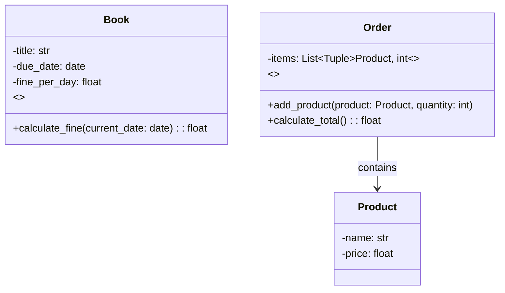

## 2.7.1 Information Expert

In the realm of software design, particularly within object-oriented programming, the GRASP (General Responsibility Assignment Software Patterns) principles serve as a guide to assigning responsibilities to classes and objects. Among these principles, the Information Expert stands out as a crucial concept that helps developers determine where to delegate responsibilities within a system. This principle is instrumental in promoting encapsulation, reducing data redundancy, and ensuring that the system is both maintainable and scalable.

### Understanding the Information Expert Principle

The Information Expert principle suggests that the responsibility for a particular operation should be assigned to the class that has the necessary information to fulfill that responsibility. This is akin to asking the person with the most knowledge about a task to perform it. By doing so, we ensure that the system is designed in a way that is logical, efficient, and easy to understand.

#### Key Concepts

- **Responsibility Assignment**: The core idea is to assign responsibilities to classes that have the information needed to perform them. This minimizes the need for classes to request information from others, thus reducing coupling.
- **Encapsulation**: By keeping the responsibility within the class that owns the data, we maintain encapsulation, which is a fundamental principle of object-oriented design.
- **Data Redundancy**: Assigning responsibilities to the information expert reduces the chances of data duplication across the system.

### Identifying the Information Expert

To identify which class should take on a particular responsibility, follow these steps:

1. **Analyze the Responsibility**: Understand what the responsibility entails and what information is required to fulfill it.
2. **Locate the Information**: Determine which class or classes have the necessary data or can derive it.
3. **Assign the Responsibility**: Delegate the responsibility to the class that has the information or can most easily obtain it.

### Python Examples of Information Expert

Let's explore some Python examples to illustrate how the Information Expert principle can be applied.

#### Example 1: Library System

Consider a simple library system where we need to calculate the total fine for overdue books.

```python
class Book:
    def __init__(self, title, due_date, fine_per_day):
        self.title = title
        self.due_date = due_date
        self.fine_per_day = fine_per_day

    def calculate_fine(self, current_date):
        overdue_days = (current_date - self.due_date).days
        if overdue_days > 0:
            return overdue_days * self.fine_per_day
        return 0

from datetime import date

book = Book("Python Programming", date(2024, 11, 1), 1.5)
current_date = date(2024, 11, 10)
print(f"The fine for the book is: ${book.calculate_fine(current_date):.2f}")
```

**Explanation**: Here, the `Book` class is the information expert because it has all the necessary data to calculate the fine: the due date and the fine per day. By assigning the `calculate_fine` responsibility to the `Book` class, we encapsulate the logic within the class that has the relevant information.

#### Example 2: E-commerce Order Processing

In an e-commerce application, we need to calculate the total price of an order, including taxes and discounts.

```python
class Product:
    def __init__(self, name, price):
        self.name = name
        self.price = price

class Order:
    def __init__(self):
        self.items = []

    def add_product(self, product, quantity):
        self.items.append((product, quantity))

    def calculate_total(self):
        total = 0
        for product, quantity in self.items:
            total += product.price * quantity
        return total

product1 = Product("Laptop", 1000)
product2 = Product("Mouse", 50)

order = Order()
order.add_product(product1, 1)
order.add_product(product2, 2)

print(f"Total order price: ${order.calculate_total():.2f}")
```

**Explanation**: In this example, the `Order` class is the information expert for calculating the total price because it knows about the products and their quantities. The `Product` class provides the price information, but the `Order` class aggregates this data to compute the total.

### Promoting Encapsulation and Reducing Redundancy

By adhering to the Information Expert principle, we promote encapsulation by ensuring that each class is responsible for its own data and behavior. This reduces the need for other classes to access or manipulate data directly, leading to a more modular and maintainable system.

#### Benefits of Encapsulation

- **Modularity**: Encapsulation allows us to change the internal implementation of a class without affecting other parts of the system.
- **Security**: By hiding the internal state of an object, we prevent unauthorized access and modification.
- **Ease of Maintenance**: Encapsulated code is easier to understand and modify, as changes are localized to specific classes.

#### Reducing Data Redundancy

When responsibilities are assigned to the information expert, we minimize the duplication of data across the system. This leads to:

- **Consistency**: Data is maintained in a single location, reducing the risk of inconsistencies.
- **Efficiency**: Redundant data storage is minimized, saving memory and processing resources.

### Potential Issues When the Principle is Not Followed

Ignoring the Information Expert principle can lead to several issues:

- **Increased Coupling**: If responsibilities are assigned to classes that do not have the necessary information, these classes may need to interact with multiple other classes to gather data, increasing coupling.
- **Data Redundancy**: Responsibilities might be duplicated across classes, leading to redundant data storage and potential inconsistencies.
- **Complexity**: The system becomes more complex as responsibilities are scattered across classes, making it harder to understand and maintain.

### Visualizing the Information Expert Principle

To better understand how the Information Expert principle works, let's visualize it using a class diagram.



**Diagram Explanation**: The diagram illustrates the `Book` and `Order` classes as information experts. The `Book` class is responsible for calculating fines based on its data, while the `Order` class calculates the total price using the products it contains.

### Try It Yourself

To deepen your understanding, try modifying the examples:

1. **Extend the Library System**: Add a method to the `Book` class that returns a summary of the book's status, including the title, due date, and fine amount.
2. **Enhance the E-commerce System**: Implement a method in the `Order` class that applies a discount to the total price and calculates the final amount.

### Knowledge Check

- **Why is the Information Expert principle important for encapsulation?**
- **What are the consequences of not following the Information Expert principle?**
- **How does the Information Expert principle help in reducing data redundancy?**

### Embrace the Journey

Remember, mastering the Information Expert principle is just one step in becoming proficient in object-oriented design. As you continue to explore design patterns and principles, you'll gain the skills needed to build robust, maintainable, and scalable systems. Keep experimenting, stay curious, and enjoy the journey!

## Quiz Time!



### Which principle suggests assigning responsibilities to the class with the necessary information?

- [x] Information Expert
- [ ] Low Coupling
- [ ] High Cohesion
- [ ] Polymorphism

> **Explanation:** The Information Expert principle suggests that responsibilities should be assigned to the class that has the necessary information to fulfill them.

### What is a key benefit of following the Information Expert principle?

- [x] Promotes encapsulation
- [ ] Increases data redundancy
- [ ] Increases coupling
- [ ] Decreases cohesion

> **Explanation:** By assigning responsibilities to the class with the necessary information, encapsulation is promoted, reducing the need for external classes to access or manipulate data.

### What issue can arise if the Information Expert principle is not followed?

- [x] Increased coupling
- [ ] Decreased encapsulation
- [ ] Reduced cohesion
- [ ] Enhanced modularity

> **Explanation:** Not following the Information Expert principle can lead to increased coupling, as classes may need to interact with multiple other classes to gather necessary information.

### Which class should calculate the total price in an e-commerce application?

- [x] Order
- [ ] Product
- [ ] Customer
- [ ] Payment

> **Explanation:** The `Order` class should calculate the total price because it contains the necessary information about the products and their quantities.

### How does the Information Expert principle reduce data redundancy?

- [x] By ensuring data is maintained in a single location
- [ ] By duplicating data across classes
- [ ] By increasing the number of classes
- [ ] By reducing the number of methods

> **Explanation:** The principle reduces data redundancy by ensuring that data is maintained in a single location, minimizing duplication across the system.

### In the library system example, which class is the information expert for calculating fines?

- [x] Book
- [ ] Library
- [ ] Member
- [ ] Author

> **Explanation:** The `Book` class is the information expert for calculating fines because it has the necessary data, such as the due date and fine per day.

### What is a consequence of increased coupling in a system?

- [x] Harder to maintain
- [ ] Easier to understand
- [ ] More efficient
- [ ] More secure

> **Explanation:** Increased coupling makes a system harder to maintain because changes in one part of the system can have widespread effects.

### Which principle is part of the GRASP principles?

- [x] Information Expert
- [ ] Single Responsibility
- [ ] Open/Closed
- [ ] Liskov Substitution

> **Explanation:** The Information Expert is one of the GRASP principles, which guide responsibility assignment in object-oriented design.

### What is encapsulation in object-oriented design?

- [x] Hiding the internal state of an object
- [ ] Exposing all data to external classes
- [ ] Increasing the number of classes
- [ ] Reducing the number of methods

> **Explanation:** Encapsulation involves hiding the internal state of an object to prevent unauthorized access and modification.

### True or False: The Information Expert principle can lead to a more modular system.

- [x] True
- [ ] False

> **Explanation:** True. By assigning responsibilities to the class with the necessary information, the system becomes more modular and easier to maintain.


