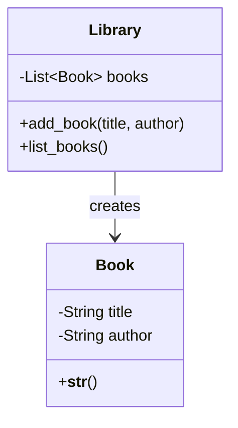

## 2.7.2 Creator

In the realm of software design, the GRASP (General Responsibility Assignment Software Patterns) principles serve as a guide for assigning responsibilities to classes and objects. Among these principles, the **Creator** principle plays a pivotal role in determining which class should be responsible for creating instances of another class. This decision is crucial as it affects the coupling between classes and the overall maintainability of the code.

### Understanding the Creator Principle

The Creator principle suggests that a class B should be responsible for creating instances of class A if one or more of the following criteria are met:

1. **Aggregation**: B contains or aggregates A.
2. **Association**: B records instances of A.
3. **Initialization**: B uses A closely and has the data necessary to initialize A.
4. **Dependency**: B has the information required to create A.
5. **Ownership**: B has a strong ownership or control over A.

By following these criteria, we can ensure that object creation is logically placed within the class that has the most relevant information or relationship with the object being created. This leads to a more cohesive and understandable codebase.

### Implementing the Creator Principle in Python

Let's delve into a practical example to illustrate how the Creator principle can be applied in Python. Consider a simple scenario involving a `Library` and `Book` classes.

```python
class Book:
    def __init__(self, title, author):
        self.title = title
        self.author = author

    def __str__(self):
        return f"'{self.title}' by {self.author}"

class Library:
    def __init__(self):
        self.books = []

    def add_book(self, title, author):
        # Library is responsible for creating Book instances
        book = Book(title, author)
        self.books.append(book)

    def list_books(self):
        for book in self.books:
            print(book)

library = Library()
library.add_book("1984", "George Orwell")
library.add_book("To Kill a Mockingbird", "Harper Lee")
library.list_books()
```

In this example, the `Library` class is responsible for creating `Book` instances. This responsibility is assigned to `Library` because it aggregates `Book` objects and has the necessary information to initialize them (i.e., title and author).

### How the Creator Principle Affects Coupling

Coupling refers to the degree of direct knowledge that one class has about another. By adhering to the Creator principle, we can reduce unnecessary coupling between classes. In the example above, the `Library` class is tightly coupled with the `Book` class, but this is an intentional and logical coupling because the `Library` aggregates `Book` instances.

However, if another class, say `Bookstore`, were to create `Book` instances without a direct relationship, it would lead to unnecessary coupling. By following the Creator principle, we ensure that only classes with a logical relationship to `Book` are responsible for its creation.

### Benefits of Following the Creator Principle

1. **Clarity**: By assigning creation responsibilities to the most logical class, the code becomes more intuitive and easier to understand.
2. **Maintainability**: Changes to the creation process are localized to the class responsible for creation, reducing the impact on other parts of the system.
3. **Cohesion**: The Creator principle promotes high cohesion within classes, as related responsibilities are grouped together.

### Exceptions and Alternative Approaches

While the Creator principle provides a solid guideline for assigning creation responsibilities, there are situations where alternative approaches might be preferable:

- **Factory Patterns**: In scenarios where object creation is complex or involves multiple steps, factory patterns (like Factory Method or Abstract Factory) can be used to encapsulate the creation logic.
- **Dependency Injection**: When classes require external dependencies, dependency injection can be used to decouple the creation of those dependencies from the class itself.
- **Prototype Pattern**: For cases where objects are created by copying existing instances, the Prototype pattern can be a suitable alternative.

### Visualizing the Creator Principle

To better understand the relationships and responsibilities involved in the Creator principle, let's visualize the `Library` and `Book` classes using a class diagram.



In this diagram, the `Library` class is shown to have a direct relationship with the `Book` class, indicating its responsibility for creating `Book` instances.

### Try It Yourself

Let's encourage you to experiment with the code example provided. Try modifying the `Library` class to include additional methods for removing books or searching for books by title. Consider how these changes affect the responsibilities of the `Library` class and whether they align with the Creator principle.

### Knowledge Check

Before we wrap up, let's pose a few questions to reinforce your understanding of the Creator principle:

- What are the criteria for assigning creation responsibilities according to the Creator principle?
- How does the Creator principle affect coupling between classes?
- Can you think of a scenario where using a factory pattern might be more appropriate than following the Creator principle?

### Conclusion

The Creator principle is a fundamental aspect of the GRASP principles, guiding us in assigning object creation responsibilities based on existing relationships. By adhering to this principle, we can create clearer, more maintainable, and cohesive code. Remember, while the Creator principle provides valuable guidance, it's essential to consider the context and requirements of your specific application when deciding on the best approach for object creation.

## Quiz Time!



### Which of the following is a criterion for the Creator principle?

- [x] Aggregation
- [ ] Inheritance
- [ ] Polymorphism
- [ ] Encapsulation

> **Explanation:** Aggregation is one of the criteria for the Creator principle, indicating that a class should create instances of another class if it contains or aggregates them.

### What is the primary benefit of following the Creator principle?

- [x] Increased clarity and maintainability
- [ ] Faster execution time
- [ ] Reduced memory usage
- [ ] Enhanced security

> **Explanation:** The Creator principle primarily enhances clarity and maintainability by logically assigning creation responsibilities.

### In the provided example, which class is responsible for creating Book instances?

- [x] Library
- [ ] Book
- [ ] Bookstore
- [ ] Author

> **Explanation:** The `Library` class is responsible for creating `Book` instances, as it aggregates them and has the necessary information for their creation.

### How does the Creator principle affect coupling?

- [x] It reduces unnecessary coupling by assigning creation responsibilities to related classes.
- [ ] It increases coupling by introducing more dependencies.
- [ ] It has no effect on coupling.
- [ ] It eliminates all coupling between classes.

> **Explanation:** The Creator principle reduces unnecessary coupling by ensuring that only related classes are responsible for object creation.

### When might a factory pattern be more appropriate than the Creator principle?

- [x] When object creation is complex or involves multiple steps
- [ ] When objects are immutable
- [ ] When objects are simple and require no initialization
- [ ] When objects are created infrequently

> **Explanation:** Factory patterns are suitable for complex object creation processes, encapsulating the creation logic.

### What is a potential alternative to the Creator principle for handling dependencies?

- [x] Dependency Injection
- [ ] Singleton Pattern
- [ ] Observer Pattern
- [ ] Composite Pattern

> **Explanation:** Dependency Injection is an alternative approach that decouples the creation of dependencies from the class itself.

### Which of the following is NOT a benefit of the Creator principle?

- [x] Faster execution time
- [ ] Clarity
- [ ] Maintainability
- [ ] Cohesion

> **Explanation:** The Creator principle does not inherently lead to faster execution time; its benefits are primarily related to clarity, maintainability, and cohesion.

### What does the Creator principle promote within classes?

- [x] High cohesion
- [ ] Low cohesion
- [ ] High coupling
- [ ] Low coupling

> **Explanation:** The Creator principle promotes high cohesion by grouping related responsibilities within classes.

### In the context of the Creator principle, what does "ownership" refer to?

- [x] A class having strong control over another class
- [ ] A class being a subclass of another class
- [ ] A class inheriting methods from another class
- [ ] A class being an instance of another class

> **Explanation:** Ownership in the Creator principle refers to a class having strong control or ownership over another class, justifying its responsibility for creation.

### True or False: The Creator principle can be applied to reduce memory usage in a program.

- [ ] True
- [x] False

> **Explanation:** The Creator principle is not directly related to memory usage; its focus is on assigning creation responsibilities to enhance clarity and maintainability.



Remember, this is just the beginning. As you progress, you'll build more complex and interactive systems. Keep experimenting, stay curious, and enjoy the journey!
