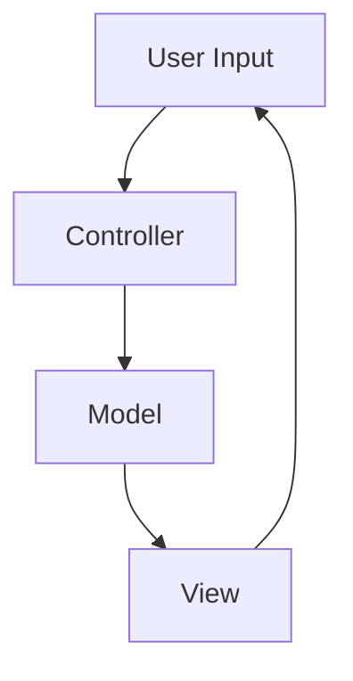
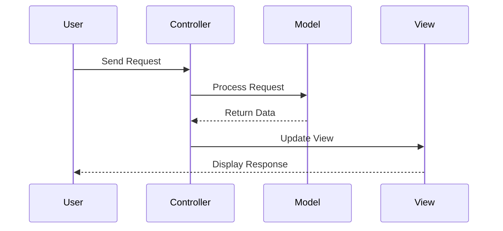

## 2.7.3 Controller

In the realm of object-oriented design, the Controller plays a pivotal role in managing system events and delegating tasks to appropriate components. This section delves into the intricacies of the Controller, its integration into various architectural patterns, and best practices for implementation in Python.

### Understanding the Controller's Role

The Controller is a fundamental concept in software design, particularly within the GRASP (General Responsibility Assignment Software Patterns) principles. It acts as an intermediary between the user interface and the business logic, handling incoming requests, processing them, and determining the appropriate course of action. The Controller's primary responsibilities include:

- **Handling System Events**: Controllers are designed to respond to events such as user inputs, system notifications, or external triggers. They interpret these events and translate them into actions within the application.
- **Delegating Work**: Controllers delegate tasks to other components, such as models or services, ensuring that each part of the system performs its designated function.
- **Coordinating Tasks**: By managing the flow of data and control between different parts of the application, Controllers help maintain a clean separation of concerns.

### Controllers in Application Architectures

Controllers are integral to several architectural patterns, most notably the Model-View-Controller (MVC) and its variants. Let's explore how Controllers fit into these architectures:

#### Model-View-Controller (MVC)

In the MVC architecture, the Controller serves as the glue between the Model and the View. It receives input from the View, processes it (often by interacting with the Model), and returns the output display to the View. This separation of concerns allows for more modular and maintainable code.



**Diagram Explanation**: The diagram illustrates the flow of data in an MVC architecture. The Controller receives user input, interacts with the Model, and updates the View accordingly.

#### Model-View-Presenter (MVP) and Model-View-ViewModel (MVVM)

In MVP and MVVM, the Controller's role is often replaced or supplemented by a Presenter or ViewModel, which may take on similar responsibilities. However, the core idea of managing input and coordinating tasks remains consistent.

### Implementing Controllers in Python

Let's explore how to implement Controllers in Python, focusing on managing workflows and delegating tasks effectively.

#### Basic Controller Example

Consider a simple application where a user can create, read, update, and delete (CRUD) items. The Controller will handle these requests and interact with the Model to perform the necessary operations.

```python
class ItemController:
    def __init__(self, model):
        self.model = model

    def create_item(self, data):
        """Handle the creation of a new item."""
        item = self.model.create(data)
        return f"Item created: {item}"

    def read_item(self, item_id):
        """Handle reading an item."""
        item = self.model.read(item_id)
        return f"Item details: {item}"

    def update_item(self, item_id, data):
        """Handle updating an item."""
        item = self.model.update(item_id, data)
        return f"Item updated: {item}"

    def delete_item(self, item_id):
        """Handle deleting an item."""
        self.model.delete(item_id)
        return "Item deleted"
```

**Code Explanation**: This `ItemController` class manages CRUD operations by delegating tasks to the `model` object, which handles the data logic.

#### Try It Yourself

Experiment with the above code by adding error handling for cases where an item does not exist. Consider how the Controller should respond to such situations.

### Best Practices for Controllers

To ensure Controllers remain effective and maintainable, adhere to the following best practices:

- **Keep Controllers Focused**: Each Controller should handle a specific set of related tasks. Avoid overloading a single Controller with too many responsibilities.
- **Delegate Appropriately**: Controllers should delegate business logic to models or services, rather than handling it directly. This separation of concerns enhances code readability and maintainability.
- **Avoid "God" Controllers**: A "God" Controller is one that takes on too many responsibilities, leading to complex and hard-to-maintain code. Strive for simplicity and clarity by breaking down tasks into smaller, manageable components.

### Common Mistakes and How to Avoid Them

When implementing Controllers, developers often encounter pitfalls that can lead to inefficient or unmanageable code. Here are some common mistakes and strategies to avoid them:

#### Overloading Controllers

**Mistake**: Assigning too many responsibilities to a single Controller, leading to a "God" Controller.

**Solution**: Break down the Controller into smaller, more focused components. For instance, separate Controllers for different parts of the application (e.g., `UserController`, `OrderController`).

#### Mixing Business Logic with Control Logic

**Mistake**: Implementing business logic directly within the Controller.

**Solution**: Delegate business logic to models or service classes. The Controller should focus on handling input and coordinating tasks.

#### Ignoring Error Handling

**Mistake**: Failing to implement robust error handling within Controllers.

**Solution**: Incorporate comprehensive error handling to manage exceptions and provide meaningful feedback to the user.

### Advanced Controller Patterns

For more complex applications, Controllers can be extended to handle additional responsibilities, such as authentication, authorization, and logging. Let's explore some advanced patterns:

#### Authentication and Authorization

Controllers can manage user authentication and authorization by integrating with authentication services or middleware. This ensures that only authorized users can access certain parts of the application.

```python
class AuthenticatedController:
    def __init__(self, auth_service, model):
        self.auth_service = auth_service
        self.model = model

    def perform_action(self, user, action, *args):
        if not self.auth_service.is_authorized(user, action):
            return "Unauthorized access"
        return getattr(self, action)(*args)
```

**Code Explanation**: The `AuthenticatedController` class uses an `auth_service` to check user permissions before performing actions.

#### Logging and Monitoring

Integrating logging and monitoring within Controllers can provide valuable insights into application performance and user behavior.

```python
import logging

class LoggingController:
    def __init__(self, model):
        self.model = model
        self.logger = logging.getLogger(__name__)

    def create_item(self, data):
        self.logger.info("Creating item with data: %s", data)
        return self.model.create(data)
```

**Code Explanation**: The `LoggingController` class logs actions performed by the Controller, aiding in debugging and monitoring.

### Visualizing Controller Workflows

To better understand how Controllers manage workflows, let's visualize a typical Controller interaction in a web application.



**Diagram Explanation**: This sequence diagram illustrates the interaction between the User, Controller, Model, and View in a typical web application workflow.

### Knowledge Check

Let's reinforce our understanding of Controllers with a few questions:

1. What is the primary role of a Controller in an application?
2. How does the Controller fit into the MVC architecture?
3. What are some best practices for keeping Controllers focused?

### Embrace the Journey

Remember, mastering the Controller pattern is just one step in your journey to becoming a proficient software architect. As you continue to explore design patterns and architectural principles, you'll develop the skills needed to build robust, scalable applications. Keep experimenting, stay curious, and embrace the challenges along the way!

## Quiz Time!



### What is the primary responsibility of a Controller in an application?

- [x] Handling system events and delegating tasks
- [ ] Managing database connections
- [ ] Designing user interfaces
- [ ] Writing business logic

> **Explanation:** The Controller's main role is to handle system events and delegate tasks to appropriate components.

### In the MVC architecture, the Controller interacts directly with which components?

- [x] Model and View
- [ ] Only the Model
- [ ] Only the View
- [ ] Database and User Interface

> **Explanation:** In MVC, the Controller interacts with both the Model and the View to process input and update the display.

### Which of the following is a best practice for Controllers?

- [x] Keeping Controllers focused on specific tasks
- [ ] Implementing all business logic within the Controller
- [ ] Using Controllers to manage database schema
- [ ] Avoiding delegation to other components

> **Explanation:** Best practices include keeping Controllers focused and delegating business logic to other components.

### What is a "God" Controller?

- [x] A Controller with too many responsibilities
- [ ] A Controller that only handles user authentication
- [ ] A Controller that manages database connections
- [ ] A Controller that logs all user actions

> **Explanation:** A "God" Controller is overloaded with responsibilities, making it difficult to maintain.

### How can Controllers manage user authentication?

- [x] By integrating with authentication services
- [ ] By storing passwords directly
- [ ] By modifying user data
- [ ] By handling database queries

> **Explanation:** Controllers can manage authentication by integrating with dedicated authentication services.

### What is a common mistake when implementing Controllers?

- [x] Mixing business logic with control logic
- [ ] Delegating tasks to models
- [ ] Using logging for monitoring
- [ ] Keeping Controllers focused

> **Explanation:** Mixing business logic with control logic is a common mistake that can lead to complex and unmanageable code.

### How can Controllers enhance application monitoring?

- [x] By integrating logging and monitoring
- [ ] By storing logs in the database
- [ ] By modifying user interfaces
- [ ] By handling all system events

> **Explanation:** Integrating logging and monitoring within Controllers provides valuable insights into application performance.

### What is the benefit of using sequence diagrams for Controllers?

- [x] Visualizing interactions between components
- [ ] Designing database schemas
- [ ] Writing business logic
- [ ] Managing user interfaces

> **Explanation:** Sequence diagrams help visualize interactions between components, aiding in understanding workflows.

### How can Controllers avoid overloading?

- [x] By breaking down tasks into smaller components
- [ ] By handling all business logic
- [ ] By managing database connections
- [ ] By designing user interfaces

> **Explanation:** Breaking down tasks into smaller components helps avoid overloading Controllers.

### True or False: Controllers should handle all business logic directly.

- [ ] True
- [x] False

> **Explanation:** Controllers should delegate business logic to models or services, focusing on handling input and coordinating tasks.


