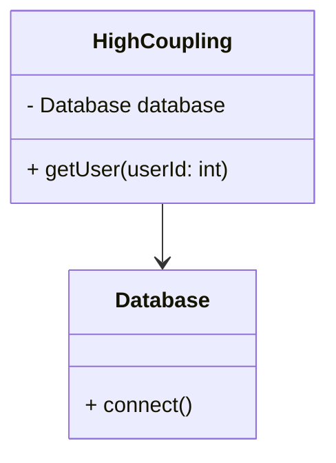
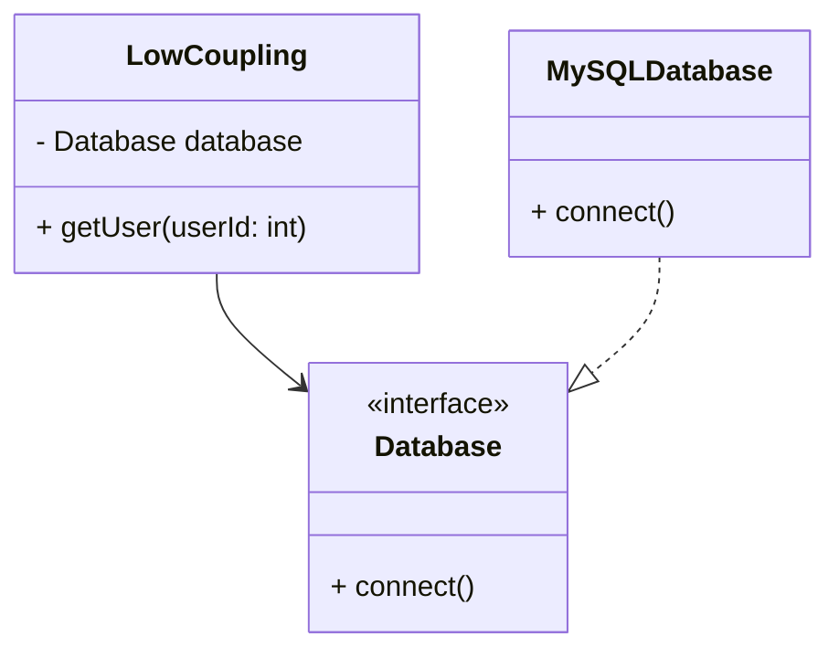

## 2.7.4 Low Coupling

In the realm of software design, the concept of coupling plays a pivotal role in determining the flexibility and maintainability of a system. Coupling refers to the degree of direct knowledge that one module has about another. In this section, we will delve into the principles of low coupling, explore its significance, and provide practical strategies to achieve it in Python.

### Understanding Coupling

Coupling is a measure of how closely connected different modules or classes are within a system. It reflects the extent to which one module relies on another. High coupling indicates a strong dependency between modules, whereas low coupling suggests minimal dependency.

#### Impact of High Coupling

High coupling can have several adverse effects on software design:

- **Reduced Flexibility**: Changes in one module may necessitate changes in others, making the system less adaptable to new requirements.
- **Decreased Reusability**: Tightly coupled modules are often difficult to reuse in different contexts, as they depend heavily on specific implementations.
- **Increased Complexity**: High coupling can lead to complex interdependencies, making the system harder to understand and maintain.

### Why Low Coupling is Desirable

Low coupling is a desirable attribute in software design for several reasons:

- **Enhanced Flexibility**: Modules with low coupling can evolve independently, allowing for easier adaptation to changing requirements.
- **Improved Reusability**: Loosely coupled modules can be reused across different projects or contexts without significant modification.
- **Simplified Maintenance**: With fewer dependencies, the system becomes easier to understand, test, and maintain.

### Strategies to Achieve Low Coupling in Python

Achieving low coupling involves designing systems where modules interact through well-defined interfaces, minimizing direct dependencies. Here are some strategies to achieve low coupling in Python:

#### 1. Use Interfaces and Abstract Base Classes

Interfaces define a contract that classes must adhere to, allowing for interchangeable implementations. In Python, abstract base classes (ABCs) can be used to define interfaces.

```python
from abc import ABC, abstractmethod

class PaymentProcessor(ABC):
    @abstractmethod
    def process_payment(self, amount: float):
        pass

class CreditCardProcessor(PaymentProcessor):
    def process_payment(self, amount: float):
        print(f"Processing credit card payment of {amount}")

class PayPalProcessor(PaymentProcessor):
    def process_payment(self, amount: float):
        print(f"Processing PayPal payment of {amount}")

def make_payment(processor: PaymentProcessor, amount: float):
    processor.process_payment(amount)

processor = CreditCardProcessor()
make_payment(processor, 100.0)
```

In this example, `PaymentProcessor` is an interface that defines a contract for payment processing. Both `CreditCardProcessor` and `PayPalProcessor` implement this interface, allowing them to be used interchangeably.

#### 2. Apply Dependency Injection

Dependency injection involves passing dependencies to a class rather than hard-coding them. This reduces the coupling between classes and their dependencies.

```python
class OrderService:
    def __init__(self, payment_processor: PaymentProcessor):
        self.payment_processor = payment_processor

    def place_order(self, amount: float):
        self.payment_processor.process_payment(amount)

payment_processor = PayPalProcessor()
order_service = OrderService(payment_processor)
order_service.place_order(200.0)
```

Here, `OrderService` receives a `PaymentProcessor` instance through its constructor, allowing for flexible substitution of different payment processors.

#### 3. Favor Composition Over Inheritance

Composition involves building complex objects by combining simpler ones, rather than relying on inheritance. This approach reduces coupling by allowing objects to interact through interfaces.

```python
class Engine:
    def start(self):
        print("Engine started")

class Car:
    def __init__(self, engine: Engine):
        self.engine = engine

    def drive(self):
        self.engine.start()
        print("Car is driving")

engine = Engine()
car = Car(engine)
car.drive()
```

In this example, `Car` is composed of an `Engine` object, allowing for flexible substitution of different engine implementations.

### High vs. Low Coupling: A Comparative Example

Let's compare high and low coupling scenarios to illustrate the benefits of low coupling.

#### High Coupling Example

```python
class Database:
    def connect(self):
        print("Connecting to database")

class UserService:
    def __init__(self):
        self.database = Database()

    def get_user(self, user_id: int):
        self.database.connect()
        print(f"Fetching user {user_id}")

user_service = UserService()
user_service.get_user(1)
```

In this high coupling example, `UserService` is tightly coupled to the `Database` class, making it difficult to substitute different database implementations.

#### Low Coupling Example

```python
class Database(ABC):
    @abstractmethod
    def connect(self):
        pass

class MySQLDatabase(Database):
    def connect(self):
        print("Connecting to MySQL database")

class UserService:
    def __init__(self, database: Database):
        self.database = database

    def get_user(self, user_id: int):
        self.database.connect()
        print(f"Fetching user {user_id}")

database = MySQLDatabase()
user_service = UserService(database)
user_service.get_user(1)
```

In this low coupling example, `UserService` interacts with the `Database` interface, allowing for flexible substitution of different database implementations.

### Trade-offs Between Coupling and Other Design Considerations

While low coupling is generally desirable, it is important to consider the trade-offs with other design considerations:

- **Complexity vs. Simplicity**: Striving for low coupling can sometimes lead to increased complexity, especially when overusing interfaces or dependency injection.
- **Performance**: Introducing layers of abstraction to achieve low coupling may impact performance, as additional indirection can slow down execution.
- **Development Time**: Designing for low coupling may require more upfront effort, as it involves careful planning and consideration of module interactions.

### Visualizing Low Coupling

To better understand the concept of low coupling, let's visualize the relationships between modules in high and low coupling scenarios.



In the high coupling diagram, the `HighCoupling` class directly depends on the `Database` class, leading to a strong dependency.



In the low coupling diagram, the `LowCoupling` class interacts with the `Database` interface, allowing for flexible substitution of different database implementations.

### Try It Yourself

To reinforce your understanding of low coupling, try modifying the code examples provided:

1. **Add a New Payment Processor**: Implement a new payment processor class and use it with the `OrderService` class.
2. **Substitute the Database Implementation**: Create a new database implementation and use it with the `UserService` class.
3. **Experiment with Composition**: Modify the `Car` class to use a different engine implementation.

### Knowledge Check

- **What is coupling, and why is it important in software design?**
- **How can interfaces and abstract base classes help achieve low coupling?**
- **What are the benefits of using dependency injection to reduce coupling?**
- **How does composition differ from inheritance in terms of coupling?**

### Embrace the Journey

Remember, achieving low coupling is a journey, not a destination. As you continue to design and develop software, strive to balance coupling with other design considerations. Keep experimenting, stay curious, and enjoy the journey!

## Quiz Time!



### What is coupling in software design?

- [x] The degree of direct knowledge one module has about another.
- [ ] The process of combining multiple modules into one.
- [ ] The act of separating modules to increase complexity.
- [ ] The method of optimizing code for performance.

> **Explanation:** Coupling refers to how closely connected different modules or classes are within a system, indicating the level of dependency between them.

### Why is low coupling desirable?

- [x] It enhances flexibility and reusability.
- [ ] It increases the complexity of the system.
- [ ] It reduces the need for interfaces.
- [ ] It makes the code harder to understand.

> **Explanation:** Low coupling is desirable because it allows modules to evolve independently, improving flexibility and reusability.

### Which strategy can help achieve low coupling in Python?

- [x] Using interfaces and abstract base classes.
- [ ] Hard-coding dependencies within classes.
- [ ] Avoiding the use of interfaces.
- [ ] Combining all modules into a single class.

> **Explanation:** Using interfaces and abstract base classes allows for interchangeable implementations, reducing direct dependencies.

### What is dependency injection?

- [x] Passing dependencies to a class rather than hard-coding them.
- [ ] Combining multiple classes into one.
- [ ] Avoiding the use of constructors.
- [ ] Hard-coding dependencies within a class.

> **Explanation:** Dependency injection involves providing dependencies to a class externally, reducing coupling between classes and their dependencies.

### How does composition help reduce coupling?

- [x] By allowing objects to interact through interfaces.
- [ ] By combining multiple classes into one.
- [ ] By increasing the complexity of the system.
- [ ] By hard-coding dependencies within a class.

> **Explanation:** Composition involves building complex objects by combining simpler ones, allowing for flexible substitution of components.

### What is a potential trade-off of achieving low coupling?

- [x] Increased complexity in the system.
- [ ] Reduced flexibility of the system.
- [ ] Decreased reusability of modules.
- [ ] Simplified maintenance of the system.

> **Explanation:** Striving for low coupling can sometimes lead to increased complexity, especially when overusing interfaces or dependency injection.

### Which of the following is an example of high coupling?

- [x] A class directly instantiating and using another class.
- [ ] A class interacting with another through an interface.
- [ ] A class using dependency injection to receive its dependencies.
- [ ] A class composed of simpler objects.

> **Explanation:** High coupling occurs when a class directly depends on another class, making it difficult to substitute different implementations.

### What is the role of abstract base classes in reducing coupling?

- [x] They define a contract for interchangeable implementations.
- [ ] They increase the complexity of the system.
- [ ] They hard-code dependencies within classes.
- [ ] They combine multiple classes into one.

> **Explanation:** Abstract base classes define a contract that classes must adhere to, allowing for interchangeable implementations and reducing direct dependencies.

### How does low coupling affect maintainability?

- [x] It simplifies maintenance by reducing dependencies.
- [ ] It complicates maintenance by increasing dependencies.
- [ ] It has no impact on maintainability.
- [ ] It makes the code harder to understand.

> **Explanation:** Low coupling simplifies maintenance by reducing dependencies, making the system easier to understand and modify.

### True or False: Low coupling always leads to better performance.

- [ ] True
- [x] False

> **Explanation:** While low coupling improves flexibility and reusability, it may introduce additional layers of abstraction that can impact performance.


