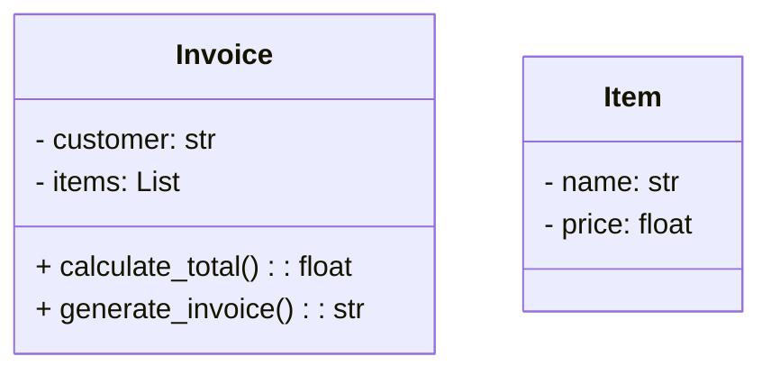

## 2.7.5 High Cohesion

In the realm of object-oriented design, cohesion is a fundamental concept that significantly influences the quality and maintainability of software. High cohesion refers to the degree to which the elements within a module or class belong together. This section delves into the importance of high cohesion, its benefits, and practical strategies for achieving it in Python programming.

### Understanding Cohesion

Cohesion is a measure of how closely related and focused the responsibilities of a single module or class are. In a cohesive class, all the methods and properties work towards a single, well-defined purpose. High cohesion implies that a class or module performs a single task or a group of related tasks, making it easier to understand, maintain, and extend.

#### Importance of High Cohesion

1. **Clarity and Readability**: High cohesion ensures that a class or module is focused on a single responsibility, making it easier for developers to understand its purpose and functionality.
   
2. **Maintainability**: When classes are cohesive, changes in requirements or bug fixes are easier to implement because the impact is localized.

3. **Reusability**: Cohesive classes are more likely to be reusable in different contexts because they encapsulate a specific functionality.

4. **Testability**: High cohesion simplifies unit testing since each class or module has a clear and focused responsibility.

### Benefits of High Cohesion

High cohesion brings numerous advantages to software development, particularly in terms of code readability and maintainability:

- **Improved Code Readability**: When a class has a single, clear purpose, it becomes easier for developers to read and understand the code. This clarity reduces the learning curve for new team members and facilitates code reviews.

- **Enhanced Maintainability**: With high cohesion, modifications to a class are less likely to affect other parts of the system. This isolation minimizes the risk of introducing bugs during maintenance.

- **Simplified Debugging**: Debugging is more straightforward when classes are cohesive, as the source of a problem can be more easily identified within a well-defined scope.

- **Facilitated Refactoring**: High cohesion makes it easier to refactor code, as the responsibilities of a class are clear and changes can be made with confidence.

### Examples of Cohesion

To illustrate the concept of cohesion, let's consider examples of classes with high and low cohesion.

#### High Cohesion Example

```python
class Invoice:
    def __init__(self, customer, items):
        self.customer = customer
        self.items = items

    def calculate_total(self):
        return sum(item.price for item in self.items)

    def generate_invoice(self):
        total = self.calculate_total()
        return f"Invoice for {self.customer}:\n" + \
               "\n".join(f"{item.name}: ${item.price}" for item in self.items) + \
               f"\nTotal: ${total}"
```

In this example, the `Invoice` class has high cohesion. It focuses on managing invoice-related tasks, such as calculating the total and generating the invoice. Each method is directly related to the concept of an invoice.

#### Low Cohesion Example

```python
class Utility:
    def __init__(self):
        pass

    def calculate_total(self, items):
        return sum(item.price for item in items)

    def send_email(self, recipient, subject, body):
        # Code to send an email
        pass

    def generate_report(self, data):
        # Code to generate a report
        pass
```

The `Utility` class exhibits low cohesion. It contains methods that perform unrelated tasks, such as calculating totals, sending emails, and generating reports. This lack of focus makes the class difficult to understand and maintain.

### High Cohesion and Low Coupling

High cohesion and low coupling are complementary principles in object-oriented design. While cohesion focuses on the internal consistency of a class, coupling refers to the degree of interdependence between classes or modules.

- **Low Coupling**: Achieved by minimizing dependencies between classes, allowing them to be modified independently.
- **High Cohesion**: Ensures that a class has a single, well-defined responsibility, making it easier to understand and maintain.

Together, these principles contribute to a robust and flexible software architecture. High cohesion within classes and low coupling between them lead to a design that is easier to modify, test, and extend.

### Tips for Achieving High Cohesion

Achieving high cohesion requires careful consideration during the design phase. Here are some tips to help you design cohesive classes:

1. **Define Clear Responsibilities**: Before implementing a class, clearly define its responsibilities. Ensure that all methods and properties align with these responsibilities.

2. **Limit Class Size**: Avoid creating classes that are too large or complex. Break down large classes into smaller, more focused ones.

3. **Use Descriptive Names**: Choose class and method names that clearly convey their purpose. This practice helps reinforce the focus of the class.

4. **Encapsulate Related Functionality**: Group related methods and properties within the same class. If a method does not align with the class's primary responsibility, consider moving it to a more appropriate class.

5. **Refactor Regularly**: Regularly review and refactor your code to improve cohesion. Look for opportunities to split classes or consolidate related functionality.

6. **Avoid Unrelated Methods**: Resist the temptation to add unrelated methods to a class, even if it seems convenient. This practice can lead to low cohesion and make the class harder to maintain.

### Visualizing High Cohesion

To better understand the concept of high cohesion, let's visualize it using a class diagram. The diagram below illustrates a cohesive class structure, where each class has a focused responsibility.



In this diagram, the `Invoice` class is responsible for managing invoice-related tasks, while the `Item` class represents individual items with their respective properties. This separation of concerns ensures high cohesion within each class.

### Try It Yourself

To reinforce your understanding of high cohesion, try modifying the `Invoice` class example. Add a method to apply a discount to the total amount. Ensure that the new method aligns with the class's primary responsibility.

```python
class Invoice:
    def __init__(self, customer, items):
        self.customer = customer
        self.items = items

    def calculate_total(self):
        return sum(item.price for item in self.items)

    def apply_discount(self, discount):
        total = self.calculate_total()
        return total - (total * discount)

    def generate_invoice(self):
        total = self.calculate_total()
        return f"Invoice for {self.customer}:\n" + \
               "\n".join(f"{item.name}: ${item.price}" for item in self.items) + \
               f"\nTotal: ${total}"
```

### Knowledge Check

Before we conclude, let's review some key takeaways:

- High cohesion ensures that a class has a single, well-defined responsibility.
- It improves code readability, maintainability, and testability.
- High cohesion complements low coupling, leading to a robust software architecture.
- Achieving high cohesion requires careful design and regular refactoring.

### Embrace the Journey

Remember, high cohesion is a journey, not a destination. As you continue to develop software, strive to create cohesive classes that are easy to understand and maintain. Keep experimenting, stay curious, and enjoy the process of refining your design skills.

## Quiz Time!



### What is high cohesion in object-oriented design?

- [x] A measure of how closely related and focused the responsibilities of a class are.
- [ ] A measure of how many methods a class contains.
- [ ] A measure of how many classes are in a module.
- [ ] A measure of how many dependencies a class has.

> **Explanation:** High cohesion refers to the degree to which the elements within a class are related and work towards a single purpose.

### Which of the following is a benefit of high cohesion?

- [x] Improved code readability
- [x] Enhanced maintainability
- [ ] Increased coupling
- [ ] More complex classes

> **Explanation:** High cohesion improves code readability and maintainability by ensuring that classes have focused responsibilities.

### What is the relationship between high cohesion and low coupling?

- [x] They are complementary principles that contribute to a robust software architecture.
- [ ] They are opposing principles that cannot coexist.
- [ ] High cohesion leads to high coupling.
- [ ] Low coupling leads to low cohesion.

> **Explanation:** High cohesion and low coupling are complementary principles that together lead to a robust and flexible software design.

### How can you achieve high cohesion in class design?

- [x] Define clear responsibilities for each class.
- [x] Limit class size and complexity.
- [ ] Add unrelated methods to classes.
- [ ] Avoid refactoring.

> **Explanation:** Achieving high cohesion involves defining clear responsibilities, limiting class size, and avoiding unrelated methods.

### What is an example of a class with low cohesion?

- [ ] A class that calculates the total of an invoice.
- [x] A class that calculates totals, sends emails, and generates reports.
- [ ] A class that manages user authentication.
- [ ] A class that handles database connections.

> **Explanation:** A class with low cohesion performs unrelated tasks, such as calculating totals, sending emails, and generating reports.

### Which principle does high cohesion complement?

- [x] Low coupling
- [ ] High coupling
- [ ] Encapsulation
- [ ] Inheritance

> **Explanation:** High cohesion complements low coupling, both of which contribute to a robust software architecture.

### What is a key characteristic of a cohesive class?

- [x] It has a single, well-defined responsibility.
- [ ] It contains many methods.
- [ ] It has many dependencies.
- [ ] It performs unrelated tasks.

> **Explanation:** A cohesive class has a single, well-defined responsibility, making it easier to understand and maintain.

### Why is high cohesion important for testability?

- [x] It simplifies unit testing by ensuring classes have focused responsibilities.
- [ ] It increases the number of test cases needed.
- [ ] It makes it harder to isolate classes for testing.
- [ ] It requires more complex test setups.

> **Explanation:** High cohesion simplifies unit testing because classes have focused responsibilities, making it easier to isolate and test them.

### What is a practical tip for achieving high cohesion?

- [x] Use descriptive names for classes and methods.
- [ ] Add as many methods as possible to a class.
- [ ] Avoid breaking down large classes.
- [ ] Include unrelated functionality in a single class.

> **Explanation:** Using descriptive names for classes and methods helps reinforce their focus and achieve high cohesion.

### True or False: High cohesion leads to more complex classes.

- [ ] True
- [x] False

> **Explanation:** High cohesion leads to simpler, more focused classes, not more complex ones.


