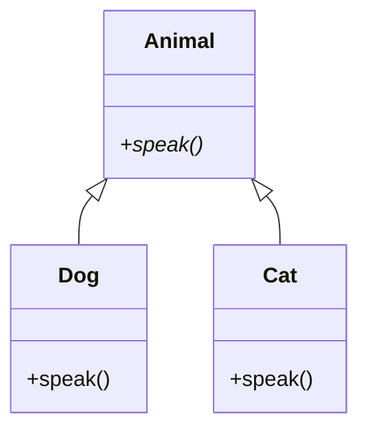

## 2.7.6 Polymorphism

Polymorphism is a cornerstone of object-oriented programming (OOP) that allows objects to be treated as instances of their parent class rather than their actual class. This ability to process objects differently based on their data type or class is what makes polymorphism a powerful tool in software design. In this section, we will delve into the concept of polymorphism, explore how it promotes flexibility and extensibility, and demonstrate its application in Python through examples.

### Understanding Polymorphism

**Polymorphism** is derived from the Greek words "poly" (meaning many) and "morph" (meaning form). In the context of programming, it refers to the ability of different classes to be treated as instances of the same class through a common interface. The primary goal of polymorphism is to allow one interface to control access to a general class of actions. The specific action is determined by the exact nature of the situation.

#### Types of Polymorphism

1. **Compile-Time Polymorphism**: Also known as static polymorphism, this is achieved through method overloading or operator overloading. It is resolved during compile time.

2. **Run-Time Polymorphism**: Also known as dynamic polymorphism, this is achieved through method overriding. It is resolved during runtime.

Python primarily supports run-time polymorphism through method overriding, which we will focus on in this guide.

### Promoting Flexibility and Extensibility

Polymorphism enhances flexibility and extensibility in code by allowing objects to be manipulated without knowing their exact types. This is particularly useful in scenarios where the exact class of an object is not known until runtime. By using polymorphism, developers can write more generic and reusable code, which can be extended with new classes without modifying existing code.

#### Key Benefits

- **Code Reusability**: Polymorphic code can work with objects of different classes, reducing the need for duplicate code.
- **Maintainability**: Changes in class implementations do not affect the polymorphic code, making it easier to maintain.
- **Extensibility**: New classes can be added with minimal changes to existing code, enhancing the system's ability to grow and evolve.

### Implementing Polymorphism in Python

In Python, polymorphism is implemented using inheritance and interfaces. Let's explore these concepts with examples.

#### Inheritance-Based Polymorphism

Inheritance allows a class (child class) to inherit attributes and methods from another class (parent class). This forms the basis for polymorphism, where a child class can override methods of the parent class to provide specific functionality.

```python
class Animal:
    def speak(self):
        raise NotImplementedError("Subclass must implement abstract method")

class Dog(Animal):
    def speak(self):
        return "Woof!"

class Cat(Animal):
    def speak(self):
        return "Meow!"

def animal_sound(animal):
    print(animal.speak())

dog = Dog()
cat = Cat()

animal_sound(dog)  # Output: Woof!
animal_sound(cat)  # Output: Meow!
```

In this example, `Dog` and `Cat` are subclasses of `Animal`. They override the `speak` method to provide specific implementations. The `animal_sound` function demonstrates polymorphism by calling the `speak` method on an `Animal` object, regardless of its specific type.

#### Interface-Based Polymorphism

Python does not have formal interfaces like some other languages, but it uses abstract base classes (ABCs) to achieve similar functionality. ABCs can define a set of methods that must be created within any child classes built from the abstract base.

```python
from abc import ABC, abstractmethod

class Shape(ABC):
    @abstractmethod
    def area(self):
        pass

class Rectangle(Shape):
    def __init__(self, width, height):
        self.width = width
        self.height = height

    def area(self):
        return self.width * self.height

class Circle(Shape):
    def __init__(self, radius):
        self.radius = radius

    def area(self):
        return 3.14159 * self.radius * self.radius

def print_area(shape):
    print(f"The area is: {shape.area()}")

rectangle = Rectangle(5, 10)
circle = Circle(7)

print_area(rectangle)  # Output: The area is: 50
print_area(circle)     # Output: The area is: 153.93791
```

In this example, `Shape` is an abstract base class with an abstract method `area`. `Rectangle` and `Circle` are concrete classes that implement the `area` method. The `print_area` function demonstrates polymorphism by calling the `area` method on a `Shape` object.

### Scenarios Simplified by Polymorphism

Polymorphism can greatly simplify code maintenance in scenarios where different objects need to be processed in a similar way. Here are some examples:

1. **UI Components**: In a graphical user interface, different components like buttons, text fields, and labels can be treated as instances of a common interface, allowing for uniform handling of events.

2. **File Processing**: Different file formats (e.g., CSV, JSON, XML) can be processed using a common interface, with specific implementations for reading and writing each format.

3. **Payment Processing**: Different payment methods (e.g., credit card, PayPal, bank transfer) can be handled through a common interface, with specific logic for each method.

### Polymorphism in Design Patterns

Polymorphism plays a crucial role in implementing several design patterns, enhancing their flexibility and reusability.

#### Strategy Pattern

The Strategy pattern defines a family of algorithms, encapsulates each one, and makes them interchangeable. Polymorphism allows the client code to use different algorithms without knowing their specific implementations.

```python
class Strategy(ABC):
    @abstractmethod
    def execute(self, data):
        pass

class ConcreteStrategyA(Strategy):
    def execute(self, data):
        return f"Strategy A processing {data}"

class ConcreteStrategyB(Strategy):
    def execute(self, data):
        return f"Strategy B processing {data}"

class Context:
    def __init__(self, strategy: Strategy):
        self.strategy = strategy

    def execute_strategy(self, data):
        return self.strategy.execute(data)

context = Context(ConcreteStrategyA())
print(context.execute_strategy("data"))  # Output: Strategy A processing data

context.strategy = ConcreteStrategyB()
print(context.execute_strategy("data"))  # Output: Strategy B processing data
```

#### Command Pattern

The Command pattern encapsulates a request as an object, allowing for parameterization and queuing of requests. Polymorphism enables different command objects to be executed without knowing their specific types.

```python
class Command(ABC):
    @abstractmethod
    def execute(self):
        pass

class LightOnCommand(Command):
    def execute(self):
        return "Light is on"

class LightOffCommand(Command):
    def execute(self):
        return "Light is off"

class RemoteControl:
    def __init__(self):
        self.command = None

    def set_command(self, command: Command):
        self.command = command

    def press_button(self):
        return self.command.execute()

remote = RemoteControl()
light_on = LightOnCommand()
light_off = LightOffCommand()

remote.set_command(light_on)
print(remote.press_button())  # Output: Light is on

remote.set_command(light_off)
print(remote.press_button())  # Output: Light is off
```

### Visualizing Polymorphism

To better understand polymorphism, let's visualize the relationship between classes using a class diagram.



In this diagram, `Animal` is the parent class with an abstract method `speak`. `Dog` and `Cat` are subclasses that provide specific implementations of the `speak` method.

### Try It Yourself

To deepen your understanding of polymorphism, try modifying the examples provided:

1. **Extend the Animal Example**: Add more subclasses like `Bird` or `Fish` and implement the `speak` method for each. Observe how the `animal_sound` function remains unchanged.

2. **Create a New Shape**: Add a new shape class, such as `Triangle`, and implement the `area` method. Test it with the `print_area` function.

3. **Experiment with Strategies**: Create additional strategies for the Strategy pattern and switch between them in the `Context` class.

### Knowledge Check

- **What is polymorphism and how does it enhance flexibility in code?**
- **How does Python implement polymorphism using inheritance and interfaces?**
- **In what scenarios can polymorphism simplify code maintenance?**
- **How does polymorphism play a role in the Strategy and Command design patterns?**

### Embrace the Journey

Remember, mastering polymorphism is a journey. As you continue to explore and experiment with polymorphic code, you'll discover new ways to enhance the flexibility and maintainability of your software. Keep experimenting, stay curious, and enjoy the journey!

## Quiz Time!



### What is polymorphism in programming?

- [x] The ability of different classes to be treated as instances of the same class through a common interface.
- [ ] The process of converting one data type to another.
- [ ] A method of optimizing code performance.
- [ ] A technique for managing memory allocation.

> **Explanation:** Polymorphism allows objects of different classes to be treated as instances of a common superclass, enabling flexibility and reusability.

### Which type of polymorphism does Python primarily support?

- [ ] Compile-Time Polymorphism
- [x] Run-Time Polymorphism
- [ ] Static Polymorphism
- [ ] Operator Overloading

> **Explanation:** Python supports run-time polymorphism, which is achieved through method overriding.

### How does polymorphism promote code maintainability?

- [x] By allowing changes in class implementations without affecting polymorphic code.
- [ ] By increasing the complexity of the code.
- [ ] By requiring more lines of code.
- [ ] By making code less readable.

> **Explanation:** Polymorphism allows changes in class implementations without affecting the polymorphic code, thus enhancing maintainability.

### What is the role of abstract base classes in Python?

- [x] To define a set of methods that must be created within any child classes built from the abstract base.
- [ ] To provide a concrete implementation of methods.
- [ ] To optimize code performance.
- [ ] To manage memory allocation.

> **Explanation:** Abstract base classes define a set of methods that must be implemented in any subclass, ensuring a consistent interface.

### In the Strategy pattern, how does polymorphism enhance flexibility?

- [x] By allowing different algorithms to be used interchangeably without knowing their specific implementations.
- [ ] By reducing the number of classes needed.
- [ ] By increasing the complexity of the code.
- [ ] By making code less readable.

> **Explanation:** Polymorphism allows different strategies to be used interchangeably, enhancing flexibility.

### What is the benefit of using polymorphism in UI components?

- [x] It allows for uniform handling of events across different components.
- [ ] It increases the complexity of the UI code.
- [ ] It reduces the number of components needed.
- [ ] It makes the UI less responsive.

> **Explanation:** Polymorphism allows different UI components to be treated uniformly, simplifying event handling.

### How can polymorphism simplify file processing?

- [x] By allowing different file formats to be processed using a common interface.
- [ ] By increasing the complexity of the file processing code.
- [ ] By reducing the number of file formats supported.
- [ ] By making file processing less efficient.

> **Explanation:** Polymorphism allows different file formats to be processed through a common interface, simplifying the code.

### What is the main advantage of using polymorphism in payment processing systems?

- [x] It allows different payment methods to be handled through a common interface.
- [ ] It increases the complexity of the payment processing code.
- [ ] It reduces the number of payment methods supported.
- [ ] It makes payment processing less secure.

> **Explanation:** Polymorphism allows different payment methods to be handled uniformly, enhancing flexibility.

### Which design pattern encapsulates a request as an object?

- [x] Command Pattern
- [ ] Strategy Pattern
- [ ] Observer Pattern
- [ ] Singleton Pattern

> **Explanation:** The Command pattern encapsulates a request as an object, allowing for parameterization and queuing.

### Polymorphism allows for code reusability and flexibility.

- [x] True
- [ ] False

> **Explanation:** Polymorphism enables code reusability and flexibility by allowing objects to be treated as instances of their parent class, enhancing the ability to extend and maintain code.


