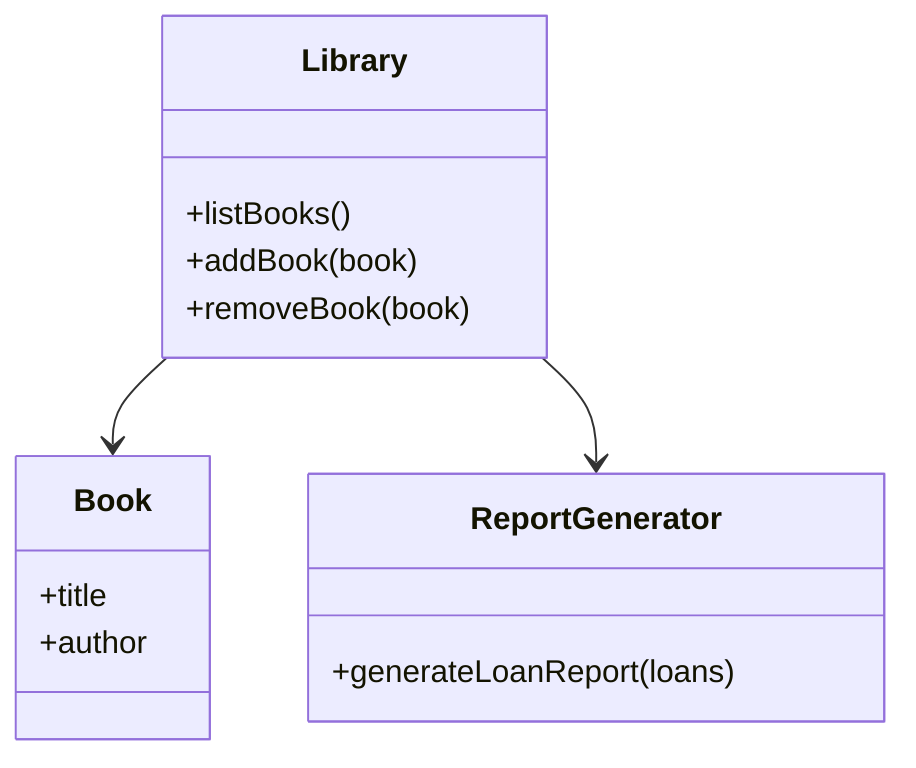

## 2.7.7 Pure Fabrication

In the realm of object-oriented design, the GRASP (General Responsibility Assignment Software Patterns) principles serve as a guide for assigning responsibilities to classes and objects. Among these principles, Pure Fabrication stands out as a strategic approach to achieving low coupling and high cohesion in software design. In this section, we will delve into the concept of Pure Fabrication, explore its purpose and benefits, and demonstrate its implementation in Python.

### Understanding Pure Fabrication

Pure Fabrication is a design principle that involves creating classes that do not directly represent a concept in the problem domain. Instead, these classes are fabricated to fulfill specific responsibilities that do not naturally fit into existing entities. The primary goal of Pure Fabrication is to enhance the design by promoting low coupling and high cohesion.

#### Why Use Pure Fabrication?

In many software systems, certain responsibilities do not align neatly with the existing domain entities. Attempting to force these responsibilities into domain classes can lead to poor design, characterized by high coupling and low cohesion. Pure Fabrication addresses this issue by allowing developers to create new classes that encapsulate these responsibilities, thereby improving the overall design.

### Key Benefits of Pure Fabrication

1. **Low Coupling**: By creating separate classes for specific responsibilities, Pure Fabrication reduces dependencies between classes. This makes the system more modular and easier to maintain.

2. **High Cohesion**: Pure Fabrication promotes high cohesion by ensuring that each class has a well-defined purpose. This makes the code more understandable and easier to work with.

3. **Flexibility**: Fabricated classes can be easily modified or replaced without affecting the rest of the system. This enhances the flexibility of the design.

4. **Reusability**: Pure Fabrication encourages the creation of reusable components that can be used across different parts of the system or even in other projects.

### Examples of Pure Fabrication

Let's consider a scenario where Pure Fabrication can improve design. Suppose we are developing a library management system, and we need to implement a feature that generates reports on book loans. Instead of adding this responsibility to an existing class like `Library` or `Book`, we can create a fabricated class called `ReportGenerator`.

```python
class ReportGenerator:
    def generate_loan_report(self, loans):
        report = "Loan Report\n"
        report += "------------\n"
        for loan in loans:
            report += f"Book: {loan.book.title}, Borrower: {loan.borrower.name}, Due Date: {loan.due_date}\n"
        return report

loans = [
    Loan(Book("The Great Gatsby"), Borrower("Alice"), "2024-11-20"),
    Loan(Book("1984"), Borrower("Bob"), "2024-11-22"),
]

report_generator = ReportGenerator()
print(report_generator.generate_loan_report(loans))
```

In this example, `ReportGenerator` is a fabricated class that encapsulates the responsibility of generating reports. This design choice keeps the `Library` and `Book` classes focused on their primary responsibilities, maintaining high cohesion.

### Assigning Responsibilities with Pure Fabrication

Pure Fabrication is particularly useful when assigning responsibilities that do not fit existing entities. By creating fabricated classes, developers can assign these responsibilities in a way that aligns with the principles of low coupling and high cohesion.

#### Example: Logging in a Web Application

Consider a web application that requires logging functionality. Instead of embedding logging logic within existing classes, we can create a fabricated class called `Logger`.

```python
class Logger:
    def log(self, message):
        with open("app.log", "a") as log_file:
            log_file.write(message + "\n")

logger = Logger()
logger.log("User logged in")
logger.log("User performed an action")
```

By using a fabricated `Logger` class, we isolate the logging responsibility, reducing coupling between the logging logic and other parts of the application.

### Achieving High Cohesion and Low Coupling

Pure Fabrication aids in adhering to high cohesion and low coupling by providing a clear separation of concerns. Each fabricated class is designed to handle a specific responsibility, ensuring that classes remain focused and independent.

#### Example: Payment Processing

In an e-commerce application, payment processing is a critical responsibility that may not fit neatly into existing domain classes. By creating a fabricated class called `PaymentProcessor`, we can encapsulate this responsibility.

```python
class PaymentProcessor:
    def process_payment(self, order, payment_details):
        # Simulate payment processing
        print(f"Processing payment for order {order.id} with amount {order.total_amount}")
        # Logic to interact with payment gateway
        return True

order = Order(id=123, total_amount=100.0)
payment_details = PaymentDetails(card_number="1234-5678-9012-3456", expiry_date="12/24")

payment_processor = PaymentProcessor()
payment_successful = payment_processor.process_payment(order, payment_details)
```

In this example, `PaymentProcessor` is a fabricated class that handles payment processing. This design choice keeps the `Order` class focused on order-related responsibilities, maintaining high cohesion.

### Addressing Concerns About Abstraction Layers

One potential concern with Pure Fabrication is the introduction of additional abstraction layers. While it's true that fabricated classes add layers to the design, these layers are justified by the benefits they provide. By promoting low coupling and high cohesion, Pure Fabrication enhances the maintainability and flexibility of the system.

#### Balancing Abstraction

It's important to strike a balance between abstraction and complexity. While Pure Fabrication encourages the creation of new classes, developers should avoid over-engineering the design. Each fabricated class should have a clear purpose and contribute to the overall design goals.

### Visualizing Pure Fabrication

To better understand the concept of Pure Fabrication, let's visualize the relationship between fabricated classes and domain classes using a class diagram.



In this diagram, the `Library` class interacts with both `Book` and `ReportGenerator`. The `ReportGenerator` is a fabricated class that handles report generation, illustrating how Pure Fabrication separates responsibilities.

### Try It Yourself

To deepen your understanding of Pure Fabrication, try modifying the examples provided:

1. **Extend the `ReportGenerator`**: Add functionality to generate different types of reports, such as overdue loans or popular books.

2. **Enhance the `Logger`**: Implement different logging levels (e.g., INFO, WARNING, ERROR) and allow the logger to write to different outputs (e.g., console, file).

3. **Refactor the `PaymentProcessor`**: Introduce error handling and support for multiple payment methods.

### References and Further Reading

- [GRASP Patterns](https://en.wikipedia.org/wiki/GRASP_(object-oriented_design)) - Wikipedia
- [Design Patterns: Elements of Reusable Object-Oriented Software](https://www.amazon.com/Design-Patterns-Elements-Reusable-Object-Oriented/dp/0201633612) - Erich Gamma et al.
- [Python Design Patterns](https://python-patterns.guide/) - Python Patterns Guide

### Knowledge Check

Before we wrap up, let's reinforce what we've learned about Pure Fabrication.

- **What is Pure Fabrication?**: A design principle that involves creating classes that do not represent a concept in the problem domain to achieve low coupling and high cohesion.

- **Why use Pure Fabrication?**: To assign responsibilities that don't fit existing entities, promote low coupling and high cohesion, and enhance flexibility and reusability.

- **How does Pure Fabrication help?**: By isolating specific responsibilities in fabricated classes, it reduces dependencies and keeps classes focused on their primary responsibilities.

### Embrace the Journey

Remember, mastering design principles like Pure Fabrication is a journey. As you continue to explore and apply these concepts, you'll develop a deeper understanding of how to create maintainable and scalable software systems. Keep experimenting, stay curious, and enjoy the process!

## Quiz Time!



### What is the primary goal of Pure Fabrication?

- [x] To achieve low coupling and high cohesion
- [ ] To increase the number of classes in a system
- [ ] To represent every concept in the problem domain
- [ ] To eliminate the need for domain classes

> **Explanation:** Pure Fabrication aims to achieve low coupling and high cohesion by creating classes that encapsulate specific responsibilities not naturally fitting into existing domain entities.

### How does Pure Fabrication improve design?

- [x] By reducing dependencies between classes
- [ ] By increasing the complexity of the system
- [ ] By merging multiple responsibilities into a single class
- [ ] By eliminating the need for interfaces

> **Explanation:** Pure Fabrication improves design by reducing dependencies between classes, making the system more modular and easier to maintain.

### Which of the following is an example of a fabricated class?

- [x] Logger
- [ ] Book
- [ ] Library
- [ ] User

> **Explanation:** `Logger` is an example of a fabricated class, as it encapsulates the responsibility of logging, which doesn't naturally fit into existing domain entities.

### What is a potential concern with Pure Fabrication?

- [x] Introduction of additional abstraction layers
- [ ] Reduction in system flexibility
- [ ] Increase in coupling between classes
- [ ] Decrease in code readability

> **Explanation:** A potential concern with Pure Fabrication is the introduction of additional abstraction layers, which must be balanced against the benefits they provide.

### How does Pure Fabrication promote high cohesion?

- [x] By ensuring each class has a well-defined purpose
- [ ] By merging unrelated responsibilities into a single class
- [ ] By increasing the number of dependencies
- [ ] By eliminating the need for domain classes

> **Explanation:** Pure Fabrication promotes high cohesion by ensuring each class has a well-defined purpose, making the code more understandable and easier to work with.

### What is the relationship between Pure Fabrication and domain classes?

- [x] Fabricated classes do not directly represent domain concepts
- [ ] Fabricated classes replace domain classes
- [ ] Fabricated classes merge multiple domain concepts
- [ ] Fabricated classes eliminate the need for domain classes

> **Explanation:** Fabricated classes do not directly represent domain concepts; they are created to handle specific responsibilities that don't fit into existing domain entities.

### In which scenario might you use Pure Fabrication?

- [x] When a responsibility doesn't naturally fit into existing domain classes
- [ ] When you want to reduce the number of classes in a system
- [ ] When you need to merge multiple responsibilities into a single class
- [ ] When you want to eliminate the need for interfaces

> **Explanation:** Pure Fabrication is used when a responsibility doesn't naturally fit into existing domain classes, allowing for better separation of concerns.

### What is the benefit of using fabricated classes?

- [x] They enhance the flexibility of the design
- [ ] They increase the complexity of the system
- [ ] They eliminate the need for domain classes
- [ ] They reduce the number of classes in a system

> **Explanation:** Fabricated classes enhance the flexibility of the design by allowing responsibilities to be easily modified or replaced without affecting the rest of the system.

### True or False: Pure Fabrication can lead to over-engineering if not used judiciously.

- [x] True
- [ ] False

> **Explanation:** True. While Pure Fabrication offers many benefits, it can lead to over-engineering if too many fabricated classes are created without clear purposes.

### True or False: Pure Fabrication is only applicable in large systems.

- [ ] True
- [x] False

> **Explanation:** False. Pure Fabrication can be applied in systems of any size where responsibilities do not naturally fit into existing domain classes.


