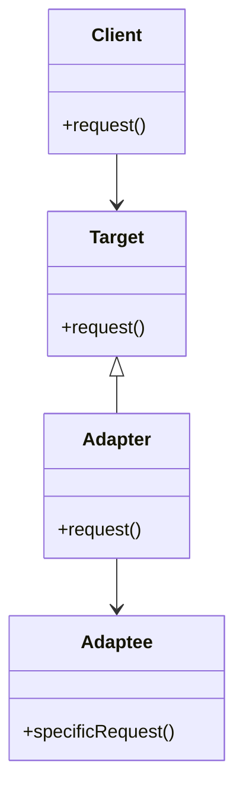
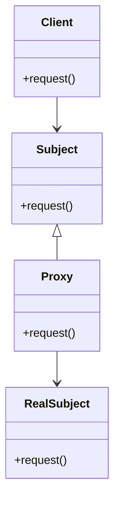

## 2.7.8 Indirection

In the realm of software design, the principle of Indirection plays a crucial role in managing dependencies and reducing coupling between components. By introducing intermediary objects, developers can create flexible and maintainable systems that are easier to extend and modify. In this section, we will delve into the concept of Indirection, explore its applications in design patterns such as adapters and proxies, and discuss its benefits and potential drawbacks. We will also provide guidelines on when and how to apply Indirection effectively in your Python projects.

### Understanding the Indirection Principle

Indirection is a fundamental principle in software design that involves introducing an intermediary layer or object to mediate interactions between components. This intermediary acts as a bridge, decoupling the components and allowing them to interact without being directly dependent on each other. By doing so, Indirection helps manage dependencies, enhance flexibility, and promote modularity.

#### Key Purposes of Indirection

1. **Reducing Coupling**: By decoupling components, Indirection minimizes the dependencies between them, making the system more flexible and easier to maintain.
2. **Enhancing Flexibility**: Indirection allows for changes in one component without affecting others, facilitating easier updates and modifications.
3. **Promoting Reusability**: By abstracting interactions, Indirection enables components to be reused in different contexts without modification.
4. **Supporting Scalability**: Indirection can help manage complexity in large systems by organizing interactions in a structured manner.

### Examples of Indirection in Design Patterns

Indirection is a common theme in many design patterns, where it is used to achieve various architectural goals. Let's explore some patterns where Indirection is prominently applied.

#### Adapter Pattern

The Adapter Pattern is a classic example of Indirection. It allows incompatible interfaces to work together by introducing an adapter that acts as an intermediary. The adapter translates the interface of a class into another interface that clients expect, enabling them to interact seamlessly.

**Python Example:**

```python
class EuropeanSocketInterface:
    def voltage(self):
        return 230

    def live(self):
        return 1

    def neutral(self):
        return -1

    def earth(self):
        return 0

class AmericanSocketInterface:
    def voltage(self):
        return 120

    def live(self):
        return 1

    def neutral(self):
        return -1

class Adapter(AmericanSocketInterface):
    def __init__(self, socket):
        self.socket = socket

    def voltage(self):
        return 120

    def live(self):
        return self.socket.live()

    def neutral(self):
        return self.socket.neutral()

    def earth(self):
        return self.socket.earth()

european_socket = EuropeanSocketInterface()
adapter = Adapter(european_socket)
print(f"Voltage: {adapter.voltage()}V")
```

In this example, the `Adapter` class allows a `EuropeanSocketInterface` to be used where an `AmericanSocketInterface` is expected, demonstrating the power of Indirection in bridging incompatible interfaces.

#### Proxy Pattern

The Proxy Pattern uses Indirection to control access to an object. A proxy acts as an intermediary, providing a surrogate or placeholder for another object. This pattern is useful for implementing lazy initialization, access control, logging, and more.

**Python Example:**

```python
class RealSubject:
    def request(self):
        print("RealSubject: Handling request.")

class Proxy:
    def __init__(self, real_subject):
        self._real_subject = real_subject

    def request(self):
        if self.check_access():
            self._real_subject.request()
            self.log_access()

    def check_access(self):
        print("Proxy: Checking access prior to firing a real request.")
        return True

    def log_access(self):
        print("Proxy: Logging the time of request.")

real_subject = RealSubject()
proxy = Proxy(real_subject)
proxy.request()
```

Here, the `Proxy` class controls access to the `RealSubject`, demonstrating how Indirection can be used to add additional behavior to an object.

### Benefits of Indirection

Indirection offers several benefits that make it a valuable principle in software design:

1. **Improved Modularity**: By decoupling components, Indirection promotes modularity, making it easier to isolate and manage different parts of a system.
2. **Ease of Maintenance**: With reduced dependencies, changes in one component are less likely to affect others, simplifying maintenance and updates.
3. **Enhanced Testability**: Indirection facilitates testing by allowing components to be tested in isolation, using mock objects or stubs as intermediaries.
4. **Increased Flexibility**: Systems designed with Indirection can adapt more easily to changing requirements, as components can be modified or replaced without impacting others.

### Potential Performance Impacts and Complexities

While Indirection provides many benefits, it can also introduce certain challenges and trade-offs:

1. **Performance Overhead**: The additional layer of abstraction introduced by Indirection can lead to performance overhead, as interactions must pass through the intermediary.
2. **Increased Complexity**: Indirection can add complexity to the system architecture, making it harder to understand and manage, especially in large systems.
3. **Potential for Overuse**: Excessive use of Indirection can lead to unnecessary complexity and reduced performance, so it should be applied judiciously.

### Guidelines for Applying Indirection Effectively

To leverage the benefits of Indirection while minimizing its drawbacks, consider the following guidelines:

1. **Assess the Need**: Before applying Indirection, evaluate whether it is necessary to achieve your design goals. Avoid using it for simple interactions that do not require decoupling.
2. **Balance Flexibility and Complexity**: Strive to balance the flexibility gained through Indirection with the complexity it introduces. Use it where it adds significant value without overcomplicating the design.
3. **Use Established Patterns**: Leverage established design patterns that incorporate Indirection, such as Adapters, Proxies, and Decorators, to ensure a well-structured and maintainable implementation.
4. **Monitor Performance**: Be mindful of the performance impact of Indirection, especially in performance-critical applications. Optimize where necessary to minimize overhead.
5. **Document and Communicate**: Clearly document the use of Indirection in your system architecture, and communicate its purpose and implementation to team members to ensure a shared understanding.

### Visualizing Indirection in Design Patterns

To better understand how Indirection works in design patterns, let's visualize the Adapter and Proxy patterns using Mermaid.js diagrams.

#### Adapter Pattern Diagram



**Diagram Description**: This diagram illustrates the Adapter Pattern, where the `Adapter` class acts as an intermediary between the `Client` and the `Adaptee`, allowing them to interact despite incompatible interfaces.

#### Proxy Pattern Diagram



**Diagram Description**: This diagram represents the Proxy Pattern, where the `Proxy` class mediates access to the `RealSubject`, adding additional behavior such as access control and logging.

### Try It Yourself

To deepen your understanding of Indirection, try modifying the provided code examples:

1. **Adapter Pattern**: Extend the `Adapter` class to support additional socket types, such as British or Australian sockets. Consider how the adapter can be modified to handle different voltages and plug types.

2. **Proxy Pattern**: Implement a caching mechanism in the `Proxy` class to store and retrieve results of previous requests, reducing the need to repeatedly access the `RealSubject`.

### Knowledge Check

- What is the primary purpose of Indirection in software design?
- How does the Adapter Pattern utilize Indirection to achieve its goals?
- What are some potential drawbacks of using Indirection in a system?
- When should you consider applying Indirection in your design?

### Embrace the Journey

Remember, mastering the principle of Indirection is a journey that requires practice and experimentation. As you apply this principle in your projects, you'll gain a deeper understanding of how to create flexible, maintainable, and scalable systems. Keep exploring, stay curious, and enjoy the process of learning and growing as a software developer!

## Quiz Time!



### What is the primary purpose of Indirection in software design?

- [x] To reduce coupling between components
- [ ] To increase performance
- [ ] To simplify code
- [ ] To eliminate dependencies

> **Explanation:** Indirection is primarily used to reduce coupling between components, making the system more flexible and maintainable.

### Which design pattern uses Indirection to allow incompatible interfaces to work together?

- [x] Adapter Pattern
- [ ] Singleton Pattern
- [ ] Observer Pattern
- [ ] Factory Pattern

> **Explanation:** The Adapter Pattern uses Indirection to bridge incompatible interfaces, allowing them to interact seamlessly.

### What is a potential drawback of using Indirection?

- [ ] Improved modularity
- [x] Performance overhead
- [ ] Enhanced testability
- [ ] Increased flexibility

> **Explanation:** Indirection can introduce performance overhead due to the additional layer of abstraction.

### In the Proxy Pattern, what role does the Proxy class play?

- [x] It controls access to the RealSubject
- [ ] It acts as the main subject
- [ ] It eliminates the need for a RealSubject
- [ ] It simplifies the client interface

> **Explanation:** The Proxy class controls access to the RealSubject, adding additional behavior such as access control and logging.

### When should you consider using Indirection in your design?

- [x] When you need to decouple components
- [ ] When performance is the primary concern
- [ ] When you want to simplify interactions
- [ ] When you need to eliminate all dependencies

> **Explanation:** Indirection should be considered when you need to decouple components to enhance flexibility and maintainability.

### What is a benefit of using Indirection?

- [x] Improved modularity
- [ ] Increased complexity
- [ ] Reduced flexibility
- [ ] Decreased testability

> **Explanation:** Indirection improves modularity by decoupling components, making the system easier to manage and maintain.

### How does the Adapter Pattern achieve Indirection?

- [x] By introducing an adapter class
- [ ] By eliminating the need for interfaces
- [ ] By simplifying the client interface
- [ ] By increasing performance

> **Explanation:** The Adapter Pattern achieves Indirection by introducing an adapter class that bridges incompatible interfaces.

### What is a common use case for the Proxy Pattern?

- [x] Access control
- [ ] Simplifying code
- [ ] Eliminating dependencies
- [ ] Increasing performance

> **Explanation:** The Proxy Pattern is commonly used for access control, as it can mediate access to the RealSubject.

### True or False: Indirection always improves system performance.

- [ ] True
- [x] False

> **Explanation:** False. While Indirection offers many benefits, it can introduce performance overhead due to the additional layer of abstraction.

### What should you consider before applying Indirection?

- [x] The need for decoupling and the potential complexity it introduces
- [ ] The need to eliminate all dependencies
- [ ] The need to increase performance at all costs
- [ ] The need to simplify interactions

> **Explanation:** Before applying Indirection, consider the need for decoupling and the potential complexity it introduces to ensure it adds value without overcomplicating the design.


