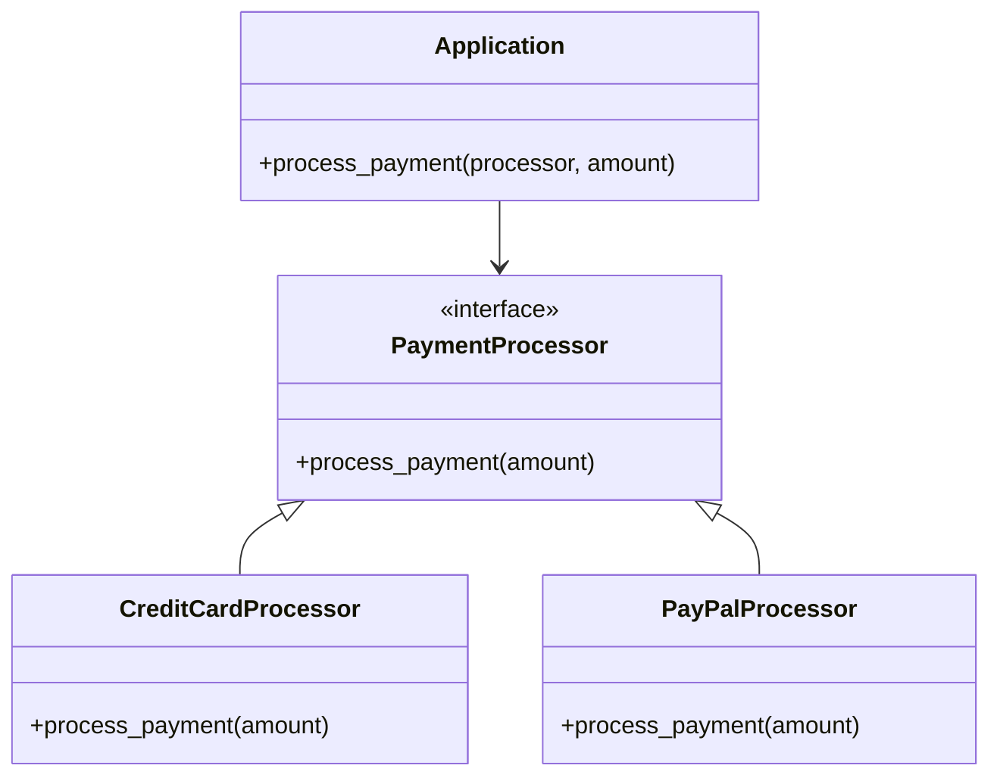

## 2.7.9 Protected Variations

In the ever-evolving landscape of software development, change is inevitable. Whether it's adapting to new requirements, integrating with different systems, or simply improving existing functionality, software must be designed to accommodate change gracefully. The Protected Variations principle, one of the GRASP (General Responsibility Assignment Software Patterns) principles, provides a strategy to shield elements from the impact of variations in other elements, thereby enhancing the maintainability and flexibility of the system.

### Understanding Protected Variations

Protected Variations is a design principle that aims to minimize the impact of change by encapsulating areas of potential variation. By doing so, it prevents changes in one part of the system from causing a ripple effect across the entire system. This is achieved through the use of interfaces, abstractions, and other design techniques that decouple the components of a system.

#### Key Concepts

- **Encapsulation**: Encapsulating the parts of a system that are likely to change helps isolate those changes from the rest of the system.
- **Abstraction**: Using abstract interfaces or classes allows different implementations to be swapped without affecting the clients that use them.
- **Decoupling**: Reducing dependencies between components ensures that changes in one component do not necessitate changes in others.

### The Importance of Protected Variations

The Protected Variations principle is crucial for several reasons:

- **Long-term Maintenance**: By isolating changes, the system becomes easier to maintain. Developers can modify or extend parts of the system without fear of unintended consequences elsewhere.
- **Flexibility**: Systems designed with Protected Variations are more adaptable to new requirements or technologies.
- **Robustness**: By minimizing the impact of changes, the system is less prone to errors that might arise from unexpected interactions between components.

### Implementing Protected Variations in Python

Python, with its dynamic typing and strong support for object-oriented programming, provides several tools and techniques to implement the Protected Variations principle effectively.

#### Using Interfaces and Abstractions

One of the primary ways to achieve Protected Variations is through the use of interfaces and abstractions. In Python, this can be done using abstract base classes (ABCs) from the `abc` module.

```python
from abc import ABC, abstractmethod

class PaymentProcessor(ABC):
    @abstractmethod
    def process_payment(self, amount):
        pass

class CreditCardProcessor(PaymentProcessor):
    def process_payment(self, amount):
        print(f"Processing credit card payment of {amount}")

class PayPalProcessor(PaymentProcessor):
    def process_payment(self, amount):
        print(f"Processing PayPal payment of {amount}")

def process_payment(processor: PaymentProcessor, amount: float):
    processor.process_payment(amount)

credit_card_processor = CreditCardProcessor()
paypal_processor = PayPalProcessor()

process_payment(credit_card_processor, 100.0)
process_payment(paypal_processor, 200.0)
```

In this example, `PaymentProcessor` is an abstract base class that defines a common interface for different payment processing strategies. The `CreditCardProcessor` and `PayPalProcessor` classes implement this interface, allowing the `process_payment` function to operate on any `PaymentProcessor` without needing to know the specifics of each implementation.

#### Encapsulating Areas of Change

Encapsulation is another key technique for implementing Protected Variations. By encapsulating the parts of the system that are likely to change, we can isolate those changes from the rest of the system.

```python
class DatabaseConnection:
    def connect(self):
        print("Connecting to database")

    def disconnect(self):
        print("Disconnecting from database")

class DataRepository:
    def __init__(self, db_connection: DatabaseConnection):
        self.db_connection = db_connection

    def fetch_data(self):
        self.db_connection.connect()
        print("Fetching data")
        self.db_connection.disconnect()

db_connection = DatabaseConnection()
repository = DataRepository(db_connection)
repository.fetch_data()
```

In this example, the `DatabaseConnection` class encapsulates the details of connecting to and disconnecting from a database. The `DataRepository` class depends on `DatabaseConnection`, but it does not need to know the specifics of how the connection is managed. This encapsulation allows the connection logic to change without affecting the `DataRepository`.

#### Decoupling Components

Decoupling components is essential for achieving Protected Variations. By reducing dependencies between components, we ensure that changes in one component do not necessitate changes in others.

```python
class Logger:
    def log(self, message: str):
        print(f"Log: {message}")

class FileLogger(Logger):
    def log(self, message: str):
        with open("log.txt", "a") as file:
            file.write(f"{message}\n")

class Application:
    def __init__(self, logger: Logger):
        self.logger = logger

    def run(self):
        self.logger.log("Application started")

console_logger = Logger()
file_logger = FileLogger()

app = Application(console_logger)
app.run()

app = Application(file_logger)
app.run()
```

In this example, the `Application` class depends on a `Logger` interface. This decoupling allows different logging strategies to be used without modifying the `Application` class.

### Visualizing Protected Variations

To better understand how Protected Variations works, let's visualize the relationships between components using a class diagram.



In this diagram, `PaymentProcessor` is an interface that defines a contract for payment processing. `CreditCardProcessor` and `PayPalProcessor` implement this interface, allowing the `Application` to interact with any `PaymentProcessor` implementation.

### Try It Yourself

To deepen your understanding of Protected Variations, try modifying the examples provided:

1. **Add a New Payment Processor**: Implement a new payment processor class, such as `BitcoinProcessor`, and integrate it with the existing system.
2. **Change the Logging Strategy**: Modify the `FileLogger` to log messages in a different format or to a different file.
3. **Encapsulate a New Area of Change**: Identify another area of your code that could benefit from encapsulation and apply the Protected Variations principle.

### Knowledge Check

To ensure you've grasped the concepts of Protected Variations, consider the following questions:

- What are the benefits of using interfaces and abstractions to achieve Protected Variations?
- How does encapsulation help isolate changes in a system?
- Why is decoupling components important for maintaining flexibility?

### Conclusion

The Protected Variations principle is a powerful tool for designing flexible and maintainable software systems. By encapsulating areas of change and decoupling components, we can shield our systems from the impact of variations, making them more robust and adaptable to future changes. As you continue your journey in software development, remember to apply these principles to create systems that stand the test of time.

## Quiz Time!



### What is the main goal of the Protected Variations principle?

- [x] To shield elements from the impact of changes in other elements.
- [ ] To increase the complexity of the system.
- [ ] To make the system more dependent on specific implementations.
- [ ] To reduce the number of components in the system.

> **Explanation:** The main goal of the Protected Variations principle is to shield elements from the impact of changes in other elements, thereby enhancing maintainability and flexibility.

### Which of the following techniques is NOT used to achieve Protected Variations?

- [ ] Encapsulation
- [ ] Abstraction
- [x] Hardcoding
- [ ] Decoupling

> **Explanation:** Hardcoding is not a technique used to achieve Protected Variations. Instead, it increases dependencies and reduces flexibility.

### How does encapsulation contribute to Protected Variations?

- [x] By isolating changes to specific parts of the system.
- [ ] By exposing internal details to other components.
- [ ] By increasing the number of dependencies.
- [ ] By making the system more complex.

> **Explanation:** Encapsulation contributes to Protected Variations by isolating changes to specific parts of the system, thereby preventing ripple effects.

### What role do interfaces play in Protected Variations?

- [x] They allow different implementations to be swapped without affecting clients.
- [ ] They increase the coupling between components.
- [ ] They make the system more rigid.
- [ ] They expose internal details to other components.

> **Explanation:** Interfaces allow different implementations to be swapped without affecting clients, which is key to achieving Protected Variations.

### Why is decoupling important in Protected Variations?

- [x] It ensures that changes in one component do not necessitate changes in others.
- [ ] It increases the number of dependencies in the system.
- [ ] It makes the system more complex.
- [ ] It exposes internal details to other components.

> **Explanation:** Decoupling is important in Protected Variations because it ensures that changes in one component do not necessitate changes in others, enhancing flexibility.

### What is the benefit of using abstract base classes in Python for Protected Variations?

- [x] They define a common interface for different implementations.
- [ ] They increase the complexity of the system.
- [ ] They make the system more dependent on specific implementations.
- [ ] They expose internal details to other components.

> **Explanation:** Abstract base classes in Python define a common interface for different implementations, which is beneficial for achieving Protected Variations.

### How does the use of Protected Variations affect long-term maintenance?

- [x] It makes the system easier to maintain by isolating changes.
- [ ] It increases the complexity of maintenance.
- [ ] It makes the system more dependent on specific implementations.
- [ ] It reduces the number of components in the system.

> **Explanation:** The use of Protected Variations makes the system easier to maintain by isolating changes, thus reducing the risk of unintended consequences.

### What is a potential drawback of not using Protected Variations?

- [x] Changes in one part of the system can cause a ripple effect across the entire system.
- [ ] The system becomes too flexible.
- [ ] The system has fewer components.
- [ ] The system becomes too simple.

> **Explanation:** A potential drawback of not using Protected Variations is that changes in one part of the system can cause a ripple effect across the entire system, increasing the risk of errors.

### Which of the following is an example of encapsulating an area of change?

- [x] Using a class to manage database connections.
- [ ] Hardcoding values into the system.
- [ ] Increasing the number of dependencies.
- [ ] Exposing internal details to other components.

> **Explanation:** Using a class to manage database connections is an example of encapsulating an area of change, which helps isolate changes from the rest of the system.

### True or False: Protected Variations can be achieved by increasing the number of dependencies between components.

- [ ] True
- [x] False

> **Explanation:** False. Protected Variations are achieved by reducing dependencies between components, not increasing them.


