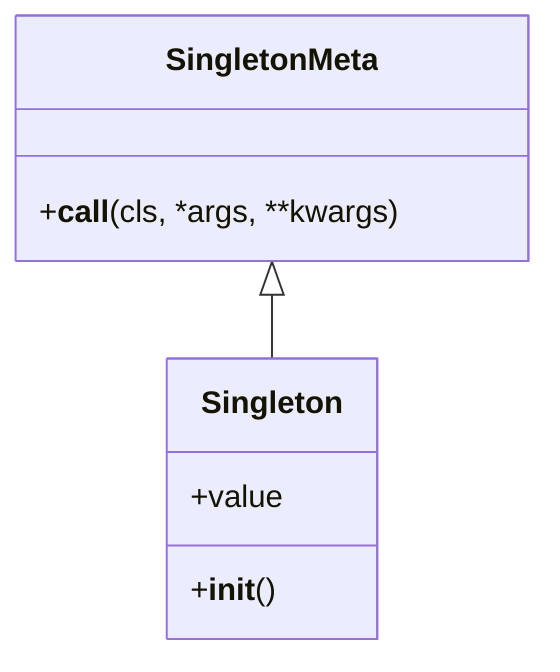

## 3.1.1 Implementing Singleton in Python

The Singleton pattern is a creational design pattern that ensures a class has only one instance and provides a global point of access to that instance. This pattern is particularly useful when exactly one object is needed to coordinate actions across a system. In this section, we will explore how to implement the Singleton pattern in Python using metaclasses and decorators, discuss their advantages and limitations, and provide best practices for their usage.

### Understanding the Singleton Pattern

Before diving into the implementation, let's briefly understand the core concept of the Singleton pattern. The primary goal of this pattern is to restrict the instantiation of a class to a single object. This is useful in scenarios where having multiple instances could lead to inconsistent states or unnecessary resource consumption.

### Implementing Singleton with Metaclasses

Metaclasses in Python are a powerful tool that allows you to customize class creation. By using a metaclass, we can control the instantiation process to ensure that only one instance of a class is created.

#### Step-by-Step Implementation

1. **Define a Metaclass**: Create a metaclass that overrides the `__call__` method. This method is responsible for creating new instances of a class.

2. **Override `__call__` Method**: In the overridden `__call__` method, check if an instance of the class already exists. If it does, return the existing instance; otherwise, create a new one.

3. **Apply the Metaclass**: Use the metaclass when defining the Singleton class.

```python
class SingletonMeta(type):
    _instances = {}

    def __call__(cls, *args, **kwargs):
        if cls not in cls._instances:
            instance = super().__call__(*args, **kwargs)
            cls._instances[cls] = instance
        return cls._instances[cls]

class Singleton(metaclass=SingletonMeta):
    def __init__(self):
        self.value = None

singleton1 = Singleton()
singleton2 = Singleton()

print(singleton1 is singleton2)  # Output: True
```

**Explanation**: In this implementation, `SingletonMeta` is a metaclass that maintains a dictionary `_instances` to store instances of classes. The `__call__` method checks if an instance already exists and returns it if so, ensuring only one instance is created.

#### Advantages and Limitations

- **Advantages**:
  - **Centralized Control**: The metaclass provides a centralized way to control instance creation.
  - **Flexibility**: Easily applied to multiple classes by specifying the metaclass.

- **Limitations**:
  - **Complexity**: Metaclasses can be complex and may introduce additional overhead.
  - **Readability**: Code readability might suffer for developers unfamiliar with metaclasses.

### Implementing Singleton with Decorators

Decorators in Python provide a more straightforward approach to implementing the Singleton pattern. A decorator is a function that takes another function or class and extends its behavior without explicitly modifying it.

#### Step-by-Step Implementation

1. **Define a Decorator Function**: Create a decorator function that maintains a reference to the instance.

2. **Check for Existing Instance**: Within the decorator, check if an instance already exists. If not, create and store it.

3. **Return the Instance**: Return the stored instance whenever the class is called.

```python
def singleton(cls):
    instances = {}

    def get_instance(*args, **kwargs):
        if cls not in instances:
            instances[cls] = cls(*args, **kwargs)
        return instances[cls]

    return get_instance

@singleton
class Singleton:
    def __init__(self):
        self.value = None

singleton1 = Singleton()
singleton2 = Singleton()

print(singleton1 is singleton2)  # Output: True
```

**Explanation**: The `singleton` decorator maintains a dictionary `instances` to store class instances. The `get_instance` function checks if an instance exists and returns it, ensuring only one instance is created.

#### Advantages and Limitations

- **Advantages**:
  - **Simplicity**: Decorators are simple and easy to understand.
  - **Readability**: Code is more readable and concise.

- **Limitations**:
  - **Limited to Single Class**: The decorator must be applied to each class individually.
  - **Less Control**: Offers less control compared to metaclasses.

### Best Practices for Singleton Usage

- **Avoid Global State**: Use Singletons sparingly to avoid introducing global state, which can lead to hard-to-track bugs.
- **Thread Safety**: Ensure thread safety if the Singleton is accessed by multiple threads. Consider using locks or other synchronization mechanisms.
- **Lazy Initialization**: Consider lazy initialization to delay instance creation until it's needed, which can improve performance.
- **Testing**: Write unit tests to ensure the Singleton behaves as expected, especially in multi-threaded scenarios.

### Common Pitfalls and How to Avoid Them

- **Overuse**: Avoid using Singletons for every class; only use them when a single instance is truly necessary.
- **Tight Coupling**: Be cautious of tight coupling between the Singleton and other classes, which can make testing and maintenance difficult.
- **Hidden Dependencies**: Singletons can introduce hidden dependencies, making it harder to understand the codebase.

### Visualizing Singleton Implementation

To better understand the Singleton pattern, let's visualize the process using a class diagram.



**Diagram Description**: The diagram shows the relationship between `SingletonMeta` and `Singleton`. The `Singleton` class uses `SingletonMeta` as its metaclass, which controls instance creation.

### Try It Yourself

Experiment with the Singleton implementations by modifying the code examples:

- **Add a Method**: Add a method to the Singleton class and observe how it behaves with multiple instances.
- **Thread Safety**: Implement thread safety in the metaclass-based Singleton.
- **Lazy Initialization**: Modify the decorator-based Singleton to use lazy initialization.

### References and Further Reading

- [Python Metaclasses](https://docs.python.org/3/reference/datamodel.html#metaclasses)
- [Python Decorators](https://realpython.com/primer-on-python-decorators/)
- [Singleton Pattern - Wikipedia](https://en.wikipedia.org/wiki/Singleton_pattern)

### Knowledge Check

- What are the primary goals of the Singleton pattern?
- How does a metaclass ensure a single instance of a class?
- What are the advantages of using decorators for Singleton implementation?

### Embrace the Journey

Remember, mastering design patterns like Singleton is a journey. As you progress, you'll gain a deeper understanding of when and how to apply these patterns effectively. Keep experimenting, stay curious, and enjoy the journey!

## Quiz Time!



### What is the primary purpose of the Singleton pattern?

- [x] To ensure a class has only one instance
- [ ] To allow multiple instances of a class
- [ ] To create a new instance every time a class is called
- [ ] To restrict access to a class

> **Explanation:** The Singleton pattern ensures that a class has only one instance and provides a global point of access to it.

### Which method is overridden in a metaclass to implement Singleton?

- [ ] __init__
- [x] __call__
- [ ] __new__
- [ ] __str__

> **Explanation:** The `__call__` method is overridden in a metaclass to control the instantiation process and ensure a single instance.

### What is a key advantage of using decorators for Singleton implementation?

- [x] Simplicity and readability
- [ ] Complex control over instance creation
- [ ] Ability to apply to multiple classes at once
- [ ] Increased code complexity

> **Explanation:** Decorators provide a simple and readable way to implement the Singleton pattern.

### What is a common pitfall of using Singletons?

- [x] Introducing global state
- [ ] Reducing code complexity
- [ ] Improving performance
- [ ] Enhancing modularity

> **Explanation:** Singletons can introduce global state, which may lead to hard-to-track bugs.

### How can thread safety be ensured in a Singleton?

- [x] Using locks or synchronization mechanisms
- [ ] Avoiding the use of Singletons
- [ ] Creating multiple instances
- [ ] Ignoring thread safety

> **Explanation:** Thread safety can be ensured by using locks or other synchronization mechanisms to control access to the Singleton instance.

### What is lazy initialization in the context of Singleton?

- [x] Delaying instance creation until needed
- [ ] Creating an instance at program start
- [ ] Creating multiple instances
- [ ] Avoiding instance creation

> **Explanation:** Lazy initialization delays the creation of the Singleton instance until it is needed, improving performance.

### Which of the following is a limitation of using metaclasses for Singleton?

- [x] Complexity and potential overhead
- [ ] Simplicity and readability
- [ ] Limited to a single class
- [ ] Lack of control over instance creation

> **Explanation:** Metaclasses can introduce complexity and potential overhead, making them less suitable for simple use cases.

### What is a benefit of using a metaclass for Singleton?

- [x] Centralized control over instance creation
- [ ] Simplicity and ease of use
- [ ] Reduced code readability
- [ ] Limited to a single class

> **Explanation:** Metaclasses provide centralized control over instance creation, making them powerful for managing Singletons.

### True or False: A Singleton pattern can be implemented using both metaclasses and decorators.

- [x] True
- [ ] False

> **Explanation:** Both metaclasses and decorators can be used to implement the Singleton pattern in Python.

### What should be avoided when using Singletons?

- [x] Overuse and tight coupling
- [ ] Ensuring thread safety
- [ ] Lazy initialization
- [ ] Centralized control

> **Explanation:** Overuse and tight coupling should be avoided to maintain code maintainability and testability.


