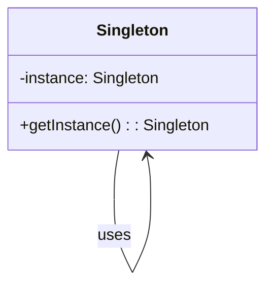
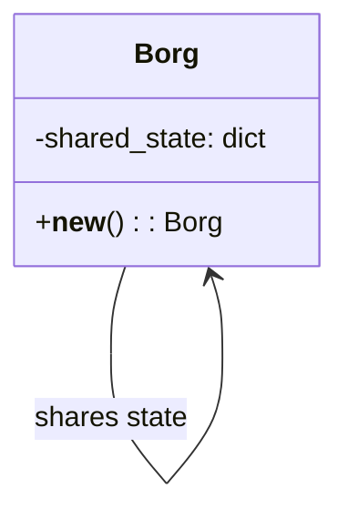

## 3.1.2 Singleton vs. Borg Pattern

In the realm of software design patterns, the Singleton and Borg patterns offer unique approaches to managing object instantiation and state sharing. While both aim to control how objects are created and how they share data, they do so in distinct ways. This section delves into the nuances of these patterns, providing a comprehensive understanding of their implementations, benefits, and use cases in Python.

### Understanding the Singleton Pattern

The Singleton pattern ensures that a class has only one instance and provides a global point of access to that instance. This is particularly useful when exactly one object is needed to coordinate actions across the system.

#### Key Characteristics of Singleton

- **Single Instance**: Only one instance of the class is created.
- **Global Access**: The instance is accessible globally.
- **Controlled Access**: The class controls the instantiation process.

#### Implementing Singleton in Python

Let's explore a basic implementation of the Singleton pattern in Python:

```python
class Singleton:
    _instance = None

    def __new__(cls, *args, **kwargs):
        if not cls._instance:
            cls._instance = super(Singleton, cls).__new__(cls, *args, **kwargs)
        return cls._instance

singleton1 = Singleton()
singleton2 = Singleton()

print(singleton1 is singleton2)  # Output: True
```

In this implementation, the `__new__` method is overridden to ensure that only one instance of the class is created. If an instance already exists, the existing instance is returned.

### Introducing the Borg Pattern

The Borg pattern, also known as the Monostate pattern, is a variation of the Singleton pattern. Instead of ensuring a single instance, it ensures that all instances share the same state.

#### Key Characteristics of Borg

- **Shared State**: All instances share the same state.
- **Multiple Instances**: Multiple instances of the class can exist.
- **State Synchronization**: Changes to one instance affect all others.

#### Implementing Borg in Python

Here's how you can implement the Borg pattern in Python:

```python
class Borg:
    _shared_state = {}

    def __new__(cls, *args, **kwargs):
        obj = super(Borg, cls).__new__(cls, *args, **kwargs)
        obj.__dict__ = cls._shared_state
        return obj

borg1 = Borg()
borg2 = Borg()

borg1.state = 'Shared State'
print(borg2.state)  # Output: Shared State
```

In this implementation, the `__dict__` attribute of each instance is set to a class-level dictionary, `_shared_state`, ensuring that all instances share the same state.

### Comparing Singleton and Borg Patterns

#### Single Instance vs. Shared State

- **Singleton**: Guarantees a single instance of a class, which can be beneficial when a single point of control is needed.
- **Borg**: Allows multiple instances but ensures they share the same state, which can be useful when state synchronization is more important than instance control.

#### Use Cases

- **Singleton**: Ideal for scenarios where a single instance is required, such as logging, configuration management, or connection pooling.
- **Borg**: Suitable for scenarios where multiple instances are needed, but they should behave as if they are the same instance, such as in settings where state consistency across instances is critical.

### Benefits and Drawbacks

#### Benefits of Singleton

- **Resource Efficiency**: Reduces resource usage by limiting the number of instances.
- **Consistency**: Ensures consistent access to a single instance.

#### Drawbacks of Singleton

- **Global State**: Can lead to issues with global state management.
- **Testing Challenges**: Difficult to test due to its global nature.

#### Benefits of Borg

- **State Consistency**: Ensures consistent state across multiple instances.
- **Flexibility**: Allows for multiple instances while maintaining shared state.

#### Drawbacks of Borg

- **Complexity**: Can be more complex to implement and understand.
- **State Management**: Requires careful management of shared state.

### Misconceptions and Clarifications

#### Misconception: Singleton and Borg are Interchangeable

While both patterns aim to control object creation and state sharing, they are not interchangeable. Singleton focuses on limiting instances, whereas Borg focuses on sharing state.

#### Misconception: Borg is a Singleton Variant

Although Borg is sometimes referred to as a Singleton variant, it is fundamentally different in its approach to instance and state management.

### Choosing Between Singleton and Borg

When deciding between Singleton and Borg, consider the following:

- **Need for Single Instance**: If a single instance is essential, Singleton is the way to go.
- **Need for Shared State**: If shared state across multiple instances is more critical, Borg is the better choice.

### Try It Yourself

Experiment with the following modifications to deepen your understanding:

1. **Modify the Singleton**: Try adding a method to the Singleton class and observe how it behaves across multiple calls.
2. **Extend the Borg**: Add additional attributes to the Borg class and see how they are shared across instances.
3. **Combine Patterns**: Attempt to combine both patterns in a single implementation and analyze the results.

### Visualizing Singleton and Borg Patterns

To better understand the differences between Singleton and Borg patterns, let's visualize their structures using Mermaid.js diagrams.

#### Singleton Pattern Diagram



#### Borg Pattern Diagram



These diagrams illustrate the core differences: Singleton maintains a single instance, while Borg shares state across multiple instances.

### Conclusion

Both Singleton and Borg patterns offer valuable solutions for managing object creation and state sharing in Python. By understanding their differences, benefits, and use cases, you can make informed decisions about which pattern to use in your projects. Remember, the choice between Singleton and Borg depends on your specific requirements for instance control and state sharing.

## Quiz Time!



### What is the primary goal of the Singleton pattern?

- [x] To ensure a class has only one instance
- [ ] To allow multiple instances with shared state
- [ ] To provide a global access point for multiple instances
- [ ] To synchronize state across instances

> **Explanation:** The Singleton pattern's primary goal is to ensure that a class has only one instance, providing a global access point to that instance.

### How does the Borg pattern differ from the Singleton pattern?

- [x] Borg shares state across instances, while Singleton ensures a single instance
- [ ] Borg ensures a single instance, while Singleton shares state
- [ ] Borg and Singleton are identical in functionality
- [ ] Borg is a more complex version of Singleton

> **Explanation:** The Borg pattern shares state across multiple instances, whereas the Singleton pattern ensures that only one instance of a class exists.

### In which scenario is the Singleton pattern most useful?

- [x] When a single instance is needed to coordinate actions
- [ ] When multiple instances need to share the same state
- [ ] When instances need to be created dynamically
- [ ] When state synchronization is not important

> **Explanation:** The Singleton pattern is most useful when a single instance is needed to coordinate actions across the system.

### What is a potential drawback of the Singleton pattern?

- [x] It can lead to issues with global state management
- [ ] It allows multiple instances
- [ ] It complicates state synchronization
- [ ] It is difficult to implement

> **Explanation:** A potential drawback of the Singleton pattern is that it can lead to issues with global state management.

### Which pattern would you choose for state consistency across instances?

- [x] Borg
- [ ] Singleton
- [ ] Factory
- [ ] Observer

> **Explanation:** The Borg pattern is ideal for ensuring state consistency across multiple instances.

### What is a common misconception about the Borg pattern?

- [x] That it is a variant of Singleton
- [ ] That it cannot share state
- [ ] That it ensures a single instance
- [ ] That it is identical to Factory

> **Explanation:** A common misconception is that the Borg pattern is a variant of Singleton, but it actually focuses on shared state rather than a single instance.

### How does the Borg pattern achieve shared state?

- [x] By using a class-level dictionary for instance attributes
- [ ] By limiting the number of instances
- [ ] By creating a single global instance
- [ ] By using inheritance

> **Explanation:** The Borg pattern achieves shared state by using a class-level dictionary for instance attributes, ensuring all instances share the same state.

### What is a benefit of the Singleton pattern?

- [x] It reduces resource usage by limiting instances
- [ ] It allows for multiple instances
- [ ] It simplifies state synchronization
- [ ] It is easier to implement than Borg

> **Explanation:** A benefit of the Singleton pattern is that it reduces resource usage by limiting the number of instances.

### Can the Borg pattern have multiple instances?

- [x] Yes
- [ ] No

> **Explanation:** Yes, the Borg pattern can have multiple instances, but they all share the same state.

### True or False: The Singleton pattern is always preferred over the Borg pattern.

- [ ] True
- [x] False

> **Explanation:** False. The choice between Singleton and Borg depends on the specific requirements for instance control and state sharing.



Remember, this is just the beginning of your journey with design patterns in Python. As you progress, you'll gain a deeper understanding of how these patterns can be applied to create more efficient and maintainable code. Keep experimenting, stay curious, and enjoy the journey!
