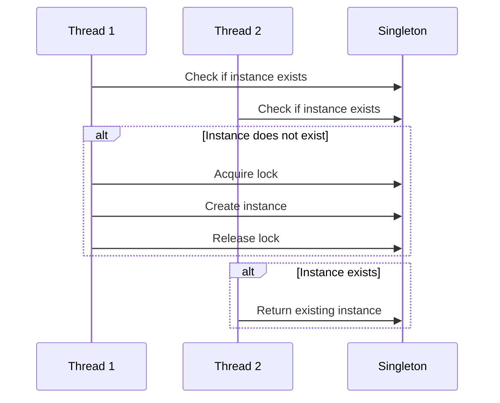

## 3.1.3 Thread-safe Singleton

In this section, we delve into the complexities of implementing a thread-safe Singleton pattern in Python. The Singleton pattern is a creational design pattern that ensures a class has only one instance and provides a global point of access to it. While this pattern is straightforward in single-threaded applications, it becomes challenging in multi-threaded environments where concurrent access can lead to multiple instances being created. Let's explore how to tackle these challenges effectively.

### Understanding the Problem

In a multi-threaded environment, multiple threads may attempt to create an instance of a Singleton simultaneously. This can lead to the creation of multiple instances, violating the Singleton principle. Consider the following naive Singleton implementation:

```python
class Singleton:
    _instance = None

    def __new__(cls, *args, **kwargs):
        if not cls._instance:
            cls._instance = super(Singleton, cls).__new__(cls, *args, **kwargs)
        return cls._instance
```

In this example, the check `if not cls._instance` is not atomic, meaning that two threads could both pass this check before either has set `_instance`, resulting in two instances being created.

### Thread-safe Singleton Implementation

To ensure thread safety, we need to synchronize access to the instance creation process. Python provides several mechanisms to achieve this, such as using locks from the `threading` module.

#### Using Locks

A common approach to making a Singleton thread-safe is to use a lock to ensure that only one thread can execute the instance creation code at a time.

```python
import threading

class Singleton:
    _instance = None
    _lock = threading.Lock()

    def __new__(cls, *args, **kwargs):
        with cls._lock:
            if not cls._instance:
                cls._instance = super(Singleton, cls).__new__(cls, *args, **kwargs)
        return cls._instance
```

In this implementation, we use a lock to synchronize access to the critical section where the instance is created. The `with` statement ensures that the lock is acquired before the block is executed and released afterward, even if an exception occurs.

#### Double-Checked Locking

Double-checked locking is an optimization that reduces the overhead of acquiring a lock by first checking if the instance is already created. This approach minimizes the performance impact of synchronization.

```python
import threading

class Singleton:
    _instance = None
    _lock = threading.Lock()

    def __new__(cls, *args, **kwargs):
        if not cls._instance:
            with cls._lock:
                if not cls._instance:
                    cls._instance = super(Singleton, cls).__new__(cls, *args, **kwargs)
        return cls._instance
```

In this example, we first check if `_instance` is `None` before acquiring the lock. If it is not `None`, we skip the locking mechanism, which improves performance when the Singleton has already been instantiated.

### Performance Implications

While locks ensure thread safety, they can introduce performance overhead due to the time spent acquiring and releasing locks. Double-checked locking mitigates this by reducing the frequency of lock acquisition, but it is essential to ensure that the implementation is correct and does not introduce subtle bugs.

### Best Practices for Thread-safe Singleton

1. **Use Locks Judiciously**: Only use locks around the critical section of code that needs synchronization. Avoid holding locks for extended periods to minimize contention.

2. **Consider Lazy Initialization**: Initialize the Singleton instance only when it is needed. This can be combined with double-checked locking to improve performance.

3. **Evaluate Alternatives**: In some cases, other patterns or designs may be more suitable than Singleton, especially if the Singleton introduces complexity or performance issues.

4. **Test Thoroughly**: Concurrency issues can be challenging to detect and reproduce. Ensure that your Singleton implementation is thoroughly tested under various conditions to verify its correctness.

### Python Threading Considerations

Python's Global Interpreter Lock (GIL) ensures that only one thread executes Python bytecode at a time, which simplifies some aspects of thread safety. However, the GIL does not eliminate the need for synchronization when dealing with shared resources, as it does not prevent context switches between threads.

#### Using `threading` Module

The `threading` module provides several synchronization primitives, such as locks, events, and semaphores, which can be used to manage access to shared resources.

```python
import threading

lock = threading.Lock()

def thread_safe_function():
    with lock:
        # Critical section
        pass
```

### Visualizing Thread-safe Singleton

To better understand the flow of a thread-safe Singleton implementation, let's visualize the process using a sequence diagram.



In this diagram, both threads check if the Singleton instance exists. Thread 1 acquires the lock and creates the instance, while Thread 2 waits and then returns the existing instance once Thread 1 releases the lock.

### Try It Yourself

Experiment with the thread-safe Singleton implementation by modifying the code to introduce delays or simulate concurrent access. Observe how the lock ensures that only one instance is created, even under concurrent conditions.

```python
import threading
import time

class Singleton:
    _instance = None
    _lock = threading.Lock()

    def __new__(cls, *args, **kwargs):
        if not cls._instance:
            with cls._lock:
                if not cls._instance:
                    print("Creating instance")
                    time.sleep(1)  # Simulate delay
                    cls._instance = super(Singleton, cls).__new__(cls, *args, **kwargs)
        return cls._instance

def create_singleton():
    instance = Singleton()
    print(f"Instance ID: {id(instance)}")

threads = [threading.Thread(target=create_singleton) for _ in range(5)]

for thread in threads:
    thread.start()

for thread in threads:
    thread.join()
```

### Knowledge Check

- What is the primary purpose of using locks in a thread-safe Singleton implementation?
- How does double-checked locking improve performance in a Singleton pattern?
- Why is it important to test thread-safe implementations thoroughly?

### Conclusion

Implementing a thread-safe Singleton in Python requires careful consideration of synchronization mechanisms to ensure that only one instance is created, even in a multi-threaded environment. By using locks and techniques like double-checked locking, we can achieve thread safety while minimizing performance overhead. Remember to test your implementation thoroughly and consider alternative designs if the Singleton pattern introduces unnecessary complexity.

## Quiz Time!



### What is the main issue with a naive Singleton implementation in a multi-threaded environment?

- [x] Multiple instances can be created.
- [ ] It is too slow.
- [ ] It uses too much memory.
- [ ] It is difficult to read.

> **Explanation:** In a multi-threaded environment, multiple threads can pass the instance check simultaneously, leading to multiple instances being created.

### How does a lock ensure thread safety in a Singleton implementation?

- [x] It prevents multiple threads from executing the critical section simultaneously.
- [ ] It speeds up the execution of the code.
- [ ] It reduces memory usage.
- [ ] It ensures the code is easier to read.

> **Explanation:** A lock ensures that only one thread can execute the critical section at a time, preventing the creation of multiple instances.

### What is the purpose of double-checked locking in a Singleton pattern?

- [x] To reduce the overhead of acquiring a lock.
- [ ] To ensure the Singleton is created faster.
- [ ] To make the code easier to read.
- [ ] To increase memory usage.

> **Explanation:** Double-checked locking minimizes the performance impact by checking if the instance is already created before acquiring the lock.

### Why is it important to test thread-safe implementations thoroughly?

- [x] Concurrency issues can be challenging to detect and reproduce.
- [ ] It makes the code run faster.
- [ ] It reduces memory usage.
- [ ] It simplifies the code.

> **Explanation:** Concurrency issues can be subtle and difficult to reproduce, so thorough testing is essential to ensure correctness.

### Which Python module provides synchronization primitives like locks?

- [x] `threading`
- [ ] `multiprocessing`
- [ ] `concurrent`
- [ ] `asyncio`

> **Explanation:** The `threading` module provides synchronization primitives such as locks, events, and semaphores.

### What is the Global Interpreter Lock (GIL) in Python?

- [x] A mechanism that ensures only one thread executes Python bytecode at a time.
- [ ] A lock that prevents memory leaks.
- [ ] A tool for optimizing Python code.
- [ ] A feature that speeds up Python execution.

> **Explanation:** The GIL is a mutex that protects access to Python objects, ensuring that only one thread executes Python bytecode at a time.

### What is a critical section in the context of thread-safe Singleton?

- [x] A part of the code that must not be executed by more than one thread at a time.
- [ ] A section of the code that is executed very quickly.
- [ ] A section of the code that uses a lot of memory.
- [ ] A section of the code that is difficult to read.

> **Explanation:** A critical section is a part of the code that accesses shared resources and must be protected to prevent concurrent execution by multiple threads.

### What is the primary benefit of using a thread-safe Singleton?

- [x] It ensures that only one instance of the class is created, even in a multi-threaded environment.
- [ ] It makes the code run faster.
- [ ] It reduces memory usage.
- [ ] It simplifies the code.

> **Explanation:** A thread-safe Singleton ensures that only one instance of the class is created, maintaining the Singleton property even in multi-threaded environments.

### Can the Global Interpreter Lock (GIL) eliminate the need for synchronization in Python?

- [ ] True
- [x] False

> **Explanation:** The GIL does not eliminate the need for synchronization when dealing with shared resources, as it does not prevent context switches between threads.

### What is the role of the `__new__` method in a Singleton class?

- [x] To control the creation of a new instance of the class.
- [ ] To initialize the instance attributes.
- [ ] To clean up resources when an instance is deleted.
- [ ] To provide a string representation of the instance.

> **Explanation:** The `__new__` method is responsible for creating a new instance of the class and is used in Singleton to control instance creation.


