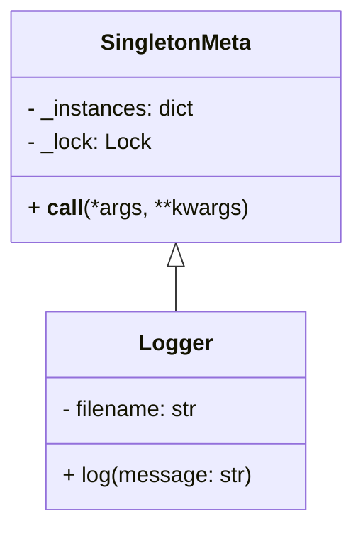

## 3.1.4 Use Cases and Examples

The Singleton pattern is a creational design pattern that ensures a class has only one instance and provides a global point of access to it. This pattern is particularly useful in scenarios where a single instance of a class is required to coordinate actions across a system. In this section, we will delve into common use cases for the Singleton pattern, provide real-world examples, discuss its appropriateness, and highlight potential drawbacks and alternatives.

### Common Use Cases for Singleton

1. **Logging**: 
   - Logging is a critical component of any application, providing insights into the application's behavior and aiding in debugging. A Singleton logger ensures that all parts of an application write to the same log file or output stream, maintaining consistency and avoiding conflicts.

2. **Configuration Management**:
   - Applications often require configuration settings that should be accessible globally. A Singleton can manage these settings, ensuring that all parts of the application use the same configuration data.

3. **Resource Pooling**:
   - In resource-constrained environments, such as database connections or thread pools, a Singleton can manage a pool of resources, ensuring efficient allocation and reuse.

4. **Cache Management**:
   - A Singleton can be used to manage a cache, ensuring that all parts of an application have access to the same cached data, improving performance by reducing redundant data retrieval.

5. **Device Management**:
   - In applications interfacing with hardware devices, a Singleton can manage access to a device, ensuring that only one instance interacts with the hardware at any time, preventing conflicts.

### Real-World Examples

#### Example 1: Singleton Logger

Let's consider a simple logging system where we want to ensure that all log messages are written to the same file. Here's how we can implement a Singleton logger in Python:

```python
import threading

class SingletonMeta(type):
    _instances = {}
    _lock: threading.Lock = threading.Lock()

    def __call__(cls, *args, **kwargs):
        with cls._lock:
            if cls not in cls._instances:
                instance = super().__call__(*args, **kwargs)
                cls._instances[cls] = instance
        return cls._instances[cls]

class Logger(metaclass=SingletonMeta):
    def __init__(self, filename):
        self.filename = filename

    def log(self, message):
        with open(self.filename, 'a') as file:
            file.write(message + '\n')

logger1 = Logger('app.log')
logger2 = Logger('app.log')

logger1.log('This is a log message.')
logger2.log('This is another log message.')

print(logger1 is logger2)  # Output: True
```

**Explanation**: 
- The `SingletonMeta` metaclass ensures that only one instance of the `Logger` class is created. 
- The `Logger` class writes log messages to a file. 
- Both `logger1` and `logger2` refer to the same instance, ensuring consistent logging.

#### Example 2: Configuration Manager

In many applications, configuration settings need to be accessed globally. Here's how a Singleton can manage these settings:

```python
class ConfigurationManager(metaclass=SingletonMeta):
    def __init__(self):
        self.config = {}

    def set(self, key, value):
        self.config[key] = value

    def get(self, key):
        return self.config.get(key)

config1 = ConfigurationManager()
config2 = ConfigurationManager()

config1.set('database', 'mysql')
print(config2.get('database'))  # Output: mysql

print(config1 is config2)  # Output: True
```

**Explanation**: 
- The `ConfigurationManager` class uses the `SingletonMeta` metaclass to ensure a single instance.
- Configuration settings are stored in a dictionary, accessible globally.

### Why Singleton is Appropriate

The Singleton pattern is appropriate in scenarios where:

- **Consistency**: A single point of access ensures consistent behavior across the application.
- **Resource Management**: Efficiently manages resources by ensuring only one instance controls access.
- **Global Access**: Provides a global point of access to shared resources or data.

### Potential Drawbacks

While the Singleton pattern offers several benefits, it also has potential drawbacks:

- **Global State**: Singletons introduce global state into an application, which can lead to tight coupling and make testing difficult.
- **Concurrency Issues**: In multi-threaded applications, ensuring thread safety can be challenging.
- **Hidden Dependencies**: Singletons can hide dependencies, making the codebase harder to understand and maintain.

### Alternatives to Singleton

Consider the following alternatives to the Singleton pattern:

- **Dependency Injection**: Instead of using a Singleton, inject the required instance into classes that need it. This approach improves testability and decouples components.
- **Module-Level Variables**: In Python, modules are singletons by nature. Using module-level variables can achieve similar results without explicitly implementing the Singleton pattern.
- **Factory Pattern**: Use a factory to manage the creation of instances, allowing more control over instance management.

### Encouraging Critical Thinking

When considering the Singleton pattern, ask yourself the following questions:

- Is a single instance truly necessary, or can the problem be solved with a different approach?
- How will the Singleton impact the testability and maintainability of the code?
- Are there concurrency concerns that need to be addressed?

### Visualizing Singleton Pattern

To better understand the Singleton pattern, let's visualize its structure and workflow using a class diagram:



**Diagram Description**: 
- The `SingletonMeta` class is a metaclass that manages the creation of Singleton instances.
- The `Logger` class is an example of a Singleton, using `SingletonMeta` to ensure a single instance.

### Try It Yourself

Experiment with the Singleton pattern by modifying the examples:

- **Change the Logger**: Modify the `Logger` class to log messages to different formats, such as JSON or XML.
- **Extend ConfigurationManager**: Add functionality to load configuration settings from a file or environment variables.
- **Implement a Resource Pool**: Create a Singleton class that manages a pool of database connections.

### Knowledge Check

- What are the benefits of using the Singleton pattern in logging systems?
- How does the Singleton pattern ensure a single instance of a class?
- What are some potential drawbacks of using the Singleton pattern?
- How can dependency injection be used as an alternative to the Singleton pattern?

### Summary

The Singleton pattern is a powerful tool for ensuring a single instance of a class across an application. It is particularly useful in scenarios requiring consistency, resource management, and global access. However, it is essential to be aware of its potential drawbacks and consider alternatives when appropriate. By understanding the use cases and examples provided, you can make informed decisions about when and how to apply the Singleton pattern in your Python projects.

## Quiz Time!



### What is a common use case for the Singleton pattern?

- [x] Logging
- [ ] User authentication
- [ ] Data encryption
- [ ] Image processing

> **Explanation:** Logging is a common use case for the Singleton pattern because it ensures that all log messages are written to the same output, maintaining consistency.

### How does the Singleton pattern ensure only one instance of a class is created?

- [x] By using a metaclass or a class variable to store the instance
- [ ] By using a global variable
- [ ] By creating multiple instances and selecting one
- [ ] By using a decorator

> **Explanation:** The Singleton pattern typically uses a metaclass or a class variable to store the instance, ensuring only one instance is created and accessed globally.

### What is a potential drawback of the Singleton pattern?

- [x] It introduces global state
- [ ] It simplifies code
- [ ] It enhances security
- [ ] It increases performance

> **Explanation:** A potential drawback of the Singleton pattern is that it introduces global state, which can lead to tight coupling and make testing difficult.

### Which of the following is an alternative to the Singleton pattern?

- [x] Dependency Injection
- [ ] Observer Pattern
- [ ] Strategy Pattern
- [ ] Factory Pattern

> **Explanation:** Dependency Injection is an alternative to the Singleton pattern, as it allows for more flexible and testable code by injecting dependencies rather than relying on a global instance.

### What is the primary purpose of the Singleton pattern?

- [x] To ensure a class has only one instance
- [ ] To create multiple instances of a class
- [ ] To enhance performance
- [ ] To manage user sessions

> **Explanation:** The primary purpose of the Singleton pattern is to ensure that a class has only one instance and provides a global point of access to it.

### How can concurrency issues be addressed in a Singleton implementation?

- [x] By using locks or thread-safe mechanisms
- [ ] By creating multiple instances
- [ ] By avoiding the use of global variables
- [ ] By using decorators

> **Explanation:** Concurrency issues in a Singleton implementation can be addressed by using locks or thread-safe mechanisms to ensure that only one instance is created in multi-threaded environments.

### What is a benefit of using the Singleton pattern for configuration management?

- [x] It ensures consistent access to configuration settings
- [ ] It allows for multiple configurations
- [ ] It enhances security
- [ ] It simplifies code

> **Explanation:** A benefit of using the Singleton pattern for configuration management is that it ensures consistent access to configuration settings across the application.

### Why might the Singleton pattern be inappropriate for some applications?

- [x] It can lead to tight coupling and hidden dependencies
- [ ] It simplifies code
- [ ] It enhances performance
- [ ] It provides global access

> **Explanation:** The Singleton pattern might be inappropriate for some applications because it can lead to tight coupling and hidden dependencies, making the codebase harder to understand and maintain.

### What is a common alternative to the Singleton pattern in Python?

- [x] Module-level variables
- [ ] Class-level variables
- [ ] Instance-level variables
- [ ] Function-level variables

> **Explanation:** In Python, module-level variables can be used as a common alternative to the Singleton pattern, as modules are singletons by nature.

### True or False: The Singleton pattern is always the best choice for managing shared resources.

- [ ] True
- [x] False

> **Explanation:** False. While the Singleton pattern is useful for managing shared resources, it is not always the best choice. Alternatives like dependency injection or resource pooling may be more appropriate depending on the application's requirements.



Remember, this is just the beginning. As you progress, you'll build more complex and interactive applications. Keep experimenting, stay curious, and enjoy the journey!
