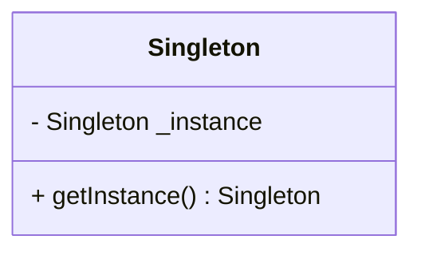

## 3.1 Singleton Pattern

In the realm of software design patterns, the Singleton pattern stands out as a fundamental creational pattern. Its primary purpose is to ensure that a class has only one instance while providing a global access point to that instance. This pattern is particularly useful in scenarios where a single point of control or coordination is required, such as configuration settings, logging, or connection pooling.

### Purpose and Use Cases of the Singleton Pattern

The Singleton pattern is employed in situations where it is crucial to have exactly one instance of a class. This can be beneficial in various scenarios, including:

- **Configuration Management**: Centralizing configuration settings ensures consistency across an application.
- **Logging**: A single logging object can manage log entries uniformly across different parts of an application.
- **Resource Management**: Managing shared resources, such as database connections or thread pools, efficiently.
- **Caching**: Implementing a cache that is accessible globally to store frequently accessed data.

### Challenges of Implementing Singleton in Python

Implementing the Singleton pattern in Python presents unique challenges due to the language's nature. Python's module system inherently supports a form of Singleton, as modules are instantiated only once per interpreter session. However, there are situations where a more explicit Singleton implementation is necessary.

#### Module-Level Singletons

In Python, modules themselves can act as Singletons. When a module is imported, it is loaded into memory once, and subsequent imports refer to the same module object. This behavior can be leveraged to create a Singleton-like structure without additional code.

```python
class Config:
    def __init__(self):
        self.settings = {}

config = Config()
```

```python
from config import config

config.settings['theme'] = 'dark'
```

In this example, `config` acts as a Singleton, as it is instantiated once and shared across the application.

### Methods of Implementing Singleton in Python

There are several ways to implement the Singleton pattern in Python, each with its own advantages and nuances.

#### 1. Using a Classic Singleton Class

The classic approach involves overriding the `__new__` method to control instance creation.

```python
class Singleton:
    _instance = None

    def __new__(cls, *args, **kwargs):
        if cls._instance is None:
            cls._instance = super(Singleton, cls).__new__(cls, *args, **kwargs)
        return cls._instance

singleton1 = Singleton()
singleton2 = Singleton()
assert singleton1 is singleton2  # True
```

#### 2. Singleton with Decorators

Decorators can be used to wrap a class and ensure only one instance is created.

```python
def singleton(cls):
    instances = {}
    def get_instance(*args, **kwargs):
        if cls not in instances:
            instances[cls] = cls(*args, **kwargs)
        return instances[cls]
    return get_instance

@singleton
class Singleton:
    pass

singleton1 = Singleton()
singleton2 = Singleton()
assert singleton1 is singleton2  # True
```

#### 3. Singleton with Metaclasses

Metaclasses provide a powerful way to define Singletons by controlling class creation.

```python
class SingletonMeta(type):
    _instances = {}

    def __call__(cls, *args, **kwargs):
        if cls not in cls._instances:
            cls._instances[cls] = super(SingletonMeta, cls).__call__(*args, **kwargs)
        return cls._instances[cls]

class Singleton(metaclass=SingletonMeta):
    pass

singleton1 = Singleton()
singleton2 = Singleton()
assert singleton1 is singleton2  # True
```

### Comparing Singleton with Borg Pattern

The Borg pattern, also known as the shared-state pattern, is an alternative to the Singleton pattern. Instead of ensuring a single instance, the Borg pattern shares state among all instances.

```python
class Borg:
    _shared_state = {}

    def __init__(self):
        self.__dict__ = self._shared_state

class BorgSingleton(Borg):
    def __init__(self, **kwargs):
        super().__init__()
        self._shared_state.update(kwargs)

borg1 = BorgSingleton(a=1)
borg2 = BorgSingleton(b=2)
assert borg1 is not borg2  # True, different instances
assert borg1.a == 1 and borg2.b == 2  # True, shared state
```

### Testing and Global State Management Concerns

The Singleton pattern can introduce challenges in testing due to its global state. It can lead to tightly coupled code, making unit testing difficult. To mitigate this, consider:

- **Dependency Injection**: Inject dependencies rather than relying on global state.
- **Mocking**: Use mocking frameworks to simulate Singleton behavior in tests.

### Thread-Safe Singleton Implementation

In multi-threaded applications, ensuring thread safety is crucial when implementing a Singleton. Python's Global Interpreter Lock (GIL) provides some protection, but explicit synchronization is often necessary.

#### Using Locks for Thread Safety

```python
import threading

class ThreadSafeSingleton:
    _instance = None
    _lock = threading.Lock()

    def __new__(cls, *args, **kwargs):
        with cls._lock:
            if cls._instance is None:
                cls._instance = super(ThreadSafeSingleton, cls).__new__(cls, *args, **kwargs)
        return cls._instance

singleton1 = ThreadSafeSingleton()
singleton2 = ThreadSafeSingleton()
assert singleton1 is singleton2  # True
```

### Visualizing Singleton Pattern

Below is a class diagram representing the Singleton pattern:



### Try It Yourself

Experiment with the Singleton pattern by modifying the examples above. Try creating a Singleton that logs messages to a file, ensuring only one log file is used across the application.

### Key Takeaways

- The Singleton pattern ensures a class has only one instance with a global access point.
- Python's module system can naturally support Singleton-like behavior.
- Various methods exist to implement Singleton in Python, including decorators and metaclasses.
- The Borg pattern offers an alternative by sharing state among instances.
- Thread safety is crucial in multi-threaded environments, requiring synchronization mechanisms like locks.
- Testing Singleton implementations can be challenging due to global state concerns.

## Quiz Time!



### What is the primary purpose of the Singleton pattern?

- [x] To ensure a class has only one instance with a global access point.
- [ ] To allow multiple instances of a class.
- [ ] To manage multiple threads.
- [ ] To provide a user interface.

> **Explanation:** The Singleton pattern is designed to ensure a class has only one instance and provides a global access point to it.

### Which Python feature naturally supports Singleton-like behavior?

- [x] Modules
- [ ] Functions
- [ ] Lists
- [ ] Dictionaries

> **Explanation:** Python modules are instantiated once per interpreter session, supporting Singleton-like behavior.

### What is a key difference between the Singleton and Borg patterns?

- [x] Singleton ensures one instance, Borg shares state among instances.
- [ ] Singleton uses decorators, Borg uses metaclasses.
- [ ] Singleton is thread-safe, Borg is not.
- [ ] Singleton is faster than Borg.

> **Explanation:** The Singleton pattern ensures a single instance, while the Borg pattern shares state among multiple instances.

### How can thread safety be ensured in a Singleton implementation?

- [x] By using locks to synchronize instance creation.
- [ ] By using global variables.
- [ ] By using decorators.
- [ ] By using lists.

> **Explanation:** Locks can be used to ensure thread safety by synchronizing access to the Singleton instance.

### What is a potential downside of using the Singleton pattern?

- [x] It can introduce global state, making testing difficult.
- [ ] It is always slower than other patterns.
- [ ] It cannot be implemented in Python.
- [ ] It requires too much memory.

> **Explanation:** The Singleton pattern can introduce global state, which can complicate testing and lead to tightly coupled code.

### Which method can be used to implement a Singleton in Python?

- [x] Metaclasses
- [ ] Lists
- [ ] Dictionaries
- [ ] Functions

> **Explanation:** Metaclasses can be used to control class instantiation, making them suitable for implementing Singletons.

### What is the role of the `__new__` method in a Singleton class?

- [x] To control the creation of a new instance.
- [ ] To initialize instance variables.
- [ ] To delete an instance.
- [ ] To clone an instance.

> **Explanation:** The `__new__` method is responsible for controlling the creation of a new instance in a Singleton class.

### How does the Borg pattern differ from a traditional Singleton?

- [x] It shares state among instances rather than ensuring a single instance.
- [ ] It uses decorators instead of metaclasses.
- [ ] It is not thread-safe.
- [ ] It is faster than Singleton.

> **Explanation:** The Borg pattern shares state among instances, unlike the Singleton pattern, which ensures a single instance.

### Which of the following is a benefit of using the Singleton pattern?

- [x] Centralized control of resources.
- [ ] Increased memory usage.
- [ ] More complex code.
- [ ] Slower execution.

> **Explanation:** The Singleton pattern centralizes control of resources, which can simplify management and ensure consistency.

### True or False: The Singleton pattern can be implemented using Python decorators.

- [x] True
- [ ] False

> **Explanation:** Python decorators can be used to implement the Singleton pattern by controlling instance creation.


