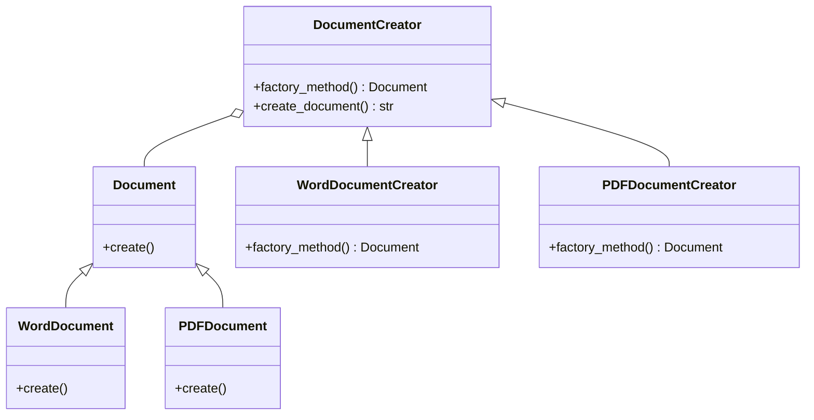

## 3.2.1 Implementing Factory Method in Python

The Factory Method pattern is a creational design pattern that provides an interface for creating objects in a superclass, but allows subclasses to alter the type of objects that will be created. This pattern is particularly useful when the exact type of object that needs to be created is determined at runtime. In this section, we will delve into the intricacies of implementing the Factory Method pattern in Python, leveraging its dynamic features and polymorphism.

### Understanding the Factory Method Pattern

The Factory Method pattern is all about defining a method, often in an interface or abstract class, for creating an object but letting subclasses decide which class to instantiate. This pattern promotes loose coupling by eliminating the need to bind application-specific classes into the code. The core idea is to delegate the responsibility of instantiation to subclasses, allowing the code to remain flexible and scalable.

#### Key Concepts

- **Creator**: The class that contains the factory method. This class is often abstract, providing a default implementation of the factory method.
- **Product**: The interface or abstract class that defines the type of objects the factory method creates.
- **Concrete Creator**: Subclasses of the Creator that implement the factory method to return an instance of a Concrete Product.
- **Concrete Product**: Subclasses of the Product that are created by the factory method.

### Step-by-Step Guide to Implementing Factory Method in Python

Let's walk through the process of implementing the Factory Method pattern in Python with a practical example. We will create a simple application that generates different types of documents (e.g., Word, PDF) using the Factory Method pattern.

#### Step 1: Define the Product Interface

The first step is to define an interface for the products that the factory method will create. In Python, we can use an abstract base class to define this interface.

```python
from abc import ABC, abstractmethod

class Document(ABC):
    @abstractmethod
    def create(self):
        pass
```

Here, `Document` is an abstract base class with an abstract method `create()`. This method will be implemented by concrete products.

#### Step 2: Create Concrete Products

Next, we define concrete implementations of the `Document` interface. These are the specific types of documents that our factory method will create.

```python
class WordDocument(Document):
    def create(self):
        return "Word document created."

class PDFDocument(Document):
    def create(self):
        return "PDF document created."
```

In this example, `WordDocument` and `PDFDocument` are concrete products that implement the `create()` method.

#### Step 3: Define the Creator Class

The Creator class declares the factory method that returns an object of type `Document`. The Creator class can also provide a default implementation of the factory method.

```python
class DocumentCreator(ABC):
    @abstractmethod
    def factory_method(self) -> Document:
        pass

    def create_document(self) -> str:
        document = self.factory_method()
        return document.create()
```

The `DocumentCreator` class defines the `factory_method()` as an abstract method. It also provides a `create_document()` method that uses the factory method to create a document.

#### Step 4: Implement Concrete Creators

Concrete Creators override the factory method to change the resulting product's type.

```python
class WordDocumentCreator(DocumentCreator):
    def factory_method(self) -> Document:
        return WordDocument()

class PDFDocumentCreator(DocumentCreator):
    def factory_method(self) -> Document:
        return PDFDocument()
```

`WordDocumentCreator` and `PDFDocumentCreator` are concrete creators that implement the `factory_method()` to return instances of `WordDocument` and `PDFDocument`, respectively.

#### Step 5: Use the Factory Method

Now, let's see how we can use the Factory Method pattern to create documents.

```python
def client_code(creator: DocumentCreator):
    print(f"Client: I'm not aware of the creator's class, but it still works.\n"
          f"{creator.create_document()}")

if __name__ == "__main__":
    print("App: Launched with the WordDocumentCreator.")
    client_code(WordDocumentCreator())

    print("\nApp: Launched with the PDFDocumentCreator.")
    client_code(PDFDocumentCreator())
```

In the `client_code` function, we interact with the `DocumentCreator` interface, which allows us to work with any concrete creator without knowing its specific class.

### Dynamic Factory Selection

One of the powerful features of the Factory Method pattern is the ability to select the factory dynamically at runtime. This can be achieved by using a registry of factories.

#### Registering Factories

We can maintain a registry of factories and select the appropriate factory based on some criteria.

```python
class DocumentFactoryRegistry:
    _factories = {}

    @classmethod
    def register_factory(cls, key: str, factory: DocumentCreator):
        cls._factories[key] = factory

    @classmethod
    def get_factory(cls, key: str) -> DocumentCreator:
        factory = cls._factories.get(key)
        if not factory:
            raise ValueError(f"Factory not found for key: {key}")
        return factory
```

Here, `DocumentFactoryRegistry` is a class that maintains a registry of document factories. We can register factories with a unique key and retrieve them as needed.

#### Using the Registry

Let's see how we can use the registry to select a factory dynamically.

```python
DocumentFactoryRegistry.register_factory("word", WordDocumentCreator())
DocumentFactoryRegistry.register_factory("pdf", PDFDocumentCreator())

factory_key = "pdf"
factory = DocumentFactoryRegistry.get_factory(factory_key)
client_code(factory)
```

In this example, we register the `WordDocumentCreator` and `PDFDocumentCreator` with keys "word" and "pdf", respectively. We then retrieve and use the factory based on the `factory_key`.

### The Role of `@classmethod` Decorator

In Python, the `@classmethod` decorator is used to define methods that are bound to the class and not the instance of the class. This is particularly useful in factory methods when we need to maintain a registry of factories or when the factory method needs to access class-level data.

#### Example of `@classmethod` in Factory Method

Let's modify our factory registry to use `@classmethod`.

```python
class DocumentFactoryRegistry:
    _factories = {}

    @classmethod
    def register_factory(cls, key: str, factory: DocumentCreator):
        cls._factories[key] = factory

    @classmethod
    def get_factory(cls, key: str) -> DocumentCreator:
        factory = cls._factories.get(key)
        if not factory:
            raise ValueError(f"Factory not found for key: {key}")
        return factory
```

The `register_factory` and `get_factory` methods are class methods, allowing them to access the `_factories` dictionary, which is shared across all instances of the class.

### Python-Specific Considerations

When implementing the Factory Method pattern in Python, there are a few language-specific features and considerations to keep in mind:

- **Duck Typing**: Python's dynamic typing allows us to use duck typing, where the type of an object is determined by its behavior (methods and properties) rather than its explicit type. This can simplify the implementation of the Factory Method pattern.
  
- **Dynamic Typing**: Python's dynamic typing allows us to create and use objects without declaring their types explicitly. This flexibility can be leveraged to create more generic and reusable factory methods.

- **Metaclasses**: Python's metaclasses can be used to modify class creation, which can be useful in advanced factory method implementations where class behavior needs to be altered dynamically.

- **Modules as Singletons**: Python modules are singletons by nature, which means they can be used to implement a simple factory method without the need for a separate factory class.

### Try It Yourself

To solidify your understanding of the Factory Method pattern, try modifying the code examples provided:

1. **Add a New Document Type**: Implement a new document type, such as `ExcelDocument`, and create a corresponding `ExcelDocumentCreator`. Register this new factory in the `DocumentFactoryRegistry` and test it.

2. **Dynamic Factory Selection**: Modify the `client_code` function to accept user input for selecting the document type. Use this input to dynamically select and create the appropriate document.

3. **Logging**: Add logging to the factory methods to track when and which type of document is created.

### Visualizing the Factory Method Pattern

To better understand the Factory Method pattern, let's visualize the relationships between the classes using a class diagram.



**Diagram Description**: The class diagram above illustrates the Factory Method pattern. The `Document` class is the product interface, with `WordDocument` and `PDFDocument` as concrete products. The `DocumentCreator` class is the creator, with `WordDocumentCreator` and `PDFDocumentCreator` as concrete creators.

### Knowledge Check

Let's reinforce what we've learned with a few questions:

- What is the primary purpose of the Factory Method pattern?
- How does the Factory Method pattern promote loose coupling?
- What role does polymorphism play in the Factory Method pattern?
- How can we dynamically select a factory in Python?
- What is the significance of the `@classmethod` decorator in factory methods?

### Summary

In this section, we've explored the Factory Method pattern in depth, focusing on its implementation in Python. We've seen how this pattern allows us to define an interface for creating objects while letting subclasses decide which class to instantiate. By leveraging Python's dynamic features, such as duck typing and class methods, we can create flexible and reusable factory methods. Remember, the Factory Method pattern is a powerful tool for promoting loose coupling and enhancing the scalability of your code.

Keep experimenting with the examples provided, and consider how you might apply the Factory Method pattern in your own projects. As you continue your journey through design patterns, you'll find that the principles and techniques you've learned here will be invaluable in creating robust and maintainable software.

## Quiz Time!



### What is the primary purpose of the Factory Method pattern?

- [x] To define an interface for creating objects, allowing subclasses to decide which class to instantiate.
- [ ] To provide a single instance of a class.
- [ ] To create complex objects step-by-step.
- [ ] To separate the construction of a complex object from its representation.

> **Explanation:** The Factory Method pattern defines an interface for creating objects, allowing subclasses to determine which class to instantiate, promoting flexibility and scalability.

### How does the Factory Method pattern promote loose coupling?

- [x] By delegating the responsibility of object creation to subclasses.
- [ ] By using a single instance of a class.
- [ ] By encapsulating complex object construction.
- [ ] By providing a global point of access to an object.

> **Explanation:** The Factory Method pattern promotes loose coupling by delegating the responsibility of object creation to subclasses, allowing the code to remain flexible and adaptable to changes.

### What role does polymorphism play in the Factory Method pattern?

- [x] It allows subclasses to provide specific implementations of the factory method.
- [ ] It ensures a single instance of a class is created.
- [ ] It separates object construction from its representation.
- [ ] It provides a simplified interface to a complex subsystem.

> **Explanation:** Polymorphism allows subclasses to provide specific implementations of the factory method, enabling the creation of different types of objects based on the subclass used.

### How can we dynamically select a factory in Python?

- [x] By using a registry of factories and selecting based on a key.
- [ ] By using a single instance of a class.
- [ ] By encapsulating complex object construction.
- [ ] By providing a global point of access to an object.

> **Explanation:** In Python, we can dynamically select a factory by maintaining a registry of factories and selecting the appropriate factory based on a key or criteria.

### What is the significance of the `@classmethod` decorator in factory methods?

- [x] It allows methods to be bound to the class rather than an instance, useful for maintaining class-level data.
- [ ] It ensures a single instance of a class is created.
- [ ] It separates object construction from its representation.
- [ ] It provides a simplified interface to a complex subsystem.

> **Explanation:** The `@classmethod` decorator allows methods to be bound to the class rather than an instance, which is useful for maintaining class-level data, such as a registry of factories.

### Which of the following is a Concrete Product in the Factory Method pattern?

- [x] WordDocument
- [ ] Document
- [ ] DocumentCreator
- [ ] WordDocumentCreator

> **Explanation:** `WordDocument` is a Concrete Product in the Factory Method pattern, as it is a specific implementation of the `Document` interface.

### What is the role of the Creator class in the Factory Method pattern?

- [x] To declare the factory method that returns an object of type Product.
- [ ] To provide a single instance of a class.
- [ ] To create complex objects step-by-step.
- [ ] To separate the construction of a complex object from its representation.

> **Explanation:** The Creator class declares the factory method that returns an object of type Product, providing a default implementation that can be overridden by subclasses.

### In the Factory Method pattern, what is a Concrete Creator?

- [x] A subclass that overrides the factory method to return an instance of a Concrete Product.
- [ ] A class that provides a single instance of a class.
- [ ] A class that creates complex objects step-by-step.
- [ ] A class that separates the construction of a complex object from its representation.

> **Explanation:** A Concrete Creator is a subclass that overrides the factory method to return an instance of a Concrete Product, allowing for specific object creation.

### How does Python's dynamic typing benefit the Factory Method pattern?

- [x] It allows for more generic and reusable factory methods without explicit type declarations.
- [ ] It ensures a single instance of a class is created.
- [ ] It separates object construction from its representation.
- [ ] It provides a simplified interface to a complex subsystem.

> **Explanation:** Python's dynamic typing allows for more generic and reusable factory methods without the need for explicit type declarations, enhancing flexibility.

### True or False: The Factory Method pattern can be used to create a single instance of a class.

- [ ] True
- [x] False

> **Explanation:** False. The Factory Method pattern is not used to create a single instance of a class; it is used to define an interface for creating objects, allowing subclasses to decide which class to instantiate.



Remember, this is just the beginning. As you progress, you'll build more complex and interactive applications using the Factory Method pattern. Keep experimenting, stay curious, and enjoy the journey!
