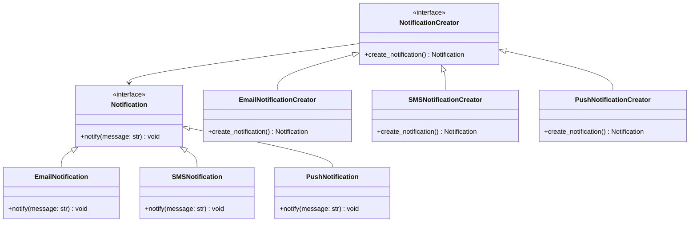

## 3.2.2 Creating Products and Creators

In the realm of software design patterns, the Factory Method Pattern stands out as a pivotal concept for creating objects. This section delves into the intricacies of creating products and creators within this pattern, providing you with a comprehensive understanding of their roles, implementation, and best practices in Python.

### Understanding the Concepts of "Product" and "Creator"

The Factory Method Pattern revolves around two primary components: **Products** and **Creators**. Let's define these terms clearly:

- **Product**: In the Factory Method Pattern, a product is an object that is created by the factory method. Products are often part of a product hierarchy, where different types of products share a common interface or abstract class. This allows for flexibility and interchangeability of products within the system.

- **Creator**: A creator is a class that contains the factory method. It defines the interface for creating products but delegates the instantiation of products to subclasses. This allows subclasses to decide which specific product to create, promoting loose coupling and scalability.

### Example of Product Hierarchies and Corresponding Creators

To illustrate the relationship between products and creators, consider a scenario where we are developing a notification system. In this system, we have different types of notifications, such as Email, SMS, and Push notifications. Each notification type is a product, and we need a mechanism to create these notifications without tightly coupling the creation logic to the client code.

#### Product Hierarchy

```python
from abc import ABC, abstractmethod

class Notification(ABC):
    @abstractmethod
    def notify(self, message: str) -> None:
        pass

class EmailNotification(Notification):
    def notify(self, message: str) -> None:
        print(f"Sending email notification with message: {message}")

class SMSNotification(Notification):
    def notify(self, message: str) -> None:
        print(f"Sending SMS notification with message: {message}")

class PushNotification(Notification):
    def notify(self, message: str) -> None:
        print(f"Sending push notification with message: {message}")
```

In this example, `Notification` is the abstract product, and `EmailNotification`, `SMSNotification`, and `PushNotification` are concrete products that implement the `notify` method.

#### Corresponding Creators

```python
class NotificationCreator(ABC):
    @abstractmethod
    def create_notification(self) -> Notification:
        pass

class EmailNotificationCreator(NotificationCreator):
    def create_notification(self) -> Notification:
        return EmailNotification()

class SMSNotificationCreator(NotificationCreator):
    def create_notification(self) -> Notification:
        return SMSNotification()

class PushNotificationCreator(NotificationCreator):
    def create_notification(self) -> Notification:
        return PushNotification()
```

Here, `NotificationCreator` is the abstract creator, and `EmailNotificationCreator`, `SMSNotificationCreator`, and `PushNotificationCreator` are concrete creators that implement the `create_notification` method to instantiate the appropriate product.

### How Creators Use Factory Methods to Produce Products

The factory method is a crucial component of the Factory Method Pattern. It is responsible for creating instances of products. The creator class contains the factory method, which is overridden by subclasses to produce specific products.

#### Implementing the Factory Method

Let's see how the factory method is used in practice:

```python
def client_code(creator: NotificationCreator, message: str) -> None:
    # The client code works with creators and products through their interfaces
    notification = creator.create_notification()
    notification.notify(message)

if __name__ == "__main__":
    email_creator = EmailNotificationCreator()
    sms_creator = SMSNotificationCreator()
    push_creator = PushNotificationCreator()

    client_code(email_creator, "Hello via Email!")
    client_code(sms_creator, "Hello via SMS!")
    client_code(push_creator, "Hello via Push Notification!")
```

In this example, the `client_code` function interacts with the creator interface to create and send notifications. The specific type of notification is determined by the concrete creator passed to the function, demonstrating the flexibility and extensibility of the Factory Method Pattern.

### Best Practices in Organizing Code for Clarity and Maintainability

When implementing the Factory Method Pattern, it's essential to organize your code in a way that promotes clarity and maintainability. Here are some best practices to consider:

1. **Use Interfaces and Abstract Classes**: Define clear interfaces or abstract classes for products and creators. This ensures that all concrete implementations adhere to a consistent contract, making the system easier to understand and extend.

2. **Separate Concerns**: Keep the creation logic separate from the business logic. The factory method should focus solely on instantiating products, while the client code should handle the business logic.

3. **Promote Reusability**: Design your product and creator classes to be reusable across different parts of the application. This reduces duplication and makes it easier to introduce new product types.

4. **Document Your Code**: Provide clear documentation for your product and creator classes, explaining their purpose and usage. This helps other developers understand the system and make informed modifications.

5. **Test Thoroughly**: Write unit tests for your factory methods to ensure they produce the correct products. This helps catch errors early and ensures the reliability of your system.

### Scenarios Where Multiple Products Are Needed

In many real-world applications, you may encounter scenarios where multiple products are needed. The Factory Method Pattern is well-suited for such situations, as it allows you to create different types of products without altering the client code.

#### Example: Document Export System

Consider a document export system that supports exporting documents in various formats, such as PDF, Word, and HTML. Each format is a product, and the system needs to create these products based on user preferences.

```python
class DocumentExporter(ABC):
    @abstractmethod
    def export(self, content: str) -> None:
        pass

class PDFExporter(DocumentExporter):
    def export(self, content: str) -> None:
        print(f"Exporting content to PDF: {content}")

class WordExporter(DocumentExporter):
    def export(self, content: str) -> None:
        print(f"Exporting content to Word: {content}")

class HTMLExporter(DocumentExporter):
    def export(self, content: str) -> None:
        print(f"Exporting content to HTML: {content}")

class ExporterCreator(ABC):
    @abstractmethod
    def create_exporter(self) -> DocumentExporter:
        pass

class PDFExporterCreator(ExporterCreator):
    def create_exporter(self) -> DocumentExporter:
        return PDFExporter()

class WordExporterCreator(ExporterCreator):
    def create_exporter(self) -> DocumentExporter:
        return WordExporter()

class HTMLExporterCreator(ExporterCreator):
    def create_exporter(self) -> DocumentExporter:
        return HTMLExporter()

def export_document(creator: ExporterCreator, content: str) -> None:
    exporter = creator.create_exporter()
    exporter.export(content)

if __name__ == "__main__":
    pdf_creator = PDFExporterCreator()
    word_creator = WordExporterCreator()
    html_creator = HTMLExporterCreator()

    export_document(pdf_creator, "Document content for PDF")
    export_document(word_creator, "Document content for Word")
    export_document(html_creator, "Document content for HTML")
```

In this example, the `export_document` function uses the factory method to create the appropriate exporter based on the creator passed to it. This approach allows the system to support multiple export formats without changing the client code.

### Visualizing the Factory Method Pattern

To better understand the Factory Method Pattern, let's visualize the relationship between products and creators using a class diagram.



**Diagram Description**: This class diagram illustrates the Factory Method Pattern for a notification system. It shows the relationship between the `Notification` interface and its concrete implementations (`EmailNotification`, `SMSNotification`, `PushNotification`), as well as the `NotificationCreator` interface and its concrete creators (`EmailNotificationCreator`, `SMSNotificationCreator`, `PushNotificationCreator`).

### Try It Yourself

To deepen your understanding of the Factory Method Pattern, try modifying the examples provided:

1. **Add a New Notification Type**: Introduce a new notification type, such as `InAppNotification`, and implement the corresponding product and creator classes.

2. **Extend the Document Export System**: Add a new export format, such as `CSVExporter`, and update the system to support this new format.

3. **Experiment with Different Scenarios**: Think of other scenarios where the Factory Method Pattern could be applied, such as a payment processing system with different payment methods.

### Knowledge Check

- **What is the primary role of a product in the Factory Method Pattern?**
- **How does a creator determine which product to create?**
- **What are the benefits of using interfaces or abstract classes in the Factory Method Pattern?**
- **How can the Factory Method Pattern improve code maintainability?**

### Summary

In this section, we've explored the roles of products and creators in the Factory Method Pattern, providing examples of product hierarchies and their corresponding creators. We've seen how creators use factory methods to produce products and discussed best practices for organizing code. By understanding these concepts, you can leverage the Factory Method Pattern to create flexible and maintainable software systems.

## Quiz Time!



### What is the primary role of a product in the Factory Method Pattern?

- [x] To define the objects that are created by the factory method.
- [ ] To create instances of other products.
- [ ] To manage the lifecycle of creators.
- [ ] To handle client requests directly.

> **Explanation:** In the Factory Method Pattern, a product is an object that is created by the factory method. It defines the specific objects that the factory method will produce.

### How does a creator determine which product to create?

- [x] By implementing a factory method that is overridden by subclasses to produce specific products.
- [ ] By directly instantiating products in the client code.
- [ ] By using a switch statement to select the product type.
- [ ] By querying a database for product information.

> **Explanation:** A creator uses a factory method, which is overridden by subclasses, to determine which specific product to create. This allows for flexibility and scalability.

### What is a key benefit of using interfaces or abstract classes in the Factory Method Pattern?

- [x] They ensure that all concrete implementations adhere to a consistent contract.
- [ ] They allow for direct instantiation of products.
- [ ] They eliminate the need for client code.
- [ ] They provide a way to bypass the factory method.

> **Explanation:** Interfaces or abstract classes provide a consistent contract that all concrete implementations must adhere to, promoting clarity and maintainability.

### How can the Factory Method Pattern improve code maintainability?

- [x] By separating creation logic from business logic, making the system easier to understand and extend.
- [ ] By embedding all logic within the client code.
- [ ] By using global variables to manage product instances.
- [ ] By hardcoding product types in the creator.

> **Explanation:** The Factory Method Pattern separates creation logic from business logic, allowing for easier understanding and extension of the system.

### Which of the following is a best practice when implementing the Factory Method Pattern?

- [x] Separate concerns by keeping creation logic separate from business logic.
- [ ] Use global variables to store product instances.
- [x] Document your code to explain the purpose and usage of classes.
- [ ] Hardcode product types in the client code.

> **Explanation:** Separating concerns and documenting code are best practices that enhance clarity and maintainability in the Factory Method Pattern.

### In the Factory Method Pattern, what is the role of a concrete creator?

- [x] To implement the factory method and instantiate specific products.
- [ ] To define the interface for products.
- [ ] To manage the lifecycle of all products.
- [ ] To handle client requests directly.

> **Explanation:** A concrete creator implements the factory method to instantiate specific products, determining which product to create.

### Why is it important to write unit tests for factory methods?

- [x] To ensure they produce the correct products and catch errors early.
- [ ] To eliminate the need for client code.
- [x] To verify the consistency of product interfaces.
- [ ] To manage the lifecycle of creators.

> **Explanation:** Unit tests ensure that factory methods produce the correct products, helping to catch errors early and verify consistency.

### What is a scenario where multiple products might be needed in the Factory Method Pattern?

- [x] A document export system supporting various formats like PDF, Word, and HTML.
- [ ] A single-threaded application with no product variations.
- [ ] A static website with fixed content.
- [ ] A command-line tool with no user interaction.

> **Explanation:** A document export system that supports multiple formats is a scenario where multiple products might be needed, demonstrating the flexibility of the Factory Method Pattern.

### How does the Factory Method Pattern promote loose coupling?

- [x] By allowing subclasses to decide which specific product to create.
- [ ] By embedding all logic within the client code.
- [ ] By using global variables to manage product instances.
- [ ] By hardcoding product types in the creator.

> **Explanation:** The Factory Method Pattern promotes loose coupling by allowing subclasses to decide which specific product to create, reducing dependencies.

### True or False: The Factory Method Pattern can only be used with object-oriented programming languages.

- [x] True
- [ ] False

> **Explanation:** The Factory Method Pattern is primarily used in object-oriented programming languages, where it leverages concepts like inheritance and polymorphism.


