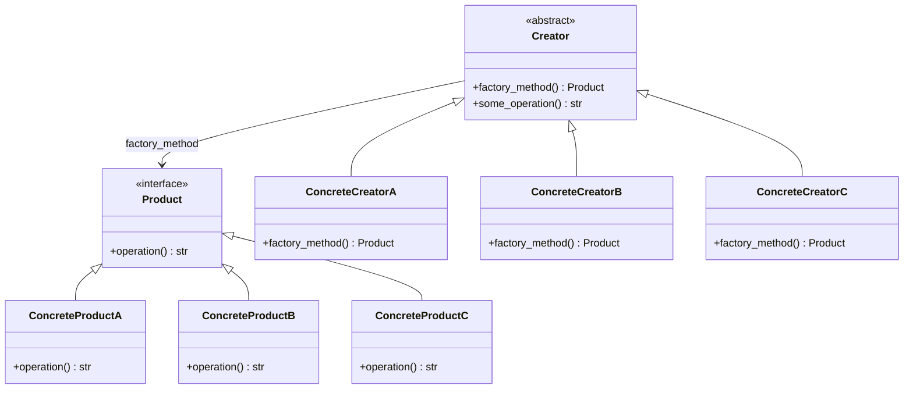

## 3.2.3 Extending Factories

In the world of software design, the Factory Method Pattern is a cornerstone for creating objects in a way that adheres to the Open/Closed Principle. This principle, one of the SOLID principles of object-oriented design, states that software entities should be open for extension but closed for modification. In this section, we will delve into how the Factory Method Pattern facilitates this principle by allowing developers to add new product types without altering existing code. We will explore practical examples, strategies for dynamic product registration, and discuss how this pattern aids in scaling applications. Additionally, we'll address potential challenges you might encounter when extending factories.

### Understanding the Open/Closed Principle

The Open/Closed Principle (OCP) is a fundamental concept in software design that encourages the extension of existing code without modifying it. This principle is crucial for maintaining code stability and reducing the risk of introducing bugs when adding new features. The Factory Method Pattern supports OCP by allowing new product types to be introduced through subclassing rather than altering existing code.

### Demonstrating the Factory Method Pattern

The Factory Method Pattern involves creating an interface for creating objects, but it allows subclasses to alter the type of objects that will be created. This pattern is particularly useful when a class cannot anticipate the class of objects it must create or when a class wants its subclasses to specify the objects it creates.

#### Basic Structure of the Factory Method Pattern

Before we dive into extending factories, let's revisit the basic structure of the Factory Method Pattern:

```python
from abc import ABC, abstractmethod

class Product(ABC):
    @abstractmethod
    def operation(self) -> str:
        pass

class ConcreteProductA(Product):
    def operation(self) -> str:
        return "Result of ConcreteProductA"

class ConcreteProductB(Product):
    def operation(self) -> str:
        return "Result of ConcreteProductB"

class Creator(ABC):
    @abstractmethod
    def factory_method(self) -> Product:
        pass

    def some_operation(self) -> str:
        product = self.factory_method()
        return f"Creator: The same creator's code has just worked with {product.operation()}"

class ConcreteCreatorA(Creator):
    def factory_method(self) -> Product:
        return ConcreteProductA()

class ConcreteCreatorB(Creator):
    def factory_method(self) -> Product:
        return ConcreteProductB()
```

In this example, `Creator` is an abstract class with a `factory_method` that returns a `Product`. `ConcreteCreatorA` and `ConcreteCreatorB` are subclasses that implement the `factory_method` to return instances of `ConcreteProductA` and `ConcreteProductB`, respectively.

### Extending the Product and Creator Classes

To extend factories, you can add new product types by creating new subclasses of the `Product` and `Creator` classes. This approach allows you to introduce new functionality without modifying existing code, thus adhering to the Open/Closed Principle.

#### Adding a New Product

Suppose we want to add a new product type, `ConcreteProductC`. We can do this by creating a new subclass of `Product`:

```python
class ConcreteProductC(Product):
    def operation(self) -> str:
        return "Result of ConcreteProductC"
```

#### Adding a New Creator

Next, we create a new creator class, `ConcreteCreatorC`, that will produce instances of `ConcreteProductC`:

```python
class ConcreteCreatorC(Creator):
    def factory_method(self) -> Product:
        return ConcreteProductC()
```

By adding these new classes, we have extended the factory to support a new product type without modifying any existing classes.

### Strategies for Registering New Products Dynamically

In some cases, you may want to register new products dynamically at runtime rather than statically defining them in the code. This approach is particularly useful in plugin architectures or systems that require high configurability.

#### Using a Registry

One strategy is to use a registry that maps product identifiers to product classes. This registry can be updated at runtime to include new products:

```python
class ProductRegistry:
    _registry = {}

    @classmethod
    def register_product(cls, product_id: str, product_cls: type):
        cls._registry[product_id] = product_cls

    @classmethod
    def create_product(cls, product_id: str) -> Product:
        if product_id not in cls._registry:
            raise ValueError(f"Product ID {product_id} not found in registry.")
        return cls._registry[product_id]()

ProductRegistry.register_product("A", ConcreteProductA)
ProductRegistry.register_product("B", ConcreteProductB)
ProductRegistry.register_product("C", ConcreteProductC)

product_a = ProductRegistry.create_product("A")
product_b = ProductRegistry.create_product("B")
product_c = ProductRegistry.create_product("C")
```

This registry allows you to add new products without modifying the factory method or existing product classes.

### Scaling Applications with the Factory Method Pattern

The Factory Method Pattern aids in scaling applications by providing a flexible and extensible architecture. As your application grows, you can introduce new product types and creators without disrupting existing functionality. This scalability is achieved through:

- **Modularity**: By encapsulating product creation logic within creator classes, you can manage complexity and maintain a clean separation of concerns.
- **Extensibility**: New product types can be added through subclassing, allowing your application to evolve without altering existing code.
- **Configurability**: Dynamic registration of products enables highly configurable systems that can adapt to changing requirements.

### Potential Challenges When Extending Factories

While the Factory Method Pattern offers numerous benefits, there are potential challenges to consider when extending factories:

- **Complexity**: As the number of product types and creators increases, the system can become complex to manage. It's important to maintain clear documentation and organization to mitigate this complexity.
- **Performance**: Dynamic registration and creation of products can introduce performance overhead, especially in systems with a large number of product types. Consider caching or optimizing product creation if performance becomes an issue.
- **Dependency Management**: Ensure that dependencies between products and creators are well-managed to avoid tight coupling and maintain flexibility.

### Visualizing the Factory Method Pattern

To better understand the relationship between products and creators, let's visualize the Factory Method Pattern using a class diagram:



This diagram illustrates how `ConcreteCreatorA`, `ConcreteCreatorB`, and `ConcreteCreatorC` implement the `factory_method` to produce instances of `ConcreteProductA`, `ConcreteProductB`, and `ConcreteProductC`, respectively.

### Try It Yourself

To solidify your understanding of extending factories, try the following exercises:

1. **Create a New Product and Creator**: Add a new product type, `ConcreteProductD`, and a corresponding creator, `ConcreteCreatorD`. Implement the necessary classes and test them using the existing framework.

2. **Dynamic Product Registration**: Modify the `ProductRegistry` to support unregistering products. Implement a method that removes a product from the registry and test it by unregistering a product and attempting to create it.

3. **Performance Optimization**: If your application involves creating a large number of products, consider implementing a caching mechanism within the `ProductRegistry` to improve performance. Measure the impact of caching on product creation time.

### Knowledge Check

- How does the Factory Method Pattern support the Open/Closed Principle?
- What are the benefits of using a registry for dynamic product registration?
- How can you manage complexity when extending factories with many product types?
- What strategies can be used to optimize performance in a factory-based system?

### Conclusion

Extending factories using the Factory Method Pattern is a powerful technique for building scalable and maintainable applications. By adhering to the Open/Closed Principle, you can introduce new product types without altering existing code, ensuring stability and reducing the risk of bugs. With strategies for dynamic product registration and considerations for scaling, you can design flexible systems that adapt to changing requirements. Remember, the journey of mastering design patterns is ongoing, and each step you take brings you closer to creating robust and efficient software.

## Quiz Time!



### How does the Factory Method Pattern support the Open/Closed Principle?

- [x] By allowing new product types to be added through subclassing without modifying existing code.
- [ ] By requiring all product types to be defined in a single class.
- [ ] By enforcing strict type checking at compile time.
- [ ] By using global variables to manage product instances.

> **Explanation:** The Factory Method Pattern supports the Open/Closed Principle by enabling new product types to be introduced through subclassing, thus extending functionality without modifying existing code.

### What is a key benefit of using a registry for dynamic product registration?

- [x] It allows products to be added or removed at runtime without changing the code.
- [ ] It ensures that all products are created at application startup.
- [ ] It eliminates the need for subclassing in the Factory Method Pattern.
- [ ] It automatically optimizes product creation for performance.

> **Explanation:** A registry allows products to be dynamically added or removed at runtime, providing flexibility and configurability without altering the existing codebase.

### Which of the following is a potential challenge when extending factories?

- [x] Managing complexity as the number of product types increases.
- [ ] Ensuring all products are created at application startup.
- [ ] Reducing the number of subclasses in the system.
- [ ] Enforcing compile-time type checking.

> **Explanation:** As the number of product types and creators grows, managing complexity becomes a challenge. Clear documentation and organization are essential to mitigate this complexity.

### How can performance be optimized in a factory-based system?

- [x] By implementing caching mechanisms for product creation.
- [ ] By using global variables to store product instances.
- [ ] By reducing the number of product types.
- [ ] By enforcing strict type checking at runtime.

> **Explanation:** Implementing caching mechanisms can optimize performance by reducing the overhead of repeatedly creating the same product instances.

### What is the role of the `factory_method` in the Factory Method Pattern?

- [x] It defines the interface for creating a product.
- [ ] It stores product instances globally.
- [ ] It enforces compile-time type checking.
- [ ] It manages the lifecycle of all product instances.

> **Explanation:** The `factory_method` defines the interface for creating a product, allowing subclasses to specify the exact type of product to be created.

### True or False: The Factory Method Pattern requires all product types to be defined in a single class.

- [ ] True
- [x] False

> **Explanation:** False. The Factory Method Pattern allows product types to be defined in separate subclasses, promoting modularity and adherence to the Open/Closed Principle.

### What is a strategy for managing complexity in a system with many product types?

- [x] Maintaining clear documentation and organization.
- [ ] Storing all product instances in a global variable.
- [ ] Reducing the number of product types.
- [ ] Enforcing compile-time type checking.

> **Explanation:** Maintaining clear documentation and organization is crucial for managing complexity in a system with many product types, ensuring that the system remains understandable and maintainable.

### How does dynamic product registration enhance system configurability?

- [x] By allowing products to be added or removed at runtime.
- [ ] By ensuring all products are created at application startup.
- [ ] By reducing the number of subclasses required.
- [ ] By enforcing compile-time type checking.

> **Explanation:** Dynamic product registration enhances configurability by allowing products to be added or removed at runtime, adapting to changing requirements without altering the codebase.

### What is a potential downside of dynamic product registration?

- [x] It can introduce performance overhead if not managed properly.
- [ ] It requires all products to be defined at application startup.
- [ ] It eliminates the need for subclassing in the Factory Method Pattern.
- [ ] It enforces strict type checking at runtime.

> **Explanation:** Dynamic product registration can introduce performance overhead if not managed properly, especially in systems with a large number of product types. Caching and optimization strategies may be necessary.

### True or False: The Factory Method Pattern can be used to enforce compile-time type checking.

- [ ] True
- [x] False

> **Explanation:** False. The Factory Method Pattern is not designed to enforce compile-time type checking. It focuses on providing a flexible and extensible way to create objects.


