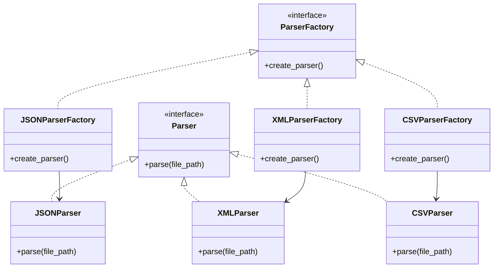

## 3.2.4 Use Cases and Examples

The Factory Method Pattern is a creational design pattern that provides a way to delegate the instantiation of objects to subclasses. This pattern is particularly useful when a class cannot anticipate the class of objects it must create or when a class wants its subclasses to specify the objects it creates. In this section, we will explore various real-world use cases where the Factory Method Pattern enhances flexibility and adaptability in software design.

### Real-World Use Cases

#### 1. Parsing Different File Formats

Imagine a scenario where you need to parse different file formats, such as JSON, XML, and CSV. Each format requires a different parsing strategy, and the Factory Method Pattern can be employed to handle this diversity efficiently.

**Why Factory Method?**

- **Flexibility**: The Factory Method allows you to define an interface for creating an object but lets subclasses alter the type of objects that will be created. This is ideal when dealing with multiple file formats.
- **Scalability**: As new file formats emerge, you can extend your application by adding new subclasses without modifying existing code.

**Code Example:**

```python
from abc import ABC, abstractmethod

class Parser(ABC):
    @abstractmethod
    def parse(self, file_path):
        pass

class JSONParser(Parser):
    def parse(self, file_path):
        print(f"Parsing JSON file: {file_path}")

class XMLParser(Parser):
    def parse(self, file_path):
        print(f"Parsing XML file: {file_path}")

class CSVParser(Parser):
    def parse(self, file_path):
        print(f"Parsing CSV file: {file_path}")

class ParserFactory(ABC):
    @abstractmethod
    def create_parser(self):
        pass

class JSONParserFactory(ParserFactory):
    def create_parser(self):
        return JSONParser()

class XMLParserFactory(ParserFactory):
    def create_parser(self):
        return XMLParser()

class CSVParserFactory(ParserFactory):
    def create_parser(self):
        return CSVParser()

def parse_file(factory: ParserFactory, file_path: str):
    parser = factory.create_parser()
    parser.parse(file_path)

parse_file(JSONParserFactory(), "data.json")
parse_file(XMLParserFactory(), "data.xml")
parse_file(CSVParserFactory(), "data.csv")
```

**Try It Yourself**: Modify the code to add support for a new file format, such as YAML. Create a `YAMLParser` class and a corresponding `YAMLParserFactory`.

#### 2. Creating GUI Components

In GUI applications, different components such as buttons, text fields, and checkboxes may need to be created dynamically based on user interactions or configuration files. The Factory Method Pattern is well-suited for this task.

**Why Factory Method?**

- **Decoupling**: It decouples the client code from the concrete classes of GUI components, allowing for more flexible and maintainable code.
- **Extensibility**: New GUI components can be added without altering the existing client code.

**Code Example:**

```python
from abc import ABC, abstractmethod

class GUIComponent(ABC):
    @abstractmethod
    def render(self):
        pass

class Button(GUIComponent):
    def render(self):
        print("Rendering a button")

class TextField(GUIComponent):
    def render(self):
        print("Rendering a text field")

class Checkbox(GUIComponent):
    def render(self):
        print("Rendering a checkbox")

class GUIFactory(ABC):
    @abstractmethod
    def create_component(self):
        pass

class ButtonFactory(GUIFactory):
    def create_component(self):
        return Button()

class TextFieldFactory(GUIFactory):
    def create_component(self):
        return TextField()

class CheckboxFactory(GUIFactory):
    def create_component(self):
        return Checkbox()

def render_component(factory: GUIFactory):
    component = factory.create_component()
    component.render()

render_component(ButtonFactory())
render_component(TextFieldFactory())
render_component(CheckboxFactory())
```

**Try It Yourself**: Extend the example by adding a new component, such as a slider, and implement the corresponding factory class.

### Alternative Approaches

While the Factory Method Pattern is powerful, it's essential to consider alternative approaches and understand when it might be preferred.

#### Alternative: Simple Factory

A Simple Factory is a less formalized version of the Factory Method Pattern, where a single factory class is responsible for creating instances of different classes. It is suitable for simpler scenarios but lacks the flexibility and extensibility of the Factory Method Pattern.

**When to Use Factory Method Over Simple Factory:**

- **Complexity**: When the object creation process is complex and involves multiple steps or configurations.
- **Extensibility**: When you anticipate frequent changes or additions to the types of objects being created.
- **Inheritance**: When you want to leverage polymorphism to allow subclasses to determine the object types.

### Encouragement for Readers

As we have seen, the Factory Method Pattern provides a robust framework for creating objects in a flexible and scalable manner. Consider applying this pattern in your projects where object creation needs to be decoupled from the client code, and where you anticipate the need for future extensions or modifications.

### Visualizing the Factory Method Pattern

To better understand the Factory Method Pattern, let's visualize the relationship between the components using a class diagram.



**Diagram Description**: The diagram illustrates the Factory Method Pattern with `Parser` as the abstract product and `ParserFactory` as the abstract creator. Concrete products (`JSONParser`, `XMLParser`, `CSVParser`) and concrete creators (`JSONParserFactory`, `XMLParserFactory`, `CSVParserFactory`) are shown, highlighting the relationships and dependencies.

### Knowledge Check

Let's reinforce our understanding with a few questions:

1. What is the primary purpose of the Factory Method Pattern?
2. How does the Factory Method Pattern enhance flexibility in software design?
3. What are some real-world scenarios where the Factory Method Pattern can be applied?
4. How does the Factory Method Pattern differ from a Simple Factory?
5. What are the benefits of using the Factory Method Pattern in GUI applications?

### Summary

In this section, we explored the Factory Method Pattern and its application in real-world scenarios such as parsing different file formats and creating GUI components. We discussed the advantages of using this pattern, including flexibility, scalability, and decoupling of client code from concrete classes. We also considered alternative approaches and encouraged readers to apply the pattern in their projects where appropriate.

### Embrace the Journey

Remember, this is just the beginning. As you progress, you'll discover more opportunities to apply design patterns in your projects, enhancing your code's maintainability and scalability. Keep experimenting, stay curious, and enjoy the journey!

## Quiz Time!



### What is the primary benefit of using the Factory Method Pattern?

- [x] It allows subclasses to determine the object types.
- [ ] It simplifies the code by eliminating the need for classes.
- [ ] It ensures that objects are created in a single step.
- [ ] It provides a global point of access to objects.

> **Explanation:** The Factory Method Pattern allows subclasses to determine the object types, providing flexibility and extensibility.

### Which of the following scenarios is ideal for the Factory Method Pattern?

- [x] Parsing different file formats.
- [ ] Managing a single database connection.
- [ ] Implementing a simple calculator.
- [ ] Creating a singleton instance.

> **Explanation:** The Factory Method Pattern is ideal for scenarios where different object types need to be created, such as parsing different file formats.

### How does the Factory Method Pattern enhance flexibility?

- [x] By decoupling the client code from the concrete classes.
- [ ] By reducing the number of classes in the application.
- [ ] By enforcing a single object creation method.
- [ ] By providing a fixed set of object types.

> **Explanation:** The Factory Method Pattern enhances flexibility by decoupling the client code from the concrete classes, allowing for easy extension and modification.

### What is a key difference between the Factory Method Pattern and a Simple Factory?

- [x] The Factory Method Pattern allows for subclassing to determine object types.
- [ ] The Simple Factory Pattern requires inheritance.
- [ ] The Factory Method Pattern uses a single factory class.
- [ ] The Simple Factory Pattern is more flexible.

> **Explanation:** The Factory Method Pattern allows for subclassing to determine object types, whereas a Simple Factory uses a single factory class.

### In GUI applications, why is the Factory Method Pattern beneficial?

- [x] It allows for the dynamic creation of components.
- [ ] It reduces the need for user interaction.
- [ ] It simplifies the rendering process.
- [ ] It eliminates the need for event handling.

> **Explanation:** The Factory Method Pattern is beneficial in GUI applications because it allows for the dynamic creation of components, enhancing flexibility and maintainability.

### What is an alternative approach to the Factory Method Pattern for simple scenarios?

- [x] Simple Factory
- [ ] Singleton Pattern
- [ ] Observer Pattern
- [ ] Strategy Pattern

> **Explanation:** For simple scenarios, a Simple Factory can be used as an alternative to the Factory Method Pattern.

### How does the Factory Method Pattern support scalability?

- [x] By allowing new subclasses to be added without modifying existing code.
- [ ] By reducing the number of classes needed.
- [ ] By enforcing a single object creation method.
- [ ] By providing a fixed set of object types.

> **Explanation:** The Factory Method Pattern supports scalability by allowing new subclasses to be added without modifying existing code, making it easy to extend the application.

### What is a potential drawback of the Factory Method Pattern?

- [x] It can lead to a proliferation of classes.
- [ ] It simplifies the code too much.
- [ ] It restricts the types of objects that can be created.
- [ ] It makes the code less flexible.

> **Explanation:** A potential drawback of the Factory Method Pattern is that it can lead to a proliferation of classes, as each new type requires a new subclass.

### Why might you choose the Factory Method Pattern over directly instantiating objects?

- [x] To allow for future extensions and modifications.
- [ ] To reduce the number of lines of code.
- [ ] To enforce a single creation method.
- [ ] To simplify the object model.

> **Explanation:** You might choose the Factory Method Pattern over directly instantiating objects to allow for future extensions and modifications, enhancing flexibility and maintainability.

### True or False: The Factory Method Pattern is only suitable for large applications.

- [ ] True
- [x] False

> **Explanation:** False. The Factory Method Pattern can be applied in both small and large applications where flexibility and scalability are needed.


