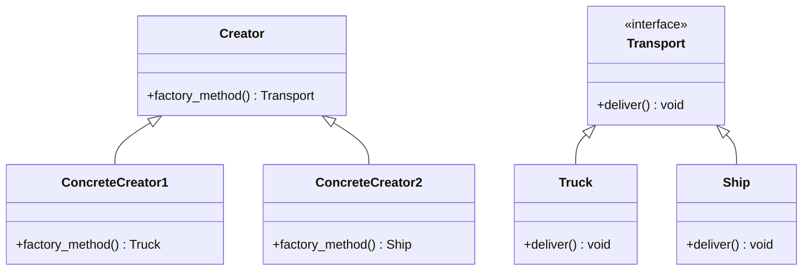
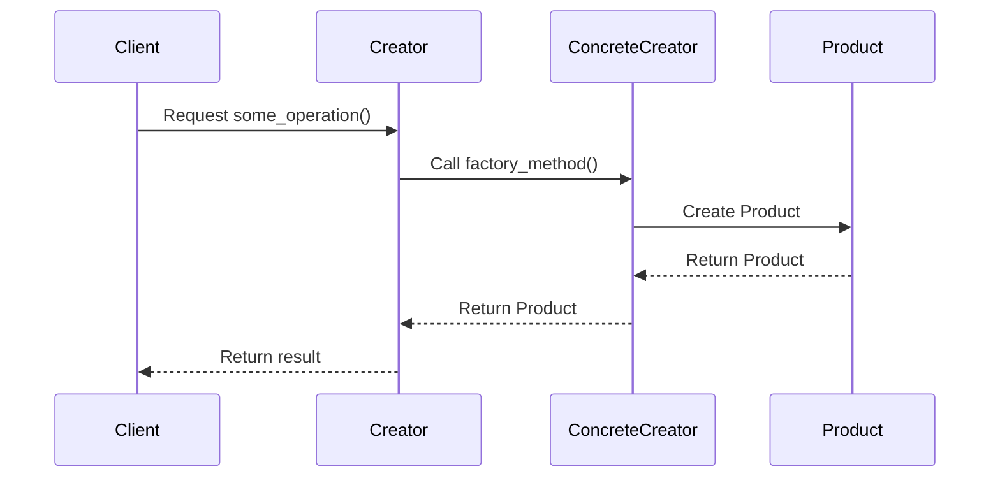

## 3.2 Factory Method Pattern

### Introduction

The Factory Method Pattern is a creational design pattern that provides an interface for creating objects in a superclass, but allows subclasses to alter the type of objects that will be created. This pattern is particularly useful when a class cannot anticipate the class of objects it must create or when a class wants its subclasses to specify the objects it creates.

### Intent and Motivation

The primary intent of the Factory Method Pattern is to define an interface for creating an object, but let subclasses decide which class to instantiate. This pattern promotes loose coupling by eliminating the need for a class to instantiate objects directly. Instead, it delegates the responsibility of object creation to subclasses.

#### Motivation

Consider a scenario where you are developing a logistics application that needs to handle different types of transport methods, such as trucks, ships, and planes. Each transport method has its own way of delivering goods. Using the Factory Method Pattern, you can create a base class `Transport` with a method `create_transport()`, and then let the subclasses `Truck`, `Ship`, and `Plane` implement the specific transport creation logic.

### UML Diagram

To better understand the Factory Method Pattern, let's visualize it using a UML diagram adapted for Python:



In this diagram:
- `Creator` is an abstract class that declares the factory method `factory_method()`.
- `ConcreteCreator1` and `ConcreteCreator2` are subclasses that implement the factory method to create specific products (`Truck` and `Ship`).
- `Transport` is an interface for the products created by the factory method.

### Code Examples

Let's dive into Python code to see how the Factory Method Pattern can be implemented.

#### Base Creator Class

```python
from abc import ABC, abstractmethod

class Transport(ABC):
    @abstractmethod
    def deliver(self):
        pass

class Creator(ABC):
    @abstractmethod
    def factory_method(self) -> Transport:
        pass

    def some_operation(self) -> str:
        # Call the factory method to create a Transport object
        transport = self.factory_method()
        # Now, use the transport
        result = f"Creator: The same creator's code has just worked with {transport.deliver()}"
        return result
```

#### Concrete Implementations

```python
class Truck(Transport):
    def deliver(self) -> str:
        return "Delivering by land in a box."

class Ship(Transport):
    def deliver(self) -> str:
        return "Delivering by sea in a container."

class TruckCreator(Creator):
    def factory_method(self) -> Transport:
        return Truck()

class ShipCreator(Creator):
    def factory_method(self) -> Transport:
        return Ship()
```

#### Client Code

```python
def client_code(creator: Creator) -> None:
    print(f"Client: I'm not aware of the creator's class, but it still works.\n"
          f"{creator.some_operation()}", end="")

if __name__ == "__main__":
    print("App: Launched with the TruckCreator.")
    client_code(TruckCreator())
    print("\n")

    print("App: Launched with the ShipCreator.")
    client_code(ShipCreator())
```

### Promoting Extensibility and Loose Coupling

The Factory Method Pattern promotes extensibility by allowing new product types to be introduced without modifying existing code. This is achieved by adding new subclasses that implement the factory method. This pattern also promotes loose coupling by decoupling the client code from the concrete classes it uses. Instead of instantiating objects directly, the client code relies on the factory method to create objects.

### Factory Method vs. Abstract Factory

While both the Factory Method and Abstract Factory patterns deal with object creation, they serve different purposes:

- **Factory Method**: Focuses on creating a single product. It defines an interface for creating an object, but lets subclasses decide which class to instantiate.
- **Abstract Factory**: Focuses on creating families of related or dependent objects. It provides an interface for creating families of related objects without specifying their concrete classes.

### Using the Pattern in Python's Dynamic Typing Context

Python's dynamic typing and powerful reflection capabilities make implementing the Factory Method Pattern straightforward. The pattern can leverage Python's `abc` module to define abstract base classes and abstract methods, ensuring that subclasses provide concrete implementations.

#### Dynamic Typing Example

```python
class Transport:
    def deliver(self):
        raise NotImplementedError("Subclasses must implement this method.")

class Truck(Transport):
    def deliver(self):
        return "Delivering by land in a box."

class Ship(Transport):
    def deliver(self):
        return "Delivering by sea in a container."

def create_transport(transport_type: str) -> Transport:
    if transport_type == "truck":
        return Truck()
    elif transport_type == "ship":
        return Ship()
    else:
        raise ValueError(f"Unknown transport type: {transport_type}")

transport = create_transport("truck")
print(transport.deliver())
```

### Try It Yourself

To better understand the Factory Method Pattern, try modifying the code examples:

1. **Add a New Transport Type**: Implement a new transport type, such as `Plane`, and create a corresponding `PlaneCreator`.
2. **Modify the Client Code**: Change the client code to use your new transport type.
3. **Experiment with Error Handling**: Add error handling to manage unknown transport types gracefully.

### Visualizing the Factory Method Pattern in Action

Let's create a sequence diagram to visualize the interaction between the client and the factory method:



### Knowledge Check

- **What is the primary intent of the Factory Method Pattern?**
- **How does the Factory Method Pattern promote loose coupling?**
- **What is the difference between the Factory Method and Abstract Factory patterns?**
- **How does Python's dynamic typing influence the implementation of the Factory Method Pattern?**

### Summary

The Factory Method Pattern is a powerful tool for creating objects in a flexible and extensible manner. By delegating the responsibility of object creation to subclasses, it promotes loose coupling and enhances the maintainability of your code. Understanding and implementing this pattern in Python can significantly improve your software design skills.

Remember, this is just the beginning. As you progress, you'll build more complex and interactive systems using design patterns. Keep experimenting, stay curious, and enjoy the journey!

## Quiz Time!



### What is the primary intent of the Factory Method Pattern?

- [x] To define an interface for creating objects, but let subclasses decide which class to instantiate.
- [ ] To create families of related or dependent objects.
- [ ] To provide a simplified interface to a complex subsystem.
- [ ] To compose objects into tree structures to represent part-whole hierarchies.

> **Explanation:** The Factory Method Pattern focuses on defining an interface for creating objects, allowing subclasses to determine the specific class to instantiate.

### How does the Factory Method Pattern promote loose coupling?

- [x] By decoupling the client code from concrete classes.
- [ ] By composing objects into tree structures.
- [ ] By providing a simplified interface to a complex subsystem.
- [ ] By encapsulating a request as an object.

> **Explanation:** The Factory Method Pattern promotes loose coupling by allowing the client code to rely on an abstract interface rather than concrete classes, thus reducing dependencies.

### What is the difference between the Factory Method and Abstract Factory patterns?

- [x] Factory Method focuses on creating a single product, while Abstract Factory creates families of related objects.
- [ ] Factory Method provides a simplified interface, while Abstract Factory composes objects.
- [ ] Factory Method encapsulates a request, while Abstract Factory defines a grammar.
- [ ] Factory Method uses a chain of handlers, while Abstract Factory uses a mediator.

> **Explanation:** The Factory Method Pattern is concerned with creating a single product, whereas the Abstract Factory Pattern deals with creating families of related or dependent objects.

### How does Python's dynamic typing influence the implementation of the Factory Method Pattern?

- [x] It allows for flexible and straightforward implementations using abstract base classes.
- [ ] It requires strict type checking and validation.
- [ ] It limits the use of abstract base classes.
- [ ] It enforces static type declarations.

> **Explanation:** Python's dynamic typing allows for flexible implementations of the Factory Method Pattern, often using abstract base classes to define interfaces.

### Which of the following is a benefit of using the Factory Method Pattern?

- [x] Promotes code reusability and extensibility.
- [ ] Simplifies the user interface.
- [ ] Reduces memory usage.
- [ ] Increases execution speed.

> **Explanation:** The Factory Method Pattern promotes code reusability and extensibility by allowing new product types to be introduced without modifying existing code.

### In the Factory Method Pattern, who decides which class to instantiate?

- [x] Subclasses
- [ ] The client code
- [ ] The base class
- [ ] The product class

> **Explanation:** In the Factory Method Pattern, subclasses decide which class to instantiate by implementing the factory method.

### What is a common use case for the Factory Method Pattern?

- [x] When a class cannot anticipate the class of objects it must create.
- [ ] When a system needs to support multiple user interfaces.
- [ ] When an application requires high-performance computations.
- [ ] When a system needs to handle large amounts of data.

> **Explanation:** The Factory Method Pattern is commonly used when a class cannot anticipate the class of objects it must create, allowing subclasses to specify the objects.

### Which Python module is often used to implement abstract base classes in the Factory Method Pattern?

- [x] `abc`
- [ ] `os`
- [ ] `sys`
- [ ] `collections`

> **Explanation:** The `abc` module in Python is commonly used to implement abstract base classes, which are essential for defining interfaces in the Factory Method Pattern.

### What is the role of the `factory_method()` in the Factory Method Pattern?

- [x] To create and return an instance of a product.
- [ ] To simplify complex subsystems.
- [ ] To encapsulate a request as an object.
- [ ] To provide a simplified interface.

> **Explanation:** The `factory_method()` in the Factory Method Pattern is responsible for creating and returning an instance of a product, allowing subclasses to specify the product type.

### True or False: The Factory Method Pattern can only be used in statically typed languages.

- [ ] True
- [x] False

> **Explanation:** False. The Factory Method Pattern can be used in both statically and dynamically typed languages, including Python, where dynamic typing allows for flexible implementations.


