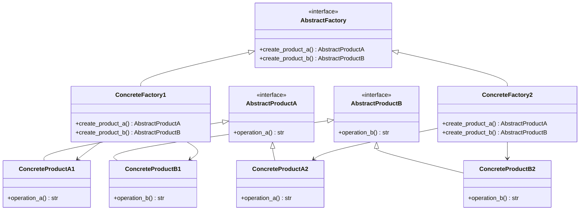

## 3.3.1 Implementing Abstract Factory in Python

The Abstract Factory Pattern is a creational design pattern that provides an interface for creating families of related or dependent objects without specifying their concrete classes. This pattern is particularly useful when a system needs to be independent of how its objects are created, composed, and represented. In this section, we will walk through the implementation of the Abstract Factory Pattern in Python, showcasing how to define abstract interfaces for factories and products, create multiple concrete factories, and interact with the abstract factory.

### Understanding the Abstract Factory Pattern

Before diving into the implementation, let's understand the core concept of the Abstract Factory Pattern. The pattern involves the following key components:

1. **Abstract Factory**: Declares an interface for creating abstract product objects.
2. **Concrete Factory**: Implements the operations to create concrete product objects.
3. **Abstract Product**: Declares an interface for a type of product object.
4. **Concrete Product**: Defines a product object to be created by the corresponding concrete factory.
5. **Client**: Uses only the interfaces declared by the abstract factory and abstract products.

The Abstract Factory Pattern is beneficial when a system needs to be configured with one of multiple families of products. It promotes consistency among products and enhances flexibility by allowing the interchange of product families without altering the client code.

### Defining Abstract Interfaces for Factories and Products

In Python, we can define abstract interfaces using abstract base classes (ABCs) from the `abc` module. This module provides tools for defining abstract classes and methods, ensuring that derived classes implement the required methods.

Let's start by defining the abstract interfaces for our factories and products.

```python
from abc import ABC, abstractmethod

class AbstractProductA(ABC):
    @abstractmethod
    def operation_a(self) -> str:
        pass

class AbstractProductB(ABC):
    @abstractmethod
    def operation_b(self) -> str:
        pass

class AbstractFactory(ABC):
    @abstractmethod
    def create_product_a(self) -> AbstractProductA:
        pass

    @abstractmethod
    def create_product_b(self) -> AbstractProductB:
        pass
```

In this code, we define two abstract product interfaces, `AbstractProductA` and `AbstractProductB`, each with a single abstract method. The `AbstractFactory` interface declares methods for creating these products.

### Creating Concrete Factories and Products

With the abstract interfaces in place, we can now create concrete implementations for the factories and products. Each concrete factory will implement the methods to create specific products.

```python
class ConcreteProductA1(AbstractProductA):
    def operation_a(self) -> str:
        return "Result of ConcreteProductA1"

class ConcreteProductB1(AbstractProductB):
    def operation_b(self) -> str:
        return "Result of ConcreteProductB1"

class ConcreteFactory1(AbstractFactory):
    def create_product_a(self) -> AbstractProductA:
        return ConcreteProductA1()

    def create_product_b(self) -> AbstractProductB:
        return ConcreteProductB1()

class ConcreteProductA2(AbstractProductA):
    def operation_a(self) -> str:
        return "Result of ConcreteProductA2"

class ConcreteProductB2(AbstractProductB):
    def operation_b(self) -> str:
        return "Result of ConcreteProductB2"

class ConcreteFactory2(AbstractFactory):
    def create_product_a(self) -> AbstractProductA:
        return ConcreteProductA2()

    def create_product_b(self) -> AbstractProductB:
        return ConcreteProductB2()
```

Here, we define two concrete factories, `ConcreteFactory1` and `ConcreteFactory2`, each producing different versions of products `A` and `B`. The concrete products, `ConcreteProductA1`, `ConcreteProductB1`, `ConcreteProductA2`, and `ConcreteProductB2`, implement the operations defined in their respective abstract interfaces.

### Client Interaction with the Abstract Factory

The client interacts with the abstract factory to create products. The client code is decoupled from the concrete classes, relying solely on the interfaces provided by the abstract factory and products.

```python
def client_code(factory: AbstractFactory) -> None:
    product_a = factory.create_product_a()
    product_b = factory.create_product_b()

    print(product_a.operation_a())
    print(product_b.operation_b())

print("Client: Testing client code with the first factory type:")
client_code(ConcreteFactory1())

print("\nClient: Testing the same client code with the second factory type:")
client_code(ConcreteFactory2())
```

In this example, the `client_code` function takes an `AbstractFactory` as an argument and uses it to create products `A` and `B`. The client code is flexible and can work with any concrete factory, allowing for easy interchangeability of product families.

### Python Features Facilitating the Pattern

Python's dynamic typing and support for abstract base classes make it an ideal language for implementing the Abstract Factory Pattern. The `abc` module allows us to define abstract interfaces and enforce method implementation in derived classes. Additionally, Python's duck typing enables us to focus on the behavior of objects rather than their specific types, further enhancing flexibility.

### Visualizing the Abstract Factory Pattern

To better understand the relationships between the components of the Abstract Factory Pattern, let's visualize it using a class diagram.



This diagram illustrates the hierarchy and relationships between the abstract and concrete components of the Abstract Factory Pattern.

### Try It Yourself

To deepen your understanding of the Abstract Factory Pattern, try modifying the code examples:

- **Add a new product type**: Introduce a new abstract product interface and implement concrete products and factories for it.
- **Experiment with different product combinations**: Modify the concrete factories to produce different combinations of products.
- **Integrate with a real-world scenario**: Apply the Abstract Factory Pattern to a real-world problem, such as creating UI components for different platforms.

### Knowledge Check

To reinforce your understanding, consider the following questions:

- What are the key components of the Abstract Factory Pattern?
- How does the Abstract Factory Pattern promote consistency among products?
- Why is the client code decoupled from concrete classes in this pattern?

### Summary

In this section, we explored the Abstract Factory Pattern in Python, learning how to define abstract interfaces for factories and products, create concrete factories, and interact with the abstract factory. We also highlighted Python features that facilitate the pattern and provided a visual representation to enhance understanding. Remember, the Abstract Factory Pattern is a powerful tool for creating families of related products while maintaining flexibility and consistency.

## Quiz Time!



### What is the primary purpose of the Abstract Factory Pattern?

- [x] To provide an interface for creating families of related or dependent objects without specifying their concrete classes.
- [ ] To create a single instance of a class.
- [ ] To define a one-to-many dependency between objects.
- [ ] To encapsulate a request as an object.

> **Explanation:** The Abstract Factory Pattern provides an interface for creating families of related or dependent objects without specifying their concrete classes, allowing for flexibility and consistency.

### Which module in Python is used to define abstract base classes?

- [x] `abc`
- [ ] `os`
- [ ] `sys`
- [ ] `collections`

> **Explanation:** The `abc` module in Python is used to define abstract base classes and enforce method implementation in derived classes.

### What is the role of the client in the Abstract Factory Pattern?

- [x] To interact with the abstract factory and create products.
- [ ] To implement concrete products.
- [ ] To define abstract interfaces for products.
- [ ] To enforce method implementation in derived classes.

> **Explanation:** The client interacts with the abstract factory to create products, relying solely on the interfaces provided by the abstract factory and products.

### How does the Abstract Factory Pattern enhance flexibility?

- [x] By allowing the interchange of product families without altering the client code.
- [ ] By creating a single instance of a class.
- [ ] By defining a one-to-many dependency between objects.
- [ ] By encapsulating a request as an object.

> **Explanation:** The Abstract Factory Pattern enhances flexibility by allowing the interchange of product families without altering the client code, promoting consistency among products.

### What is the benefit of using abstract base classes in Python?

- [x] They allow for defining abstract interfaces and enforcing method implementation in derived classes.
- [ ] They provide a way to create a single instance of a class.
- [ ] They define a one-to-many dependency between objects.
- [ ] They encapsulate a request as an object.

> **Explanation:** Abstract base classes in Python allow for defining abstract interfaces and enforcing method implementation in derived classes, ensuring consistency and flexibility.

### In the Abstract Factory Pattern, what does a concrete factory do?

- [x] Implements the operations to create concrete product objects.
- [ ] Provides an interface for creating abstract product objects.
- [ ] Declares an interface for a type of product object.
- [ ] Uses only the interfaces declared by the abstract factory and abstract products.

> **Explanation:** A concrete factory implements the operations to create concrete product objects, providing specific implementations for the abstract product interfaces.

### How does the Abstract Factory Pattern promote consistency among products?

- [x] By ensuring that products created by a factory are compatible with each other.
- [ ] By creating a single instance of a class.
- [ ] By defining a one-to-many dependency between objects.
- [ ] By encapsulating a request as an object.

> **Explanation:** The Abstract Factory Pattern promotes consistency among products by ensuring that products created by a factory are compatible with each other, maintaining a cohesive product family.

### What is the advantage of using Python's dynamic typing in the Abstract Factory Pattern?

- [x] It allows us to focus on the behavior of objects rather than their specific types.
- [ ] It provides a way to create a single instance of a class.
- [ ] It defines a one-to-many dependency between objects.
- [ ] It encapsulates a request as an object.

> **Explanation:** Python's dynamic typing allows us to focus on the behavior of objects rather than their specific types, enhancing flexibility and reducing coupling.

### Which of the following is a key component of the Abstract Factory Pattern?

- [x] Abstract Factory
- [ ] Singleton
- [ ] Observer
- [ ] Command

> **Explanation:** The Abstract Factory is a key component of the Abstract Factory Pattern, providing an interface for creating abstract product objects.

### True or False: The Abstract Factory Pattern is useful when a system needs to be configured with one of multiple families of products.

- [x] True
- [ ] False

> **Explanation:** True. The Abstract Factory Pattern is useful when a system needs to be configured with one of multiple families of products, allowing for flexibility and consistency.



Remember, this is just the beginning. As you progress, you'll build more complex and interactive systems using the Abstract Factory Pattern. Keep experimenting, stay curious, and enjoy the journey!
