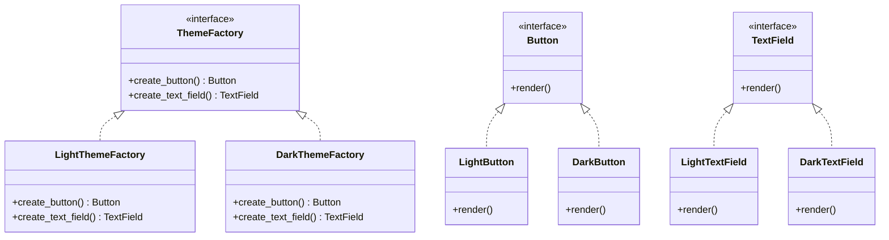

## 3.3.2 Dealing with Multiple Families of Products

In the realm of software design, the need to manage multiple families of products often arises, especially in scenarios like theme systems or cross-platform applications. The Abstract Factory Pattern is a creational design pattern that provides an interface for creating families of related or dependent objects without specifying their concrete classes. This pattern is particularly useful when dealing with multiple product families, as it allows for the creation of objects that belong to different families interchangeably.

### Understanding the Need for Multiple Product Families

Before diving into the Abstract Factory Pattern, let's explore scenarios where managing multiple product families is essential:

1. **Theme Systems**: Consider a user interface framework that supports different themes, such as light and dark modes. Each theme represents a family of products, including buttons, text fields, and menus, all styled differently.

2. **Cross-Platform Applications**: Applications that run on multiple platforms (e.g., Windows, macOS, Linux) often require different implementations for UI components or system interactions. Each platform can be seen as a separate product family.

3. **Game Development**: In games, different levels or worlds might have distinct sets of rules and graphics, requiring different families of game objects.

4. **Internationalization**: Applications that support multiple languages may need different sets of resources or UI components for each language.

### The Role of the Abstract Factory Pattern

The Abstract Factory Pattern simplifies the process of switching between product families by providing a consistent interface for creating objects. This pattern ensures that the client code remains agnostic of the specific classes it instantiates, focusing instead on the interfaces provided by the abstract factory.

#### Key Components of the Abstract Factory Pattern

1. **Abstract Factory Interface**: Declares a set of methods for creating abstract product objects.

2. **Concrete Factories**: Implement the abstract factory interface to create concrete product objects that belong to a specific family.

3. **Abstract Products**: Declare interfaces for a set of related products.

4. **Concrete Products**: Implement the abstract product interfaces, representing products created by the concrete factories.

5. **Client**: Uses the abstract factory to create product objects. The client interacts with products solely through their abstract interfaces.

### Implementing the Abstract Factory Pattern in Python

Let's implement a simple example of the Abstract Factory Pattern in Python, focusing on a theme system with two themes: Light and Dark.

```python
from abc import ABC, abstractmethod

class Button(ABC):
    @abstractmethod
    def render(self):
        pass

class TextField(ABC):
    @abstractmethod
    def render(self):
        pass

class LightButton(Button):
    def render(self):
        return "Rendering a light-themed button"

class LightTextField(TextField):
    def render(self):
        return "Rendering a light-themed text field"

class DarkButton(Button):
    def render(self):
        return "Rendering a dark-themed button"

class DarkTextField(TextField):
    def render(self):
        return "Rendering a dark-themed text field"

class ThemeFactory(ABC):
    @abstractmethod
    def create_button(self) -> Button:
        pass

    @abstractmethod
    def create_text_field(self) -> TextField:
        pass

class LightThemeFactory(ThemeFactory):
    def create_button(self) -> Button:
        return LightButton()

    def create_text_field(self) -> TextField:
        return LightTextField()

class DarkThemeFactory(ThemeFactory):
    def create_button(self) -> Button:
        return DarkButton()

    def create_text_field(self) -> TextField:
        return DarkTextField()

def render_ui(factory: ThemeFactory):
    button = factory.create_button()
    text_field = factory.create_text_field()
    print(button.render())
    print(text_field.render())

light_factory = LightThemeFactory()
dark_factory = DarkThemeFactory()

print("Light Theme UI:")
render_ui(light_factory)

print("\nDark Theme UI:")
render_ui(dark_factory)
```

### Explanation of the Code

- **Abstract Products**: `Button` and `TextField` are abstract classes that define the interface for their respective products.
- **Concrete Products**: `LightButton`, `LightTextField`, `DarkButton`, and `DarkTextField` are concrete implementations of the abstract products.
- **Abstract Factory**: `ThemeFactory` declares methods for creating abstract products.
- **Concrete Factories**: `LightThemeFactory` and `DarkThemeFactory` implement the `ThemeFactory` interface to create products for the light and dark themes, respectively.
- **Client Code**: The `render_ui` function uses a `ThemeFactory` to create and render UI components. The client code is decoupled from the concrete product classes, allowing for easy switching between themes.

### Benefits of Using the Abstract Factory Pattern

1. **Consistency Across Product Families**: By enforcing a consistent interface across product families, the Abstract Factory Pattern ensures that all products within a family are compatible with each other.

2. **Ease of Switching Product Families**: The client code can switch between different product families by simply changing the factory it uses, without altering the code that uses the products.

3. **Scalability**: New product families can be added by introducing new concrete factories and products, without affecting existing code.

4. **Decoupling**: The pattern decouples the client code from the concrete classes, promoting flexibility and maintainability.

### Addressing Scalability Issues

While the Abstract Factory Pattern offers numerous benefits, it can also introduce scalability challenges, particularly as the number of product families and products grows. Here are some strategies to mitigate these issues:

1. **Modular Design**: Organize your codebase into modules or packages, with each module representing a product family. This approach helps manage complexity and facilitates the addition of new families.

2. **Automated Testing**: Implement automated tests to ensure that new product families integrate seamlessly with existing ones. Testing helps catch compatibility issues early in the development process.

3. **Documentation**: Maintain comprehensive documentation of the interfaces and expected behaviors of each product family. Clear documentation aids developers in understanding the system and making informed decisions when extending it.

4. **Design Patterns**: Consider combining the Abstract Factory Pattern with other design patterns, such as the Factory Method Pattern, to further enhance flexibility and scalability.

### Visualizing the Abstract Factory Pattern

To better understand the relationships between the components of the Abstract Factory Pattern, let's visualize them using a class diagram.



### Try It Yourself

To deepen your understanding of the Abstract Factory Pattern, try modifying the example code:

1. **Add a New Theme**: Implement a new theme, such as a "Colorful" theme, by creating new concrete products and a corresponding factory.

2. **Extend Product Families**: Introduce a new product type, such as a `Menu`, and update the factories to support this new product.

3. **Refactor for Scalability**: Experiment with organizing the code into separate modules for each theme, and observe how this affects the maintainability of the codebase.

### Knowledge Check

- What are some scenarios where managing multiple product families is necessary?
- How does the Abstract Factory Pattern facilitate switching between product families?
- What are the key components of the Abstract Factory Pattern?
- How can scalability issues be addressed when using the Abstract Factory Pattern?

### Embrace the Journey

Remember, mastering design patterns is a journey. As you continue to explore and experiment with the Abstract Factory Pattern, you'll gain valuable insights into creating flexible and maintainable software architectures. Keep experimenting, stay curious, and enjoy the journey!

## Quiz Time!



### What is the primary purpose of the Abstract Factory Pattern?

- [x] To provide an interface for creating families of related objects without specifying their concrete classes.
- [ ] To create a single instance of a class.
- [ ] To provide a way to access elements of a collection sequentially.
- [ ] To define a skeleton of an algorithm.

> **Explanation:** The Abstract Factory Pattern provides an interface for creating families of related or dependent objects without specifying their concrete classes.

### In the context of the Abstract Factory Pattern, what is a "product family"?

- [x] A set of related or dependent objects that are designed to work together.
- [ ] A single object created by a factory.
- [ ] A collection of unrelated objects.
- [ ] A group of factories that produce the same type of object.

> **Explanation:** A product family is a set of related or dependent objects that are designed to work together within the Abstract Factory Pattern.

### Which of the following is NOT a component of the Abstract Factory Pattern?

- [ ] Abstract Factory
- [ ] Concrete Factory
- [x] Singleton
- [ ] Abstract Product

> **Explanation:** The Singleton is not a component of the Abstract Factory Pattern. The pattern includes Abstract Factory, Concrete Factory, Abstract Product, and Concrete Product.

### How does the Abstract Factory Pattern promote scalability?

- [x] By allowing new product families to be added without affecting existing code.
- [ ] By reducing the number of classes needed.
- [ ] By eliminating the need for interfaces.
- [ ] By ensuring that only one instance of a class is created.

> **Explanation:** The Abstract Factory Pattern promotes scalability by allowing new product families to be added without affecting existing code, thanks to its use of interfaces and abstract classes.

### What is a potential downside of using the Abstract Factory Pattern?

- [x] It can introduce complexity as the number of product families grows.
- [ ] It makes it difficult to switch between product families.
- [ ] It tightly couples the client code to concrete classes.
- [ ] It does not support the creation of multiple objects.

> **Explanation:** A potential downside of using the Abstract Factory Pattern is that it can introduce complexity as the number of product families grows, requiring careful management and organization.

### Which design pattern can be combined with the Abstract Factory Pattern to enhance flexibility?

- [x] Factory Method Pattern
- [ ] Singleton Pattern
- [ ] Observer Pattern
- [ ] Decorator Pattern

> **Explanation:** The Factory Method Pattern can be combined with the Abstract Factory Pattern to enhance flexibility by allowing more dynamic creation of objects.

### In the provided example, what does the `render_ui` function do?

- [x] It creates and renders UI components using a given theme factory.
- [ ] It switches between different themes.
- [ ] It defines the interface for creating UI components.
- [ ] It implements the concrete products for the themes.

> **Explanation:** The `render_ui` function creates and renders UI components using a given theme factory, demonstrating the use of the Abstract Factory Pattern.

### What is the benefit of having consistent interfaces across product families?

- [x] It ensures compatibility and interchangeability of products within a family.
- [ ] It reduces the number of classes needed.
- [ ] It eliminates the need for abstract classes.
- [ ] It allows for the creation of a single product type.

> **Explanation:** Having consistent interfaces across product families ensures compatibility and interchangeability of products within a family, which is a key benefit of the Abstract Factory Pattern.

### True or False: The Abstract Factory Pattern decouples client code from concrete product classes.

- [x] True
- [ ] False

> **Explanation:** True. The Abstract Factory Pattern decouples client code from concrete product classes by using abstract interfaces, promoting flexibility and maintainability.

### What is one way to address scalability issues in the Abstract Factory Pattern?

- [x] Organize code into modules or packages for each product family.
- [ ] Avoid using abstract classes.
- [ ] Use global variables to manage product families.
- [ ] Limit the number of product families to one.

> **Explanation:** One way to address scalability issues in the Abstract Factory Pattern is to organize code into modules or packages for each product family, which helps manage complexity and facilitates the addition of new families.


