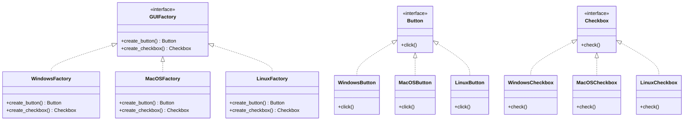

## 3.3.3 Extensibility in Abstract Factories

In the realm of software design, the ability to extend systems without modifying existing code is a hallmark of robust architecture. The Abstract Factory pattern is a creational design pattern that provides an interface for creating families of related or dependent objects without specifying their concrete classes. This section delves into the strategies for enhancing the extensibility of Abstract Factory patterns in Python, allowing for the seamless addition of new product families.

### Understanding Extensibility in Abstract Factories

Extensibility is a critical feature in software design that allows developers to add new functionality with minimal disruption to existing code. In the context of the Abstract Factory pattern, extensibility refers to the ability to introduce new product families without altering the existing factory code. This capability is crucial for maintaining the Open/Closed Principle, one of the SOLID principles of object-oriented design, which states that software entities should be open for extension but closed for modification.

### Applying the Open/Closed Principle

The Open/Closed Principle (OCP) is a fundamental concept in software engineering that encourages the design of modules that can be extended without changing their source code. In the context of Abstract Factories, this principle can be applied by designing factories and products in such a way that new product families can be introduced by adding new classes rather than modifying existing ones.

#### Key Strategies for Extensibility

1. **Interface Segregation**: Define clear and concise interfaces for each product family. This segregation ensures that each product family can evolve independently, and new families can be introduced by implementing these interfaces.

2. **Factory Method Integration**: Use the Factory Method pattern within the Abstract Factory to delegate the creation of products to subclasses. This integration allows for the easy addition of new product types by subclassing the factory.

3. **Dependency Injection**: Employ dependency injection to decouple the creation of objects from their usage. This approach facilitates the introduction of new product families by injecting different factory implementations.

4. **Modular Design**: Organize code into modules or packages that encapsulate product families. This modularity simplifies the process of adding new families by isolating changes to specific modules.

### Demonstrating Extensibility with Python Examples

Let's explore how to implement these strategies in Python, focusing on the seamless addition of new product families.

#### Example: Extending a GUI Toolkit

Consider a scenario where we have an Abstract Factory for creating GUI components. Initially, we have two product families: Windows and MacOS. We want to extend this system to support a new family: Linux.

```python
from abc import ABC, abstractmethod

class Button(ABC):
    @abstractmethod
    def click(self):
        pass

class Checkbox(ABC):
    @abstractmethod
    def check(self):
        pass

class WindowsButton(Button):
    def click(self):
        print("Windows Button clicked!")

class WindowsCheckbox(Checkbox):
    def check(self):
        print("Windows Checkbox checked!")

class MacOSButton(Button):
    def click(self):
        print("MacOS Button clicked!")

class MacOSCheckbox(Checkbox):
    def check(self):
        print("MacOS Checkbox checked!")

class GUIFactory(ABC):
    @abstractmethod
    def create_button(self) -> Button:
        pass

    @abstractmethod
    def create_checkbox(self) -> Checkbox:
        pass

class WindowsFactory(GUIFactory):
    def create_button(self) -> Button:
        return WindowsButton()

    def create_checkbox(self) -> Checkbox:
        return WindowsCheckbox()

class MacOSFactory(GUIFactory):
    def create_button(self) -> Button:
        return MacOSButton()

    def create_checkbox(self) -> Checkbox:
        return MacOSCheckbox()

def client_code(factory: GUIFactory):
    button = factory.create_button()
    checkbox = factory.create_checkbox()
    button.click()
    checkbox.check()

print("Client: Testing client code with WindowsFactory:")
client_code(WindowsFactory())

print("\nClient: Testing client code with MacOSFactory:")
client_code(MacOSFactory())
```

#### Adding a New Product Family: Linux

To add support for Linux, we simply introduce new product classes and a new factory class without modifying existing code.

```python
class LinuxButton(Button):
    def click(self):
        print("Linux Button clicked!")

class LinuxCheckbox(Checkbox):
    def check(self):
        print("Linux Checkbox checked!")

class LinuxFactory(GUIFactory):
    def create_button(self) -> Button:
        return LinuxButton()

    def create_checkbox(self) -> Checkbox:
        return LinuxCheckbox()

print("\nClient: Testing client code with LinuxFactory:")
client_code(LinuxFactory())
```

### Best Practices for Organizing Code

1. **Use Clear Naming Conventions**: Adopt consistent naming conventions for interfaces and classes to enhance readability and maintainability.

2. **Leverage Python's Module System**: Organize product families into separate modules or packages. This organization facilitates the addition of new families by creating new modules.

3. **Document Interfaces and Implementations**: Provide comprehensive documentation for interfaces and their implementations to guide future extensions.

4. **Adopt Test-Driven Development (TDD)**: Write tests for existing factories and products to ensure that new additions do not introduce regressions.

### Visualizing the Abstract Factory Pattern

To better understand the relationships between the components of the Abstract Factory pattern, let's visualize the structure using a class diagram.



### Try It Yourself

Experiment with the code examples by adding a new product family, such as Android. Define new `Button` and `Checkbox` classes for Android, and implement an `AndroidFactory` class. Test your implementation by integrating it with the existing client code.

### Knowledge Check

- What is the Open/Closed Principle, and how does it apply to the Abstract Factory pattern?
- How can you add a new product family to an Abstract Factory without modifying existing code?
- What are some best practices for organizing code to support extensibility in Abstract Factories?

### Embrace the Journey

Remember, mastering design patterns is a journey. As you continue to explore and apply these patterns, you'll develop a deeper understanding of how to create flexible and maintainable software systems. Keep experimenting, stay curious, and enjoy the journey!

## Quiz Time!



### What is the primary goal of the Abstract Factory pattern?

- [x] To provide an interface for creating families of related objects without specifying their concrete classes.
- [ ] To ensure a class has only one instance.
- [ ] To define a one-to-many dependency between objects.
- [ ] To encapsulate a request as an object.

> **Explanation:** The Abstract Factory pattern provides an interface for creating families of related or dependent objects without specifying their concrete classes.

### How does the Open/Closed Principle apply to the Abstract Factory pattern?

- [x] It allows new product families to be added without modifying existing code.
- [ ] It ensures that a class has only one instance.
- [ ] It defines a one-to-many dependency between objects.
- [ ] It encapsulates a request as an object.

> **Explanation:** The Open/Closed Principle states that software entities should be open for extension but closed for modification. In the Abstract Factory pattern, this means new product families can be added by creating new classes, not by modifying existing ones.

### Which of the following is a strategy for enhancing extensibility in Abstract Factories?

- [x] Interface Segregation
- [ ] Singleton Pattern
- [ ] Observer Pattern
- [ ] Chain of Responsibility

> **Explanation:** Interface Segregation is a strategy that involves defining clear and concise interfaces for each product family, allowing for independent evolution and easy addition of new families.

### What is the role of the Factory Method pattern in enhancing extensibility in Abstract Factories?

- [x] It delegates the creation of products to subclasses, allowing for easy addition of new product types.
- [ ] It ensures a class has only one instance.
- [ ] It defines a one-to-many dependency between objects.
- [ ] It encapsulates a request as an object.

> **Explanation:** The Factory Method pattern can be integrated within the Abstract Factory to delegate the creation of products to subclasses, facilitating the addition of new product types.

### What is a best practice for organizing code to support extensibility in Abstract Factories?

- [x] Use clear naming conventions and organize code into modules.
- [ ] Use the Singleton pattern for all classes.
- [ ] Avoid using interfaces.
- [ ] Hard-code all product types.

> **Explanation:** Using clear naming conventions and organizing code into modules or packages enhances readability and maintainability, supporting extensibility.

### What is the benefit of using dependency injection in Abstract Factories?

- [x] It decouples the creation of objects from their usage, facilitating the introduction of new product families.
- [ ] It ensures a class has only one instance.
- [ ] It defines a one-to-many dependency between objects.
- [ ] It encapsulates a request as an object.

> **Explanation:** Dependency injection decouples the creation of objects from their usage, allowing for different factory implementations to be injected, which facilitates the introduction of new product families.

### How can modular design aid in the extensibility of Abstract Factories?

- [x] By isolating changes to specific modules, making it easier to add new product families.
- [ ] By ensuring a class has only one instance.
- [ ] By defining a one-to-many dependency between objects.
- [ ] By encapsulating a request as an object.

> **Explanation:** Modular design organizes code into modules or packages, isolating changes to specific modules, which simplifies the process of adding new product families.

### What is the role of the client code in the Abstract Factory pattern?

- [x] To use the factory interface to create products without knowing their concrete classes.
- [ ] To ensure a class has only one instance.
- [ ] To define a one-to-many dependency between objects.
- [ ] To encapsulate a request as an object.

> **Explanation:** The client code uses the factory interface to create products, allowing it to work with abstract interfaces rather than concrete classes.

### Which of the following is NOT a benefit of the Abstract Factory pattern?

- [ ] It provides an interface for creating families of related objects.
- [ ] It allows for the addition of new product families without modifying existing code.
- [x] It ensures a class has only one instance.
- [ ] It supports the Open/Closed Principle.

> **Explanation:** Ensuring a class has only one instance is a benefit of the Singleton pattern, not the Abstract Factory pattern.

### True or False: The Abstract Factory pattern can be used to create a single instance of a class.

- [ ] True
- [x] False

> **Explanation:** The Abstract Factory pattern is used to create families of related or dependent objects, not to ensure a single instance of a class.


