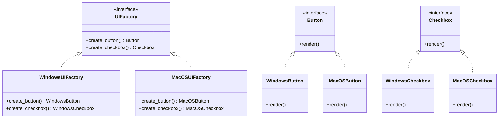

## 3.3.4 Use Cases and Examples

The Abstract Factory Pattern is a creational design pattern that provides an interface for creating families of related or dependent objects without specifying their concrete classes. This pattern is particularly useful in scenarios where a system needs to be independent of how its objects are created, composed, and represented. In this section, we will explore various use cases and examples of the Abstract Factory Pattern, focusing on cross-platform UI elements and other domains where this pattern proves beneficial.

### Understanding the Abstract Factory Pattern

Before diving into the examples, let's briefly revisit the core concept of the Abstract Factory Pattern. The pattern involves creating an abstract class or interface that declares the creation methods for different product types. Concrete factories implement these methods to produce products that are part of a family. This setup allows for the creation of a suite of products that are designed to work together, while also enabling easy switching of product families.

### Cross-Platform UI Elements

One of the most common use cases for the Abstract Factory Pattern is in the development of cross-platform graphical user interfaces (GUIs). When building applications that need to run on multiple operating systems, such as Windows, macOS, and Linux, developers face the challenge of dealing with different UI toolkits and system-specific behaviors. The Abstract Factory Pattern helps manage these differences by providing a way to create UI components that are platform-independent.

#### Example: GUI Toolkit with Abstract Factory

Consider a GUI application that needs to support multiple operating systems. We can use the Abstract Factory Pattern to create a family of UI components, such as buttons, checkboxes, and windows, that are tailored for each platform. Here's how we can implement this in Python:

```python
from abc import ABC, abstractmethod

class UIFactory(ABC):
    @abstractmethod
    def create_button(self):
        pass

    @abstractmethod
    def create_checkbox(self):
        pass

class WindowsUIFactory(UIFactory):
    def create_button(self):
        return WindowsButton()

    def create_checkbox(self):
        return WindowsCheckbox()

class MacOSUIFactory(UIFactory):
    def create_button(self):
        return MacOSButton()

    def create_checkbox(self):
        return MacOSCheckbox()

class Button(ABC):
    @abstractmethod
    def render(self):
        pass

class WindowsButton(Button):
    def render(self):
        print("Rendering a button in Windows style")

class MacOSButton(Button):
    def render(self):
        print("Rendering a button in macOS style")

class Checkbox(ABC):
    @abstractmethod
    def render(self):
        pass

class WindowsCheckbox(Checkbox):
    def render(self):
        print("Rendering a checkbox in Windows style")

class MacOSCheckbox(Checkbox):
    def render(self):
        print("Rendering a checkbox in macOS style")

def create_ui(factory: UIFactory):
    button = factory.create_button()
    checkbox = factory.create_checkbox()
    button.render()
    checkbox.render()

platform = "Windows"  # This could be dynamically determined
if platform == "Windows":
    factory = WindowsUIFactory()
elif platform == "MacOS":
    factory = MacOSUIFactory()
else:
    raise ValueError("Unsupported platform")

create_ui(factory)
```

In this example, the `UIFactory` interface defines methods for creating buttons and checkboxes. The `WindowsUIFactory` and `MacOSUIFactory` classes implement these methods to produce Windows and macOS-specific UI components, respectively. The client code can create a UI by selecting the appropriate factory based on the platform, ensuring that the correct set of UI components is used.

### Benefits of Modular Design

The Abstract Factory Pattern encourages modular design by decoupling the client code from the concrete implementations of the products. This separation of concerns offers several benefits:

1. **Flexibility**: The client code can easily switch between different families of products without modifying its logic. This is particularly useful in applications that need to support multiple environments or configurations.

2. **Scalability**: New product families can be added without altering existing code. This makes it easier to extend the application with new features or support for additional platforms.

3. **Maintainability**: By isolating the creation logic in factory classes, the code becomes easier to maintain and update. Changes to the product implementations do not affect the client code, reducing the risk of introducing bugs.

### Other Domains for Abstract Factory Pattern

While cross-platform UI development is a prominent use case, the Abstract Factory Pattern is applicable in various other domains:

#### 1. Database Connectivity

In applications that need to support multiple database systems, the Abstract Factory Pattern can be used to create a family of database connection objects. Each concrete factory can produce connections, queries, and transactions specific to a particular database system, such as MySQL, PostgreSQL, or SQLite.

```python
from abc import ABC, abstractmethod

class DatabaseFactory(ABC):
    @abstractmethod
    def create_connection(self):
        pass

    @abstractmethod
    def create_query(self):
        pass

class MySQLFactory(DatabaseFactory):
    def create_connection(self):
        return MySQLConnection()

    def create_query(self):
        return MySQLQuery()

class PostgreSQLFactory(DatabaseFactory):
    def create_connection(self):
        return PostgreSQLConnection()

    def create_query(self):
        return PostgreSQLQuery()

class Connection(ABC):
    @abstractmethod
    def connect(self):
        pass

class MySQLConnection(Connection):
    def connect(self):
        print("Connecting to MySQL database")

class PostgreSQLConnection(Connection):
    def connect(self):
        print("Connecting to PostgreSQL database")

class Query(ABC):
    @abstractmethod
    def execute(self):
        pass

class MySQLQuery(Query):
    def execute(self):
        print("Executing MySQL query")

class PostgreSQLQuery(Query):
    def execute(self):
        print("Executing PostgreSQL query")

def perform_database_operations(factory: DatabaseFactory):
    connection = factory.create_connection()
    query = factory.create_query()
    connection.connect()
    query.execute()

database_type = "MySQL"  # This could be dynamically determined
if database_type == "MySQL":
    factory = MySQLFactory()
elif database_type == "PostgreSQL":
    factory = PostgreSQLFactory()
else:
    raise ValueError("Unsupported database type")

perform_database_operations(factory)
```

In this example, the `DatabaseFactory` interface defines methods for creating connections and queries. The `MySQLFactory` and `PostgreSQLFactory` classes implement these methods to produce MySQL and PostgreSQL-specific database components. The client code can perform database operations by selecting the appropriate factory based on the database type.

#### 2. Game Development

In game development, the Abstract Factory Pattern can be used to create a family of game objects, such as characters, weapons, and environments, that are tailored for different game levels or themes. This allows for easy switching between different game modes or themes without modifying the core game logic.

```python
from abc import ABC, abstractmethod

class GameFactory(ABC):
    @abstractmethod
    def create_character(self):
        pass

    @abstractmethod
    def create_weapon(self):
        pass

class FantasyGameFactory(GameFactory):
    def create_character(self):
        return ElfCharacter()

    def create_weapon(self):
        return SwordWeapon()

class SciFiGameFactory(GameFactory):
    def create_character(self):
        return AlienCharacter()

    def create_weapon(self):
        return LaserWeapon()

class Character(ABC):
    @abstractmethod
    def describe(self):
        pass

class ElfCharacter(Character):
    def describe(self):
        print("This is an Elf character")

class AlienCharacter(Character):
    def describe(self):
        print("This is an Alien character")

class Weapon(ABC):
    @abstractmethod
    def use(self):
        pass

class SwordWeapon(Weapon):
    def use(self):
        print("Swinging a sword")

class LaserWeapon(Weapon):
    def use(self):
        print("Firing a laser")

def play_game(factory: GameFactory):
    character = factory.create_character()
    weapon = factory.create_weapon()
    character.describe()
    weapon.use()

game_theme = "Fantasy"  # This could be dynamically determined
if game_theme == "Fantasy":
    factory = FantasyGameFactory()
elif game_theme == "Sci-Fi":
    factory = SciFiGameFactory()
else:
    raise ValueError("Unsupported game theme")

play_game(factory)
```

In this example, the `GameFactory` interface defines methods for creating characters and weapons. The `FantasyGameFactory` and `SciFiGameFactory` classes implement these methods to produce fantasy and sci-fi-themed game components. The client code can play the game by selecting the appropriate factory based on the game theme.

### Encouraging Modular Design

The Abstract Factory Pattern encourages developers to think about modular design and the benefits it brings. By abstracting the creation of objects, developers can create flexible and scalable systems that are easy to extend and maintain. This pattern is particularly useful in large-scale applications where different parts of the system need to be developed independently and integrated seamlessly.

### Try It Yourself

To deepen your understanding of the Abstract Factory Pattern, try modifying the examples provided:

1. **Add a New Platform**: Extend the GUI toolkit example by adding support for a new platform, such as Linux. Implement the necessary concrete factory and product classes.

2. **Create a New Game Theme**: In the game development example, add a new game theme, such as a medieval or futuristic theme. Implement the necessary concrete factory and product classes.

3. **Experiment with Different Domains**: Think of other domains where the Abstract Factory Pattern could be applied, such as network protocols, file formats, or messaging systems. Implement a simple example in your chosen domain.

### Visualizing the Abstract Factory Pattern

To better understand the relationships between the components of the Abstract Factory Pattern, let's visualize the pattern using a class diagram:



### Conclusion

The Abstract Factory Pattern is a powerful tool for creating modular and scalable systems. By abstracting the creation of related objects, it allows developers to build applications that are flexible and easy to extend. Whether you're developing cross-platform UI elements, managing database connectivity, or creating themed game components, the Abstract Factory Pattern provides a robust framework for managing complexity and promoting modular design.

Remember, this is just the beginning. As you progress, you'll discover more ways to apply the Abstract Factory Pattern and other design patterns to solve complex problems. Keep experimenting, stay curious, and enjoy the journey!

## Quiz Time!



### What is the primary purpose of the Abstract Factory Pattern?

- [x] To provide an interface for creating families of related objects without specifying their concrete classes.
- [ ] To create a single instance of a class.
- [ ] To define a skeleton of an algorithm.
- [ ] To allow incompatible interfaces to work together.

> **Explanation:** The Abstract Factory Pattern provides an interface for creating families of related or dependent objects without specifying their concrete classes.

### In the context of the Abstract Factory Pattern, what is a "product"?

- [x] An object created by a factory method.
- [ ] A method that creates objects.
- [ ] A class that implements the factory interface.
- [ ] A subclass of the abstract factory.

> **Explanation:** In the Abstract Factory Pattern, a "product" is an object created by a factory method.

### How does the Abstract Factory Pattern promote modular design?

- [x] By decoupling the client code from the concrete implementations of the products.
- [ ] By ensuring a class has only one instance.
- [ ] By defining a skeleton of an algorithm.
- [ ] By allowing incompatible interfaces to work together.

> **Explanation:** The Abstract Factory Pattern promotes modular design by decoupling the client code from the concrete implementations of the products, allowing for flexibility and scalability.

### Which of the following is a common use case for the Abstract Factory Pattern?

- [x] Cross-platform UI development.
- [ ] Implementing a singleton class.
- [ ] Defining a skeleton of an algorithm.
- [ ] Allowing incompatible interfaces to work together.

> **Explanation:** A common use case for the Abstract Factory Pattern is cross-platform UI development, where different UI components are needed for different platforms.

### What is the role of a concrete factory in the Abstract Factory Pattern?

- [x] To implement the creation methods for specific product types.
- [ ] To define the interface for creating objects.
- [ ] To provide a single instance of a class.
- [ ] To allow incompatible interfaces to work together.

> **Explanation:** In the Abstract Factory Pattern, a concrete factory implements the creation methods for specific product types.

### In the provided GUI toolkit example, what does the `create_ui` function do?

- [x] It creates and renders UI components using a specified factory.
- [ ] It defines the interface for creating UI components.
- [ ] It implements the creation methods for specific UI components.
- [ ] It allows incompatible UI components to work together.

> **Explanation:** The `create_ui` function creates and renders UI components using a specified factory.

### How can the Abstract Factory Pattern be extended to support new product families?

- [x] By adding new concrete factories and product classes.
- [ ] By modifying the existing client code.
- [ ] By changing the abstract factory interface.
- [ ] By creating a single instance of a class.

> **Explanation:** The Abstract Factory Pattern can be extended to support new product families by adding new concrete factories and product classes.

### What is the benefit of using the Abstract Factory Pattern in game development?

- [x] It allows for easy switching between different game modes or themes.
- [ ] It ensures a class has only one instance.
- [ ] It defines a skeleton of an algorithm.
- [ ] It allows incompatible interfaces to work together.

> **Explanation:** In game development, the Abstract Factory Pattern allows for easy switching between different game modes or themes without modifying the core game logic.

### Which of the following is NOT a benefit of the Abstract Factory Pattern?

- [ ] Flexibility
- [ ] Scalability
- [ ] Maintainability
- [x] Complexity

> **Explanation:** While the Abstract Factory Pattern offers flexibility, scalability, and maintainability, it can also introduce complexity due to the increased number of classes and interfaces.

### True or False: The Abstract Factory Pattern can only be used for UI development.

- [ ] True
- [x] False

> **Explanation:** False. The Abstract Factory Pattern can be used in various domains, including database connectivity, game development, and more, not just UI development.


