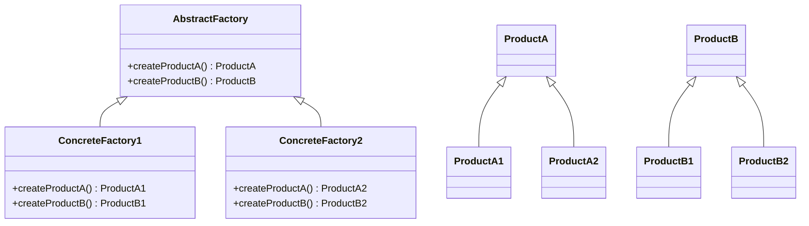

## 3.3 Abstract Factory Pattern

The Abstract Factory Pattern is a creational design pattern that provides an interface for creating families of related or dependent objects without specifying their concrete classes. This pattern is particularly useful when a system needs to be independent of how its objects are created, composed, and represented. It allows for the creation of objects that follow a particular theme or style, ensuring consistency across the product family.

### Purpose and Benefits of the Abstract Factory Pattern

The main purpose of the Abstract Factory Pattern is to encapsulate a group of individual factories that have a common theme. It provides a way to create a suite of related products without having to specify their concrete classes. This pattern is beneficial in scenarios where:

- **Consistency is Key**: When you need to ensure that a set of objects are compatible or follow a consistent theme.
- **Decoupling**: It decouples the client code from the concrete classes, making the system more flexible and easier to extend.
- **Scalability**: Adding new families of products becomes easier since you only need to introduce new factory classes without altering existing code.

### Diagram: Visualizing Abstract Factory Pattern

To better understand the Abstract Factory Pattern, let's visualize the relationships between abstract factories, concrete factories, and products.



In this diagram, `AbstractFactory` defines the interface for creating products. `ConcreteFactory1` and `ConcreteFactory2` implement this interface to produce products `ProductA1`, `ProductB1`, `ProductA2`, and `ProductB2`, respectively.

### Implementing Abstract Factory in Python

Let's implement an Abstract Factory Pattern in Python. We'll create a simple example involving two product families: `Chair` and `Table`, with two styles: `Modern` and `Victorian`.

#### Step 1: Define Abstract Products

First, we define interfaces for the products.

```python
from abc import ABC, abstractmethod

class Chair(ABC):
    @abstractmethod
    def sit_on(self) -> str:
        pass

class Table(ABC):
    @abstractmethod
    def dine_on(self) -> str:
        pass
```

#### Step 2: Create Concrete Products

Next, we implement the concrete products for each style.

```python
class ModernChair(Chair):
    def sit_on(self) -> str:
        return "Sitting on a modern chair."

class VictorianChair(Chair):
    def sit_on(self) -> str:
        return "Sitting on a Victorian chair."

class ModernTable(Table):
    def dine_on(self) -> str:
        return "Dining on a modern table."

class VictorianTable(Table):
    def dine_on(self) -> str:
        return "Dining on a Victorian table."
```

#### Step 3: Define Abstract Factory

Now, we define the abstract factory interface.

```python
class FurnitureFactory(ABC):
    @abstractmethod
    def create_chair(self) -> Chair:
        pass

    @abstractmethod
    def create_table(self) -> Table:
        pass
```

#### Step 4: Implement Concrete Factories

We implement the concrete factories for each product family.

```python
class ModernFurnitureFactory(FurnitureFactory):
    def create_chair(self) -> Chair:
        return ModernChair()

    def create_table(self) -> Table:
        return ModernTable()

class VictorianFurnitureFactory(FurnitureFactory):
    def create_chair(self) -> Chair:
        return VictorianChair()

    def create_table(self) -> Table:
        return VictorianTable()
```

#### Step 5: Client Code

Finally, let's see how the client code interacts with the factories.

```python
def client_code(factory: FurnitureFactory):
    chair = factory.create_chair()
    table = factory.create_table()
    print(chair.sit_on())
    print(table.dine_on())

print("Modern Furniture:")
client_code(ModernFurnitureFactory())

print("\nVictorian Furniture:")
client_code(VictorianFurnitureFactory())
```

### Promoting Consistency Among Products

The Abstract Factory Pattern ensures that the products created by a factory are compatible with each other. In our example, a `ModernFurnitureFactory` will always produce a `ModernChair` and a `ModernTable`, maintaining a consistent style across the product family. This consistency is crucial in applications where products need to work together seamlessly.

### Complexity and Management

While the Abstract Factory Pattern provides significant benefits in terms of consistency and scalability, it also introduces complexity. Managing multiple factories and product hierarchies can become cumbersome, especially as the number of product families grows. To manage this complexity:

- **Use Dependency Injection**: Inject the factory into the client code to make testing and maintenance easier.
- **Leverage Polymorphism**: Use polymorphic behavior to handle different product types without altering the client code.
- **Keep It Simple**: Avoid over-engineering. Use the pattern only when you have multiple product families that need to be managed.

### Comparing Abstract Factory with Other Creational Patterns

The Abstract Factory Pattern is often compared with other creational patterns such as Factory Method and Builder. Here's how they differ:

- **Factory Method**: Focuses on creating a single product. It uses a method to create objects, allowing subclasses to alter the type of objects created.
- **Builder**: Separates the construction of a complex object from its representation, allowing the same construction process to create different representations.
- **Abstract Factory**: Provides an interface for creating families of related objects without specifying their concrete classes, ensuring consistency across the product family.

### Try It Yourself

Experiment with the code examples provided. Try adding a new style, such as `ArtDeco`, and implement the necessary classes and factories. Observe how the Abstract Factory Pattern helps maintain consistency across the new product family.

### Conclusion

The Abstract Factory Pattern is a powerful tool for creating families of related objects while maintaining consistency and scalability. By understanding its benefits and complexities, you can make informed decisions about when and how to use this pattern in your projects.

## Quiz Time!



### What is the main purpose of the Abstract Factory Pattern?

- [x] To provide an interface for creating families of related objects without specifying concrete classes.
- [ ] To create a single object with a complex construction process.
- [ ] To separate the construction of an object from its representation.
- [ ] To allow subclasses to alter the type of objects created.

> **Explanation:** The Abstract Factory Pattern is designed to provide an interface for creating families of related or dependent objects without specifying their concrete classes.

### Which of the following is a benefit of using the Abstract Factory Pattern?

- [x] It promotes consistency among products.
- [ ] It simplifies the creation of a single product.
- [ ] It reduces the number of classes in a system.
- [ ] It eliminates the need for interfaces.

> **Explanation:** The Abstract Factory Pattern promotes consistency among products by ensuring that a set of objects are compatible or follow a consistent theme.

### In the provided Python code example, what does the `FurnitureFactory` class represent?

- [x] An abstract factory interface for creating chairs and tables.
- [ ] A concrete factory for creating modern furniture.
- [ ] A concrete factory for creating Victorian furniture.
- [ ] A product class for creating chairs.

> **Explanation:** The `FurnitureFactory` class is an abstract factory interface that defines methods for creating chairs and tables.

### How does the Abstract Factory Pattern handle scalability?

- [x] By allowing new families of products to be added without altering existing code.
- [ ] By reducing the number of classes needed for product creation.
- [ ] By simplifying the construction process of complex objects.
- [ ] By eliminating the need for concrete classes.

> **Explanation:** The Abstract Factory Pattern handles scalability by allowing new families of products to be added through new factory classes, without altering existing code.

### What is a potential drawback of the Abstract Factory Pattern?

- [x] It introduces complexity with multiple factories and product hierarchies.
- [ ] It limits the number of products that can be created.
- [ ] It requires the use of concrete classes in the client code.
- [ ] It makes it difficult to maintain consistency among products.

> **Explanation:** The Abstract Factory Pattern can introduce complexity due to the need to manage multiple factories and product hierarchies.

### How does the Abstract Factory Pattern differ from the Factory Method Pattern?

- [x] The Abstract Factory Pattern creates families of related objects, while the Factory Method Pattern focuses on creating a single product.
- [ ] The Abstract Factory Pattern uses a single method to create objects, while the Factory Method Pattern uses multiple methods.
- [ ] The Abstract Factory Pattern separates construction from representation, while the Factory Method Pattern does not.
- [ ] The Abstract Factory Pattern requires concrete classes, while the Factory Method Pattern does not.

> **Explanation:** The Abstract Factory Pattern is designed to create families of related objects, whereas the Factory Method Pattern focuses on creating a single product.

### What is the role of the `ModernFurnitureFactory` class in the Python code example?

- [x] A concrete factory that creates modern chairs and tables.
- [ ] An abstract factory interface for creating furniture.
- [ ] A concrete factory that creates Victorian chairs and tables.
- [ ] A product class for creating modern chairs.

> **Explanation:** The `ModernFurnitureFactory` class is a concrete factory that implements the `FurnitureFactory` interface to create modern chairs and tables.

### What is a key advantage of using the Abstract Factory Pattern in a system?

- [x] It decouples the client code from the concrete classes.
- [ ] It reduces the number of methods needed for product creation.
- [ ] It simplifies the construction process of complex objects.
- [ ] It eliminates the need for abstract classes.

> **Explanation:** The Abstract Factory Pattern decouples the client code from the concrete classes, making the system more flexible and easier to extend.

### In the context of the Abstract Factory Pattern, what does "product family" refer to?

- [x] A group of related products that are designed to work together.
- [ ] A single product with a complex construction process.
- [ ] A set of methods used to create objects.
- [ ] A collection of unrelated products.

> **Explanation:** In the context of the Abstract Factory Pattern, a "product family" refers to a group of related products that are designed to work together.

### True or False: The Abstract Factory Pattern can be used to create a single product with a complex construction process.

- [ ] True
- [x] False

> **Explanation:** False. The Abstract Factory Pattern is not intended for creating a single product with a complex construction process; it is designed to create families of related products.


