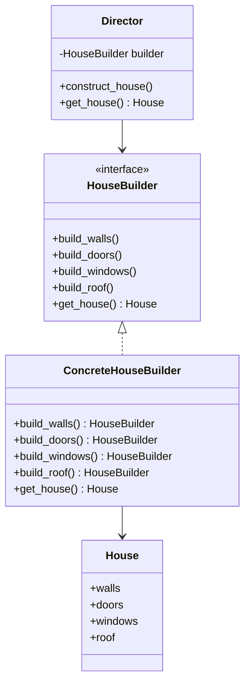

## 3.4.1 Implementing Builder in Python

In this section, we will delve into the Builder Pattern, a creational design pattern that provides a flexible solution to constructing complex objects. The Builder Pattern allows us to separate the construction of an object from its representation, enabling the same construction process to create different representations. This pattern is particularly useful when dealing with objects that require numerous configurations and optional parameters.

### Understanding the Builder Pattern

The Builder Pattern is designed to address the problem of constructing complex objects step by step. It is especially useful when an object needs to be created with various configurations or when the construction process involves several steps. The pattern involves four main components:

1. **Product**: The complex object that is being built.
2. **Builder**: An abstract interface for creating parts of the Product object.
3. **ConcreteBuilder**: A class that implements the Builder interface and constructs the parts of the Product.
4. **Director**: A class that constructs the object using the Builder interface.

### Key Concepts and Roles

- **Product**: This is the final object that we want to create. It can be complex and consist of multiple parts.
- **Builder**: This interface defines all the steps required to build the Product. It allows for the construction of different representations of the Product.
- **ConcreteBuilder**: This class implements the Builder interface to construct and assemble parts of the Product. It keeps track of the representation it creates.
- **Director**: This class is responsible for managing the construction process. It uses the Builder interface to construct the Product.

### Implementing the Builder Pattern in Python

Let's walk through the implementation of the Builder Pattern in Python with a practical example. We'll create a `House` object with various components such as walls, doors, and windows.

#### Step 1: Define the Product

The `House` class represents the complex object that we want to construct.

```python
class House:
    def __init__(self):
        self.walls = None
        self.doors = None
        self.windows = None
        self.roof = None

    def __str__(self):
        return f"House with {self.walls} walls, {self.doors} doors, {self.windows} windows, and a {self.roof} roof."
```

#### Step 2: Create the Builder Interface

The `HouseBuilder` interface defines the steps required to build a house.

```python
from abc import ABC, abstractmethod

class HouseBuilder(ABC):
    @abstractmethod
    def build_walls(self):
        pass

    @abstractmethod
    def build_doors(self):
        pass

    @abstractmethod
    def build_windows(self):
        pass

    @abstractmethod
    def build_roof(self):
        pass

    @abstractmethod
    def get_house(self) -> House:
        pass
```

#### Step 3: Implement the ConcreteBuilder

The `ConcreteHouseBuilder` class implements the `HouseBuilder` interface to construct a specific type of house.

```python
class ConcreteHouseBuilder(HouseBuilder):
    def __init__(self):
        self.house = House()

    def build_walls(self):
        self.house.walls = "brick"

    def build_doors(self):
        self.house.doors = "wooden"

    def build_windows(self):
        self.house.windows = "double-glazed"

    def build_roof(self):
        self.house.roof = "tile"

    def get_house(self) -> House:
        return self.house
```

#### Step 4: Create the Director

The `Director` class is responsible for constructing the house using the builder.

```python
class Director:
    def __init__(self, builder: HouseBuilder):
        self._builder = builder

    def construct_house(self):
        self._builder.build_walls()
        self._builder.build_doors()
        self._builder.build_windows()
        self._builder.build_roof()

    def get_house(self) -> House:
        return self._builder.get_house()
```

#### Step 5: Putting It All Together

Now, let's see how we can use the Builder Pattern to construct a house.

```python
def main():
    builder = ConcreteHouseBuilder()
    director = Director(builder)
    director.construct_house()
    house = director.get_house()
    print(house)

if __name__ == "__main__":
    main()
```

### Method Chaining for a Fluent Interface

In Python, we can enhance the Builder Pattern by implementing method chaining, which allows us to create a fluent interface. This approach makes the code more readable and intuitive.

#### Modifying the Builder for Method Chaining

Let's modify the `ConcreteHouseBuilder` to support method chaining.

```python
class FluentHouseBuilder(HouseBuilder):
    def __init__(self):
        self.house = House()

    def build_walls(self):
        self.house.walls = "brick"
        return self

    def build_doors(self):
        self.house.doors = "wooden"
        return self

    def build_windows(self):
        self.house.windows = "double-glazed"
        return self

    def build_roof(self):
        self.house.roof = "tile"
        return self

    def get_house(self) -> House:
        return self.house
```

#### Using the Fluent Interface

With method chaining, we can construct a house in a more readable way.

```python
def main():
    builder = FluentHouseBuilder()
    house = builder.build_walls().build_doors().build_windows().build_roof().get_house()
    print(house)

if __name__ == "__main__":
    main()
```

### Visualizing the Builder Pattern

To better understand the Builder Pattern, let's visualize the relationships between the components using a class diagram.



### Try It Yourself

Experiment with the Builder Pattern by modifying the code examples. Here are some suggestions:

- **Add More Features**: Extend the `House` class to include additional features like a garage or garden, and update the builder accordingly.
- **Create Different Types of Houses**: Implement multiple concrete builders to create different types of houses, such as a wooden house or a glass house.
- **Implement a Fluent Interface**: Modify the builder to use method chaining for a more readable construction process.

### Knowledge Check

- **What are the main components of the Builder Pattern?**
- **How does method chaining enhance the Builder Pattern in Python?**
- **What are some use cases where the Builder Pattern is particularly useful?**

### Summary

The Builder Pattern is a powerful tool for constructing complex objects in a flexible and readable manner. By separating the construction process from the representation, it allows for the creation of different representations using the same construction process. The use of method chaining further enhances the pattern by providing a fluent interface, making the code more intuitive and easier to read.

### References and Further Reading

- [Design Patterns: Elements of Reusable Object-Oriented Software](https://en.wikipedia.org/wiki/Design_Patterns) - The seminal book on design patterns.
- [Python's ABC Module](https://docs.python.org/3/library/abc.html) - Documentation on abstract base classes in Python.
- [Fluent Interface Pattern](https://martinfowler.com/bliki/FluentInterface.html) - Martin Fowler's article on fluent interfaces.

### Embrace the Journey

Remember, mastering design patterns is an ongoing journey. As you continue to explore and implement these patterns, you'll gain deeper insights into writing maintainable and scalable code. Keep experimenting, stay curious, and enjoy the process!

## Quiz Time!



### What is the primary purpose of the Builder Pattern?

- [x] To separate the construction of a complex object from its representation.
- [ ] To ensure a class has only one instance.
- [ ] To provide a simplified interface to a complex subsystem.
- [ ] To decouple an abstraction from its implementation.

> **Explanation:** The Builder Pattern is designed to separate the construction of a complex object from its representation, allowing the same construction process to create different representations.

### Which component of the Builder Pattern is responsible for defining the steps to build a product?

- [ ] Product
- [x] Builder
- [ ] ConcreteBuilder
- [ ] Director

> **Explanation:** The Builder component defines the steps required to build a product, providing an interface for constructing parts of the product.

### What is the role of the Director in the Builder Pattern?

- [ ] To implement the steps to build the product.
- [x] To manage the construction process using the Builder interface.
- [ ] To define the final product.
- [ ] To provide a fluent interface for method chaining.

> **Explanation:** The Director is responsible for managing the construction process using the Builder interface, ensuring the correct sequence of construction steps.

### How does method chaining enhance the Builder Pattern?

- [x] It provides a fluent interface, making the code more readable and intuitive.
- [ ] It ensures thread safety in multi-threaded environments.
- [ ] It allows for the reuse of common state among many objects.
- [ ] It provides a simplified interface to a complex subsystem.

> **Explanation:** Method chaining enhances the Builder Pattern by providing a fluent interface, allowing for a more readable and intuitive construction process.

### Which of the following is NOT a component of the Builder Pattern?

- [ ] Product
- [ ] Builder
- [ ] Director
- [x] Adapter

> **Explanation:** The Adapter is not a component of the Builder Pattern. The main components are Product, Builder, ConcreteBuilder, and Director.

### What is the advantage of using the Builder Pattern over a simple constructor?

- [x] It allows for the construction of complex objects step by step.
- [ ] It ensures a class has only one instance.
- [ ] It provides a simplified interface to a complex subsystem.
- [ ] It decouples an abstraction from its implementation.

> **Explanation:** The Builder Pattern allows for the construction of complex objects step by step, providing flexibility and clarity.

### In the Builder Pattern, what is the role of the ConcreteBuilder?

- [ ] To manage the construction process.
- [ ] To define the final product.
- [x] To implement the steps to build the product.
- [ ] To provide a fluent interface for method chaining.

> **Explanation:** The ConcreteBuilder implements the steps to build the product, constructing and assembling parts of the product.

### How can the Builder Pattern be modified to support method chaining?

- [x] By returning `self` from each method in the builder.
- [ ] By using inheritance to create customizable algorithms.
- [ ] By encapsulating a request as an object.
- [ ] By defining a one-to-many dependency.

> **Explanation:** The Builder Pattern can be modified to support method chaining by returning `self` from each method in the builder, allowing for a fluent interface.

### Which of the following is a common use case for the Builder Pattern?

- [x] Constructing objects with numerous configurations and optional parameters.
- [ ] Ensuring a class has only one instance.
- [ ] Providing a simplified interface to a complex subsystem.
- [ ] Decoupling an abstraction from its implementation.

> **Explanation:** The Builder Pattern is commonly used for constructing objects with numerous configurations and optional parameters, allowing for flexibility in the construction process.

### True or False: The Builder Pattern is only useful for constructing simple objects.

- [ ] True
- [x] False

> **Explanation:** False. The Builder Pattern is particularly useful for constructing complex objects that require numerous configurations and optional parameters.


