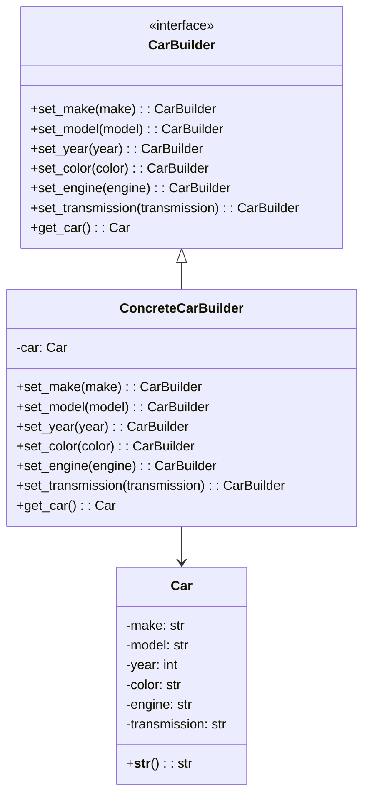

## 3.4.2 Separating Complex Object Construction

In the realm of software design, the Builder Pattern is a powerful tool that allows developers to construct complex objects step-by-step, separating the construction process from the representation. This pattern is particularly useful when dealing with objects that require numerous configurations or when the construction process involves multiple steps. By isolating construction logic, we can enhance the maintainability, flexibility, and clarity of our code.

### Why Separate Construction Logic?

Separating construction logic from the main class offers several significant benefits:

1. **Single Responsibility Principle (SRP)**: By isolating the construction process, the main class can focus on its core functionality, adhering to the SRP. This makes the codebase easier to understand and maintain.

2. **Flexibility**: The Builder Pattern allows for different representations of the object being constructed. This is particularly useful when the object can have various configurations.

3. **Reusability**: The construction logic can be reused across different contexts, reducing code duplication.

4. **Readability and Maintainability**: By breaking down the construction process into discrete steps, the code becomes more readable and easier to maintain.

5. **Complex Object Creation**: When creating objects that require multiple steps or configurations, the Builder Pattern provides a clear and organized approach.

### Core Concepts of the Builder Pattern

Before diving into code examples, let's understand the core concepts of the Builder Pattern:

- **Builder**: An interface or abstract class defining the steps to construct the product.
- **Concrete Builder**: A class that implements the Builder interface, providing specific implementations for the construction steps.
- **Director**: An optional class that controls the construction process using the Builder interface.
- **Product**: The final object that is constructed.

### Implementing the Builder Pattern in Python

Let's explore how to implement the Builder Pattern in Python through a practical example. Consider a scenario where we need to construct a complex `Car` object with various configurations.

#### Step 1: Define the Product

First, we define the `Car` class, which represents the complex object we want to construct.

```python
class Car:
    def __init__(self):
        self.make = None
        self.model = None
        self.year = None
        self.color = None
        self.engine = None
        self.transmission = None

    def __str__(self):
        return f"{self.year} {self.make} {self.model} ({self.color}) with {self.engine} engine and {self.transmission} transmission"
```

#### Step 2: Create the Builder Interface

Next, we define the `CarBuilder` interface, which outlines the steps required to construct a `Car`.

```python
from abc import ABC, abstractmethod

class CarBuilder(ABC):
    @abstractmethod
    def set_make(self, make):
        pass

    @abstractmethod
    def set_model(self, model):
        pass

    @abstractmethod
    def set_year(self, year):
        pass

    @abstractmethod
    def set_color(self, color):
        pass

    @abstractmethod
    def set_engine(self, engine):
        pass

    @abstractmethod
    def set_transmission(self, transmission):
        pass

    @abstractmethod
    def get_car(self):
        pass
```

#### Step 3: Implement the Concrete Builder

The `ConcreteCarBuilder` class implements the `CarBuilder` interface, providing specific implementations for each construction step.

```python
class ConcreteCarBuilder(CarBuilder):
    def __init__(self):
        self.car = Car()

    def set_make(self, make):
        self.car.make = make
        return self

    def set_model(self, model):
        self.car.model = model
        return self

    def set_year(self, year):
        self.car.year = year
        return self

    def set_color(self, color):
        self.car.color = color
        return self

    def set_engine(self, engine):
        self.car.engine = engine
        return self

    def set_transmission(self, transmission):
        self.car.transmission = transmission
        return self

    def get_car(self):
        return self.car
```

#### Step 4: Use the Builder to Construct the Product

Finally, we use the `ConcreteCarBuilder` to construct a `Car` object.

```python
builder = ConcreteCarBuilder()
car = (builder.set_make("Toyota")
              .set_model("Corolla")
              .set_year(2021)
              .set_color("Blue")
              .set_engine("1.8L")
              .set_transmission("Automatic")
              .get_car())

print(car)
```

This code will output:

```
2021 Toyota Corolla (Blue) with 1.8L engine and Automatic transmission
```

### Visualizing the Builder Pattern

To better understand the Builder Pattern, let's visualize the relationships between the components using a class diagram.



### Benefits of the Builder Pattern

The Builder Pattern provides several advantages, particularly in scenarios involving complex object construction:

- **Separation of Concerns**: The construction logic is separated from the main class, allowing each component to focus on its specific responsibility.
- **Improved Code Organization**: By breaking down the construction process into discrete steps, the code becomes more organized and easier to follow.
- **Enhanced Flexibility**: The Builder Pattern allows for different configurations of the product, making it easier to adapt to changing requirements.
- **Reusability**: The builder can be reused across different contexts, reducing code duplication and improving maintainability.

### Scenarios Where the Builder Pattern is Useful

The Builder Pattern is particularly useful in the following scenarios:

1. **Complex Object Construction**: When creating objects that require multiple steps or configurations, the Builder Pattern provides a clear and organized approach.

2. **Parsing Complex Data**: When parsing complex data structures, such as JSON or XML, the Builder Pattern can help manage the construction of the resulting objects.

3. **Fluent Interfaces**: The Builder Pattern supports the creation of fluent interfaces, where method chaining is used to build objects in a readable and intuitive manner.

4. **Immutable Objects**: When constructing immutable objects, the Builder Pattern allows for the step-by-step construction of the object before it is finalized.

### Try It Yourself

To deepen your understanding of the Builder Pattern, try modifying the code examples provided:

- **Add New Features**: Extend the `Car` class and `ConcreteCarBuilder` to include additional features, such as `sunroof` or `GPS`.
- **Create a Director**: Implement a `Director` class that controls the construction process, allowing for predefined configurations of the `Car`.
- **Experiment with Different Products**: Use the Builder Pattern to construct different types of products, such as `House` or `Computer`.

### Knowledge Check

- **Question**: What are the main components of the Builder Pattern?
- **Question**: How does the Builder Pattern support the Single Responsibility Principle?
- **Question**: In what scenarios is the Builder Pattern particularly useful?

### Conclusion

The Builder Pattern is a powerful tool for managing complex object construction in Python. By separating the construction logic from the main class, we can create more maintainable, flexible, and readable code. Whether you're building complex data structures, parsing intricate data formats, or simply looking to improve the organization of your code, the Builder Pattern offers a robust solution.

Remember, this is just the beginning. As you continue to explore design patterns, you'll discover new ways to enhance your software design. Keep experimenting, stay curious, and enjoy the journey!

## Quiz Time!



### What is the primary benefit of separating construction logic from the main class?

- [x] It adheres to the Single Responsibility Principle.
- [ ] It makes the code run faster.
- [ ] It reduces the number of classes needed.
- [ ] It eliminates the need for constructors.

> **Explanation:** Separating construction logic adheres to the Single Responsibility Principle, allowing the main class to focus on its core functionality.

### Which component of the Builder Pattern is responsible for defining the steps to construct the product?

- [x] Builder
- [ ] Product
- [ ] Director
- [ ] Concrete Builder

> **Explanation:** The Builder component defines the steps required to construct the product.

### What is a common use case for the Builder Pattern?

- [x] Constructing complex objects with multiple configurations.
- [ ] Implementing simple algorithms.
- [ ] Reducing memory usage.
- [ ] Managing database connections.

> **Explanation:** The Builder Pattern is commonly used for constructing complex objects with multiple configurations.

### How does the Builder Pattern improve code readability?

- [x] By breaking down the construction process into discrete steps.
- [ ] By reducing the number of lines of code.
- [ ] By using fewer classes.
- [ ] By eliminating comments.

> **Explanation:** The Builder Pattern improves readability by breaking down the construction process into discrete steps, making the code easier to follow.

### What is the role of the Director in the Builder Pattern?

- [x] To control the construction process using the Builder interface.
- [ ] To implement the product's functionality.
- [ ] To define the product's attributes.
- [ ] To provide a user interface.

> **Explanation:** The Director controls the construction process using the Builder interface, directing the sequence of building steps.

### In the provided example, what method is used to retrieve the constructed Car object?

- [x] get_car()
- [ ] build()
- [ ] construct()
- [ ] create()

> **Explanation:** The `get_car()` method is used to retrieve the constructed Car object in the example.

### How does the Builder Pattern support the creation of immutable objects?

- [x] By allowing step-by-step construction before finalization.
- [ ] By using fewer variables.
- [ ] By avoiding the use of classes.
- [ ] By using global variables.

> **Explanation:** The Builder Pattern supports the creation of immutable objects by allowing step-by-step construction before the object is finalized.

### What is a fluent interface in the context of the Builder Pattern?

- [x] A method chaining approach to build objects in a readable manner.
- [ ] A way to reduce the number of classes.
- [ ] A technique to improve performance.
- [ ] A method to handle exceptions.

> **Explanation:** A fluent interface is a method chaining approach that allows objects to be built in a readable and intuitive manner.

### Which of the following is NOT a benefit of the Builder Pattern?

- [ ] Separation of Concerns
- [ ] Improved Code Organization
- [ ] Enhanced Flexibility
- [x] Faster Execution Time

> **Explanation:** While the Builder Pattern offers many benefits, faster execution time is not typically one of them.

### True or False: The Builder Pattern is only useful for constructing objects with a single configuration.

- [ ] True
- [x] False

> **Explanation:** False. The Builder Pattern is particularly useful for constructing objects with multiple configurations.


