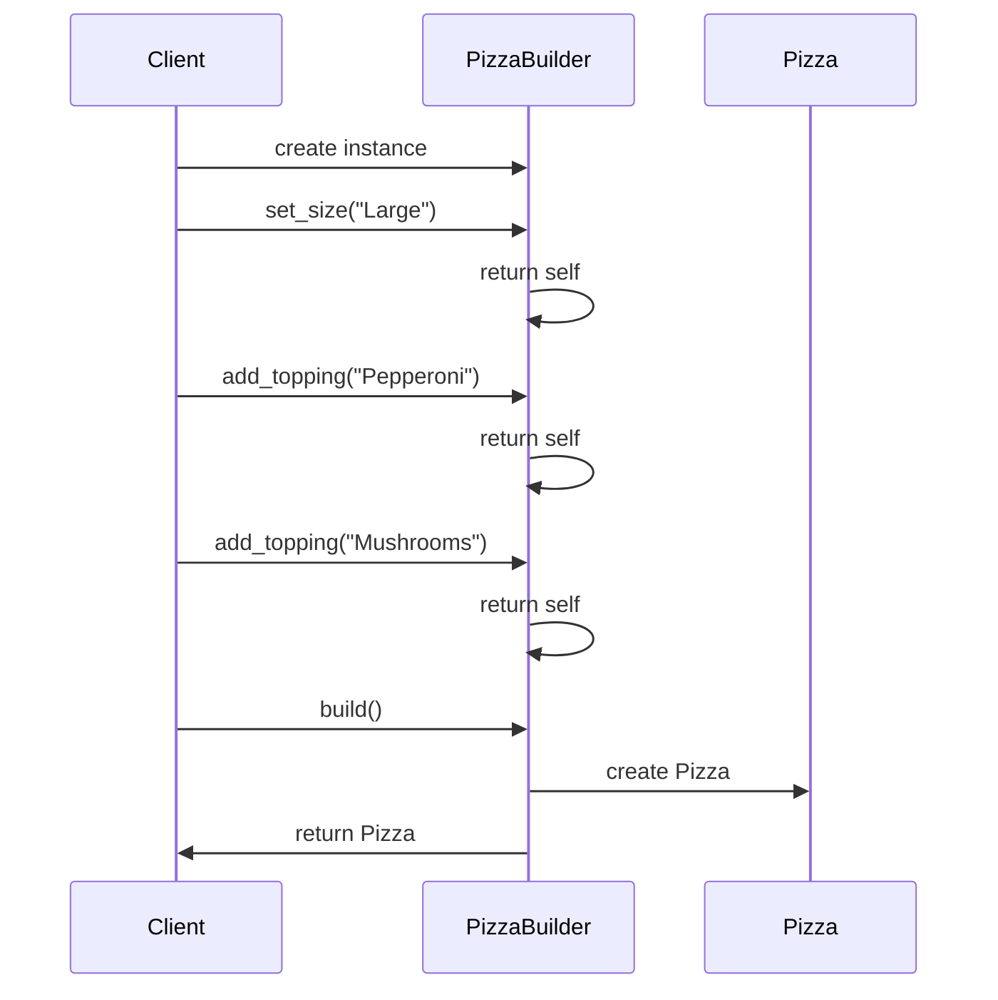

## 3.4.3 Fluent Interfaces

In the realm of software design, the quest for writing code that is both efficient and easy to read is ongoing. Fluent interfaces, a concept popularized by Martin Fowler and Eric Evans, offer a solution by enhancing code readability through method chaining. This approach is particularly useful in the context of the Builder pattern, where it can simplify the construction of complex objects. In this section, we will delve into the concept of fluent interfaces, explore how they relate to the Builder pattern, provide Python examples, and discuss their advantages and potential drawbacks.

### Understanding Fluent Interfaces

A fluent interface is a method of designing object-oriented APIs that rely on method chaining to achieve more readable code. The term "fluent" suggests smoothness and ease, akin to reading a sentence in natural language. By returning the object itself from each method call, fluent interfaces allow multiple method calls to be chained together in a single statement. This design pattern is particularly useful when configuring objects with multiple properties or performing a series of operations.

#### Key Characteristics of Fluent Interfaces

- **Method Chaining**: Each method returns the current object, allowing subsequent methods to be called on the same instance.
- **Readable Code**: The resulting code often resembles a series of declarative statements, improving readability.
- **Reduced Boilerplate**: Fluent interfaces can reduce the need for repetitive code, making the API more concise.

### Fluent Interfaces and the Builder Pattern

The Builder pattern is a creational design pattern that separates the construction of a complex object from its representation. It allows for step-by-step construction of objects, which is where fluent interfaces come into play. By using method chaining, the Builder pattern can offer a more intuitive and readable way to construct objects.

#### Example: Building a Fluent Interface in Python

Let's consider a simple example of a `PizzaBuilder` class that uses a fluent interface to construct a pizza with various toppings and sizes.

```python
class Pizza:
    def __init__(self):
        self.size = None
        self.toppings = []

    def __str__(self):
        return f"Pizza(size={self.size}, toppings={self.toppings})"

class PizzaBuilder:
    def __init__(self):
        self.pizza = Pizza()

    def set_size(self, size):
        self.pizza.size = size
        return self  # Return the builder instance for chaining

    def add_topping(self, topping):
        self.pizza.toppings.append(topping)
        return self  # Return the builder instance for chaining

    def build(self):
        return self.pizza

pizza = PizzaBuilder().set_size("Large").add_topping("Pepperoni").add_topping("Mushrooms").build()
print(pizza)
```

In this example, the `PizzaBuilder` class provides a fluent interface for constructing a `Pizza` object. Each method returns the builder instance, allowing method calls to be chained together in a natural and readable manner.

### Advantages of Fluent Interfaces

1. **Improved Readability**: Fluent interfaces make code more readable by allowing method calls to be chained together in a way that resembles natural language. This can make complex configurations easier to understand at a glance.

2. **Reduced Boilerplate Code**: By eliminating the need for repetitive code, fluent interfaces can make APIs more concise and reduce the likelihood of errors.

3. **Ease of Use**: Fluent interfaces can make APIs more intuitive and easier to use, especially for developers who are new to the codebase.

4. **Encapsulation**: Fluent interfaces can encapsulate complex operations within a single chain of method calls, reducing the need for external logic.

### Potential Drawbacks and Limitations

1. **Debugging Challenges**: Debugging method chains can be challenging, especially if an error occurs in the middle of a chain. It can be difficult to pinpoint the exact source of the problem.

2. **Readability Concerns**: While fluent interfaces can improve readability, excessively long method chains can become difficult to read and understand. It's important to strike a balance.

3. **Performance Overhead**: In some cases, the use of fluent interfaces can introduce performance overhead, particularly if the methods involve complex operations or side effects.

4. **Limited Flexibility**: Fluent interfaces can sometimes limit flexibility by enforcing a specific order of method calls. This can be mitigated by careful design.

### Best Practices for Designing Fluent Interfaces

1. **Keep Chains Short**: Aim to keep method chains short and focused. If a chain becomes too long, consider breaking it up into smaller, more manageable parts.

2. **Use Descriptive Method Names**: Choose method names that clearly describe their purpose and effect. This can enhance the readability of the method chain.

3. **Handle Errors Gracefully**: Implement error handling within the fluent interface to provide meaningful feedback when something goes wrong.

4. **Document the API**: Provide clear documentation for the fluent interface, including examples of how it should be used.

5. **Consider the User Experience**: Design the fluent interface with the end user in mind. Consider how the interface will be used in practice and strive to make it as intuitive as possible.

### Try It Yourself

To get a better understanding of fluent interfaces, try modifying the `PizzaBuilder` class to add more customization options, such as crust type or cooking time. Experiment with chaining different methods together and observe how the readability of the code changes.

### Visualizing Fluent Interfaces

To better understand the flow of method chaining in fluent interfaces, let's visualize the process using a sequence diagram.



This diagram illustrates how the client interacts with the `PizzaBuilder` class, chaining method calls together to construct a `Pizza` object.

### References and Links

For further reading on fluent interfaces and the Builder pattern, consider exploring the following resources:

- [Martin Fowler's article on Fluent Interfaces](https://martinfowler.com/bliki/FluentInterface.html)
- [Python Design Patterns: Builder](https://refactoring.guru/design-patterns/builder/python)
- [Python's Official Documentation](https://docs.python.org/3/)

### Knowledge Check

To reinforce your understanding of fluent interfaces, consider the following questions:

- What are the key characteristics of a fluent interface?
- How does method chaining improve code readability?
- What are some potential drawbacks of using fluent interfaces?
- How can you design a fluent interface to be both readable and flexible?

### Embrace the Journey

Remember, mastering fluent interfaces is just one step in your journey to becoming a proficient Python developer. As you continue to explore design patterns and best practices, you'll gain a deeper understanding of how to write clean, maintainable, and efficient code. Keep experimenting, stay curious, and enjoy the journey!

## Quiz Time!



### What is a fluent interface?

- [x] A design pattern that uses method chaining to improve code readability.
- [ ] A pattern that separates the construction of an object from its representation.
- [ ] A method for optimizing code performance.
- [ ] A way to handle errors in Python.

> **Explanation:** A fluent interface is a design pattern that uses method chaining to create more readable and intuitive code.

### How does a fluent interface relate to the Builder pattern?

- [x] It enhances the Builder pattern by allowing method chaining for object construction.
- [ ] It replaces the Builder pattern entirely.
- [ ] It is unrelated to the Builder pattern.
- [ ] It complicates the Builder pattern by adding unnecessary complexity.

> **Explanation:** Fluent interfaces enhance the Builder pattern by allowing method chaining, making the construction of complex objects more readable.

### What is a potential drawback of fluent interfaces?

- [x] Debugging method chains can be challenging.
- [ ] They always improve performance.
- [ ] They make code less readable.
- [ ] They eliminate the need for documentation.

> **Explanation:** Debugging method chains can be difficult, especially if an error occurs in the middle of a chain.

### What is a best practice when designing fluent interfaces?

- [x] Use descriptive method names to enhance readability.
- [ ] Avoid documenting the API.
- [ ] Keep method chains as long as possible.
- [ ] Ignore error handling within the interface.

> **Explanation:** Using descriptive method names helps improve the readability and usability of fluent interfaces.

### Which of the following is NOT an advantage of fluent interfaces?

- [ ] Improved readability.
- [ ] Reduced boilerplate code.
- [x] Increased performance overhead.
- [ ] Ease of use.

> **Explanation:** Fluent interfaces improve readability and reduce boilerplate code, but they can introduce performance overhead.

### What should each method in a fluent interface return?

- [x] The current object instance.
- [ ] A new object instance.
- [ ] None.
- [ ] A boolean value.

> **Explanation:** Each method in a fluent interface should return the current object instance to enable method chaining.

### Why is it important to keep method chains short?

- [x] To maintain readability and manageability.
- [ ] To increase the complexity of the code.
- [ ] To make debugging more difficult.
- [ ] To reduce the number of methods in a class.

> **Explanation:** Keeping method chains short helps maintain readability and manageability of the code.

### What is a common use case for fluent interfaces?

- [x] Configuring objects with multiple properties.
- [ ] Handling exceptions in Python.
- [ ] Optimizing algorithm performance.
- [ ] Writing low-level system code.

> **Explanation:** Fluent interfaces are commonly used for configuring objects with multiple properties due to their readability.

### How can you mitigate the debugging challenges of fluent interfaces?

- [x] Implement error handling within the interface.
- [ ] Avoid using fluent interfaces altogether.
- [ ] Use longer method chains.
- [ ] Ignore errors and continue execution.

> **Explanation:** Implementing error handling within the fluent interface can provide meaningful feedback and help mitigate debugging challenges.

### Fluent interfaces are most beneficial when:

- [x] The code requires configuring objects with multiple properties.
- [ ] The code is simple and does not require method chaining.
- [ ] The code needs to perform high-performance computations.
- [ ] The code is written in a functional programming style.

> **Explanation:** Fluent interfaces are most beneficial when configuring objects with multiple properties, as they improve readability and ease of use.


