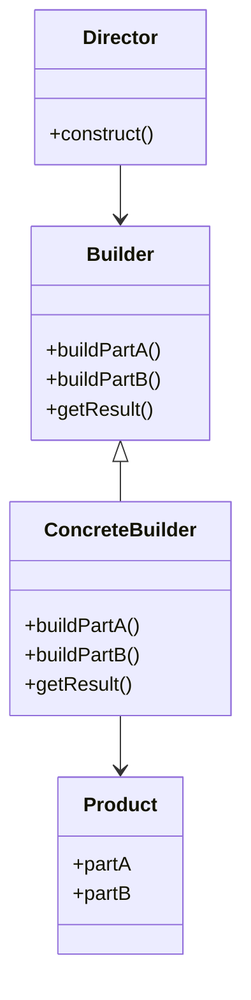

## 3.4.4 Use Cases and Examples

The Builder Pattern is a creational design pattern that provides a flexible solution to constructing complex objects. Unlike other creational patterns that focus on the instantiation process, the Builder Pattern separates the construction of a complex object from its representation, allowing the same construction process to create different representations. This makes it particularly useful in scenarios where an object can be configured in numerous ways.

### Understanding the Builder Pattern

Before diving into use cases, let's briefly recap the Builder Pattern's structure. The pattern typically involves the following components:

- **Builder**: An interface or abstract class that defines the steps to build the product.
- **Concrete Builder**: A class that implements the Builder interface and provides specific implementations for the building steps.
- **Product**: The complex object that is being built.
- **Director**: An optional component that orchestrates the building process using the Builder interface.

This separation of concerns allows for greater flexibility and control over the construction process, making it easier to manage complex configurations and optional parameters.

### Real-World Use Cases

#### 1. Constructing Complex UI Components

In modern software development, user interfaces (UIs) often require complex configurations. Consider a scenario where you need to build a customizable dialog box in a desktop application. The dialog box may have various optional components such as a title, message, buttons, icons, and input fields. Using the Builder Pattern, you can construct this dialog box step-by-step, allowing for different configurations without altering the client code.

```python
class DialogBuilder:
    def __init__(self):
        self.dialog = Dialog()

    def set_title(self, title):
        self.dialog.title = title
        return self

    def set_message(self, message):
        self.dialog.message = message
        return self

    def add_button(self, button):
        self.dialog.buttons.append(button)
        return self

    def set_icon(self, icon):
        self.dialog.icon = icon
        return self

    def build(self):
        return self.dialog

class Dialog:
    def __init__(self):
        self.title = None
        self.message = None
        self.buttons = []
        self.icon = None

dialog_builder = DialogBuilder()
dialog = (dialog_builder.set_title("Warning")
          .set_message("Are you sure you want to delete this file?")
          .add_button("Yes")
          .add_button("No")
          .set_icon("warning_icon.png")
          .build())
```

In this example, the `DialogBuilder` class provides methods to configure different parts of the dialog box. The `build()` method returns the fully constructed `Dialog` object. This approach simplifies the creation process and makes it easy to handle optional components.

#### 2. Assembling Query Objects

Another common use case for the Builder Pattern is constructing complex query objects, especially in applications that interact with databases. Consider a scenario where you need to build SQL queries dynamically based on user input or application state. The Builder Pattern can help manage the complexity of query construction, ensuring that queries are built correctly and efficiently.

```python
class SQLQueryBuilder:
    def __init__(self):
        self.query = SQLQuery()

    def select(self, *fields):
        self.query.fields = fields
        return self

    def from_table(self, table):
        self.query.table = table
        return self

    def where(self, condition):
        self.query.conditions.append(condition)
        return self

    def order_by(self, field):
        self.query.order_by = field
        return self

    def build(self):
        query_string = f"SELECT {', '.join(self.query.fields)} FROM {self.query.table}"
        if self.query.conditions:
            query_string += f" WHERE {' AND '.join(self.query.conditions)}"
        if self.query.order_by:
            query_string += f" ORDER BY {self.query.order_by}"
        return query_string

class SQLQuery:
    def __init__(self):
        self.fields = []
        self.table = None
        self.conditions = []
        self.order_by = None

query_builder = SQLQueryBuilder()
query = (query_builder.select("id", "name", "email")
         .from_table("users")
         .where("age > 18")
         .where("country = 'USA'")
         .order_by("name")
         .build())

print(query)  # Outputs: SELECT id, name, email FROM users WHERE age > 18 AND country = 'USA' ORDER BY name
```

Here, the `SQLQueryBuilder` class allows for the step-by-step construction of an SQL query. This approach not only simplifies query creation but also ensures that the query is syntactically correct.

#### 3. Building Configuration Objects

In software systems, configuration objects are often used to manage application settings. These objects can become complex, with numerous optional parameters and default values. The Builder Pattern can help manage this complexity by providing a clear and flexible way to construct configuration objects.

```python
class ConfigBuilder:
    def __init__(self):
        self.config = Config()

    def set_database(self, db_name):
        self.config.database = db_name
        return self

    def set_user(self, user):
        self.config.user = user
        return self

    def set_password(self, password):
        self.config.password = password
        return self

    def set_host(self, host):
        self.config.host = host
        return self

    def set_port(self, port):
        self.config.port = port
        return self

    def build(self):
        return self.config

class Config:
    def __init__(self):
        self.database = None
        self.user = None
        self.password = None
        self.host = None
        self.port = None

config_builder = ConfigBuilder()
config = (config_builder.set_database("my_database")
          .set_user("admin")
          .set_password("secret")
          .set_host("localhost")
          .set_port(5432)
          .build())
```

In this example, the `ConfigBuilder` class provides methods to set various configuration options. The `build()` method returns the fully constructed `Config` object. This approach makes it easy to handle optional parameters and default values.

### Simplifying Object Creation

The Builder Pattern simplifies the creation process by breaking it down into discrete steps. This approach offers several benefits:

- **Clarity**: The step-by-step construction process is easy to understand and follow.
- **Flexibility**: Different configurations can be created without altering the client code.
- **Maintainability**: Changes to the construction process are localized to the builder class, reducing the impact on other parts of the codebase.

### Handling Optional Parameters and Configuration Options

One of the key advantages of the Builder Pattern is its ability to handle optional parameters and configuration options effectively. By providing methods for each optional parameter, the pattern allows clients to specify only the parameters they need, while default values can be set for others.

### Identifying Opportunities to Apply the Builder Pattern

When considering whether to apply the Builder Pattern in your projects, look for the following characteristics:

- **Complex Objects**: The object being constructed has numerous components or configuration options.
- **Step-by-Step Construction**: The construction process can be broken down into discrete steps.
- **Optional Parameters**: The object has optional parameters or configuration options.
- **Multiple Representations**: The same construction process can create different representations of the object.

### Try It Yourself

To solidify your understanding of the Builder Pattern, try modifying the examples provided:

- **UI Components**: Add additional components to the dialog box, such as checkboxes or dropdown menus.
- **Query Objects**: Extend the SQL query builder to support additional SQL features, such as JOINs or GROUP BY clauses.
- **Configuration Objects**: Add more configuration options to the configuration builder, such as SSL settings or connection timeouts.

### Visualizing the Builder Pattern

To better understand the Builder Pattern, let's visualize its structure using a class diagram:



In this diagram, the `Director` orchestrates the construction process using the `Builder` interface. The `ConcreteBuilder` class provides specific implementations for the building steps, and the `Product` class represents the complex object being built.

### References and Links

For further reading on the Builder Pattern and its applications, consider the following resources:

- [Design Patterns: Elements of Reusable Object-Oriented Software](https://en.wikipedia.org/wiki/Design_Patterns) by Erich Gamma, Richard Helm, Ralph Johnson, and John Vlissides.
- [Python Design Patterns](https://refactoring.guru/design-patterns/python) on Refactoring.Guru.
- [Creational Design Patterns](https://www.tutorialspoint.com/design_pattern/creational_patterns.htm) on TutorialsPoint.

### Knowledge Check

To reinforce your understanding of the Builder Pattern, consider the following questions:

- What are the key components of the Builder Pattern?
- How does the Builder Pattern simplify the construction of complex objects?
- In what scenarios is the Builder Pattern most useful?
- How does the Builder Pattern handle optional parameters and configuration options?
- Can the Builder Pattern be used to create multiple representations of an object?

### Embrace the Journey

Remember, mastering design patterns is a journey. As you continue to explore and apply the Builder Pattern in your projects, you'll gain a deeper understanding of its benefits and nuances. Keep experimenting, stay curious, and enjoy the journey!

## Quiz Time!



### What is the primary purpose of the Builder Pattern?

- [x] To construct complex objects step-by-step.
- [ ] To ensure a class has only one instance.
- [ ] To provide a simplified interface to a complex subsystem.
- [ ] To allow incompatible interfaces to work together.

> **Explanation:** The Builder Pattern's primary purpose is to construct complex objects step-by-step, allowing for flexible and customizable object creation.

### Which component of the Builder Pattern is responsible for orchestrating the construction process?

- [x] Director
- [ ] Builder
- [ ] Concrete Builder
- [ ] Product

> **Explanation:** The Director is responsible for orchestrating the construction process using the Builder interface.

### How does the Builder Pattern handle optional parameters?

- [x] By providing methods for each optional parameter, allowing clients to specify only the parameters they need.
- [ ] By using default constructors.
- [ ] By requiring all parameters to be specified at once.
- [ ] By using global variables.

> **Explanation:** The Builder Pattern handles optional parameters by providing methods for each optional parameter, allowing clients to specify only the parameters they need.

### In which scenario is the Builder Pattern most useful?

- [x] When constructing complex objects with numerous components or configuration options.
- [ ] When ensuring a class has only one instance.
- [ ] When providing a simplified interface to a complex subsystem.
- [ ] When allowing incompatible interfaces to work together.

> **Explanation:** The Builder Pattern is most useful when constructing complex objects with numerous components or configuration options.

### What is the role of the Concrete Builder in the Builder Pattern?

- [x] To provide specific implementations for the building steps.
- [ ] To orchestrate the construction process.
- [ ] To represent the complex object being built.
- [ ] To define the steps to build the product.

> **Explanation:** The Concrete Builder provides specific implementations for the building steps, constructing the product.

### Can the Builder Pattern be used to create multiple representations of an object?

- [x] Yes
- [ ] No

> **Explanation:** Yes, the Builder Pattern can be used to create multiple representations of an object by using different builders or configurations.

### Which of the following is NOT a benefit of the Builder Pattern?

- [ ] Clarity
- [ ] Flexibility
- [ ] Maintainability
- [x] Redundancy

> **Explanation:** The Builder Pattern provides clarity, flexibility, and maintainability, but not redundancy.

### What is the advantage of using a Director in the Builder Pattern?

- [x] It centralizes the construction process, making it easier to manage.
- [ ] It provides default values for optional parameters.
- [ ] It ensures the object has only one instance.
- [ ] It simplifies the interface to a complex subsystem.

> **Explanation:** The Director centralizes the construction process, making it easier to manage and orchestrate the building steps.

### How does the Builder Pattern simplify object creation?

- [x] By breaking it down into discrete steps.
- [ ] By using global variables.
- [ ] By requiring all parameters to be specified at once.
- [ ] By using default constructors.

> **Explanation:** The Builder Pattern simplifies object creation by breaking it down into discrete steps, making the process clearer and more manageable.

### True or False: The Builder Pattern is only useful for constructing UI components.

- [ ] True
- [x] False

> **Explanation:** False. The Builder Pattern is useful for constructing any complex object, not just UI components, including query objects, configuration objects, and more.


