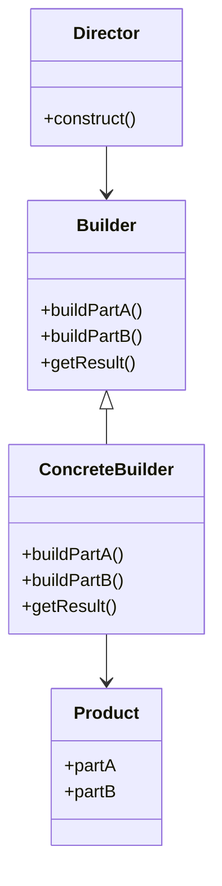
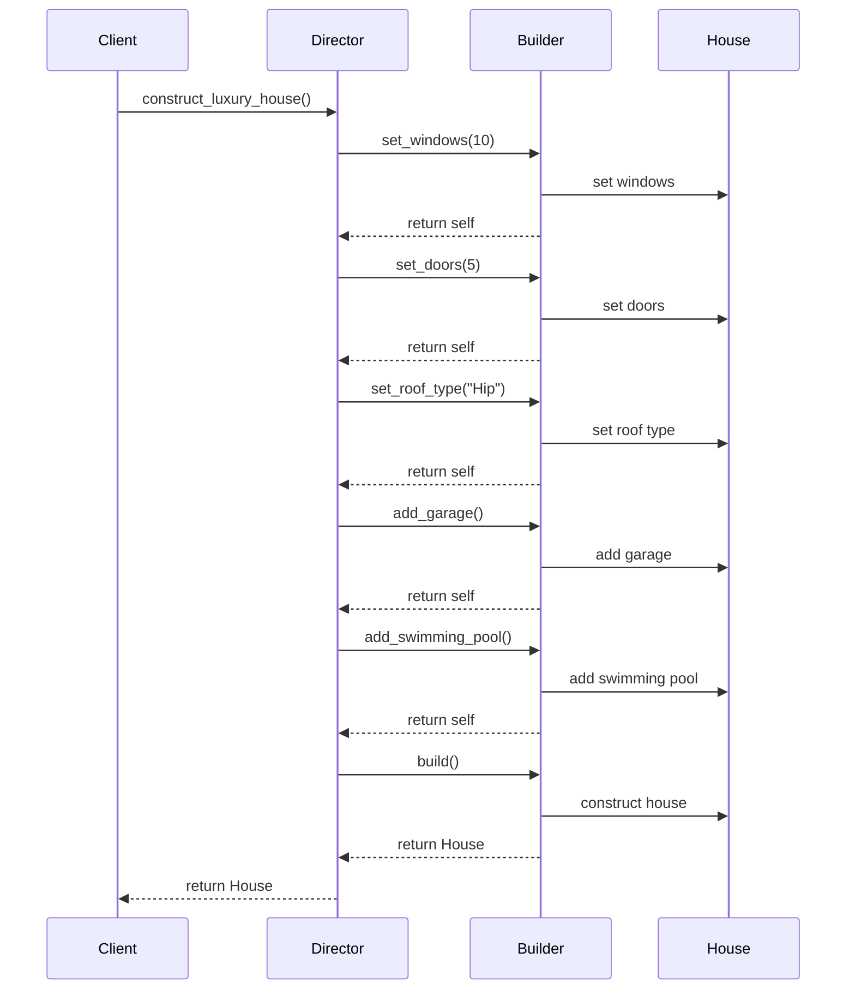

## 3.4 Builder Pattern

In the realm of software design, creating complex objects can often lead to convoluted and hard-to-maintain code. The Builder Pattern offers a solution by separating the construction of a complex object from its representation, allowing the same construction process to create different representations. This pattern is particularly useful when dealing with objects that require numerous optional parameters or intricate configurations.

### Understanding the Problem

When constructing objects with multiple attributes, especially those with optional parameters, the code can become cumbersome and error-prone. Consider a scenario where you need to create a `House` object with attributes like `windows`, `doors`, `roofType`, `hasGarage`, `hasSwimmingPool`, and more. Using a simple constructor with numerous parameters can lead to confusion and potential errors, especially when many parameters are optional or have default values.

### The Builder Pattern Solution

The Builder Pattern addresses this issue by providing a way to construct a complex object step by step. It allows for greater control over the construction process, enabling you to create different representations of an object using the same construction code.

#### Key Components of the Builder Pattern

1. **Builder Interface**: Defines the steps required to build the product.
2. **Concrete Builder**: Implements the builder interface and constructs the product's parts.
3. **Director**: Constructs an object using the builder interface.
4. **Product**: The complex object being built.

### Class Diagram

To better understand the Builder Pattern, let's visualize its structure using a class diagram:



### Implementing the Builder Pattern in Python

Let's implement the Builder Pattern in Python with a practical example of constructing a `House` object.

```python
class House:
    def __init__(self):
        self.windows = None
        self.doors = None
        self.roof_type = None
        self.has_garage = False
        self.has_swimming_pool = False

    def __str__(self):
        return (f"House with {self.windows} windows, {self.doors} doors, "
                f"roof type: {self.roof_type}, "
                f"garage: {'Yes' if self.has_garage else 'No'}, "
                f"swimming pool: {'Yes' if self.has_swimming_pool else 'No'}")


class HouseBuilder:
    def __init__(self):
        self.house = House()

    def set_windows(self, windows):
        self.house.windows = windows
        return self

    def set_doors(self, doors):
        self.house.doors = doors
        return self

    def set_roof_type(self, roof_type):
        self.house.roof_type = roof_type
        return self

    def add_garage(self):
        self.house.has_garage = True
        return self

    def add_swimming_pool(self):
        self.house.has_swimming_pool = True
        return self

    def build(self):
        return self.house


class Director:
    def __init__(self, builder):
        self.builder = builder

    def construct_simple_house(self):
        return self.builder.set_windows(4).set_doors(2).set_roof_type("Gable").build()

    def construct_luxury_house(self):
        return (self.builder.set_windows(10)
                .set_doors(5)
                .set_roof_type("Hip")
                .add_garage()
                .add_swimming_pool()
                .build())


builder = HouseBuilder()
director = Director(builder)

simple_house = director.construct_simple_house()
print(simple_house)

luxury_house = director.construct_luxury_house()
print(luxury_house)
```

### Explanation of the Code

- **House Class**: Represents the product being built. It has attributes for windows, doors, roof type, and optional features like a garage and swimming pool.
- **HouseBuilder Class**: Implements the builder interface. It provides methods to set various attributes of the `House` object and returns `self` to allow method chaining (Fluent Interface style).
- **Director Class**: Uses the builder to construct different types of houses. It defines methods like `construct_simple_house` and `construct_luxury_house` to build specific configurations.
- **Fluent Interface**: The builder methods return `self`, enabling method chaining, which improves code readability and allows for a more intuitive construction process.

### Builder vs. Factory Patterns

While both Builder and Factory patterns are creational patterns, they serve different purposes:

- **Factory Pattern**: Focuses on creating objects without exposing the instantiation logic. It is best suited for scenarios where the creation logic is simple and the object can be created in one step.
- **Builder Pattern**: Ideal for constructing complex objects step by step. It provides more control over the construction process and is suitable for objects with numerous optional parameters or configurations.

### Improving Code Readability and Maintenance

The Builder Pattern enhances code readability by clearly separating the construction logic from the representation. It allows developers to construct complex objects in a controlled manner, reducing the likelihood of errors and making the codebase easier to maintain.

### Fluent Interface Style

The Fluent Interface style, used in our `HouseBuilder` example, allows for a more natural and readable way of constructing objects. By returning `self` from each method, we can chain method calls, leading to cleaner and more expressive code.

### Try It Yourself

Experiment with the code by adding new features to the `House` class, such as `hasGarden` or `hasBasement`. Modify the `HouseBuilder` class to include methods for these new features and update the `Director` class to construct houses with these additional features.

### Visualizing the Builder Pattern in Action

To further illustrate how the Builder Pattern works, let's visualize the process of constructing a house using a sequence diagram:



### Knowledge Check

- **Question**: What is the primary advantage of using the Builder Pattern over a simple constructor with many parameters?
- **Answer**: The Builder Pattern allows for more flexible and readable object construction, especially when dealing with complex objects with numerous optional parameters.

- **Question**: How does the Fluent Interface style enhance the Builder Pattern?
- **Answer**: It improves code readability and expressiveness by allowing method chaining, making the construction process more intuitive.

### References and Further Reading

- [Python Design Patterns](https://refactoring.guru/design-patterns/python)
- [Fluent Interface Pattern](https://martinfowler.com/bliki/FluentInterface.html)

## Quiz Time!



### What is the primary purpose of the Builder Pattern?

- [x] To separate the construction of a complex object from its representation.
- [ ] To create objects without exposing the instantiation logic.
- [ ] To provide a single interface for creating related objects.
- [ ] To allow incompatible interfaces to work together.

> **Explanation:** The Builder Pattern is designed to separate the construction of a complex object from its representation, allowing for flexible and controlled object creation.

### Which component of the Builder Pattern is responsible for defining the steps to build the product?

- [ ] Director
- [x] Builder Interface
- [ ] Concrete Builder
- [ ] Product

> **Explanation:** The Builder Interface defines the steps required to build the product, which are then implemented by the Concrete Builder.

### How does the Fluent Interface style benefit the Builder Pattern?

- [x] It allows for method chaining, improving code readability.
- [ ] It reduces the number of classes needed.
- [ ] It simplifies the instantiation logic.
- [ ] It enforces type safety.

> **Explanation:** The Fluent Interface style allows for method chaining, making the code more readable and expressive by enabling a more natural flow of method calls.

### What is the role of the Director in the Builder Pattern?

- [x] To construct an object using the builder interface.
- [ ] To implement the builder interface.
- [ ] To define the steps required to build the product.
- [ ] To represent the complex object being built.

> **Explanation:** The Director constructs an object using the builder interface, orchestrating the building process.

### In what scenario is the Builder Pattern more suitable than the Factory Pattern?

- [x] When constructing objects with numerous optional parameters.
- [ ] When creating objects with a single step.
- [ ] When dealing with simple object creation.
- [ ] When needing to enforce a single instance of a class.

> **Explanation:** The Builder Pattern is more suitable for constructing objects with numerous optional parameters or complex configurations, where step-by-step construction is beneficial.

### Which of the following is NOT a component of the Builder Pattern?

- [ ] Director
- [ ] Builder Interface
- [ ] Concrete Builder
- [x] Singleton

> **Explanation:** The Singleton is not a component of the Builder Pattern. The Builder Pattern consists of the Director, Builder Interface, Concrete Builder, and Product.

### What is the main difference between the Builder and Factory Patterns?

- [x] The Builder Pattern constructs complex objects step by step, while the Factory Pattern creates objects in one step.
- [ ] The Builder Pattern is used for simple objects, while the Factory Pattern is for complex objects.
- [ ] The Builder Pattern focuses on object instantiation, while the Factory Pattern focuses on object construction.
- [ ] The Builder Pattern is used for creating a single instance, while the Factory Pattern is for multiple instances.

> **Explanation:** The Builder Pattern constructs complex objects step by step, providing more control over the construction process, while the Factory Pattern creates objects in one step.

### How does the Builder Pattern improve code maintenance?

- [x] By separating construction logic from representation, making the codebase easier to manage.
- [ ] By reducing the number of classes needed.
- [ ] By enforcing strict type checking.
- [ ] By simplifying the instantiation logic.

> **Explanation:** By separating construction logic from representation, the Builder Pattern makes the codebase easier to manage and maintain.

### What is the benefit of using a Director in the Builder Pattern?

- [x] It orchestrates the building process, ensuring the correct sequence of construction steps.
- [ ] It implements the builder interface.
- [ ] It defines the steps required to build the product.
- [ ] It represents the complex object being built.

> **Explanation:** The Director orchestrates the building process, ensuring that the construction steps are executed in the correct sequence.

### True or False: The Builder Pattern is ideal for objects with a fixed set of parameters.

- [ ] True
- [x] False

> **Explanation:** False. The Builder Pattern is ideal for objects with numerous optional parameters or complex configurations, not for objects with a fixed set of parameters.



Remember, this is just the beginning. As you progress, you'll build more complex and interactive applications using the Builder Pattern. Keep experimenting, stay curious, and enjoy the journey!
