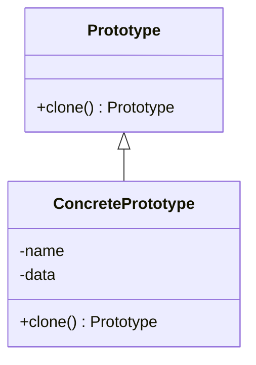

## 3.5.1 Implementing Prototype in Python

The Prototype Pattern is a creational design pattern that allows you to create new objects by copying an existing object, known as the prototype. This pattern is particularly useful when the cost of creating a new instance of an object is more expensive than copying an existing one. In Python, the `copy` module provides a convenient way to implement this pattern, offering both shallow and deep copy functionalities.

### Understanding the Prototype Pattern

The Prototype Pattern involves creating new objects by duplicating an existing object, the prototype. This approach is beneficial when the initialization of an object is resource-intensive, or when you want to avoid the complexity of creating a new instance from scratch. By using the Prototype Pattern, you can create a new object with the same properties as the prototype, with the option to modify it as needed.

### Key Concepts

- **Prototype**: The original object that is copied to create new instances.
- **Cloning**: The process of creating a copy of the prototype object.
- **Shallow Copy**: A copy where the new object is a new instance, but its attributes are references to the same objects as the original.
- **Deep Copy**: A copy where the new object and all objects referenced by its attributes are new instances.

### Implementing the Prototype Pattern in Python

To implement the Prototype Pattern in Python, we will use the `copy` module, which provides two methods: `copy()` for shallow copying and `deepcopy()` for deep copying.

#### Step 1: Define the Prototype Interface

First, let's define a simple interface for our prototype. In Python, this can be done using a base class with a `clone` method.

```python
import copy

class Prototype:
    def clone(self):
        raise NotImplementedError("Clone method not implemented!")
```

#### Step 2: Create a Concrete Prototype

Next, we create a concrete class that implements the `Prototype` interface. This class will have attributes that we want to clone.

```python
class ConcretePrototype(Prototype):
    def __init__(self, name, data):
        self.name = name
        self.data = data

    def clone(self):
        # Use shallow copy by default
        return copy.copy(self)

    def __str__(self):
        return f"ConcretePrototype(name={self.name}, data={self.data})"
```

#### Step 3: Demonstrate Cloning

Let's demonstrate how cloning works with both shallow and deep copies.

```python
original = ConcretePrototype("Original", [1, 2, 3])

shallow_copied = original.clone()

original.data.append(4)

print("Original:", original)
print("Shallow Copied:", shallow_copied)
```

**Output:**

```
Original: ConcretePrototype(name=Original, data=[1, 2, 3, 4])
Shallow Copied: ConcretePrototype(name=Original, data=[1, 2, 3, 4])
```

In this example, both the original and the shallow copied object share the same list. Modifications to the list in the original object are reflected in the shallow copy.

#### Step 4: Implement Deep Copy

To avoid shared references, use deep copying.

```python
class ConcretePrototype(Prototype):
    def __init__(self, name, data):
        self.name = name
        self.data = data

    def clone(self, deep=False):
        if deep:
            return copy.deepcopy(self)
        return copy.copy(self)

deep_copied = original.clone(deep=True)

original.data.append(5)

print("Original:", original)
print("Deep Copied:", deep_copied)
```

**Output:**

```
Original: ConcretePrototype(name=Original, data=[1, 2, 3, 4, 5])
Deep Copied: ConcretePrototype(name=Original, data=[1, 2, 3, 4])
```

Here, the deep copy does not reflect changes made to the original object's data, as it has its own copy of the list.

### Considerations for Cloning

When implementing the Prototype Pattern, consider the following:

- **Mutable vs. Immutable Attributes**: Immutable attributes (e.g., integers, strings) are safe to share between copies, while mutable attributes (e.g., lists, dictionaries) may require deep copying to avoid unintended side effects.
- **Customizing the Cloning Process**: You can customize the cloning process by overriding the `clone` method to include additional logic, such as resetting certain attributes or initializing new resources.

### Customizing the Cloning Process

Sometimes, you may need to customize the cloning process to fit specific requirements. For example, you might want to reset certain attributes or initialize new resources during cloning.

```python
class CustomPrototype(Prototype):
    def __init__(self, name, data, timestamp):
        self.name = name
        self.data = data
        self.timestamp = timestamp

    def clone(self, deep=False):
        cloned_obj = copy.deepcopy(self) if deep else copy.copy(self)
        # Reset the timestamp for the cloned object
        cloned_obj.timestamp = None
        return cloned_obj

    def __str__(self):
        return f"CustomPrototype(name={self.name}, data={self.data}, timestamp={self.timestamp})"
```

In this example, the `timestamp` attribute is reset to `None` during cloning, ensuring that the cloned object starts with a fresh timestamp.

### Visualizing the Prototype Pattern

To better understand the Prototype Pattern, let's visualize the process of cloning objects using a class diagram.



**Diagram Description**: This class diagram shows the relationship between the `Prototype` interface and the `ConcretePrototype` class. The `ConcretePrototype` class implements the `clone` method, allowing it to create copies of itself.

### Try It Yourself

To deepen your understanding of the Prototype Pattern, try modifying the code examples:

- **Experiment with Different Data Types**: Use different data types for the `data` attribute, such as dictionaries or custom objects, and observe how shallow and deep copying affects them.
- **Add New Attributes**: Add new attributes to the `ConcretePrototype` class and customize the `clone` method to handle them.
- **Implement a Prototype Registry**: Create a registry of prototype objects that can be cloned on demand, allowing you to manage and reuse prototypes efficiently.

### References and Links

- [Python's `copy` Module Documentation](https://docs.python.org/3/library/copy.html)
- [Design Patterns: Elements of Reusable Object-Oriented Software](https://en.wikipedia.org/wiki/Design_Patterns) by Erich Gamma, Richard Helm, Ralph Johnson, and John Vlissides

### Knowledge Check

Before moving on, let's review some key points:

- The Prototype Pattern is useful for creating new objects by copying an existing prototype.
- Shallow copies share references to mutable objects, while deep copies create independent copies.
- Customizing the cloning process allows you to reset or initialize attributes as needed.

### Embrace the Journey

Remember, mastering design patterns is a journey. As you continue to explore and implement patterns, you'll gain a deeper understanding of their benefits and applications. Keep experimenting, stay curious, and enjoy the process of enhancing your software design skills!

## Quiz Time!



### What is the primary purpose of the Prototype Pattern?

- [x] To create new objects by copying an existing prototype.
- [ ] To define a family of algorithms and make them interchangeable.
- [ ] To separate the construction of a complex object from its representation.
- [ ] To provide a simplified interface to a complex subsystem.

> **Explanation:** The Prototype Pattern is used to create new objects by duplicating an existing object, the prototype.

### Which Python module is commonly used to implement the Prototype Pattern?

- [x] `copy`
- [ ] `collections`
- [ ] `functools`
- [ ] `itertools`

> **Explanation:** The `copy` module in Python provides functionalities for both shallow and deep copying, which are essential for implementing the Prototype Pattern.

### What is the difference between shallow copy and deep copy?

- [x] Shallow copy shares references to mutable objects, while deep copy creates independent copies.
- [ ] Shallow copy creates independent copies, while deep copy shares references to mutable objects.
- [ ] Both shallow and deep copy create independent copies.
- [ ] Both shallow and deep copy share references to mutable objects.

> **Explanation:** Shallow copy creates a new object but shares references to the same objects as the original, while deep copy creates a completely independent copy of the object and its attributes.

### How can you customize the cloning process in the Prototype Pattern?

- [x] By overriding the `clone` method to include additional logic.
- [ ] By using the `functools` module to wrap the clone method.
- [ ] By implementing a singleton pattern within the prototype.
- [ ] By using the `itertools` module to iterate over the prototype attributes.

> **Explanation:** Customizing the cloning process involves overriding the `clone` method to include logic for resetting or initializing attributes as needed.

### What happens when you modify a mutable attribute in a shallow copy?

- [x] The modification is reflected in both the original and the shallow copy.
- [ ] The modification is only reflected in the shallow copy.
- [ ] The modification is only reflected in the original object.
- [ ] The modification causes an error.

> **Explanation:** In a shallow copy, mutable attributes are shared between the original and the copy, so changes to these attributes affect both objects.

### Which method would you use to create a deep copy of an object in Python?

- [x] `copy.deepcopy()`
- [ ] `copy.copy()`
- [ ] `functools.partial()`
- [ ] `itertools.chain()`

> **Explanation:** The `copy.deepcopy()` method is used to create a deep copy of an object, ensuring that all objects referenced by its attributes are also copied.

### Why might you choose to reset certain attributes during the cloning process?

- [x] To ensure the cloned object starts with a fresh state.
- [ ] To avoid errors during the cloning process.
- [ ] To improve the performance of the cloning operation.
- [ ] To ensure the cloned object is identical to the original.

> **Explanation:** Resetting certain attributes during cloning ensures that the cloned object starts with a fresh state, which can be important for attributes like timestamps or identifiers.

### What is a potential use case for the Prototype Pattern?

- [x] Creating multiple copies of a complex object with different states.
- [ ] Managing access to a resource by multiple clients.
- [ ] Separating the interface from the implementation.
- [ ] Defining a one-to-many dependency between objects.

> **Explanation:** The Prototype Pattern is useful for creating multiple copies of a complex object, allowing each copy to have different states or configurations.

### Can the Prototype Pattern be used with immutable objects?

- [x] True
- [ ] False

> **Explanation:** The Prototype Pattern can be used with immutable objects, as they are safe to share between copies without risk of unintended side effects.

### What is the benefit of using a prototype registry?

- [x] It allows efficient management and reuse of prototype objects.
- [ ] It ensures that only one instance of the prototype exists.
- [ ] It simplifies the process of creating new prototypes.
- [ ] It automatically updates all copies when the prototype changes.

> **Explanation:** A prototype registry allows efficient management and reuse of prototype objects, enabling you to clone them on demand.


