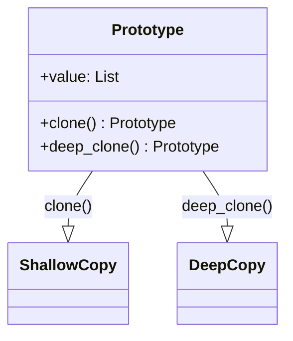

## 3.5.2 Cloning Objects

In the realm of software design, the Prototype Pattern stands out as a powerful tool for creating objects based on a template of an existing object, known as the prototype. This approach allows developers to clone objects without delving into their concrete classes, offering a level of abstraction that simplifies the creation process and adheres to the Open/Closed Principle. In this section, we will explore the benefits of cloning, the scenarios where it is preferable to instantiation, and the potential challenges related to identity and state.

### Understanding the Prototype Pattern

The Prototype Pattern is a creational design pattern that enables the creation of new objects by copying an existing object, the prototype. This pattern is particularly useful when the cost of creating a new instance of an object is more expensive than copying an existing one. By utilizing the Prototype Pattern, developers can create new instances with the same properties and behaviors as the original object, without needing to know the details of the object's class.

#### Benefits of Cloning in Terms of Abstraction

1. **Decoupling from Concrete Classes**: Cloning allows developers to work with objects without needing to know their concrete classes. This abstraction is beneficial in scenarios where the object creation logic is complex or when the object's class hierarchy is deep and intricate.

2. **Flexibility and Reusability**: By using a prototype, developers can easily create variations of an object by modifying the prototype before cloning. This approach enhances flexibility and reusability, as the same prototype can be used to create multiple objects with slight variations.

3. **Adherence to the Open/Closed Principle**: The Prototype Pattern supports the Open/Closed Principle by allowing new object types to be introduced without altering existing code. This is achieved by creating new prototypes for new object types, thus extending the system's functionality without modifying its structure.

### When Cloning is Preferable to Instantiation

Cloning is often preferable to instantiation in scenarios where:

- **Complex Initialization**: If an object requires a complex initialization process, cloning an existing, fully initialized object can be more efficient than recreating it from scratch.

- **Performance Optimization**: In performance-critical applications, cloning can reduce the overhead associated with object creation, especially when dealing with large numbers of objects or objects with expensive construction processes.

- **Prototypical Inheritance**: In systems that employ prototypical inheritance, cloning allows for the creation of new objects that inherit properties and behaviors from a prototype, facilitating the creation of object hierarchies.

### Implementing Cloning in Python

Python provides built-in support for object copying through the `copy` module, which includes `copy()` for shallow copies and `deepcopy()` for deep copies. Let's explore how these methods can be used to implement the Prototype Pattern in Python.

#### Shallow vs. Deep Copy

- **Shallow Copy**: Creates a new object, but inserts references to the objects found in the original. Changes to mutable objects in the shallow copy will reflect in the original.

- **Deep Copy**: Creates a new object and recursively copies all objects found in the original, ensuring that changes to mutable objects in the deep copy do not affect the original.

```python
import copy

class Prototype:
    def __init__(self, value):
        self.value = value

    def clone(self):
        # Use copy for shallow copy
        return copy.copy(self)

    def deep_clone(self):
        # Use deepcopy for deep copy
        return copy.deepcopy(self)

original = Prototype([1, 2, 3])

shallow_copied = original.clone()
deep_copied = original.deep_clone()

original.value.append(4)

print("Original:", original.value)  # Output: [1, 2, 3, 4]
print("Shallow Copy:", shallow_copied.value)  # Output: [1, 2, 3, 4]
print("Deep Copy:", deep_copied.value)  # Output: [1, 2, 3]
```

In this example, modifying the original object's value affects the shallow copy but not the deep copy, illustrating the difference between the two methods.

### Potential Issues with Identity and State

While cloning offers numerous benefits, it also introduces potential issues related to identity and state:

1. **Identity Confusion**: Cloned objects may share the same identity as the original, leading to confusion when comparing objects or managing object references. Developers must ensure that cloned objects are treated as distinct entities.

2. **State Synchronization**: Changes to the state of a cloned object may inadvertently affect the original object, especially in shallow copies. This issue can be mitigated by using deep copies or carefully managing object references.

3. **Resource Management**: Cloning objects that manage external resources (e.g., file handles, network connections) can lead to resource conflicts or leaks. Developers should implement mechanisms to manage resources independently for each cloned object.

### Visualizing the Cloning Process

To better understand the cloning process, let's visualize the relationship between the original object and its clones using a class diagram.



This diagram illustrates the Prototype class and its relationship with the shallow and deep copies. The `clone()` method creates a shallow copy, while the `deep_clone()` method creates a deep copy.

### Try It Yourself

To solidify your understanding of the Prototype Pattern and object cloning, try modifying the code examples provided:

- **Experiment with Different Data Types**: Modify the `value` attribute to use different data types (e.g., dictionaries, custom objects) and observe how shallow and deep copies behave.

- **Implement Custom Cloning Logic**: Override the `clone()` and `deep_clone()` methods to implement custom cloning logic for complex objects.

- **Manage Resources**: Add resource management logic to the Prototype class and ensure that resources are handled correctly in cloned objects.

### References and Further Reading

For more information on object cloning and the Prototype Pattern, consider exploring the following resources:

- [Python's `copy` Module Documentation](https://docs.python.org/3/library/copy.html)
- [Design Patterns: Elements of Reusable Object-Oriented Software](https://www.amazon.com/Design-Patterns-Elements-Reusable-Object-Oriented/dp/0201633612) by Erich Gamma et al.
- [Python Design Patterns: A Guide to Creating Elegant and Efficient Code](https://realpython.com/tutorials/design-patterns/) on Real Python

### Knowledge Check

To reinforce your understanding of the Prototype Pattern and object cloning, consider the following questions:

1. What are the key differences between shallow and deep copies?
2. How does the Prototype Pattern support the Open/Closed Principle?
3. In what scenarios is cloning preferable to instantiation?
4. What potential issues can arise when cloning objects, and how can they be mitigated?

### Embrace the Journey

Remember, mastering design patterns like the Prototype Pattern is a journey. As you continue to explore and experiment with these concepts, you'll gain a deeper understanding of how to create efficient, maintainable, and scalable software. Keep experimenting, stay curious, and enjoy the journey!

## Quiz Time!



### What is the primary benefit of using the Prototype Pattern?

- [x] It allows for object creation without knowing their concrete classes.
- [ ] It simplifies the inheritance hierarchy.
- [ ] It reduces the need for interfaces.
- [ ] It eliminates the need for constructors.

> **Explanation:** The Prototype Pattern enables the creation of objects by cloning existing ones, thus abstracting away the need to know their concrete classes.

### When is cloning preferable to instantiation?

- [x] When object initialization is complex.
- [x] When performance optimization is needed.
- [ ] When objects are immutable.
- [ ] When objects have no state.

> **Explanation:** Cloning is beneficial when object initialization is complex or when performance optimization is required due to expensive construction processes.

### What is a potential issue with shallow copying?

- [x] Changes to the original object may affect the shallow copy.
- [ ] Shallow copies are slower than deep copies.
- [ ] Shallow copies do not preserve object identity.
- [ ] Shallow copies require more memory than deep copies.

> **Explanation:** Shallow copies share references to mutable objects, so changes to the original can affect the copy.

### How does the Prototype Pattern adhere to the Open/Closed Principle?

- [x] By allowing new object types to be introduced without altering existing code.
- [ ] By enforcing strict type checking.
- [ ] By requiring all classes to implement a common interface.
- [ ] By using inheritance to extend functionality.

> **Explanation:** The Prototype Pattern supports the Open/Closed Principle by enabling new object types to be created through new prototypes, without modifying existing code.

### What is the difference between `copy()` and `deepcopy()` in Python?

- [x] `copy()` creates a shallow copy, while `deepcopy()` creates a deep copy.
- [ ] `copy()` is faster than `deepcopy()`.
- [ ] `deepcopy()` is used for immutable objects.
- [ ] `copy()` and `deepcopy()` are identical in functionality.

> **Explanation:** `copy()` creates a shallow copy, meaning it copies the object but not nested objects, while `deepcopy()` copies the object and all nested objects.

### What issue can arise from cloning objects that manage external resources?

- [x] Resource conflicts or leaks.
- [ ] Increased memory usage.
- [ ] Loss of object identity.
- [ ] Performance degradation.

> **Explanation:** Cloning objects that manage external resources can lead to conflicts or leaks if resources are not managed independently.

### How can identity confusion be avoided when cloning objects?

- [x] By treating cloned objects as distinct entities.
- [ ] By using shallow copies instead of deep copies.
- [ ] By ensuring all objects implement a common interface.
- [ ] By avoiding the use of prototypes.

> **Explanation:** Ensuring that cloned objects are treated as distinct entities helps avoid identity confusion.

### What is a potential downside of using deep copies?

- [x] Increased memory usage.
- [ ] Loss of object identity.
- [ ] Inability to clone immutable objects.
- [ ] Slower performance compared to shallow copies.

> **Explanation:** Deep copies can increase memory usage because they duplicate all nested objects.

### Which method would you use to implement custom cloning logic in Python?

- [x] Override the `clone()` and `deep_clone()` methods.
- [ ] Use the `__init__()` constructor.
- [ ] Implement a common interface.
- [ ] Use inheritance to extend functionality.

> **Explanation:** Custom cloning logic can be implemented by overriding the `clone()` and `deep_clone()` methods.

### True or False: Cloning objects always results in a loss of performance.

- [ ] True
- [x] False

> **Explanation:** Cloning objects can actually improve performance in scenarios where object creation is expensive.


