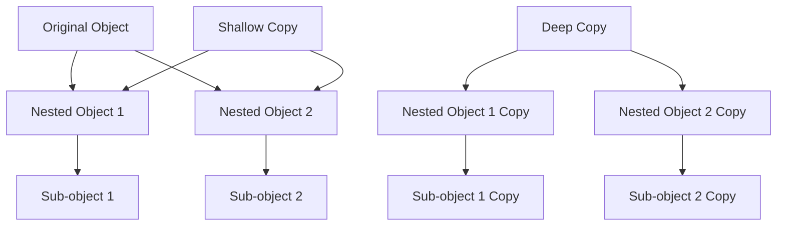

## 3.5.3 Deep vs. Shallow Copy

In the realm of Python programming, understanding how to duplicate objects is crucial, especially when dealing with complex data structures. This section delves into the concepts of deep and shallow copying, explaining their differences, use cases, and potential pitfalls. By the end of this guide, you'll have a solid grasp of when and how to use each type of copy effectively.

### Introduction to Object Copying

Before diving into deep and shallow copies, let's establish a foundational understanding of object copying in Python. Copying objects is a common task when you want to create a new object with the same properties as an existing one. However, the complexity arises when these objects contain nested structures, such as lists of lists or dictionaries containing other dictionaries.

### Shallow Copy

A shallow copy creates a new object but does not create copies of nested objects. Instead, it inserts references to the original objects into the new container. This means that changes to nested objects in the copied structure will reflect in the original structure and vice versa.

#### Creating a Shallow Copy

In Python, you can create a shallow copy using the `copy` module's `copy()` function or by using the `copy()` method available on some built-in data types like lists and dictionaries.

```python
import copy

original_list = [[1, 2, 3], [4, 5, 6]]

shallow_copied_list = copy.copy(original_list)

shallow_copied_list[0][0] = 'X'

print("Original List:", original_list)  # Output: [['X', 2, 3], [4, 5, 6]]
print("Shallow Copied List:", shallow_copied_list)  # Output: [['X', 2, 3], [4, 5, 6]]
```

As demonstrated, modifying the nested list in the shallow copy affects the original list, showcasing that the nested objects are shared between the two.

#### When to Use Shallow Copy

- **Performance**: Shallow copies are faster and use less memory since they only copy references.
- **Simple Structures**: Ideal for flat data structures or when nested objects do not require duplication.
- **Shared State**: Useful when you want changes to nested objects to be reflected across copies.

### Deep Copy

A deep copy creates a new object and recursively copies all objects found within the original, resulting in a fully independent copy. This means changes to nested objects in the copied structure do not affect the original structure.

#### Creating a Deep Copy

To create a deep copy, use the `deepcopy()` function from the `copy` module.

```python
import copy

original_list = [[1, 2, 3], [4, 5, 6]]

deep_copied_list = copy.deepcopy(original_list)

deep_copied_list[0][0] = 'X'

print("Original List:", original_list)  # Output: [[1, 2, 3], [4, 5, 6]]
print("Deep Copied List:", deep_copied_list)  # Output: [['X', 2, 3], [4, 5, 6]]
```

In this example, modifying the nested list in the deep copy does not affect the original list, demonstrating the independence of the two structures.

#### When to Use Deep Copy

- **Complex Structures**: Necessary for deeply nested data structures where independent copies are required.
- **Data Integrity**: Ensures that changes to one copy do not inadvertently affect another.
- **Isolation**: Useful in scenarios where modifications should not propagate across copies.

### Differences in Handling Nested Objects

The primary difference between deep and shallow copying lies in how they handle nested objects. Shallow copies only duplicate the outermost object, while deep copies duplicate all objects recursively.

#### Visualizing the Difference

To better understand the difference, let's visualize the process using a diagram:



In this diagram:
- The shallow copy (`F`) shares nested objects (`B` and `C`) with the original.
- The deep copy (`G`) creates new copies of all nested objects, ensuring complete independence.

### Guidelines for Choosing Between Deep and Shallow Copy

Choosing between deep and shallow copy depends on your specific use case:

1. **Consider the Complexity**: For simple, flat structures, a shallow copy is often sufficient. For complex, deeply nested structures, a deep copy may be necessary.
2. **Assess Performance Needs**: Shallow copies are faster and more memory-efficient. Use them when performance is a concern, and nested objects do not require duplication.
3. **Evaluate Data Integrity Requirements**: If maintaining independent copies is crucial, opt for deep copying to avoid unintended side effects.
4. **Understand the Data Structure**: Analyze the data structure to determine if nested objects are mutable and if changes should be isolated.

### Potential Pitfalls and How to Avoid Them

While copying objects, several pitfalls can arise. Understanding these can help you avoid common mistakes:

#### Pitfall 1: Unintended Sharing of Mutable Objects

When using shallow copies, mutable objects like lists and dictionaries are shared between the original and the copy. This can lead to unexpected behavior if changes to one affect the other.

**Solution**: Use deep copies for mutable nested objects when independence is required.

#### Pitfall 2: Performance Overhead of Deep Copying

Deep copying can be computationally expensive, especially for large or complex data structures. It can lead to increased memory usage and slower performance.

**Solution**: Only use deep copying when necessary. Consider optimizing the data structure or using shallow copies when possible.

#### Pitfall 3: Circular References

Deep copying objects with circular references can lead to infinite loops or excessive memory usage.

**Solution**: Ensure that the data structure is free of circular references, or use custom copy logic to handle such cases.

### Try It Yourself

Experimenting with code is a great way to solidify your understanding. Try modifying the examples provided:

1. **Modify Nested Structures**: Add more layers of nesting to the examples and observe how deep and shallow copies behave.
2. **Create Custom Objects**: Implement your own classes with nested attributes and experiment with copying them.
3. **Optimize Performance**: Measure the performance of deep and shallow copying for large data structures and explore optimization techniques.

### References and Further Reading

- [Python's `copy` Module Documentation](https://docs.python.org/3/library/copy.html)
- [Understanding Deep and Shallow Copying in Python](https://realpython.com/copying-python-objects/)
- [Python Data Model](https://docs.python.org/3/reference/datamodel.html)

### Knowledge Check

Before moving on, let's reinforce what we've learned:

- **What is the primary difference between deep and shallow copy?**
- **When should you use a deep copy over a shallow copy?**
- **What are the potential pitfalls of using deep copies?**
- **How can circular references affect deep copying?**

### Embrace the Journey

Remember, mastering deep and shallow copying is just one step in your Python journey. As you progress, you'll encounter more complex scenarios where these concepts will be invaluable. Keep experimenting, stay curious, and enjoy the process of learning and growing as a developer.

## Quiz Time!



### What is a shallow copy in Python?

- [x] A copy that duplicates the outermost object but shares nested objects.
- [ ] A copy that duplicates all objects recursively.
- [ ] A copy that only duplicates immutable objects.
- [ ] A copy that creates a completely independent object.

> **Explanation:** A shallow copy duplicates the outermost object but shares references to nested objects, meaning changes to nested objects affect both the original and the copy.

### How does a deep copy differ from a shallow copy?

- [x] A deep copy duplicates all objects recursively, creating independent copies.
- [ ] A deep copy only duplicates the outermost object.
- [ ] A deep copy shares references to nested objects.
- [ ] A deep copy is faster and uses less memory than a shallow copy.

> **Explanation:** A deep copy duplicates all objects recursively, ensuring that changes to any part of the copied structure do not affect the original.

### When should you use a shallow copy?

- [x] When working with simple, flat data structures.
- [ ] When dealing with complex, deeply nested structures.
- [ ] When data integrity is crucial.
- [ ] When you need completely independent copies.

> **Explanation:** Shallow copies are ideal for simple, flat data structures where nested objects do not require duplication.

### What is a potential pitfall of using shallow copies?

- [x] Unintended sharing of mutable objects.
- [ ] Increased memory usage.
- [ ] Circular references causing infinite loops.
- [ ] Slower performance.

> **Explanation:** Shallow copies share references to mutable objects, which can lead to unintended changes affecting both the original and the copy.

### How can circular references affect deep copying?

- [x] They can lead to infinite loops or excessive memory usage.
- [ ] They have no effect on deep copying.
- [ ] They improve the performance of deep copying.
- [ ] They cause shallow copies to fail.

> **Explanation:** Circular references can cause deep copying to enter infinite loops or use excessive memory, as the copy process may repeatedly encounter the same objects.

### What is a deep copy in Python?

- [x] A copy that duplicates all objects recursively, creating independent copies.
- [ ] A copy that duplicates the outermost object but shares nested objects.
- [ ] A copy that only duplicates immutable objects.
- [ ] A copy that creates a completely independent object.

> **Explanation:** A deep copy duplicates all objects recursively, ensuring that changes to any part of the copied structure do not affect the original.

### When should you use a deep copy?

- [x] When dealing with complex, deeply nested structures.
- [ ] When working with simple, flat data structures.
- [ ] When performance is a primary concern.
- [ ] When you want changes to propagate across copies.

> **Explanation:** Deep copies are necessary for complex, deeply nested structures where independent copies are required to maintain data integrity.

### What is a potential pitfall of using deep copies?

- [x] Performance overhead due to increased memory usage and slower execution.
- [ ] Unintended sharing of mutable objects.
- [ ] Circular references causing infinite loops.
- [ ] Faster execution and reduced memory usage.

> **Explanation:** Deep copies can be computationally expensive, leading to increased memory usage and slower performance, especially for large or complex data structures.

### How can you avoid unintended sharing of mutable objects?

- [x] Use deep copies for mutable nested objects when independence is required.
- [ ] Use shallow copies for all objects.
- [ ] Avoid using mutable objects altogether.
- [ ] Use custom copy logic for all objects.

> **Explanation:** To avoid unintended sharing of mutable objects, use deep copies to ensure that changes to nested objects do not affect both the original and the copy.

### True or False: Shallow copies are always faster and use less memory than deep copies.

- [x] True
- [ ] False

> **Explanation:** Shallow copies are generally faster and use less memory because they only duplicate the outermost object and share references to nested objects, unlike deep copies, which duplicate all objects recursively.


