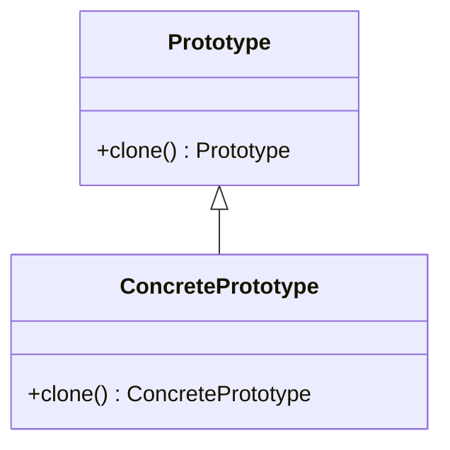

## 3.5.4 Use Cases and Examples

In this section, we will delve into the Prototype Pattern, a creational design pattern that is particularly useful for creating new objects by copying existing ones. This pattern is ideal for scenarios where the cost of creating an object is more expensive than copying it. We'll explore practical examples, such as cloning complex data structures and graphical objects, and discuss its applications in prototyping and undo mechanisms.

### Understanding the Prototype Pattern

The Prototype Pattern is a creational design pattern that allows you to create new objects by copying an existing object, known as the prototype. This pattern is particularly useful when the cost of creating a new instance of an object is high, or when you want to preserve the state of an object at a particular point in time.

#### Key Concepts

- **Prototype**: The original object that is copied to create new objects.
- **Cloning**: The process of creating a copy of the prototype object.
- **Shallow Copy**: A copy where the new object shares the same references as the original object.
- **Deep Copy**: A copy where the new object is completely independent of the original object.

### Practical Examples

Let's explore some practical examples of the Prototype Pattern in Python.

#### Example 1: Cloning Complex Data Structures

Consider a scenario where you have a complex data structure, such as a nested dictionary or a list of objects. Creating a new instance of this structure from scratch can be time-consuming and error-prone. Instead, you can use the Prototype Pattern to clone the existing structure.

```python
import copy

class ComplexData:
    def __init__(self, data):
        self.data = data

    def clone(self):
        # Perform a deep copy to ensure independence from the original object
        return copy.deepcopy(self)

original_data = ComplexData({'key1': [1, 2, 3], 'key2': {'subkey': 'value'}})

cloned_data = original_data.clone()

cloned_data.data['key1'].append(4)

print("Original Data:", original_data.data)
print("Cloned Data:", cloned_data.data)
```

In this example, we use Python's `copy` module to perform a deep copy of the `ComplexData` object. This ensures that the cloned object is independent of the original object, allowing us to modify it without affecting the original.

#### Example 2: Cloning Graphical Objects

In graphical applications, you often need to create multiple instances of a graphical object, such as a shape or a widget. The Prototype Pattern allows you to clone these objects efficiently.

```python
class Shape:
    def __init__(self, color, position):
        self.color = color
        self.position = position

    def clone(self):
        return copy.deepcopy(self)

original_shape = Shape('red', (10, 20))

cloned_shape = original_shape.clone()

cloned_shape.color = 'blue'

print("Original Shape Color:", original_shape.color)
print("Cloned Shape Color:", cloned_shape.color)
```

Here, we define a `Shape` class with attributes for color and position. By cloning the original shape, we can create a new shape with the same attributes, then modify the clone without affecting the original.

### Use Cases of the Prototype Pattern

The Prototype Pattern is particularly useful in the following scenarios:

#### 1. Prototyping

In software development, prototyping is the process of creating a preliminary version of a system or component. The Prototype Pattern allows you to quickly create multiple instances of a prototype object, enabling rapid experimentation and iteration.

#### 2. Undo Mechanisms

In applications that require undo functionality, the Prototype Pattern can be used to save the state of an object at a particular point in time. By cloning the object before making changes, you can easily revert to the previous state if needed.

#### 3. Performance Optimization

When creating new instances of an object is expensive, the Prototype Pattern can be used to improve performance. By cloning an existing object, you can avoid the overhead of initializing a new object from scratch.

### Visualizing the Prototype Pattern

To better understand the Prototype Pattern, let's visualize the process of cloning an object.



In this diagram, we have a `Prototype` class with a `clone` method. The `ConcretePrototype` class inherits from `Prototype` and implements the `clone` method to create a copy of itself.

### Considerations for Using the Prototype Pattern

While the Prototype Pattern offers several advantages, it's important to consider the following:

- **Memory Usage**: Cloning objects can increase memory usage, especially if deep copies are used.
- **Complexity**: Implementing the Prototype Pattern can add complexity to your code, particularly if the objects being cloned have complex dependencies.
- **Suitability**: The Prototype Pattern is not suitable for all scenarios. Consider using it when object creation is expensive or when you need to preserve the state of an object.

### Try It Yourself

To gain a deeper understanding of the Prototype Pattern, try modifying the examples provided. Experiment with different data structures and object attributes to see how the pattern can be applied in various contexts.

### Further Reading

For more information on the Prototype Pattern and its applications, consider exploring the following resources:

- [Python's `copy` Module Documentation](https://docs.python.org/3/library/copy.html)
- [Design Patterns: Elements of Reusable Object-Oriented Software](https://en.wikipedia.org/wiki/Design_Patterns) by Erich Gamma, Richard Helm, Ralph Johnson, and John Vlissides

### Knowledge Check

Before we conclude, let's reinforce what we've learned with a few questions:

1. What is the primary purpose of the Prototype Pattern?
2. How does a shallow copy differ from a deep copy?
3. In what scenarios is the Prototype Pattern particularly useful?

### Embrace the Journey

Remember, the Prototype Pattern is just one of many design patterns available to you as a developer. As you continue your journey in software development, keep exploring new patterns and techniques to enhance your skills and build more efficient, maintainable applications.

## Quiz Time!



### What is the primary purpose of the Prototype Pattern?

- [x] To create new objects by copying existing ones
- [ ] To define a family of algorithms
- [ ] To provide a simplified interface to a complex subsystem
- [ ] To ensure a class has only one instance

> **Explanation:** The Prototype Pattern is used to create new objects by copying existing ones, which is particularly useful when object creation is expensive.

### How does a shallow copy differ from a deep copy?

- [x] A shallow copy shares references with the original object
- [ ] A shallow copy is completely independent of the original object
- [ ] A deep copy shares references with the original object
- [ ] A deep copy is a partial copy of the original object

> **Explanation:** A shallow copy shares references with the original object, meaning changes to shared references affect both objects. A deep copy is completely independent.

### In what scenarios is the Prototype Pattern particularly useful?

- [x] Prototyping and undo mechanisms
- [ ] Sorting algorithms
- [ ] Logging systems
- [ ] User authentication

> **Explanation:** The Prototype Pattern is useful in scenarios like prototyping and undo mechanisms, where cloning objects is beneficial.

### What Python module is commonly used for implementing the Prototype Pattern?

- [x] `copy`
- [ ] `os`
- [ ] `sys`
- [ ] `json`

> **Explanation:** The `copy` module in Python provides functions for shallow and deep copying, which are essential for implementing the Prototype Pattern.

### Which method is typically implemented in a class to support the Prototype Pattern?

- [x] `clone()`
- [ ] `execute()`
- [ ] `initialize()`
- [ ] `finalize()`

> **Explanation:** The `clone()` method is typically implemented to allow an object to create a copy of itself.

### What is a potential drawback of using the Prototype Pattern?

- [x] Increased memory usage
- [ ] Reduced code readability
- [ ] Limited scalability
- [ ] Complex user interfaces

> **Explanation:** Cloning objects can increase memory usage, especially when deep copies are involved.

### Which of the following is NOT a benefit of the Prototype Pattern?

- [ ] Improved performance
- [ ] Simplified object creation
- [x] Reduced memory usage
- [ ] Preservation of object state

> **Explanation:** While the Prototype Pattern improves performance and simplifies object creation, it can increase memory usage.

### How can the Prototype Pattern aid in performance optimization?

- [x] By avoiding the overhead of initializing new objects
- [ ] By reducing the number of classes in a system
- [ ] By simplifying complex algorithms
- [ ] By enhancing user interface responsiveness

> **Explanation:** The Prototype Pattern aids in performance optimization by avoiding the overhead of initializing new objects from scratch.

### True or False: The Prototype Pattern is suitable for all scenarios.

- [ ] True
- [x] False

> **Explanation:** The Prototype Pattern is not suitable for all scenarios. It is best used when object creation is expensive or when preserving object state is necessary.

### Which of the following is a key concept of the Prototype Pattern?

- [x] Cloning
- [ ] Inheritance
- [ ] Encapsulation
- [ ] Polymorphism

> **Explanation:** Cloning is a key concept of the Prototype Pattern, as it involves creating new objects by copying existing ones.


