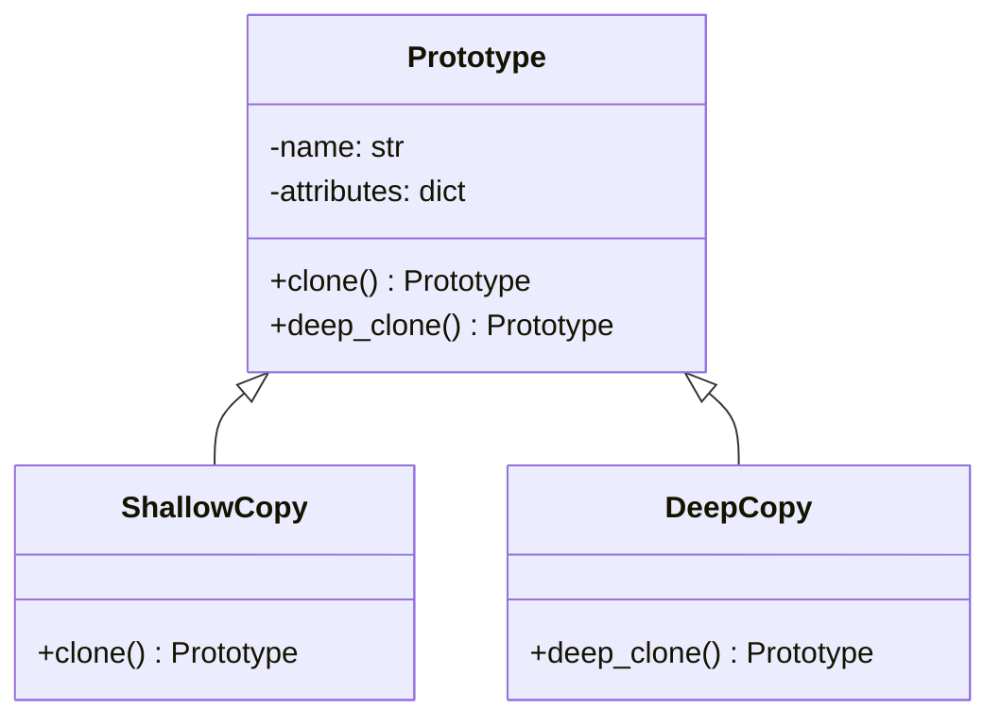

## 3.5 Prototype Pattern

In the realm of software design, the Prototype Pattern stands out as a creational design pattern that focuses on the creation of new objects by duplicating existing ones, known as prototypes. This approach is particularly useful when object creation is resource-intensive or complex, allowing developers to clone existing objects to save time and resources. In this section, we will delve into the intent and applicability of the Prototype Pattern, explore scenarios where it shines, and provide practical Python examples using the `copy` module. We will also discuss the nuances of shallow versus deep copying, highlight the advantages of this pattern, and address potential challenges related to object cloning.

### Understanding the Prototype Pattern

The Prototype Pattern is designed to create new objects by copying an existing object, known as the prototype. This pattern is particularly beneficial in situations where the cost of creating a new instance of a class is more expensive than copying an existing instance. By using the Prototype Pattern, we can easily create new objects without having to know the details of how they are created, which can be especially useful in complex systems.

#### Intent and Applicability

The primary intent of the Prototype Pattern is to:

- **Reduce the cost of creating objects**: By cloning existing objects, we can avoid the overhead associated with creating new objects from scratch.
- **Simplify object creation**: When the process of creating an object is complex, the Prototype Pattern can simplify this process by allowing us to clone an existing object.
- **Facilitate dynamic object creation**: In systems where the types of objects to be created are determined at runtime, the Prototype Pattern provides a flexible solution.

The Prototype Pattern is applicable in scenarios where:

- Object creation is resource-intensive or time-consuming.
- There is a need to create objects dynamically at runtime.
- The system requires a large number of similar objects.
- The objects to be created are complex and have numerous configurations.

### Scenarios Where Object Creation is Resource-Intensive

Consider a scenario where you are developing a graphic design application that allows users to create and manipulate complex shapes. Each shape can have multiple attributes such as color, size, and texture. Creating a new shape from scratch every time can be resource-intensive, especially if the shapes are complex and have numerous attributes. By using the Prototype Pattern, you can create a prototype of a shape and clone it whenever a new shape is needed, significantly reducing the time and resources required for object creation.

Another example is a game development scenario where you have various types of characters, each with unique attributes and behaviors. Creating each character from scratch can be costly, but by using the Prototype Pattern, you can create a prototype for each character type and clone them as needed.

### Implementing the Prototype Pattern in Python

Python provides a convenient way to implement the Prototype Pattern using the `copy` module, which allows us to perform shallow and deep copies of objects. Let's explore how to implement this pattern in Python with practical examples.

#### Using the `copy` Module for Cloning

The `copy` module in Python provides two methods for cloning objects: `copy.copy()` for shallow copying and `copy.deepcopy()` for deep copying. Let's examine these methods in detail.

```python
import copy

class Prototype:
    def __init__(self, name, attributes):
        self.name = name
        self.attributes = attributes

    def clone(self):
        return copy.copy(self)

    def deep_clone(self):
        return copy.deepcopy(self)

original = Prototype("Original", {"color": "red", "size": "large"})

shallow_copy = original.clone()

deep_copy = original.deep_clone()

original.attributes["color"] = "blue"

print(f"Original: {original.attributes}")
print(f"Shallow Copy: {shallow_copy.attributes}")
print(f"Deep Copy: {deep_copy.attributes}")
```

In this example, we define a `Prototype` class with a `clone` method for shallow copying and a `deep_clone` method for deep copying. We create an `original` object and perform both shallow and deep copies. When we modify the `original` object's attributes, we observe the differences between shallow and deep copies.

#### Shallow vs. Deep Copying

Understanding the difference between shallow and deep copying is crucial when implementing the Prototype Pattern.

- **Shallow Copy**: A shallow copy creates a new object but does not create copies of nested objects. Instead, it copies references to the original nested objects. This means changes to nested objects in the original will reflect in the shallow copy.

- **Deep Copy**: A deep copy creates a new object and recursively copies all nested objects. This means changes to nested objects in the original will not affect the deep copy.

In the previous example, when we modify the `original` object's `attributes`, the change is reflected in the `shallow_copy` but not in the `deep_copy`, demonstrating the difference between shallow and deep copying.

### Advantages of the Prototype Pattern

The Prototype Pattern offers several advantages, including:

- **Reduced Object Creation Time**: By cloning existing objects, we can significantly reduce the time required to create new objects, especially when object creation is resource-intensive.
- **Simplified Object Creation**: The Prototype Pattern simplifies the process of creating complex objects by allowing us to clone existing objects rather than creating them from scratch.
- **Flexibility**: The Prototype Pattern provides flexibility in object creation, allowing us to create new objects dynamically at runtime.
- **Consistency**: By using prototypes, we can ensure that new objects are consistent with existing ones, reducing the risk of errors.

### Challenges Related to Object Cloning

While the Prototype Pattern offers many benefits, it also presents certain challenges, including:

- **Complexity in Managing Prototypes**: Managing prototypes can become complex, especially in systems with numerous object types and configurations.
- **Handling Mutable Objects**: When dealing with mutable objects, care must be taken to ensure that changes to the original object do not unintentionally affect cloned objects.
- **Performance Overhead**: While cloning can reduce object creation time, it can also introduce performance overhead, especially when deep copying complex objects.

### Visualizing the Prototype Pattern

To better understand the Prototype Pattern, let's visualize the process of cloning objects using a class diagram.



In this diagram, we have a `Prototype` class with `clone` and `deep_clone` methods. The `ShallowCopy` and `DeepCopy` classes inherit from `Prototype`, demonstrating the relationship between the prototype and its clones.

### Try It Yourself

To solidify your understanding of the Prototype Pattern, try modifying the code example provided earlier. Experiment with different object attributes and observe how changes to the original object affect shallow and deep copies. Consider creating additional methods in the `Prototype` class to further explore the capabilities of this pattern.

### References and Further Reading

To deepen your understanding of the Prototype Pattern and its applications, consider exploring the following resources:

- [Python's `copy` Module Documentation](https://docs.python.org/3/library/copy.html)
- [Design Patterns: Elements of Reusable Object-Oriented Software](https://en.wikipedia.org/wiki/Design_Patterns) by Erich Gamma, Richard Helm, Ralph Johnson, and John Vlissides

### Knowledge Check

Before we conclude, let's pose a few questions to reinforce your understanding of the Prototype Pattern:

- What are the primary benefits of using the Prototype Pattern?
- How does shallow copying differ from deep copying?
- In what scenarios is the Prototype Pattern most beneficial?

### Embrace the Journey

Remember, mastering design patterns is a journey. As you continue to explore and apply these patterns, you'll become more adept at creating efficient, maintainable, and scalable software solutions. Keep experimenting, stay curious, and enjoy the process of learning and growing as a developer!

## Quiz Time!



### What is the primary intent of the Prototype Pattern?

- [x] To create new objects by cloning existing ones
- [ ] To create new objects from scratch
- [ ] To simplify object inheritance
- [ ] To manage object lifecycles

> **Explanation:** The Prototype Pattern is intended to create new objects by cloning existing ones, which is particularly useful when object creation is resource-intensive or complex.

### In which scenario is the Prototype Pattern most beneficial?

- [x] When object creation is resource-intensive
- [ ] When objects are simple and easy to create
- [ ] When there are no existing objects to clone
- [ ] When object inheritance is required

> **Explanation:** The Prototype Pattern is most beneficial when object creation is resource-intensive, allowing for efficient cloning of existing objects.

### What does a shallow copy do?

- [x] Copies references to nested objects
- [ ] Creates new instances of nested objects
- [ ] Copies only primitive data types
- [ ] Ignores nested objects

> **Explanation:** A shallow copy copies references to nested objects, meaning changes to the original nested objects will reflect in the shallow copy.

### What is a deep copy?

- [x] A copy that recursively duplicates all nested objects
- [ ] A copy that only duplicates primitive data types
- [ ] A copy that ignores nested objects
- [ ] A copy that duplicates references to nested objects

> **Explanation:** A deep copy recursively duplicates all nested objects, ensuring that changes to the original do not affect the copy.

### Which Python module is used for cloning objects?

- [x] copy
- [ ] clone
- [ ] deepcopy
- [ ] clone_module

> **Explanation:** The `copy` module in Python is used for cloning objects, providing methods for both shallow and deep copying.

### What is a potential challenge of using the Prototype Pattern?

- [x] Complexity in managing prototypes
- [ ] Simplified object creation
- [ ] Reduced object creation time
- [ ] Increased flexibility

> **Explanation:** A potential challenge of using the Prototype Pattern is the complexity in managing prototypes, especially in systems with numerous object types.

### How does the Prototype Pattern provide flexibility?

- [x] By allowing dynamic object creation at runtime
- [ ] By enforcing strict object creation rules
- [ ] By limiting the number of objects created
- [ ] By requiring predefined object types

> **Explanation:** The Prototype Pattern provides flexibility by allowing dynamic object creation at runtime, which is useful in systems where object types are determined at runtime.

### What is an advantage of using the Prototype Pattern?

- [x] Reduced object creation time
- [ ] Increased object creation time
- [ ] Simplified object inheritance
- [ ] Complex object creation

> **Explanation:** An advantage of using the Prototype Pattern is the reduced object creation time, as it allows for efficient cloning of existing objects.

### What happens when you modify a nested object in a shallow copy?

- [x] The change is reflected in the original object
- [ ] The change is not reflected in the original object
- [ ] The change creates a new instance of the nested object
- [ ] The change is ignored

> **Explanation:** When you modify a nested object in a shallow copy, the change is reflected in the original object because the shallow copy only copies references to nested objects.

### True or False: A deep copy creates a new instance of the original object and all its nested objects.

- [x] True
- [ ] False

> **Explanation:** True. A deep copy creates a new instance of the original object and recursively duplicates all its nested objects, ensuring that changes to the original do not affect the copy.




