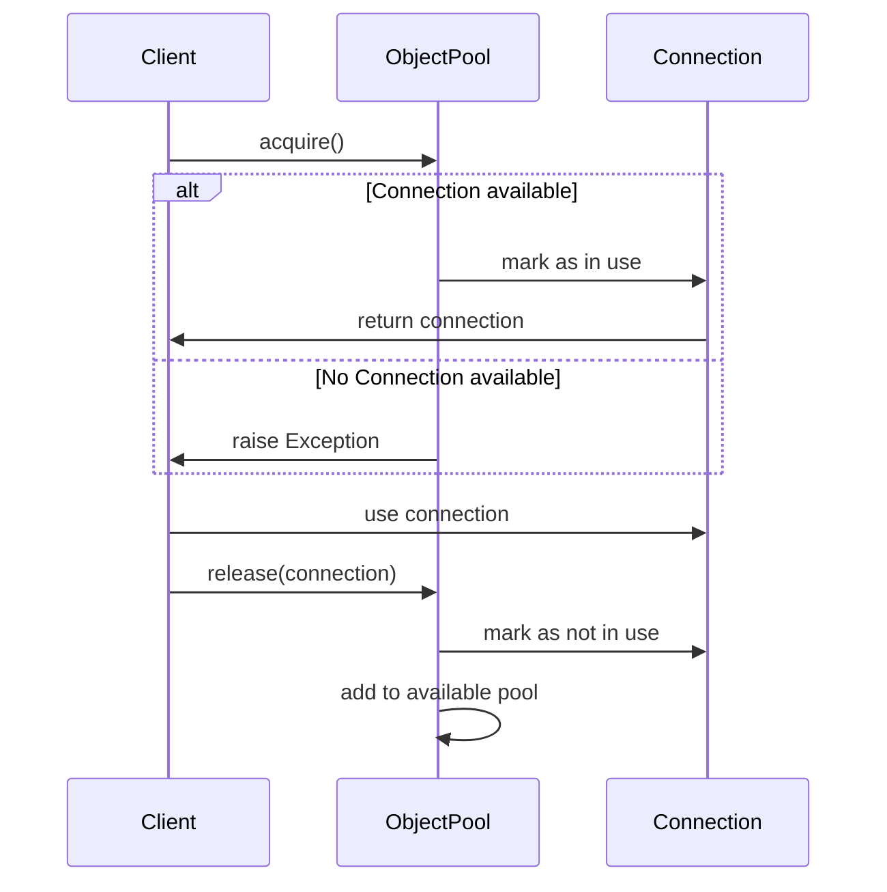

## 3.6.1 Implementing Object Pool in Python

In software development, efficient resource management is crucial, especially when dealing with objects that are expensive to create, such as database connections or large data structures. The Object Pool pattern provides a way to manage a pool of reusable objects, optimizing resource allocation and improving performance. In this section, we will explore how to implement the Object Pool pattern in Python, covering strategies for allocation, reuse, and release of objects, as well as handling scenarios when the pool is exhausted.

### Understanding the Object Pool Pattern

The Object Pool pattern is a creational design pattern that manages a set of initialized objects ready to be used, rather than creating and destroying them on demand. This pattern is particularly useful when:

- The cost of initializing a class instance is high.
- The rate of instantiation of a class is high.
- The number of instantiations in use at any one time is low.

By reusing objects from a pool, we can reduce the overhead of object creation and destruction, leading to more efficient resource management.

### Key Concepts

- **Pool Manager**: The component responsible for managing the pool of objects. It handles requests for objects, allocates them from the pool, and returns them to the pool when they are no longer needed.
- **Reusable Object**: An object that can be reused multiple times, typically after being reset to a clean state.
- **Pool Exhaustion**: A scenario where all objects in the pool are in use, and no more objects are available for allocation.

### Implementing the Object Pool in Python

Let's dive into the implementation of the Object Pool pattern in Python. We'll start by defining a simple class that represents the objects we want to pool.

#### Step 1: Define the Reusable Object

First, we define a class for the objects that will be pooled. For this example, let's consider a simple `Connection` class.

```python
class Connection:
    def __init__(self, id):
        self.id = id
        self.in_use = False

    def connect(self):
        print(f"Connection {self.id} is now active.")

    def disconnect(self):
        print(f"Connection {self.id} is now inactive.")

    def __str__(self):
        return f"Connection({self.id})"
```

In this example, the `Connection` class has a simple interface with methods to `connect` and `disconnect`, and a flag `in_use` to track whether the connection is currently in use.

#### Step 2: Create the Object Pool Manager

Next, we create the `ObjectPool` class, which will manage the pool of `Connection` objects.

```python
class ObjectPool:
    def __init__(self, size):
        self.size = size
        self.pool = [Connection(i) for i in range(size)]
        self.available = self.pool.copy()

    def acquire(self):
        if not self.available:
            raise Exception("No available connections in the pool.")
        connection = self.available.pop()
        connection.in_use = True
        connection.connect()
        return connection

    def release(self, connection):
        if connection in self.pool and connection.in_use:
            connection.disconnect()
            connection.in_use = False
            self.available.append(connection)
        else:
            raise Exception("Connection not part of the pool or already released.")
```

**Explanation:**

- **Initialization**: The `ObjectPool` is initialized with a fixed size, creating a list of `Connection` objects.
- **Acquire Method**: This method retrieves an available connection from the pool. If no connections are available, it raises an exception.
- **Release Method**: This method returns a connection to the pool, marking it as not in use.

#### Step 3: Using the Object Pool

Let's see how we can use the `ObjectPool` to manage connections.

```python
def main():
    pool_size = 3
    pool = ObjectPool(pool_size)

    # Acquire connections
    conn1 = pool.acquire()
    conn2 = pool.acquire()

    # Use connections
    print(conn1)
    print(conn2)

    # Release connections
    pool.release(conn1)
    pool.release(conn2)

    # Acquire another connection
    conn3 = pool.acquire()
    print(conn3)

    # Attempt to acquire more connections than available
    try:
        conn4 = pool.acquire()
        conn5 = pool.acquire()
        conn6 = pool.acquire()  # This will raise an exception
    except Exception as e:
        print(e)

if __name__ == "__main__":
    main()
```

In this example, we create an `ObjectPool` with three connections. We acquire and release connections, demonstrating how the pool manages the lifecycle of its objects.

### Handling Pool Exhaustion

One of the challenges of using an object pool is handling scenarios where the pool is exhausted. There are several strategies to address this:

1. **Blocking**: Wait for an object to become available.
2. **Timeout**: Wait for a specified time before raising an exception.
3. **Dynamic Pool Expansion**: Increase the pool size dynamically when needed.

Let's implement a blocking strategy with a timeout.

```python
import time
import threading

class BlockingObjectPool(ObjectPool):
    def acquire(self, timeout=None):
        start_time = time.time()
        while not self.available:
            if timeout and (time.time() - start_time) > timeout:
                raise Exception("Timeout: No available connections in the pool.")
            time.sleep(0.1)  # Sleep briefly to avoid busy waiting
        return super().acquire()
```

In this `BlockingObjectPool`, the `acquire` method waits for an available connection, checking periodically until a connection is free or the timeout is reached.

### Best Practices for Resource Management

When implementing an object pool, consider the following best practices:

- **Size Appropriately**: Choose a pool size that balances resource availability with memory usage.
- **Monitor Usage**: Track how often the pool is exhausted to adjust the size or strategy.
- **Thread Safety**: Ensure that the pool is thread-safe if used in a multi-threaded environment.
- **Reset State**: Ensure objects are reset to a clean state before being reused.

### Try It Yourself

Experiment with the object pool implementation by modifying the code:

- **Change the Pool Size**: Adjust the pool size and observe how it affects availability.
- **Implement Dynamic Expansion**: Modify the pool to dynamically increase its size when exhausted.
- **Add Thread Safety**: Use Python's `threading.Lock` to make the pool thread-safe.

### Visualizing the Object Pool Pattern

To better understand the Object Pool pattern, let's visualize the process of acquiring and releasing objects using a sequence diagram.



**Diagram Description**: This sequence diagram illustrates the interaction between the client, the object pool, and the connection objects. The client acquires a connection from the pool, uses it, and then releases it back to the pool.

### References and Further Reading

For more information on the Object Pool pattern and its applications, consider the following resources:

- [Object Pool Pattern on Wikipedia](https://en.wikipedia.org/wiki/Object_pool_pattern)
- [Python's `threading` Module Documentation](https://docs.python.org/3/library/threading.html)
- [Design Patterns: Elements of Reusable Object-Oriented Software](https://en.wikipedia.org/wiki/Design_Patterns) by Erich Gamma, Richard Helm, Ralph Johnson, and John Vlissides

### Knowledge Check

- What are the benefits of using an object pool?
- How can you handle pool exhaustion in a multi-threaded environment?
- What are some scenarios where the Object Pool pattern is particularly useful?

### Embrace the Journey

Remember, implementing design patterns like the Object Pool is just the beginning of building efficient and scalable software. As you progress, you'll encounter more complex scenarios and patterns. Keep experimenting, stay curious, and enjoy the journey!

## Quiz Time!



### What is the primary purpose of the Object Pool pattern?

- [x] To manage a pool of reusable objects and optimize resource allocation.
- [ ] To create new objects on demand.
- [ ] To destroy objects when they are no longer needed.
- [ ] To manage memory allocation for objects.

> **Explanation:** The Object Pool pattern is designed to manage a pool of reusable objects, optimizing resource allocation by reusing objects instead of creating and destroying them frequently.

### Which method in the ObjectPool class is responsible for returning an object to the pool?

- [ ] acquire()
- [x] release()
- [ ] connect()
- [ ] disconnect()

> **Explanation:** The `release()` method is responsible for returning an object to the pool, marking it as not in use.

### What is a common strategy for handling pool exhaustion?

- [ ] Immediately raise an exception.
- [x] Implement a blocking strategy with a timeout.
- [ ] Increase the pool size dynamically.
- [ ] Ignore the request.

> **Explanation:** A common strategy for handling pool exhaustion is to implement a blocking strategy with a timeout, allowing the system to wait for an object to become available.

### How can you ensure thread safety in an object pool?

- [ ] Use a larger pool size.
- [ ] Avoid using threads.
- [x] Use threading.Lock to synchronize access.
- [ ] Implement a timeout strategy.

> **Explanation:** To ensure thread safety in an object pool, you can use `threading.Lock` to synchronize access to the pool, preventing race conditions.

### What is a key benefit of using the Object Pool pattern?

- [x] Reduces the overhead of object creation and destruction.
- [ ] Increases the complexity of resource management.
- [ ] Decreases the reuse of objects.
- [ ] Simplifies the implementation of new objects.

> **Explanation:** The Object Pool pattern reduces the overhead of object creation and destruction by reusing objects, leading to more efficient resource management.

### Which of the following is NOT a best practice for implementing an object pool?

- [ ] Size the pool appropriately.
- [ ] Monitor usage and adjust the size.
- [ ] Ensure thread safety.
- [x] Ignore the state of objects before reuse.

> **Explanation:** Ignoring the state of objects before reuse is not a best practice. Objects should be reset to a clean state before being reused.

### What is the role of the Pool Manager in the Object Pool pattern?

- [x] It manages the pool of objects, handling allocation and release.
- [ ] It creates new objects on demand.
- [ ] It destroys objects when they are no longer needed.
- [ ] It monitors memory usage.

> **Explanation:** The Pool Manager is responsible for managing the pool of objects, handling their allocation and release.

### What is a potential drawback of using the Object Pool pattern?

- [ ] Increased resource availability.
- [x] Complexity in managing the pool.
- [ ] Reduced performance.
- [ ] Increased memory usage.

> **Explanation:** A potential drawback of using the Object Pool pattern is the complexity involved in managing the pool, especially in multi-threaded environments.

### How can you visualize the Object Pool pattern?

- [ ] Using a pie chart.
- [ ] Using a bar graph.
- [x] Using a sequence diagram.
- [ ] Using a histogram.

> **Explanation:** A sequence diagram is an effective way to visualize the Object Pool pattern, illustrating the interaction between the client, pool manager, and pooled objects.

### True or False: The Object Pool pattern is only useful for managing database connections.

- [ ] True
- [x] False

> **Explanation:** False. The Object Pool pattern is useful for managing any type of object that is expensive to create and can be reused, not just database connections.


