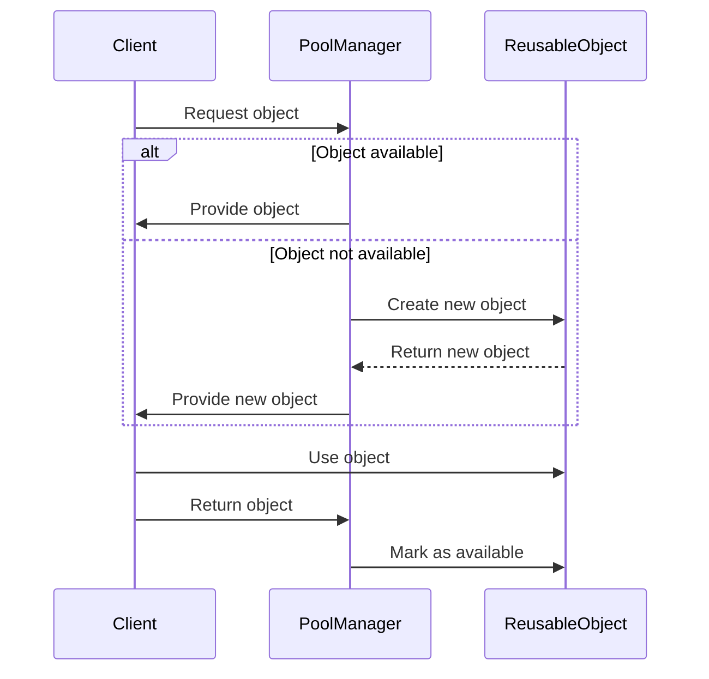

## 3.6.2 Resource Management

In today's fast-paced digital world, applications are expected to handle increasing loads and provide seamless user experiences. Efficient resource management is crucial for achieving these goals, especially in high-load environments. The Object Pool Pattern is a powerful design pattern that helps optimize resource utilization, ensuring that applications remain responsive and scalable. In this section, we will delve into the importance of resource management, explore the Object Pool Pattern, and provide practical examples and strategies for implementing this pattern in Python.

### Understanding Resource Management

Resource management involves the efficient allocation, use, and release of resources such as memory, CPU, network connections, and database connections. In high-load environments, where multiple users or processes compete for limited resources, effective management becomes critical to maintaining performance and preventing bottlenecks.

#### Importance of Efficient Resource Utilization

Efficient resource utilization is essential for several reasons:

1. **Performance Optimization**: Proper resource management ensures that applications run smoothly and respond quickly to user requests, reducing latency and improving user satisfaction.

2. **Cost Reduction**: By optimizing resource usage, organizations can minimize infrastructure costs, as fewer resources are needed to handle the same workload.

3. **Scalability**: Efficient resource management allows applications to scale gracefully, handling increased loads without degradation in performance.

4. **Reliability**: Proper management prevents resource exhaustion, reducing the risk of application crashes and downtime.

### The Object Pool Pattern

The Object Pool Pattern is a creational design pattern that manages a pool of reusable objects, optimizing resource usage by reusing objects instead of creating and destroying them repeatedly. This pattern is particularly useful for managing resources that are expensive to create or maintain, such as database connections, threads, and network sockets.

#### How the Object Pool Pattern Works

The Object Pool Pattern involves the following key components:

- **Pool Manager**: Manages the pool of reusable objects, keeping track of available and in-use objects.

- **Reusable Objects**: Objects that are expensive to create and can be reused multiple times.

- **Client**: Requests objects from the pool manager and returns them when no longer needed.

The pool manager maintains a collection of reusable objects, allocating them to clients as needed. When a client requests an object, the pool manager checks for an available object in the pool. If one is available, it is allocated to the client. If not, a new object is created, added to the pool, and allocated to the client. Once the client is done with the object, it is returned to the pool for future use.

### Benefits of Using the Object Pool Pattern

The Object Pool Pattern offers several benefits:

1. **Reduced Resource Creation Overhead**: By reusing objects, the pattern reduces the overhead associated with creating and destroying resources, leading to improved performance.

2. **Improved Resource Utilization**: The pattern ensures that resources are used efficiently, reducing waste and optimizing utilization.

3. **Enhanced Scalability**: By managing resources effectively, the pattern allows applications to scale more easily, handling increased loads without performance degradation.

4. **Increased Reliability**: The pattern helps prevent resource exhaustion, reducing the risk of application crashes and downtime.

### Examples of Resources That Benefit from Pooling

Several types of resources can benefit from pooling, including:

- **Database Connections**: Establishing a database connection is often resource-intensive. Pooling connections can significantly improve performance and reduce latency.

- **Threads**: Creating and destroying threads can be costly. Thread pooling allows for efficient management of concurrent tasks.

- **Network Sockets**: Opening and closing network sockets can be time-consuming. Socket pooling can enhance network communication efficiency.

- **Memory Buffers**: Reusing memory buffers can reduce memory allocation overhead and improve performance.

### Indicators That Suggest Pooling is Necessary

Several metrics or indicators can suggest that pooling is necessary:

1. **High Resource Creation Time**: If creating a resource takes a significant amount of time, pooling can help reduce this overhead.

2. **Frequent Resource Creation and Destruction**: If resources are frequently created and destroyed, pooling can improve efficiency by reusing existing resources.

3. **Resource Contention**: If multiple processes or threads compete for the same resources, pooling can help manage contention and improve performance.

4. **Resource Exhaustion**: If resources are frequently exhausted, leading to application crashes or downtime, pooling can help prevent this by managing resource allocation more effectively.

### Implementing the Object Pool Pattern in Python

Let's explore how to implement the Object Pool Pattern in Python. We'll start with a simple example of a database connection pool.

#### Example: Database Connection Pool

```python
import queue
import threading

class DatabaseConnection:
    def __init__(self, connection_id):
        self.connection_id = connection_id

    def connect(self):
        print(f"Connecting to database with connection {self.connection_id}")

    def disconnect(self):
        print(f"Disconnecting from database with connection {self.connection_id}")

class ConnectionPool:
    def __init__(self, max_size):
        self.pool = queue.Queue(max_size)
        self.lock = threading.Lock()
        self._initialize_pool(max_size)

    def _initialize_pool(self, max_size):
        for i in range(max_size):
            connection = DatabaseConnection(i)
            self.pool.put(connection)

    def acquire_connection(self):
        with self.lock:
            connection = self.pool.get()
            connection.connect()
            return connection

    def release_connection(self, connection):
        with self.lock:
            connection.disconnect()
            self.pool.put(connection)

pool = ConnectionPool(max_size=3)

conn1 = pool.acquire_connection()
conn2 = pool.acquire_connection()

pool.release_connection(conn1)
pool.release_connection(conn2)
```

**Explanation:**

- **DatabaseConnection Class**: Represents a database connection with methods to connect and disconnect.

- **ConnectionPool Class**: Manages a pool of database connections using a queue to store available connections. The pool is initialized with a specified maximum size.

- **Acquire and Release Methods**: The `acquire_connection` method retrieves a connection from the pool, and the `release_connection` method returns it to the pool.

### Visualizing the Object Pool Pattern

To better understand the Object Pool Pattern, let's visualize the flow of acquiring and releasing resources using a sequence diagram.



**Diagram Description**: This sequence diagram illustrates the interaction between the client, pool manager, and reusable object. The client requests an object from the pool manager, which either provides an available object or creates a new one if none are available. Once the client is done using the object, it is returned to the pool manager and marked as available.

### Try It Yourself

To deepen your understanding of the Object Pool Pattern, try modifying the example code:

1. **Increase the Pool Size**: Experiment with different pool sizes to see how it affects performance.

2. **Add More Clients**: Simulate multiple clients requesting connections simultaneously to test concurrency.

3. **Implement a Timeout**: Add a timeout mechanism to handle cases where no connections are available.

### References and Further Reading

For more information on the Object Pool Pattern and resource management, consider exploring the following resources:

- [Design Patterns: Elements of Reusable Object-Oriented Software](https://en.wikipedia.org/wiki/Design_Patterns) by Erich Gamma et al.
- [Python Queue Module](https://docs.python.org/3/library/queue.html) - Official Python documentation on the queue module.
- [Threading in Python](https://docs.python.org/3/library/threading.html) - Official Python documentation on threading.

### Knowledge Check

Let's test your understanding of the Object Pool Pattern with a few questions:

1. What are the key components of the Object Pool Pattern?
2. How does pooling improve resource utilization?
3. What are some examples of resources that benefit from pooling?
4. What indicators suggest that pooling is necessary?
5. How can you implement a timeout mechanism in a connection pool?

### Embrace the Journey

Remember, mastering design patterns is a journey. As you continue to explore and implement patterns like the Object Pool Pattern, you'll gain valuable insights into efficient resource management and application scalability. Keep experimenting, stay curious, and enjoy the process!

## Quiz Time!



### What is the primary benefit of using the Object Pool Pattern?

- [x] Reduces resource creation overhead
- [ ] Increases memory usage
- [ ] Complicates resource management
- [ ] Decreases application reliability

> **Explanation:** The Object Pool Pattern reduces the overhead associated with creating and destroying resources by reusing them.

### Which of the following resources can benefit from pooling?

- [x] Database connections
- [x] Threads
- [x] Network sockets
- [ ] Static variables

> **Explanation:** Database connections, threads, and network sockets are expensive to create and can benefit from pooling.

### What is a key indicator that pooling might be necessary?

- [x] High resource creation time
- [ ] Low memory usage
- [ ] Infrequent resource usage
- [ ] Simple resource allocation

> **Explanation:** High resource creation time suggests that pooling can reduce the overhead of creating resources repeatedly.

### How does the Object Pool Pattern enhance scalability?

- [x] By managing resources efficiently
- [ ] By increasing the number of resources
- [ ] By reducing code complexity
- [ ] By simplifying algorithms

> **Explanation:** The Object Pool Pattern enhances scalability by managing resources efficiently, allowing applications to handle increased loads.

### What is the role of the pool manager in the Object Pool Pattern?

- [x] Manages the pool of reusable objects
- [ ] Creates new resources
- [ ] Destroys unused resources
- [ ] Monitors application performance

> **Explanation:** The pool manager is responsible for managing the pool of reusable objects, allocating them to clients as needed.

### Which Python module is commonly used to implement queues in the Object Pool Pattern?

- [x] queue
- [ ] threading
- [ ] collections
- [ ] asyncio

> **Explanation:** The `queue` module is commonly used to implement queues for managing reusable objects in the Object Pool Pattern.

### What is a potential challenge when implementing the Object Pool Pattern?

- [x] Handling resource contention
- [ ] Reducing memory usage
- [ ] Simplifying code structure
- [ ] Increasing resource creation time

> **Explanation:** Handling resource contention can be a challenge, as multiple clients may request the same resource simultaneously.

### How can you simulate multiple clients requesting connections in the example code?

- [x] Add more threads
- [ ] Increase the pool size
- [ ] Decrease the pool size
- [ ] Use a single-threaded approach

> **Explanation:** Adding more threads can simulate multiple clients requesting connections simultaneously.

### What is the purpose of a timeout mechanism in a connection pool?

- [x] To handle cases where no connections are available
- [ ] To increase the number of available connections
- [ ] To reduce the pool size
- [ ] To simplify resource allocation

> **Explanation:** A timeout mechanism handles cases where no connections are available, preventing clients from waiting indefinitely.

### True or False: The Object Pool Pattern can help prevent application crashes due to resource exhaustion.

- [x] True
- [ ] False

> **Explanation:** True. By managing resources efficiently, the Object Pool Pattern helps prevent resource exhaustion, reducing the risk of application crashes.


