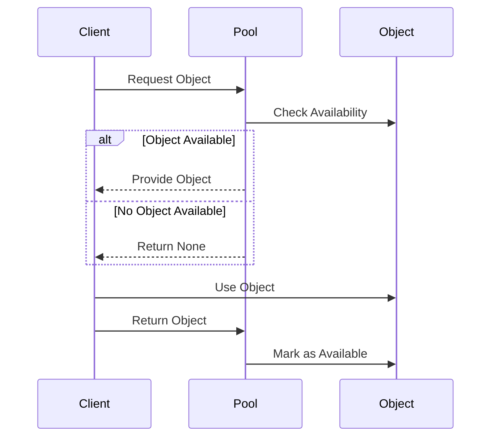

## 3.6.3 Use Cases and Examples

In this section, we delve into the practical applications of the Object Pool Pattern in Python. This pattern is particularly useful in scenarios where the cost of initializing class instances is high, and the number of instances in use at any one time is limited. By reusing objects, we can significantly improve performance and resource management. Let's explore some real-world use cases and examples to understand how this pattern can be effectively applied.

### Understanding the Object Pool Pattern

Before we dive into examples, let's briefly recap what the Object Pool Pattern is. The Object Pool Pattern is a creational design pattern that allows for the reuse of objects that are expensive to create. Instead of creating and destroying objects on demand, a pool of pre-initialized objects is maintained, and clients can borrow objects from the pool and return them when no longer needed.

#### Key Concepts

- **Pooling**: The process of maintaining a set of initialized objects ready for use.
- **Borrowing**: Clients request an object from the pool.
- **Returning**: Once the client is done with the object, it is returned to the pool for future use.
- **Resource Management**: Efficiently managing resources by reusing objects.

### Use Case 1: Database Connection Pooling

One of the most common applications of the Object Pool Pattern is in managing database connections. Establishing a connection to a database can be a resource-intensive operation. By using a connection pool, we can maintain a pool of open connections that can be reused, thus reducing the overhead of repeatedly opening and closing connections.

#### Example: Implementing a Database Connection Pool in Python

Let's implement a simple database connection pool using Python. We'll use a hypothetical database connection class for demonstration purposes.

```python
import queue
import time

class DatabaseConnection:
    def __init__(self):
        # Simulate a time-consuming connection setup
        time.sleep(1)
        self.connected = True

    def close(self):
        self.connected = False

class ConnectionPool:
    def __init__(self, max_size):
        self._pool = queue.Queue(max_size)
        for _ in range(max_size):
            self._pool.put(DatabaseConnection())

    def acquire(self):
        return self._pool.get()

    def release(self, connection):
        self._pool.put(connection)

pool = ConnectionPool(max_size=5)

connection = pool.acquire()
print("Connection acquired:", connection.connected)


pool.release(connection)
print("Connection released back to pool.")
```

In this example, we create a `ConnectionPool` class that initializes a pool of `DatabaseConnection` objects. The `acquire` method retrieves a connection from the pool, and the `release` method returns it back to the pool. This approach ensures that the overhead of establishing connections is minimized.

### Use Case 2: Thread Pooling

Thread pooling is another area where the Object Pool Pattern is highly effective. Creating and destroying threads can be costly in terms of performance. By using a thread pool, we can manage a pool of worker threads that can be reused to execute tasks, improving the efficiency of concurrent applications.

#### Example: Implementing a Thread Pool in Python

Let's see how we can implement a simple thread pool using Python's `threading` module.

```python
import threading
import queue
import time

class Worker(threading.Thread):
    def __init__(self, task_queue):
        super().__init__()
        self.task_queue = task_queue
        self.daemon = True
        self.start()

    def run(self):
        while True:
            func, args, kwargs = self.task_queue.get()
            try:
                func(*args, **kwargs)
            finally:
                self.task_queue.task_done()

class ThreadPool:
    def __init__(self, num_threads):
        self.task_queue = queue.Queue()
        for _ in range(num_threads):
            Worker(self.task_queue)

    def add_task(self, func, *args, **kwargs):
        self.task_queue.put((func, args, kwargs))

    def wait_completion(self):
        self.task_queue.join()

def example_task(name):
    print(f"Task {name} is running")
    time.sleep(2)
    print(f"Task {name} is complete")

pool = ThreadPool(num_threads=3)

for i in range(5):
    pool.add_task(example_task, f"Task-{i}")

pool.wait_completion()
```

In this example, we define a `Worker` class that runs in a separate thread and processes tasks from a queue. The `ThreadPool` class manages a pool of `Worker` threads. Tasks can be added to the pool using the `add_task` method, and the pool will execute them concurrently.

### Use Case 3: Web Server Request Handling

Web servers often handle numerous requests simultaneously. Creating a new thread or process for each request can be inefficient. Instead, a pool of worker threads or processes can be maintained to handle incoming requests, reducing the overhead and improving response times.

#### Example: Using a Thread Pool in a Web Server

Consider a simple web server that uses a thread pool to handle requests.

```python
import socket
from threading import Thread
from queue import Queue

def handle_client(client_socket):
    request = client_socket.recv(1024)
    print(f"Received: {request.decode('utf-8')}")
    client_socket.send(b"HTTP/1.1 200 OK\r\n\r\nHello, World!")
    client_socket.close()

class ThreadPoolServer:
    def __init__(self, host, port, num_threads):
        self.server_socket = socket.socket(socket.AF_INET, socket.SOCK_STREAM)
        self.server_socket.bind((host, port))
        self.server_socket.listen(5)
        self.task_queue = Queue()
        for _ in range(num_threads):
            Thread(target=self.worker, daemon=True).start()

    def worker(self):
        while True:
            client_socket = self.task_queue.get()
            handle_client(client_socket)
            self.task_queue.task_done()

    def start(self):
        print("Server is running...")
        while True:
            client_socket, _ = self.server_socket.accept()
            self.task_queue.put(client_socket)

server = ThreadPoolServer('127.0.0.1', 8080, num_threads=4)
server.start()
```

In this example, the `ThreadPoolServer` class listens for incoming connections and uses a thread pool to handle each request. This approach allows the server to efficiently manage multiple connections without the overhead of creating a new thread for each request.

### Use Case 4: Game Development

In game development, object pooling is often used to manage game objects such as bullets, enemies, or particles. Creating and destroying these objects repeatedly can lead to performance issues, especially in resource-constrained environments like mobile devices. By reusing objects, games can maintain smooth performance.

#### Example: Implementing an Object Pool for Game Objects

Let's implement a simple object pool for managing bullet objects in a game.

```python
class Bullet:
    def __init__(self):
        self.active = False

    def fire(self, position, direction):
        self.active = True
        self.position = position
        self.direction = direction

    def update(self):
        if self.active:
            # Update bullet position based on direction
            pass

    def deactivate(self):
        self.active = False

class BulletPool:
    def __init__(self, size):
        self.pool = [Bullet() for _ in range(size)]

    def get_bullet(self):
        for bullet in self.pool:
            if not bullet.active:
                return bullet
        return None  # No available bullets

    def update_bullets(self):
        for bullet in self.pool:
            bullet.update()

bullet_pool = BulletPool(size=10)

bullet = bullet_pool.get_bullet()
if bullet:
    bullet.fire(position=(0, 0), direction=(1, 0))

bullet_pool.update_bullets()
```

In this example, the `BulletPool` class manages a pool of `Bullet` objects. The `get_bullet` method returns an inactive bullet from the pool, which can then be activated and used in the game. This approach minimizes the overhead of creating and destroying bullet objects during gameplay.

### Use Case 5: Resource-Intensive Object Management

Beyond the specific examples mentioned, the Object Pool Pattern can be applied to any scenario involving resource-intensive objects. This includes scenarios like managing network connections, file handles, or any other objects that are costly to initialize or destroy.

#### Example: Managing Network Connections

Consider a scenario where an application needs to manage multiple network connections efficiently.

```python
import socket

class NetworkConnection:
    def __init__(self, host, port):
        self.socket = socket.socket(socket.AF_INET, socket.SOCK_STREAM)
        self.socket.connect((host, port))

    def send_data(self, data):
        self.socket.sendall(data)

    def close(self):
        self.socket.close()

class ConnectionPool:
    def __init__(self, host, port, size):
        self.pool = [NetworkConnection(host, port) for _ in range(size)]

    def acquire(self):
        for connection in self.pool:
            if not connection.socket:
                return connection
        return None

    def release(self, connection):
        connection.close()

pool = ConnectionPool('example.com', 80, size=5)

connection = pool.acquire()
if connection:
    connection.send_data(b"GET / HTTP/1.1\r\nHost: example.com\r\n\r\n")

pool.release(connection)
```

In this example, the `ConnectionPool` class manages a pool of `NetworkConnection` objects. The `acquire` method retrieves an available connection, and the `release` method closes and returns it to the pool.

### Visualizing Object Pool Pattern

To better understand the flow of the Object Pool Pattern, let's visualize it using a sequence diagram.



This diagram illustrates the interaction between the client, the pool, and the objects within the pool. The client requests an object, uses it, and then returns it to the pool for future use.

### Try It Yourself

Now that we've explored various use cases and examples, it's time to experiment with the Object Pool Pattern in your own projects. Consider the following exercises:

1. **Modify the Database Connection Pool**: Add functionality to handle connection timeouts and retries.
2. **Extend the Thread Pool**: Implement a priority queue to manage tasks with different priorities.
3. **Enhance the Game Object Pool**: Add functionality to dynamically resize the pool based on game conditions.
4. **Create a Custom Resource Pool**: Identify a resource-intensive object in your application and implement an object pool to manage it.

### Knowledge Check

- Why is the Object Pool Pattern beneficial for managing resource-intensive objects?
- How does the Object Pool Pattern improve performance in a web server?
- What are the key components of the Object Pool Pattern?
- How can the Object Pool Pattern be applied in game development?

### Embrace the Journey

Remember, the Object Pool Pattern is a powerful tool for optimizing resource management and improving performance in your applications. As you continue to explore design patterns, consider how they can be applied to solve challenges in your projects. Keep experimenting, stay curious, and enjoy the journey of mastering design patterns in Python!

## Quiz Time!



### What is the primary benefit of using the Object Pool Pattern?

- [x] It reduces the overhead of creating and destroying objects.
- [ ] It simplifies code readability.
- [ ] It enhances security.
- [ ] It ensures data integrity.

> **Explanation:** The Object Pool Pattern reduces the overhead of creating and destroying objects by reusing them, which is especially beneficial for resource-intensive objects.


### In which scenario is the Object Pool Pattern most beneficial?

- [x] When managing database connections.
- [ ] When implementing simple arithmetic operations.
- [ ] When designing a user interface.
- [ ] When writing documentation.

> **Explanation:** The Object Pool Pattern is most beneficial when managing database connections, as it reduces the overhead of repeatedly opening and closing connections.


### What is a common use case for thread pooling?

- [x] Handling multiple concurrent tasks efficiently.
- [ ] Storing user preferences.
- [ ] Rendering static web pages.
- [ ] Performing basic arithmetic.

> **Explanation:** Thread pooling is commonly used to handle multiple concurrent tasks efficiently by reusing threads, reducing the overhead of creating and destroying them.


### How does the Object Pool Pattern improve performance in a web server?

- [x] By reusing worker threads to handle requests.
- [ ] By caching static content.
- [ ] By compressing data.
- [ ] By encrypting data.

> **Explanation:** The Object Pool Pattern improves performance in a web server by reusing worker threads to handle requests, reducing the overhead of creating new threads for each request.


### Which method is used to retrieve an object from the pool?

- [x] acquire
- [ ] release
- [ ] connect
- [ ] initialize

> **Explanation:** The `acquire` method is used to retrieve an object from the pool for use.


### What should be done after using an object from the pool?

- [x] Return it to the pool using the release method.
- [ ] Destroy it to free resources.
- [ ] Encrypt it for security.
- [ ] Log its usage for auditing.

> **Explanation:** After using an object from the pool, it should be returned to the pool using the `release` method for future reuse.


### How can the Object Pool Pattern be applied in game development?

- [x] By managing game objects like bullets and enemies.
- [ ] By designing the game's user interface.
- [ ] By writing the game's storyline.
- [ ] By composing the game's soundtrack.

> **Explanation:** In game development, the Object Pool Pattern can be applied to manage game objects like bullets and enemies, reducing the overhead of creating and destroying them.


### What is a key component of the Object Pool Pattern?

- [x] Pool
- [ ] Database
- [ ] User Interface
- [ ] Encryption

> **Explanation:** A key component of the Object Pool Pattern is the pool, which manages the set of reusable objects.


### What is the role of the `release` method in the Object Pool Pattern?

- [x] It returns an object to the pool for future use.
- [ ] It initializes a new object.
- [ ] It encrypts data for security.
- [ ] It logs object usage.

> **Explanation:** The `release` method returns an object to the pool for future use, making it available for other clients.


### True or False: The Object Pool Pattern is only applicable to database connections.

- [ ] True
- [x] False

> **Explanation:** False. The Object Pool Pattern is applicable to any resource-intensive objects, including database connections, threads, network connections, and game objects.


