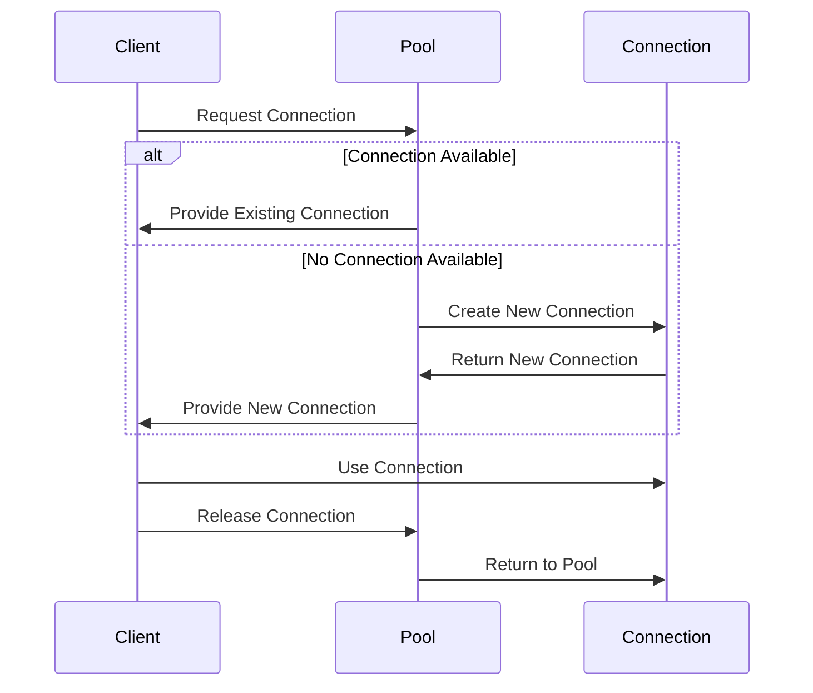

## 3.6 Object Pool Pattern

In the realm of software design, efficient resource management is crucial, especially when dealing with objects that are expensive to create or manage. The Object Pool Pattern is a creational design pattern that addresses this challenge by reusing objects rather than creating and destroying them repeatedly. This pattern is particularly useful in scenarios where object instantiation is costly in terms of time or system resources.

### Understanding the Object Pool Pattern

The Object Pool Pattern provides a mechanism to manage a pool of reusable objects. When a client requests an object, the pool provides an existing instance if available, or creates a new one if necessary. Once the client is done with the object, it is returned to the pool for future use. This approach minimizes the overhead associated with object creation and garbage collection.

#### Benefits of Object Pooling

- **Performance Improvement**: By reusing objects, the pattern reduces the time and resources spent on object creation and destruction.
- **Resource Optimization**: It helps in managing limited resources like database connections, threads, or memory buffers.
- **Scalability**: Object pooling can enhance the scalability of applications by efficiently managing resources under high load.

### Scenarios for Object Pooling

Object pooling is beneficial in scenarios where:

- **Object Creation is Expensive**: For example, establishing a database connection or loading a large configuration file.
- **High Frequency of Object Requests**: When objects are requested frequently and need to be available quickly.
- **Limited Resources**: When the system has a limited number of resources that need to be managed efficiently.

### Implementing Object Pool Pattern in Python

Let's delve into how we can implement the Object Pool Pattern in Python. We will create a simple example of a database connection pool.

#### Step-by-Step Implementation

1. **Define the Object Interface**: Create an interface or base class for the objects that will be pooled.

2. **Create the Object Pool Class**: This class will manage the pool of objects, handling requests and returns.

3. **Implement Object Lifecycle Management**: Ensure that objects are properly initialized, reused, and cleaned up.

4. **Ensure Thread Safety**: If the pool is accessed by multiple threads, implement synchronization mechanisms.

#### Example: Database Connection Pool

```python
import threading
import time

class DatabaseConnection:
    def __init__(self):
        # Simulate a costly connection setup
        time.sleep(1)
        self.connected = True

    def close(self):
        self.connected = False

class ConnectionPool:
    def __init__(self, max_size=5):
        self.max_size = max_size
        self.pool = []
        self.lock = threading.Lock()

    def acquire_connection(self):
        with self.lock:
            if self.pool:
                return self.pool.pop()
            else:
                if len(self.pool) < self.max_size:
                    return DatabaseConnection()
                else:
                    raise Exception("No available connections")

    def release_connection(self, connection):
        with self.lock:
            if len(self.pool) < self.max_size:
                self.pool.append(connection)

def use_connection(pool):
    conn = pool.acquire_connection()
    print("Using connection:", conn)
    time.sleep(2)  # Simulate work
    pool.release_connection(conn)

pool = ConnectionPool(max_size=3)

threads = [threading.Thread(target=use_connection, args=(pool,)) for _ in range(5)]
for thread in threads:
    thread.start()
for thread in threads:
    thread.join()
```

### Managing Object Lifecycle

In the above example, we manage the lifecycle of `DatabaseConnection` objects within the `ConnectionPool`. The pool ensures that connections are reused and only a limited number of connections are active at any time.

- **Acquire Connection**: The `acquire_connection` method checks if there is an available connection in the pool. If not, it creates a new one, provided the pool has not reached its maximum size.
- **Release Connection**: The `release_connection` method returns a connection to the pool, making it available for future use.

### Thread Safety and Synchronization

In a multi-threaded environment, it's crucial to ensure that the object pool is thread-safe. In our implementation, we use a `threading.Lock` to synchronize access to the pool, preventing race conditions and ensuring that connections are managed correctly.

### Visualizing the Object Pool Pattern

To better understand the flow of the Object Pool Pattern, let's visualize the process using a sequence diagram.



### Try It Yourself

To get hands-on experience with the Object Pool Pattern, try modifying the example code:

- **Change the Pool Size**: Experiment with different maximum sizes for the pool and observe how it affects performance.
- **Simulate More Threads**: Increase the number of threads to see how the pool manages concurrent requests.
- **Add Connection Validation**: Implement a mechanism to check if a connection is still valid before reusing it.

### Knowledge Check

Before we wrap up, let's reinforce what we've learned with a few key points:

- The Object Pool Pattern is used to manage a pool of reusable objects, optimizing resource usage.
- It's beneficial in scenarios where object creation is costly or resources are limited.
- Proper lifecycle management and thread safety are crucial for effective implementation.

### Conclusion

The Object Pool Pattern is a powerful tool for optimizing resource management in Python applications. By reusing objects, we can significantly improve performance and scalability, especially in resource-constrained environments. As you continue to explore design patterns, remember to consider the specific needs and constraints of your application to determine when and how to apply this pattern effectively.

## Quiz Time!



### Which of the following is a primary benefit of the Object Pool Pattern?

- [x] Performance Improvement
- [ ] Increased Complexity
- [ ] Reduced Code Readability
- [ ] Faster Garbage Collection

> **Explanation:** The Object Pool Pattern improves performance by reusing objects, reducing the need for frequent creation and destruction.

### In what scenario is the Object Pool Pattern most beneficial?

- [x] When object creation is expensive
- [ ] When objects are rarely used
- [ ] When objects are simple and lightweight
- [ ] When there is no limit on resources

> **Explanation:** The pattern is beneficial when object creation is costly in terms of time or resources.

### What is the purpose of using a lock in the ConnectionPool example?

- [x] To ensure thread safety
- [ ] To improve performance
- [ ] To increase pool size
- [ ] To reduce memory usage

> **Explanation:** The lock ensures that access to the pool is synchronized, preventing race conditions in a multi-threaded environment.

### What happens when a client requests a connection from the pool and none are available?

- [ ] The client receives a null object
- [x] A new connection is created if the pool size allows
- [ ] The client waits indefinitely
- [ ] An exception is thrown immediately

> **Explanation:** If no connections are available and the pool size limit has not been reached, a new connection is created.

### How can the Object Pool Pattern enhance scalability?

- [x] By efficiently managing limited resources
- [ ] By increasing the number of objects created
- [ ] By simplifying the codebase
- [ ] By reducing the need for synchronization

> **Explanation:** The pattern enhances scalability by managing resources efficiently, allowing applications to handle more load.

### What is a potential drawback of the Object Pool Pattern?

- [x] Increased complexity in managing object lifecycle
- [ ] Reduced performance
- [ ] Increased memory usage
- [ ] Decreased resource utilization

> **Explanation:** Managing the lifecycle of pooled objects can introduce complexity, especially in ensuring they are properly initialized and cleaned up.

### Which method in the ConnectionPool class is responsible for returning a connection to the pool?

- [ ] acquire_connection
- [x] release_connection
- [ ] create_connection
- [ ] close_connection

> **Explanation:** The `release_connection` method returns a connection to the pool for future reuse.

### What is a key consideration when implementing an object pool in a multi-threaded environment?

- [x] Ensuring thread safety
- [ ] Reducing the number of threads
- [ ] Increasing pool size
- [ ] Simplifying object creation

> **Explanation:** Thread safety is crucial to prevent race conditions and ensure correct management of pooled objects.

### What is the main role of the Connection class in the example?

- [x] To simulate a costly resource
- [ ] To manage the pool size
- [ ] To handle thread synchronization
- [ ] To improve performance

> **Explanation:** The Connection class simulates a resource that is expensive to create, demonstrating the benefits of pooling.

### True or False: The Object Pool Pattern is only applicable to database connections.

- [ ] True
- [x] False

> **Explanation:** The Object Pool Pattern can be applied to any resource that is costly to create or manage, not just database connections.



Remember, this is just the beginning. As you progress, you'll build more complex and interactive applications. Keep experimenting, stay curious, and enjoy the journey!
