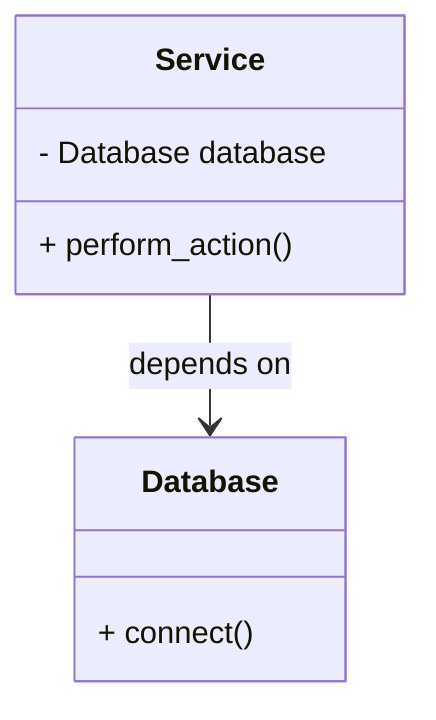

## 3.7.1 Implementing Dependency Injection in Python

Dependency Injection (DI) is a powerful design pattern that helps create flexible, maintainable, and testable code. In this section, we will delve into the concept of DI, its implementation in Python, and its benefits, especially in unit testing and mocking. We will explore different methods of injecting dependencies, discuss the role of type hints and annotations, and provide practical code examples to illustrate these concepts.

### Understanding Dependency Injection

Dependency Injection is a technique where an object receives its dependencies from an external source rather than creating them itself. This approach promotes loose coupling between components, making the system more modular and easier to test.

#### Key Concepts

- **Dependency**: An object that another object relies on to function.
- **Injection**: The process of providing an object with its dependencies.
- **Inversion of Control (IoC)**: A broader principle where the control of creating and managing dependencies is inverted, typically handled by a framework or container.

### Benefits of Dependency Injection

1. **Improved Testability**: By injecting dependencies, you can easily replace them with mock objects during testing.
2. **Decoupling**: Reduces the dependency between components, making the system more flexible and maintainable.
3. **Reusability**: Promotes the reuse of components by separating their configuration from their behavior.
4. **Flexibility**: Allows for easy swapping of implementations without changing the dependent code.

### Implementing Dependency Injection in Python

Python, with its dynamic nature and support for first-class functions, is well-suited for implementing DI. Let's explore various methods to achieve DI in Python.

#### Constructor Injection

Constructor Injection involves passing dependencies through a class's constructor. This method ensures that the dependencies are provided at the time of object creation.

```python
class Database:
    def connect(self):
        print("Connecting to the database...")

class Service:
    def __init__(self, database: Database):
        self.database = database

    def perform_action(self):
        self.database.connect()
        print("Performing service action...")

db = Database()
service = Service(db)
service.perform_action()
```

**Explanation**: In the above example, the `Service` class depends on the `Database` class. The dependency is injected via the constructor, ensuring that `Service` can only be instantiated with a `Database` object.

#### Setter Injection

Setter Injection uses setter methods to inject dependencies after the object has been created. This approach provides more flexibility in changing dependencies at runtime.

```python
class Service:
    def __init__(self):
        self.database = None

    def set_database(self, database: Database):
        self.database = database

    def perform_action(self):
        if self.database:
            self.database.connect()
            print("Performing service action...")
        else:
            print("No database set!")

db = Database()
service = Service()
service.set_database(db)
service.perform_action()
```

**Explanation**: Here, the `Service` class does not require a `Database` object at instantiation. Instead, it provides a `set_database` method to inject the dependency later.

#### Interface Injection

Interface Injection is less common in Python due to its dynamic typing, but it can be achieved using abstract base classes or protocols.

```python
from abc import ABC, abstractmethod

class DatabaseInterface(ABC):
    @abstractmethod
    def connect(self):
        pass

class Database(DatabaseInterface):
    def connect(self):
        print("Connecting to the database...")

class Service:
    def __init__(self, database: DatabaseInterface):
        self.database = database

    def perform_action(self):
        self.database.connect()
        print("Performing service action...")

db = Database()
service = Service(db)
service.perform_action()
```

**Explanation**: The `DatabaseInterface` defines a contract for the `Database` class. The `Service` class depends on this interface, allowing for different implementations of `DatabaseInterface` to be injected.

### Implementing DI Without a Framework

While frameworks like Flask and Django provide built-in support for DI, it's entirely possible to implement DI manually in Python. This approach gives you more control over the injection process and is suitable for smaller projects or when you want to avoid framework overhead.

#### Using Factory Functions

Factory functions can be used to create and inject dependencies. This method centralizes the creation logic and can be easily modified to change the dependencies.

```python
def create_service():
    db = Database()
    return Service(db)

service = create_service()
service.perform_action()
```

**Explanation**: The `create_service` function acts as a factory, creating a `Database` object and injecting it into a `Service` instance.

#### Using Configuration Files

Configuration files can store dependency information, allowing for dynamic injection based on environment or context.

```yaml
database: Database
```

```python
import yaml

class DependencyInjector:
    def __init__(self, config_file):
        with open(config_file, 'r') as file:
            self.config = yaml.safe_load(file)

    def get_database(self):
        db_class = globals()[self.config['database']]
        return db_class()

injector = DependencyInjector('config.yaml')
db = injector.get_database()
service = Service(db)
service.perform_action()
```

**Explanation**: The `DependencyInjector` reads the configuration file to determine which `Database` class to instantiate and inject. This approach allows for easy swapping of dependencies by modifying the configuration file.

### Role of Type Hints and Annotations in DI

Type hints and annotations enhance DI by providing clear expectations of the types of dependencies required. This clarity aids in code readability, maintenance, and tooling support, such as static type checkers.

```python
class Service:
    def __init__(self, database: Database):
        self.database = database

    def perform_action(self):
        self.database.connect()
        print("Performing service action...")
```

**Explanation**: The type hint `database: Database` in the constructor clearly indicates that a `Database` object is expected. This information can be used by IDEs and linters to provide better code assistance and error checking.

### Dependency Injection and Unit Testing

DI plays a crucial role in unit testing by allowing for easy replacement of real dependencies with mock objects. This capability is essential for isolating the unit under test and ensuring that tests are not affected by external factors.

#### Using Mocks with DI

```python
from unittest.mock import Mock

mock_db = Mock()
mock_db.connect.return_value = None

service = Service(mock_db)
service.perform_action()

mock_db.connect.assert_called_once()
```

**Explanation**: The `Mock` object replaces the `Database` class, allowing us to verify that the `connect` method is called without actually connecting to a database. This approach ensures that tests are fast and reliable.

### Visualizing Dependency Injection

To better understand the flow of dependencies in DI, let's visualize the process using a class diagram.



**Description**: The diagram illustrates the dependency relationship between the `Service` and `Database` classes. The `Service` class depends on the `Database` class to perform its actions.

### Try It Yourself

Experiment with the code examples provided by making the following modifications:

1. **Add a New Dependency**: Introduce a `Logger` class and inject it into the `Service` class alongside the `Database`.
2. **Swap Implementations**: Create a `MockDatabase` class and inject it into `Service` to simulate different database behaviors.
3. **Use a Configuration File**: Modify the `DependencyInjector` to support multiple environments (e.g., development, testing, production) with different configurations.

### Knowledge Check

- What are the benefits of using Dependency Injection?
- How does Constructor Injection differ from Setter Injection?
- Why are type hints important in Dependency Injection?
- How does DI facilitate unit testing and mocking?

### Embrace the Journey

Remember, mastering Dependency Injection is a journey. As you practice and experiment with DI, you'll discover its power in creating flexible and maintainable code. Keep exploring, stay curious, and enjoy the process!

## Quiz Time!



### What is Dependency Injection?

- [x] A technique where an object receives its dependencies from an external source.
- [ ] A method of creating dependencies within a class.
- [ ] A pattern that increases coupling between components.
- [ ] A way to hard-code dependencies in a class.

> **Explanation:** Dependency Injection involves providing an object with its dependencies from an external source, promoting loose coupling and flexibility.

### Which method involves passing dependencies through a class's constructor?

- [x] Constructor Injection
- [ ] Setter Injection
- [ ] Interface Injection
- [ ] Factory Injection

> **Explanation:** Constructor Injection involves passing dependencies through the constructor, ensuring they are provided at the time of object creation.

### How does Setter Injection differ from Constructor Injection?

- [x] Setter Injection allows dependencies to be injected after object creation.
- [ ] Setter Injection requires dependencies at the time of object creation.
- [ ] Setter Injection is only used in Python.
- [ ] Setter Injection does not support dependency injection.

> **Explanation:** Setter Injection uses setter methods to inject dependencies after the object has been created, offering more flexibility.

### What role do type hints play in Dependency Injection?

- [x] They provide clear expectations of the types of dependencies required.
- [ ] They are not used in Dependency Injection.
- [ ] They increase code complexity.
- [ ] They are only used for runtime checks.

> **Explanation:** Type hints enhance DI by providing clear expectations of the types of dependencies required, aiding in readability and maintenance.

### How does Dependency Injection support unit testing?

- [x] By allowing easy replacement of real dependencies with mock objects.
- [ ] By making tests more complex.
- [ ] By requiring real dependencies in tests.
- [ ] By increasing test execution time.

> **Explanation:** DI allows for easy replacement of real dependencies with mock objects, facilitating isolated and reliable unit tests.

### What is the purpose of a factory function in DI?

- [x] To centralize the creation and injection of dependencies.
- [ ] To increase the number of dependencies.
- [ ] To create dependencies within a class.
- [ ] To avoid using configuration files.

> **Explanation:** Factory functions centralize the creation logic and can be easily modified to change the dependencies, supporting DI.

### Which of the following is a benefit of Dependency Injection?

- [x] Improved testability
- [x] Decoupling
- [ ] Increased coupling
- [ ] Hard-coded dependencies

> **Explanation:** DI improves testability and decoupling by allowing dependencies to be injected externally, promoting flexibility.

### What is Inversion of Control (IoC)?

- [x] A principle where the control of creating and managing dependencies is inverted.
- [ ] A method of hard-coding dependencies.
- [ ] A technique to increase coupling.
- [ ] A way to create dependencies within a class.

> **Explanation:** IoC is a principle where the control of creating and managing dependencies is inverted, typically handled by a framework or container.

### True or False: Dependency Injection can only be implemented using a framework.

- [ ] True
- [x] False

> **Explanation:** DI can be implemented manually in Python without a framework, providing more control over the injection process.

### What is the benefit of using configuration files in DI?

- [x] They allow for dynamic injection based on environment or context.
- [ ] They increase code complexity.
- [ ] They are only used for runtime checks.
- [ ] They hard-code dependencies.

> **Explanation:** Configuration files store dependency information, allowing for dynamic injection based on environment or context, enhancing flexibility.


