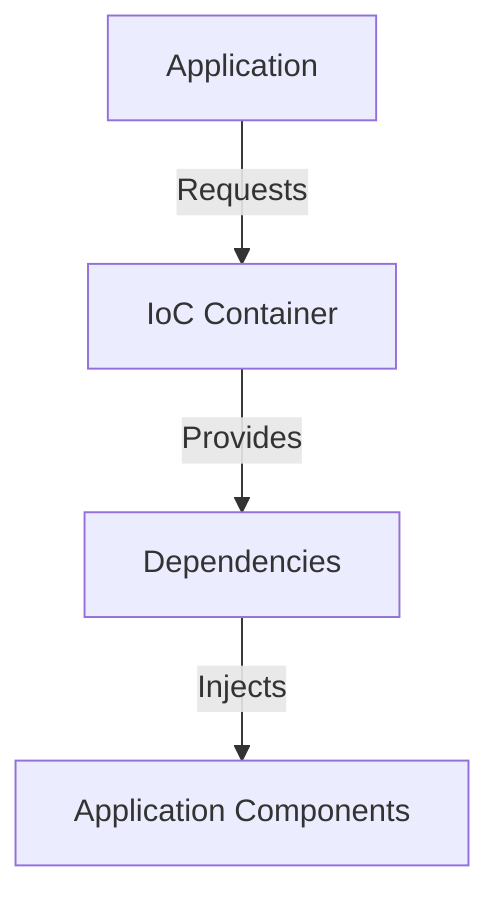

## 3.7.2 Inversion of Control

In the realm of software design, achieving modularity and flexibility is often a primary goal. One of the key principles that facilitate this is **Inversion of Control (IoC)**. This concept is pivotal in decoupling the creation and management of dependencies from the classes that use them, thereby enhancing the maintainability and scalability of applications.

### Understanding Inversion of Control

Inversion of Control is a design principle that reverses the traditional flow of control in a program. Instead of the application code controlling the flow, the control is inverted to a framework or external entity. This principle is closely associated with **Dependency Injection (DI)**, which is a specific technique to implement IoC.

#### Relationship Between Dependency Injection and Inversion of Control

Dependency Injection is a pattern that implements IoC by injecting dependencies into a class rather than the class creating them itself. This separation of concerns allows for more flexible and testable code. 

- **Dependency Injection**: A technique where an external entity provides the dependencies that a class requires.
- **Inversion of Control**: A broader principle where the control of certain aspects of a program's flow is transferred from the application to a framework or container.

By using DI, we achieve IoC, as the responsibility of managing dependencies is shifted away from the dependent class.

### Benefits of Inversion of Control

Implementing IoC offers several advantages:

1. **Decoupling**: By separating the creation of dependencies from their usage, classes become less dependent on specific implementations, allowing for easier changes and upgrades.
2. **Testability**: With dependencies injected, classes can be tested in isolation using mock or stub implementations.
3. **Flexibility**: IoC allows for different configurations and behaviors to be injected at runtime, enabling dynamic behavior changes.
4. **Maintainability**: With reduced coupling, the codebase becomes easier to maintain and extend.

### Implementing Inversion of Control in Python

Let's explore how IoC can be implemented in Python using Dependency Injection. We'll start with a simple example and gradually build up to more complex scenarios.

#### Example: Basic Dependency Injection

Consider a simple application where a `Car` class depends on an `Engine` class:

```python
class Engine:
    def start(self):
        print("Engine started")

class Car:
    def __init__(self, engine: Engine):
        self.engine = engine

    def start(self):
        self.engine.start()

engine = Engine()
car = Car(engine)
car.start()
```

In this example, the `Car` class does not create an instance of `Engine` itself. Instead, it receives an `Engine` instance through its constructor, achieving IoC.

#### Improving Modularity and Flexibility

IoC can significantly enhance the modularity and flexibility of an application. Let's consider a scenario where we want to switch between different types of engines without modifying the `Car` class:

```python
class ElectricEngine(Engine):
    def start(self):
        print("Electric engine started")

class DieselEngine(Engine):
    def start(self):
        print("Diesel engine started")

electric_engine = ElectricEngine()
diesel_engine = DieselEngine()

electric_car = Car(electric_engine)
diesel_car = Car(diesel_engine)

electric_car.start()
diesel_car.start()
```

Here, we can easily switch between `ElectricEngine` and `DieselEngine` by injecting different engine instances into the `Car` class, demonstrating flexibility and modularity.

### IoC Containers and Dependency Management

In complex applications, managing dependencies manually can become cumbersome. This is where IoC containers come into play. An IoC container is a framework that automatically manages the creation and lifecycle of dependencies.

#### Using an IoC Container in Python

While Python does not have a built-in IoC container, several third-party libraries provide this functionality. One popular library is `dependency-injector`.

```bash
pip install dependency-injector
```

Here's how you can use `dependency-injector` to manage dependencies:

```python
from dependency_injector import containers, providers

class Engine:
    def start(self):
        print("Engine started")

class Car:
    def __init__(self, engine: Engine):
        self.engine = engine

    def start(self):
        self.engine.start()

class Container(containers.DeclarativeContainer):
    engine = providers.Factory(Engine)
    car = providers.Factory(Car, engine=engine)

container = Container()
car = container.car()
car.start()
```

In this example, the `Container` class defines how dependencies are created and wired together. The `providers.Factory` is used to specify that a new instance of `Engine` and `Car` should be created each time they are requested.

### Managing Dependency Lifecycles

IoC containers can also manage the lifecycle of dependencies, ensuring that resources are properly initialized and disposed of. This is particularly useful for managing expensive resources like database connections.

#### Singleton Scope

A common lifecycle management technique is the Singleton scope, where a single instance of a dependency is shared across the application.

```python
class Container(containers.DeclarativeContainer):
    engine = providers.Singleton(Engine)
    car = providers.Factory(Car, engine=engine)
```

In this configuration, the `Engine` instance is created once and shared across all `Car` instances, reducing resource consumption.

### Visualizing Inversion of Control

To better understand how IoC works, let's visualize the flow of control in a typical IoC setup:



**Diagram Description**: This flowchart illustrates the interaction between the application, IoC container, and dependencies. The application requests dependencies from the IoC container, which provides and injects them into the application components.

### Try It Yourself

To deepen your understanding of IoC, try modifying the examples above:

- **Experiment with Different Engines**: Create new engine types and inject them into the `Car` class.
- **Implement Your Own IoC Container**: Try building a simple IoC container that manages dependencies and their lifecycles.
- **Explore `dependency-injector`**: Experiment with different providers and scopes to see how they affect dependency management.

### Conclusion

Inversion of Control is a powerful principle that enhances the modularity, flexibility, and testability of software applications. By decoupling the creation and management of dependencies from their usage, IoC enables developers to build more maintainable and scalable systems. Whether through manual Dependency Injection or using IoC containers, embracing IoC can lead to cleaner and more robust code.

## Quiz Time!



### What is Inversion of Control (IoC)?

- [x] A design principle that reverses the traditional flow of control in a program.
- [ ] A method to increase the speed of a program.
- [ ] A technique to improve user interface design.
- [ ] A way to reduce memory usage in applications.

> **Explanation:** IoC is a design principle that inverts the control of certain aspects of a program's flow from the application to a framework or container.

### How does Dependency Injection relate to IoC?

- [x] Dependency Injection is a pattern that implements IoC by injecting dependencies into a class.
- [ ] Dependency Injection is unrelated to IoC.
- [ ] Dependency Injection is a way to increase application speed.
- [ ] Dependency Injection is a method to design user interfaces.

> **Explanation:** Dependency Injection is a specific technique to achieve IoC by providing dependencies to a class externally.

### What is a benefit of using IoC?

- [x] It enhances testability by allowing classes to be tested in isolation.
- [ ] It makes the code more complex and harder to maintain.
- [ ] It reduces the flexibility of the application.
- [ ] It increases the coupling between classes.

> **Explanation:** IoC enhances testability by decoupling classes from their dependencies, allowing for isolated testing.

### What is an IoC container?

- [x] A framework that manages the creation and lifecycle of dependencies.
- [ ] A tool to compress files in an application.
- [ ] A library for designing user interfaces.
- [ ] A method to increase the speed of a program.

> **Explanation:** An IoC container is a framework that automates the management of dependencies and their lifecycles.

### What is the Singleton scope in IoC?

- [x] A lifecycle management technique where a single instance of a dependency is shared across the application.
- [ ] A method to create multiple instances of a dependency.
- [ ] A way to increase the speed of a program.
- [ ] A technique to design user interfaces.

> **Explanation:** The Singleton scope ensures that only one instance of a dependency is created and shared, reducing resource consumption.

### Which library provides IoC container functionality in Python?

- [x] dependency-injector
- [ ] numpy
- [ ] pandas
- [ ] matplotlib

> **Explanation:** The `dependency-injector` library provides IoC container functionality in Python.

### What is a key advantage of using IoC?

- [x] It allows for dynamic behavior changes at runtime.
- [ ] It makes the code more complex and harder to maintain.
- [ ] It reduces the flexibility of the application.
- [ ] It increases the coupling between classes.

> **Explanation:** IoC allows for dynamic behavior changes by enabling different configurations and behaviors to be injected at runtime.

### How can IoC improve modularity?

- [x] By decoupling the creation of dependencies from their usage.
- [ ] By increasing the coupling between classes.
- [ ] By making the code more complex and harder to maintain.
- [ ] By reducing the flexibility of the application.

> **Explanation:** IoC improves modularity by separating the creation and management of dependencies from their usage, reducing coupling.

### What does the `providers.Factory` do in `dependency-injector`?

- [x] It specifies that a new instance of a dependency should be created each time it is requested.
- [ ] It compresses files in an application.
- [ ] It designs user interfaces.
- [ ] It increases the speed of a program.

> **Explanation:** `providers.Factory` creates a new instance of a dependency each time it is requested, allowing for flexible dependency management.

### True or False: IoC containers can manage the lifecycle of dependencies.

- [x] True
- [ ] False

> **Explanation:** True, IoC containers can manage the lifecycle of dependencies, ensuring proper initialization and disposal.


