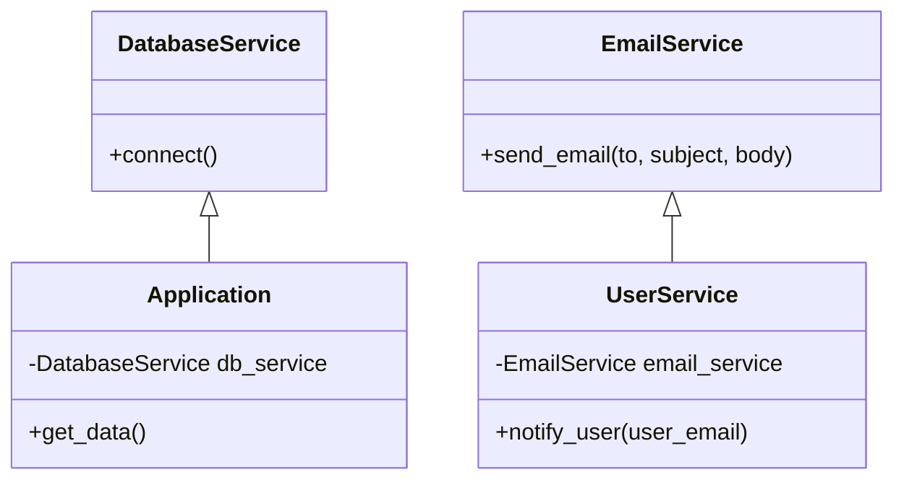

## 3.7.3 Use Cases and Examples

Dependency Injection (DI) is a powerful design pattern that enhances the flexibility and testability of software systems. By decoupling the creation of an object from its usage, DI allows for more modular, maintainable, and scalable code. In this section, we'll delve into real-world examples where DI has been effectively used, discuss its application in large-scale systems, and encourage readers to apply DI to improve code maintainability. Additionally, we'll highlight how DI facilitates adherence to the SOLID principles, particularly the Dependency Inversion Principle.

### Understanding Dependency Injection

Before we explore the use cases, let's briefly recap what Dependency Injection is. DI is a technique where an object receives its dependencies from an external source rather than creating them itself. This can be achieved through various methods, such as constructor injection, setter injection, or interface injection. By doing so, we can easily swap out dependencies, making the code more flexible and easier to test.

### Real-World Examples of Dependency Injection

#### 1. Web Frameworks

Many popular web frameworks, such as Django and Flask, utilize Dependency Injection to manage components like database connections, authentication services, and middleware. By injecting these dependencies, the frameworks allow developers to customize and extend their applications without modifying the core framework code.

**Example: Flask Application with Dependency Injection**

```python
from flask import Flask, request

class DatabaseService:
    def __init__(self, db_url):
        self.db_url = db_url

    def connect(self):
        # Simulate a database connection
        return f"Connected to database at {self.db_url}"

class Application:
    def __init__(self, db_service: DatabaseService):
        self.db_service = db_service

    def get_data(self):
        return self.db_service.connect()

db_service = DatabaseService("sqlite:///:memory:")
app = Application(db_service)

flask_app = Flask(__name__)

@flask_app.route('/')
def index():
    return app.get_data()

if __name__ == '__main__':
    flask_app.run()
```

In this example, the `Application` class depends on `DatabaseService`, which is injected into it. This allows us to easily swap out the database service for testing or different environments.

#### 2. Testing and Mocking

Dependency Injection is invaluable in testing, as it allows for easy mocking of dependencies. By injecting mock objects, we can isolate the unit under test and verify its behavior independently of its dependencies.

**Example: Unit Testing with Mocking**

```python
import unittest
from unittest.mock import Mock

class TestApplication(unittest.TestCase):
    def test_get_data(self):
        # Create a mock database service
        mock_db_service = Mock()
        mock_db_service.connect.return_value = "Mocked database connection"

        # Inject the mock into the application
        app = Application(mock_db_service)

        # Assert that the application returns the mocked connection string
        self.assertEqual(app.get_data(), "Mocked database connection")

if __name__ == '__main__':
    unittest.main()
```

Here, we use Python's `unittest` and `unittest.mock` modules to create a mock `DatabaseService`. This allows us to test the `Application` class without needing a real database connection.

#### 3. Large-Scale Systems

In large-scale systems, Dependency Injection helps manage complexity by promoting loose coupling between components. This is particularly useful in microservices architectures, where services need to interact with each other without being tightly coupled.

**Example: Microservices with Dependency Injection**

Consider a microservices architecture where a `UserService` needs to interact with an `EmailService` to send notifications.

```python
class EmailService:
    def send_email(self, to, subject, body):
        # Simulate sending an email
        print(f"Sending email to {to}: {subject}")

class UserService:
    def __init__(self, email_service: EmailService):
        self.email_service = email_service

    def notify_user(self, user_email):
        self.email_service.send_email(user_email, "Welcome!", "Thank you for joining us!")

email_service = EmailService()
user_service = UserService(email_service)

user_service.notify_user("user@example.com")
```

In this example, `UserService` depends on `EmailService`, which is injected into it. This allows us to easily replace `EmailService` with a different implementation if needed, such as a mock service for testing or a different email provider.

### Applying Dependency Injection for Code Maintainability

Dependency Injection not only enhances testability but also improves code maintainability. By decoupling dependencies, we can make changes to one part of the system without affecting others. This is particularly important in large codebases where changes can have far-reaching impacts.

#### Encouraging Adherence to SOLID Principles

Dependency Injection facilitates adherence to the SOLID principles, particularly the Dependency Inversion Principle, which states that high-level modules should not depend on low-level modules but rather on abstractions.

**Example: Adhering to SOLID Principles**

```python
from abc import ABC, abstractmethod

class NotificationService(ABC):
    @abstractmethod
    def notify(self, message):
        pass

class EmailNotificationService(NotificationService):
    def notify(self, message):
        print(f"Email: {message}")

class SMSNotificationService(NotificationService):
    def notify(self, message):
        print(f"SMS: {message}")

class AlertSystem:
    def __init__(self, notification_service: NotificationService):
        self.notification_service = notification_service

    def alert(self, message):
        self.notification_service.notify(message)

email_service = EmailNotificationService()
sms_service = SMSNotificationService()

alert_system = AlertSystem(email_service)
alert_system.alert("This is an email alert")

alert_system = AlertSystem(sms_service)
alert_system.alert("This is an SMS alert")
```

In this example, `AlertSystem` depends on the `NotificationService` abstraction rather than a specific implementation. This allows us to easily switch between different notification services, adhering to the Dependency Inversion Principle.

### Visualizing Dependency Injection

To better understand how Dependency Injection works, let's visualize the relationships between components using a class diagram.



This diagram illustrates how `Application` and `UserService` depend on `DatabaseService` and `EmailService`, respectively, through Dependency Injection.

### Encouraging Experimentation

To fully grasp the power of Dependency Injection, we encourage you to experiment with the examples provided. Try modifying the code to use different types of injection, such as setter injection or interface injection. Additionally, consider implementing DI in your own projects to see firsthand how it can improve code maintainability and testability.

### Try It Yourself

- Modify the `Application` example to use setter injection instead of constructor injection.
- Implement a new notification service, such as a `PushNotificationService`, and inject it into the `AlertSystem`.
- Create a mock `EmailService` and use it to test the `UserService` class.

### Conclusion

Dependency Injection is a versatile design pattern that offers numerous benefits, including enhanced testability, flexibility, and adherence to SOLID principles. By decoupling dependencies, DI promotes modular and maintainable code, making it an essential tool in the software developer's toolkit. As you continue to explore and apply DI in your projects, you'll discover its potential to transform the way you design and develop software systems.

## Quiz Time!



### Which of the following is a benefit of using Dependency Injection?

- [x] Enhanced testability
- [ ] Increased code complexity
- [ ] Tight coupling between components
- [ ] Reduced code readability

> **Explanation:** Dependency Injection enhances testability by allowing dependencies to be easily swapped out for testing purposes.


### In the context of Dependency Injection, what does DI stand for?

- [x] Dependency Injection
- [ ] Direct Integration
- [ ] Dynamic Instantiation
- [ ] Data Inversion

> **Explanation:** DI stands for Dependency Injection, a design pattern that involves injecting dependencies into a class rather than having the class create them itself.


### Which method of Dependency Injection involves passing dependencies through a class constructor?

- [x] Constructor Injection
- [ ] Setter Injection
- [ ] Interface Injection
- [ ] Property Injection

> **Explanation:** Constructor Injection involves passing dependencies to a class through its constructor.


### How does Dependency Injection facilitate adherence to the SOLID principles?

- [x] By promoting loose coupling and adherence to the Dependency Inversion Principle
- [ ] By increasing the number of dependencies in a class
- [ ] By making classes more dependent on concrete implementations
- [ ] By reducing the need for abstractions

> **Explanation:** Dependency Injection promotes loose coupling and adherence to the Dependency Inversion Principle by allowing classes to depend on abstractions rather than concrete implementations.


### Which of the following is a real-world example of Dependency Injection?

- [x] A web framework managing database connections
- [ ] A class creating its own dependencies
- [ ] A function with no parameters
- [ ] A class with no dependencies

> **Explanation:** Web frameworks often use Dependency Injection to manage components like database connections, allowing for customization and extension.


### What is the primary purpose of using mock objects in testing with Dependency Injection?

- [x] To isolate the unit under test and verify its behavior independently
- [ ] To increase the complexity of the test
- [ ] To ensure the test fails
- [ ] To create dependencies dynamically

> **Explanation:** Mock objects are used to isolate the unit under test and verify its behavior independently of its dependencies.


### Which of the following is NOT a method of Dependency Injection?

- [ ] Constructor Injection
- [ ] Setter Injection
- [ ] Interface Injection
- [x] Static Injection

> **Explanation:** Static Injection is not a recognized method of Dependency Injection. The common methods are Constructor Injection, Setter Injection, and Interface Injection.


### In a microservices architecture, how does Dependency Injection help manage complexity?

- [x] By promoting loose coupling between services
- [ ] By increasing the number of dependencies
- [ ] By making services tightly coupled
- [ ] By reducing the need for communication between services

> **Explanation:** Dependency Injection helps manage complexity in microservices architectures by promoting loose coupling between services.


### True or False: Dependency Injection can improve code maintainability.

- [x] True
- [ ] False

> **Explanation:** True. Dependency Injection improves code maintainability by decoupling dependencies, allowing for easier modifications and extensions.


### What is the role of an abstraction in Dependency Injection?

- [x] To allow classes to depend on abstractions rather than concrete implementations
- [ ] To increase the number of dependencies
- [ ] To make code more complex
- [ ] To reduce the need for interfaces

> **Explanation:** In Dependency Injection, abstractions allow classes to depend on them rather than concrete implementations, promoting loose coupling and flexibility.


