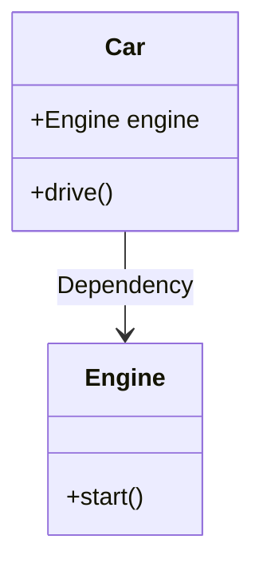

## 3.7 Dependency Injection Pattern

### Introduction to Dependency Injection

Dependency Injection (DI) is a design pattern used to implement Inversion of Control (IoC) in software development. It involves passing dependencies to a class rather than hard-coding them within the class itself. This approach enhances the modularity and flexibility of the code, making it easier to manage and test.

### Understanding Inversion of Control

Inversion of Control is a principle in which the control of object creation and management is transferred from the class itself to an external entity. This principle is fundamental to Dependency Injection, as it allows for greater decoupling between components. By inverting the control, we can change the behavior of a class without modifying its source code.

### Benefits of Dependency Injection

1. **Decoupling Components**: DI reduces the dependency of a class on specific implementations, allowing for more flexible and interchangeable components.

2. **Facilitating Testing**: By injecting dependencies, we can easily replace them with mock objects during testing, enabling unit tests to be conducted in isolation.

3. **Improving Maintainability**: DI promotes cleaner code with clear separation of concerns, making it easier to maintain and extend.

4. **Enhancing Flexibility**: With DI, swapping out implementations becomes straightforward, allowing for easier upgrades and modifications.

### Types of Dependency Injection

There are three primary methods of implementing Dependency Injection:

1. **Constructor Injection**: Dependencies are provided through a class constructor.
2. **Setter Injection**: Dependencies are provided through setter methods.
3. **Interface Injection**: The dependency provides an injector method that will inject the dependency into any client passed to it.

Let's explore each of these methods in detail with Python examples.

### Constructor Injection

Constructor Injection involves passing dependencies as parameters to the class constructor. This method ensures that the class is always in a valid state since all dependencies are provided at the time of instantiation.

```python
class Engine:
    def start(self):
        print("Engine started.")

class Car:
    def __init__(self, engine: Engine):
        self.engine = engine

    def drive(self):
        self.engine.start()
        print("Car is driving.")

engine = Engine()
car = Car(engine)
car.drive()
```

In this example, the `Car` class depends on the `Engine` class. By injecting `Engine` through the constructor, we can easily replace it with a mock or different implementation for testing or other purposes.

### Setter Injection

Setter Injection involves providing dependencies through setter methods after the object is created. This method offers more flexibility as dependencies can be changed at runtime.

```python
class Engine:
    def start(self):
        print("Engine started.")

class Car:
    def __init__(self):
        self.engine = None

    def set_engine(self, engine: Engine):
        self.engine = engine

    def drive(self):
        if self.engine:
            self.engine.start()
            print("Car is driving.")
        else:
            print("No engine found.")

engine = Engine()
car = Car()
car.set_engine(engine)
car.drive()
```

Here, the `Car` class uses a setter method to receive its `Engine` dependency. This allows for greater flexibility in changing the engine at any point in the object's lifecycle.

### Interface Injection

Interface Injection is less common in Python due to its dynamic nature but can be implemented by defining an interface that the dependency must adhere to.

```python
from abc import ABC, abstractmethod

class Engine(ABC):
    @abstractmethod
    def start(self):
        pass

class PetrolEngine(Engine):
    def start(self):
        print("Petrol engine started.")

class Car:
    def __init__(self):
        self.engine = None

    def inject_engine(self, engine: Engine):
        self.engine = engine

    def drive(self):
        if self.engine:
            self.engine.start()
            print("Car is driving.")
        else:
            print("No engine found.")

engine = PetrolEngine()
car = Car()
car.inject_engine(engine)
car.drive()
```

In this example, `Car` expects an `Engine` interface, allowing any implementation of `Engine` to be injected. This approach provides maximum flexibility and decoupling.

### Using Dependency Injection Containers

Dependency Injection Containers are frameworks that manage the lifecycle and dependencies of objects. They automatically inject dependencies, reducing boilerplate code and enhancing scalability.

#### Python DI Libraries

- **Dependency Injector**: A popular DI framework for Python that supports declarative and programmatic configuration.
- **Injector**: A simple and lightweight dependency injection framework for Python.

#### Example with Dependency Injector

```python
from dependency_injector import containers, providers

class Engine:
    def start(self):
        print("Engine started.")

class Car:
    def __init__(self, engine: Engine):
        self.engine = engine

    def drive(self):
        self.engine.start()
        print("Car is driving.")

class Container(containers.DeclarativeContainer):
    engine = providers.Factory(Engine)
    car = providers.Factory(Car, engine=engine)

container = Container()
car = container.car()
car.drive()
```

In this example, `Dependency Injector` is used to manage the creation and injection of `Engine` and `Car` objects. The container handles the wiring of dependencies, simplifying the code and enhancing maintainability.

### Common Challenges and Solutions

1. **Complexity**: DI can introduce complexity, especially in large applications. Use DI containers to manage dependencies and reduce boilerplate code.

2. **Overhead**: Excessive use of DI can lead to performance overhead. Optimize by injecting only necessary dependencies and using lazy loading where appropriate.

3. **Testing**: Ensure that tests are designed to handle injected dependencies, using mocks or stubs to isolate components.

### Best Practices for Dependency Injection

- **Design for Interfaces**: Use interfaces or abstract classes to define dependencies, allowing for flexible and interchangeable implementations.
- **Limit Dependencies**: Keep the number of dependencies minimal to reduce complexity and improve performance.
- **Use DI Containers**: Leverage DI containers to manage dependencies and reduce boilerplate code.
- **Test Thoroughly**: Ensure that all components are thoroughly tested with injected dependencies to catch potential issues early.

### Visualizing Dependency Injection

To better understand how Dependency Injection works, let's visualize the process using a class diagram.



In this diagram, the `Car` class depends on the `Engine` class. Dependency Injection allows the `Car` to receive an `Engine` instance without creating it internally, promoting decoupling and flexibility.

### Try It Yourself

Experiment with the examples provided by modifying the injected dependencies. Try creating a new `ElectricEngine` class and inject it into the `Car` class to see how easily the behavior can be changed.

### Knowledge Check

- What are the benefits of using Dependency Injection?
- How does Dependency Injection facilitate testing?
- What are the differences between constructor, setter, and interface injection?
- How can DI containers simplify dependency management?

### Conclusion

Dependency Injection is a powerful pattern that enhances the flexibility, testability, and maintainability of software applications. By decoupling components and managing dependencies externally, we can create more robust and adaptable systems. As you continue to explore and implement DI in your projects, remember to embrace best practices and leverage DI containers to streamline your development process.

## Quiz Time!



### What is Dependency Injection (DI)?

- [x] A design pattern for passing dependencies to a class instead of hard-coding them.
- [ ] A method for hard-coding dependencies within a class.
- [ ] A technique for creating dependencies at runtime.
- [ ] A pattern for managing class inheritance.

> **Explanation:** Dependency Injection is a design pattern that involves passing dependencies to a class, promoting decoupling and flexibility.

### What principle does Dependency Injection implement?

- [x] Inversion of Control (IoC)
- [ ] Single Responsibility Principle (SRP)
- [ ] Open/Closed Principle (OCP)
- [ ] Liskov Substitution Principle (LSP)

> **Explanation:** Dependency Injection implements the Inversion of Control principle, transferring control of dependencies from the class to an external entity.

### Which method of Dependency Injection involves passing dependencies through a class constructor?

- [x] Constructor Injection
- [ ] Setter Injection
- [ ] Interface Injection
- [ ] Method Injection

> **Explanation:** Constructor Injection involves passing dependencies as parameters to the class constructor.

### What is a benefit of using Dependency Injection?

- [x] It facilitates testing by allowing easy replacement of dependencies with mocks.
- [ ] It increases the coupling between components.
- [ ] It makes code less maintainable.
- [ ] It reduces flexibility in changing implementations.

> **Explanation:** Dependency Injection facilitates testing by allowing dependencies to be easily replaced with mock objects.

### What is the role of a Dependency Injection Container?

- [x] To manage the lifecycle and dependencies of objects.
- [ ] To create dependencies within a class.
- [ ] To increase code complexity.
- [ ] To reduce the number of dependencies in a class.

> **Explanation:** A Dependency Injection Container manages the lifecycle and dependencies of objects, simplifying dependency management.

### Which Python library is commonly used for Dependency Injection?

- [x] Dependency Injector
- [ ] Flask
- [ ] Django
- [ ] NumPy

> **Explanation:** Dependency Injector is a popular library for implementing Dependency Injection in Python.

### What is a common challenge of using Dependency Injection?

- [x] It can introduce complexity in large applications.
- [ ] It simplifies code to the point of being unreadable.
- [ ] It reduces the need for testing.
- [ ] It increases performance overhead.

> **Explanation:** Dependency Injection can introduce complexity, especially in large applications, due to the management of numerous dependencies.

### How can Dependency Injection improve maintainability?

- [x] By promoting cleaner code with clear separation of concerns.
- [ ] By increasing the number of dependencies in a class.
- [ ] By reducing the need for interfaces.
- [ ] By hard-coding dependencies within classes.

> **Explanation:** Dependency Injection improves maintainability by promoting cleaner code with clear separation of concerns.

### What is a best practice when designing for Dependency Injection?

- [x] Design for interfaces to allow flexible implementations.
- [ ] Hard-code dependencies within classes.
- [ ] Avoid using DI containers.
- [ ] Increase the number of dependencies in a class.

> **Explanation:** Designing for interfaces allows for flexible and interchangeable implementations, a best practice in Dependency Injection.

### True or False: Dependency Injection reduces the flexibility of a system.

- [ ] True
- [x] False

> **Explanation:** False. Dependency Injection enhances the flexibility of a system by allowing easy swapping of implementations.


